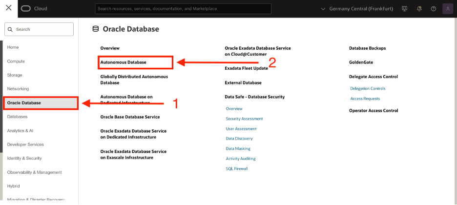
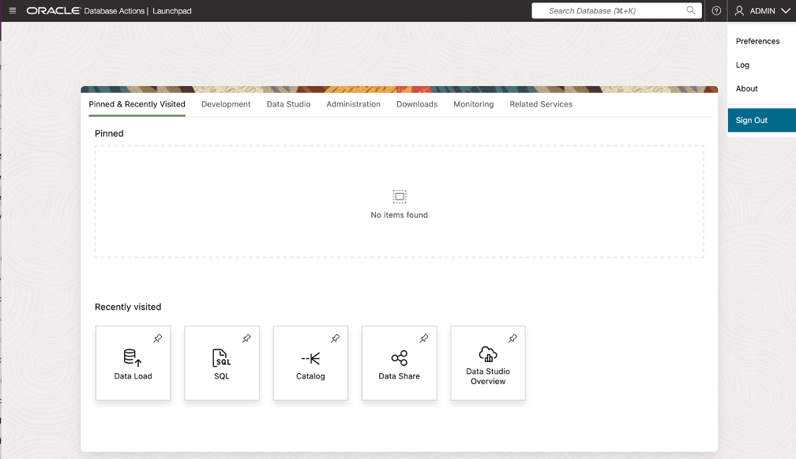

# 🛒 Subscribe to Data Products via Data Share Tool

#### Estimated Lab Time: 30 minutes

## Introduction

In this lab, you’ll learn how to **subscribe** to data products published in the **Data Marketplace**. Subscribing works like “**following**” a channel, ensuring you receive the **latest updates** as new information becomes available.

By the end of this lab, you’ll understand how the **Data Marketplace** enables teams to easily **discover and access customized data products**, keeping everyone aligned and ready to act on **up-to-date information**.

### Prerequisites

* An Oracle account

* **Prerequisites for Share Providers to use the share tool:**
      * For a versioned share, you must have **read and write access to a bucket** to store or cache your shares.
      * The schema you wish to use to create and publish shares must be **enabled by an ADMIN user**.

* **Prerequisites for Share Recipients**
      * The share recipient must have a **valid email address** a provider can use to register the recipient to use the share tool. Oracle Data Share allows you to share the recipient's activation link by email.

## Task 1: Subscribe to Data Product Share as RISK user.

1. Navigate to your assigned ADB Instance.

    * Open Navigation Menu 
    * Select Oracle Database 
    * Select Autonomous Database 

   

2. Select the name of your assigned database.

   

3. Select **Database Actions**, then **View All Database Actions**

   

4. Sign-out of **Database Actions Launchpad** as ADMIN user.

   

5. Sign-on to **Data Studio** as RISK user.

   

6. At the **Database Actions Launchpad**, click **Data Studio**.

   

7. At the **Data Share** on the navigation tree.

    

8. Click on **Consumer Share** on the **Provider and Consumer** page.

   

9. Select **Subscribe to Delta Share Provider** from the drop-down list on page, click on **Consumer Share** page.

   

10. The **Subscribe to Share Provider** wizard will be displayed.

   

* Enter the following:
    * **Share Source:** Accept the default selection, Delta Share Provider JSON.
    * **Share Provider JSON:** Accept the default selection, From File.
    * **Delta Share Profile JSON:** Click this box. In the Open dialog box, navigate to the location where you downloaded the data share profile, select it, and then click Open.
    * **Provider Name:** Enter Demo-LoanApp-Data-Share

* This will cause the **Add Shares** screen to appear.

   

   * Select the **LoanApp\_Share2Risk** share in the Available Shares column.
   * Click the ">" button to reloate the share in the Shared Shares column.

   The LoanApp\_Share2Risk share is displayed in the **Selected Shares** column.

   * Click **Subscribe**.

    The LoanApp_Share2Risk share is displayed in the **Selected Shares** section.  Click **Subscribe**.

   

## Task 2: Link Data: Create External Tables to Data Share

1. On the Link Data page, click the Select Cloud Store Location or enter a public URL drop-down list.

   

1. Select the **Demo-LoanApp-Data-Share**.  The **DELTA_SHARING** data share to which you subscribed is now displayed.

1. Expand the drill down tab for **Demo-LoanApp-Data-Share**  to display the available data.

1. Now Let's create an external table based on the **LOAN.Shared\_Loan\_Data\_Risk\_VW** file.
Drag and drop this file onto the data linking job section.

   

    The external table to be created is displayed in the data linking job section.

   

1. You can click the **Settings** (pencil Icon) to display the Link Data from Cloud Store Location panel.
You can use the various tabs listed on the left rail to perform actions like change the name of the external table name to be created, view the table's properties, view the table's data, view the SQL code used to create the table and more.

Click **Close** when you're done.

   

1. Click **Start**.

A Start Link From Cloud Store message box is displayed.

On the popup box that appears, click **Run**.

   

1.  After the link job is completed, make sure that the data link card has the link icon next to it.

   

## Task 3: Validate ADB Access to Object Storage Data

1.  Click the **Report** button for this link job to view a report of the total rows processed successfully and failed for the selected table and the SQL used.

Click **Close** when done.

   

1.  In the Table and View Loads section, 

   * Click the external table link named **Shared_Loan_Data_Risk_VW** to preview its data.

Remember, that the source data for this external table is from the **Shared\_Loan\_Data\_Risk\_VW** data share.

   

The **Clients\_To\_Loan** panel is displayed with the **Preview** tab selected by default that displays the external table's data.

   

1. Click **Close** to exit the panel and to return to the Data Share Dashboard.

1. Click on Query button to run a query from ADB against the Linked Shared Data

   

* On the left rail, Click on Catalog to return to Dashboard

   

**Congratulations you have now subscribed to the data shared with you from ADB via Data Share.**

## Learn More

* [Get Started with Data Catalog](https://docs.oracle.com/en-us/iaas/data-catalog/using/index.htm)
* [Data Catalog Overview](https://docs.oracle.com/en-us/iaas/data-catalog/using/overview.htm)
* [Oracle Cloud Infrastructure Documentation](https://docs.cloud.oracle.com/en-us/iaas/Content/GSG/Concepts/baremetalintro.htm)
* [What Is a Data Catalog and Why Do You Need One?](https://www.oracle.com/big-data/what-is-a-data-catalog/)
* [Harvesting Object Storage Files as Logical Data Entities](https://docs.oracle.com/en-us/iaas/data-catalog/using/logical-entities.htm)

## Acknowledgements
* **Authors** -  Otis Barr
* **Contributors** - Matt Kowalik, Eddie Ambler, Ramona Magadan
* **Last Updated By/Date** - TBC

Copyright (C) Oracle Corporation.
