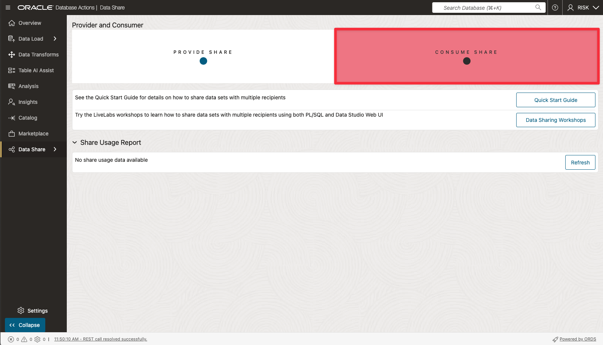

# 🛒 Subscribe to Data Products via Data Share Tool

## Introduction

At SeersEquities, speed and precision are everything—especially for the Risk team. They need access to the latest loan data the moment it's available, without hunting it down or requesting manual updates.

In this lab, you’ll step into the role of a data share recipient and learn how to subscribe to live data products published by the Loan team using Oracle’s Data Share tool. Subscribing is like following a trusted data source: you always get the latest updates, automatically and securely.

By the end of this lab, you’ll understand how subscriptions help the Risk team stay aligned with the business—so they can evaluate changes quickly, adjust risk models, and support smarter decisions in real time.

Estimated Time: 30 minutes

### Objectives

In this lab, you will:

* **Subscribe** to a published data product using the Data Share tool

* **Access shared datasets** published by the LOAN team

* **Ensure timely, secure updates** to drive real-time analytics

### Prerequisites

* You must complete the lab **Create & Share Trusted Data Products**.

## Task 1: Subscribe to Data Product Share as RISK user

1. Click **View Login Info**. Copy your **DB ADMIN Password**, and click the **SQL Worksheet** link.

      

2. For your Username enter **RISK**. Paste in the password you copied in the previous step.

   

   Click **Sign in** button.

3. From the Launchpad, click **Data Studio**, then **Data Share**.

   

4. On the **Provider and Consumer** page, click on **Consume Share**.

      

5. On the **Consume Share** Page

      * Click on **Subscribe to Share Provider** drop-down button.  
      * Select **Subscribe to Delta Share Provider** from the drop-down list  

      

6. In the **Subscribe to Share Provider** wizard enter the following details:

      * Select **Create Share Provider** as share source
      * Select **From File** as **Share Provider JSON**, 
        * Select the file you downloaded in the lab  **Create & Share Trusted Data Products**
      * Provider Name: **Demo-Data-Share**  
      * Description: **Demo-Data-Share**

      

   Click on **Next** to proceed

7. On the **Add Shares** screen:

   Select the **LoanApp\_ShareToRisk** share in the **Available Shares** column  
   Click the **move (>)** button to transfer the share to the **Selected Shares** column  

   

   Click on **Subscribe** to proceed.

You successfully subscribed to a share provider, which is now linked to your Autonomous Database.

## Task 2: Link Data: Create External Tables to Data Share

1. On the Link Data page **select drop-down list** select the **Demo-Data-Share.**

   

2. Expand the drill down tab for the share named **LoanApp\_Share\_Provider** to display the available data.

   

3. Drag and drop the file **LOAN.Shared\_Loan\_Data\_Risk\_VW** into the data linking job area.

   

      >**NOTE:** This causes the external table to be created is displayed in the data linking job section.  

   

4. Click the **Settings** icon (pencil) to open the configuration panel. Use the tabs on the left to:

      

      * Rename the external table to: **SHARED\_LOAN\_DATA\_RISK**

      

      * Click **Close** to proceed

5. Click **Start** to create shared link.

6. Click **Run** in the pop window.

      

7. Once the job is complete, check for the link icon next to the data link card to confirm success.

      

You created an external table from a shared dataset—linking live loan data directly into your environment without copying it. This step gives the Risk team immediate, governed access to trusted data, ready for queries and analysis.

## Task 3: Validate ADB Access to Object Storage Data

1. Click the Report button for this link job to view a report of the total rows processed successfully and failed for the selected table and the SQL used.

   

1. Click **Close** when done.

1. In the **Table and View Loads** section, click the external table link named **Shared\_Loan\_Data\_Risk** to preview the data.  Remember, the source for this data is the **Shared\_Loan\_Data\_Risk\_VW** data share.
   
   

1. The **Shared\_Loan\_Data\_Risk\_VW** panel is displayed with the **Preview** tab selected by default that displays the external table's data.

   

1. Click **Close** to exit the panel and to return to the Data Share Dashboard.

1. Click on **Query** button to run a query from ADB against the Linked Shared Data

   

***Congratulations you have now subscribed to the data shared with you from ADB via Data Share and confirmed you can query the data.***

## Learn More

* [Get Started with Data Catalog](https://docs.oracle.com/en-us/iaas/data-catalog/using/index.htm)
* [Data Catalog Overview](https://docs.oracle.com/en-us/iaas/data-catalog/using/overview.htm)
* [Oracle Cloud Infrastructure Documentation](https://docs.cloud.oracle.com/en-us/iaas/Content/GSG/Concepts/baremetalintro.htm)
* [What Is a Data Catalog and Why Do You Need One?](https://www.oracle.com/big-data/what-is-a-data-catalog/)
* [Harvesting Object Storage Files as Logical Data Entities](https://docs.oracle.com/en-us/iaas/data-catalog/using/logical-entities.htm)

## Acknowledgements
* **Authors** - Eddie Ambler, Otis Barr
* **Last Updated By/Date** - June 2025, Otis Barr

Copyright (C) Oracle Corporation.
