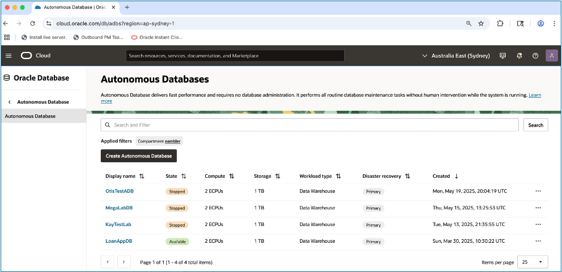
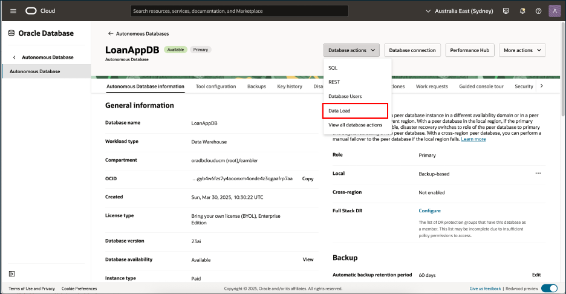
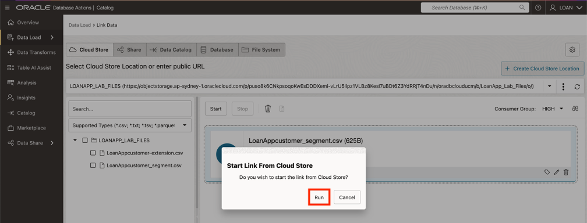
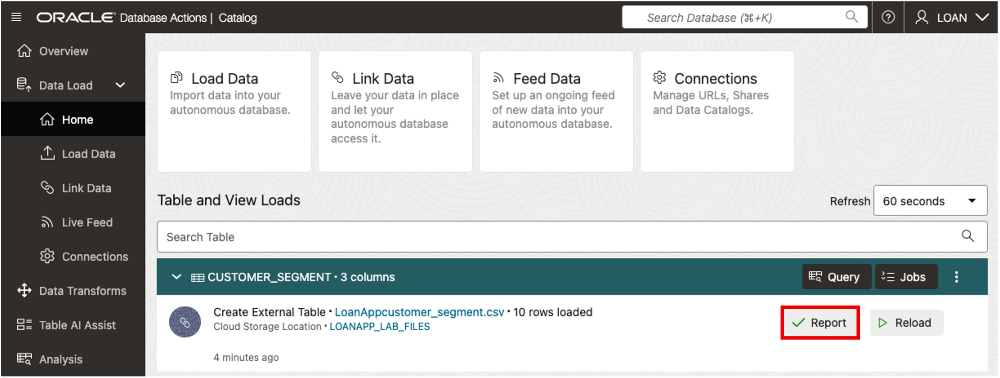
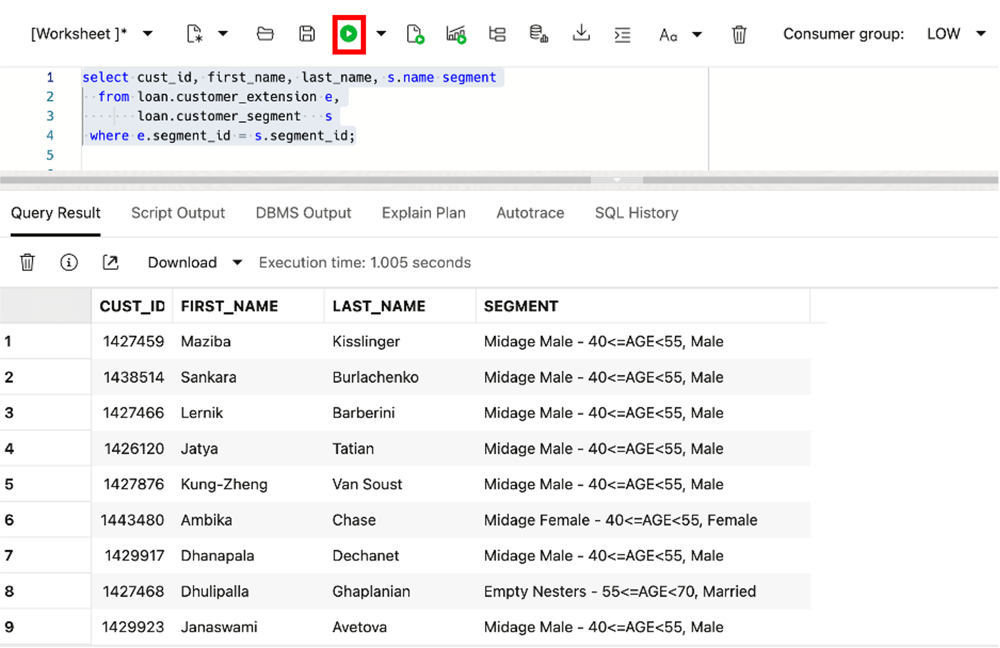

# Load, Link, and Query Object Storage Data from Autonomous Database

## Introduction

This lab is designed to give the Data Engineer experience using the **Data Load** tools, teasily and efficiently move object storage data into Autonomous Database tables.

This lab will give you the skills to load, link, and query object storage data directly from your **Autonomous Database** instance.  

## Estimated Lab Time: 45 minutes

## Objectives
   * Login to LiveLabs Sandbox
   * Find your LiveLabs Sandbox reservations

## Prerequisites

## Task 1: Navigate to Autonomous Database

To begin, we will log onto the assigned Autonomous Database and launch Database Actions (as the LOAN user), so you can discover and manage all the data you have access to all from one location.

1. Log onto Oracle Cloud account at cloud.oracle.com

      

    Click the menu icon (three horizontal lines) in top left corner to open the Navigation Menu  

1. Select Oracle Database from the Navigation Menu.  

    

1. Choose the database type  

    
    Click on Autonomous Database.

1. Select the desired database  

    
    Click the name of the Autonomous Database you want to use  

1. Launch Database Actions  

      

    Click Database Actions, then select Data Load from the dropdown list   

## Task 2: Load Object Storage Data into Autonomous Database using Data Catalog

1. Click on the **Data Objects** tab at the top of the **Catalog** page, to view the contents of the object storage buckets.

     
   
   Select **LoanApp Customer-extention.csv** from the list, this will take you to the **Cloud Object Entity** page.

1. Select the **Load to Table** button and the **Load Data** page will appear. 

     

1. Click **Edit (pencil)** icon, in the lower right corner.  

     

1. Enter details for the data load  
   
      Select **Create Table** from the list of options displayed in the table section  

        

      Enter **Customer_Extention** for the name of the table.  

        

      Click **Close** button.  

1. Click the **Start** button on the **Data Load** page, then click the **Run** button in the popup window, to start a job that loads data from the Cloud Store.  

        

      Once the job is complete, the table will appear in the **Table and View Loads** section  

1. To generate a report and review the SQL used for the job, click on the **Report** button.  

        

      Click the **Close** button when finished.  

        

1. To review details about the data in the table using SQL Worksheet, click on the **Query** button.  

        

1. The **SQL Worksheet** will appear with the query pre-loaded, the query results available and an analysis of the data set.  

        

1. Select **Catalog** from the left rail rail and take note that the **Customer_Extension** table now appears in the Catalog.

      

      ***Congratulations you have now loaded your Object Storage discovered in your catalog data into your ADB.***

## Task 3: Link Object Storage Data from Data Catalog to ADB.

1. From the Data Catalog page with Data Objects selected.

      Make sure the Cloud Object filter is selected, then select **LoanAppCustomer-segments.csv** from the list for the Cloud Object Entity page.

      

1. Select the Link to Table button and the Load Data page will appear.

      

1. Click the **Edit (pencil)** icon, in the lower right corner.

      

1. In the table section, select **Create External Table** from the list of options.

      

1. Enter the name **Customer_Segment** for the table.  Click **Close** button.

      

1. Click the **Start** button on the **Link Data** page.

      

1. Click the **Run** button in the popup window, to start a job that loads data from the Cloud Store.

      

1. The table will appear on the **Table and View Loads** page, once the job is completes.

      

1.	To review details about the data in the table using SQL Worksheet, click on the **Query** button.

      

      ***Congratulations you have now Linked your Object Storage discovered in your catalog and can query it from your ADB..***

## Task 4: Query Data in Object Storage and ADB Database.

1.	Click Database Actions in the banner to display the Launchpad page. Click the **Development** tab, and then click the **SQL** tab to display the SQL Worksheet

      

2.	Let's query the CUSTOMER_EXTENSION table. Copy and paste the following code into your SQL Worksheet, and then click the Run Statement icon in the Worksheet toolbar.

      ```
      <copy>
      select * from CUSTOMER_EXTENSION e;
      </copy>
      ```

      >**NOTE:** The output shows information about customers.

      

3.	Let's query the CUSTOMER_SEGMENTS external table. In the SQL Worksheet, copy and paste the following code into your SQL Worksheet to query the data, and then click the Run Statement icon in the Worksheet toolbar.

      ```
      <copy>
      select * from CUSTOMER_SEGMENT s;
      </copy>
      ```

      >**NOTE:** The output shows defined customer segments.

      

4.	Create a join combining data from the CUSTOMER_EXTENSION table with data a then click the Run Statement icon in the Worksheet toolbar.

      ```
      <copy>
        select cust_id, first_name, last_name, s.name segment
         from loan.customer_extension e,
               loan.customer_segment  s
         where e.segment_id = s.segment_id;
      </copy>
      ```

      >**NOTE:** The output shows combined customer information.

      

      ***Congratulations you have now combined data stored in Object Storage with data stored in the ADB database.***

## Acknowledgements
   * **Authors** - Eddie Ambler, Otis Barr
   * **Contributors** - Mike Matthews, Marty Gubar
   * **Last Updated By/Date** - 04-28-2025

   Copyright (C) Oracle Corporation.