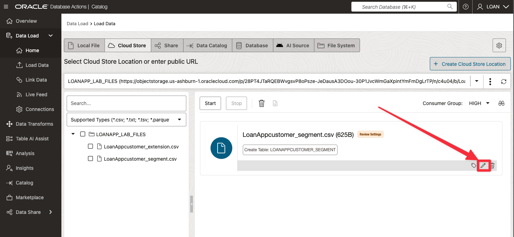
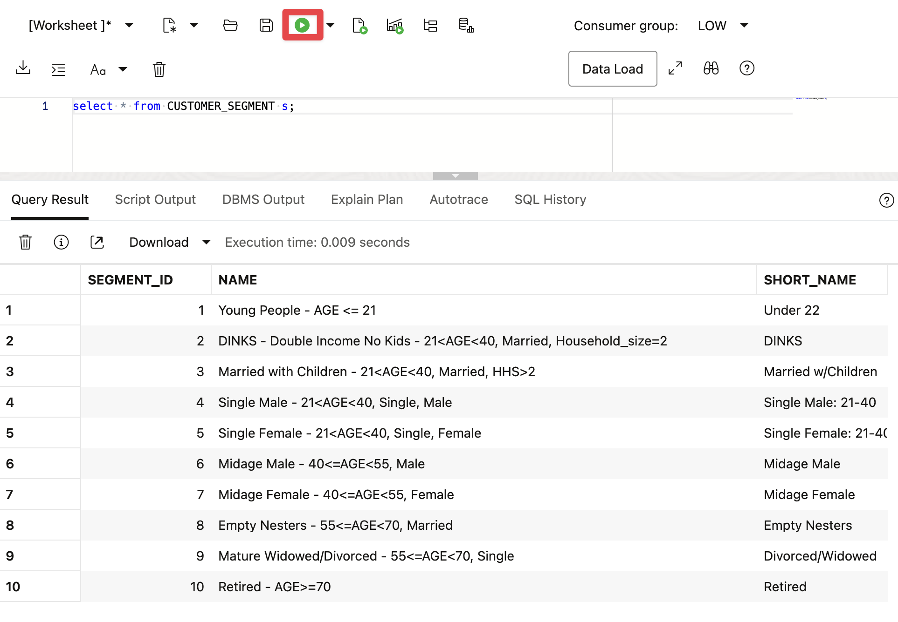

# Load, Link, and Query Object Storage Data from Autonomous Database

## Introduction

At SeersEquities, staying ahead means answering complex questions fast:

* *What’s the current funding mix for active loans?*

* *How do external market shifts affect our pricing models?*

To answer those questions, the data team must not only find the right data—they must **use it efficiently across systems, without bottlenecks or delays**.

In this lab, you’ll take the next step: using Oracle’s tools to **load, link, and query** data stored in cloud object storage—directly from Autonomous Database. You’ll make external data locally available when needed, or link to it in place to save time and cost.

Estimated Time: 45 minutes

### Objectives

By the end of this lab, you will:

* **Load high-value data** into database tables for fast performance or persistence

* **Link data in place** using Oracle Data Catalog to avoid duplication

* **Query across sources**—combining structured and unstructured data for real-time financial insights

By the end, you’ll have the skills to turn raw, external data into a seamless part of SeersEquities’ analytics workflow—ready to power better loan decisions and smarter risk management.


## Task 1: Load Object Storage Data into Autonomous Database using the Catalog Tool

1. Click **View Login Info**. Copy your **DB ADMIN Password**, and click the **SQL Worksheet** link.

      

2. For your Username enter **LOAN**. Paste in the password you copied in the previous step.

      

3. Select **Data Studio** from the tab menu, then select **Catalog** from the left rail.

      

4.  Click the **Data Objects** tab at the top of the catalog page to view the contents from your object storage buckets.

      

5. Select **LoanApp Customer-extention.csv** from the list, this will take you to the Cloud Object Entity page.

      

5. Select the **Load to Table** button and the Load Data page will appear. 

        

6. Click the **Edit (pencil)** icon, in the lower right corner.  

        

7. In the table section, select **Create Table** from the list of options displayed.  

        

8. Enter **CUSTOMER_EXTENTION** for the name of the table. Click the **Close** button. 

        
 
9. Click the **Start** button on the Data Load page.  

        

10. Click the **Run** button in the popup window, to start a job that loads data from the Cloud Store.  

       

11. The table will appear on the Table and View Loads page, once the job is completed. To generate a report and review the SQL used for the job, click on the **Report** button.  

        

12. Click the **Close** button when finished.  

        

13. To review details about the data in the table using SQL Worksheet, click on the **Query** button.  

        

14. The SQL Worksheet will appear with the query pre-loaded, the query results available, and an analysis of the data set.  

        

15. Select **Catalog** from the left rail and take note that the **Customer_Extension** table now appears in the Catalog.

      

   **Congratulations you have now loaded your Object Storage discovered in your catalog data into your ADB.**

You’ve just loaded external object storage data directly into your Autonomous Database—turning a static file into a query-ready table. This move helps optimize performance and makes your data ready for analytics, joins, and future products.

   1. From the Data Catalog page with Data Objects selected, make sure the Cloud Object filter is selected, then select **LoanAppCustomer_segment.csv** from the list for the Cloud Object Entity page.

      

   2. Select the **Load to Table** button and the Load Data page will appear.

   

   3. Click the **Edit (pencil)** icon, in the lower right corner.

   

   4. In the table section, choose **Create External Table** from the options.

   

   5. Let's change the default name to something more meaningful for our use case. Change the default table name to **CUSTOMER_SEGMENT**. Click **Close**.

   

   6. Click **Start** on the **Link Data** page.

   

   7. In the popup, click **Run** to start the link job from cloud store.

   

   8. The table will appear on the Table and View Loads page once the job is completed. To review details about the data in the table using SQL Worksheet, click on the **Query** button.

   

   


You’ve just linked **external object storage data** to your database—**no loading required**. With this external table in place, you can **run queries instantly while avoiding data duplication** and keeping your analytics agile and efficient.

## Task 3: Query Data in Object Storage and ADB Database.

   1.	Click **Database Actions** in the top banner to open the **Launchpad** page. Select the **Development** tab, then click **SQL** to open the SQL Worksheet.

  

   2.	Query the **CUSTOMER_EXTENSION** table. Copy and paste the following SQL into the Worksheet, then click the **Run Statement** icon:

      ```
      <copy>
      select * from CUSTOMER_EXTENSION e;
      </copy>
      ```

   The output shows information about customers.

  

   3.	Now query the **CUSTOMER_SEGMENT** external table. Paste the SQL below into the Worksheet, then click **Run**:

      ```
      <copy>
     select * from CUSTOMER_SEGMENT s;
      </copy>
      ```

   The output shows defined customer segments.

  

   4.	Combine data from both tables using a **join**. Paste the query below, then click **Run**:

      ```
      <copy>
        select cust_id, first_name, last_name, s.name segment
         from loan.customer_extension e,
               loan.customer_segment  s
         where e.segment_id = s.segment_id;
      </copy>
      ```

   The results show enriched customer profiles with segment labels.

  


You’ve now combined external object storage data with internal database data—all from a single query. This unlocks richer analytics, enabling SeersEquities to connect customer attributes with segmentation strategies in real time.

## Conclusion

In this lab, you’ve learned how to **load, link, and query data** from cloud object storage using Oracle Autonomous Database. Each task brought you closer to a unified data environment—one where internal and external sources work together seamlessly.

By turning static files into live tables or external links, you’ve made **data instantly queryable**. And by joining that data across sources, you've created a **richer, real-time foundation for analytics**.

For SeersEquities, this means **faster decisions, smarter loan products, and more agile data workflows**. For you, it means mastering the tools that make all of that possible.

## Acknowledgements
* **Authors** - Eddie Ambler, Otis Barr
* **Last Updated By/Date** - Kamryn Vinson, June 2025
