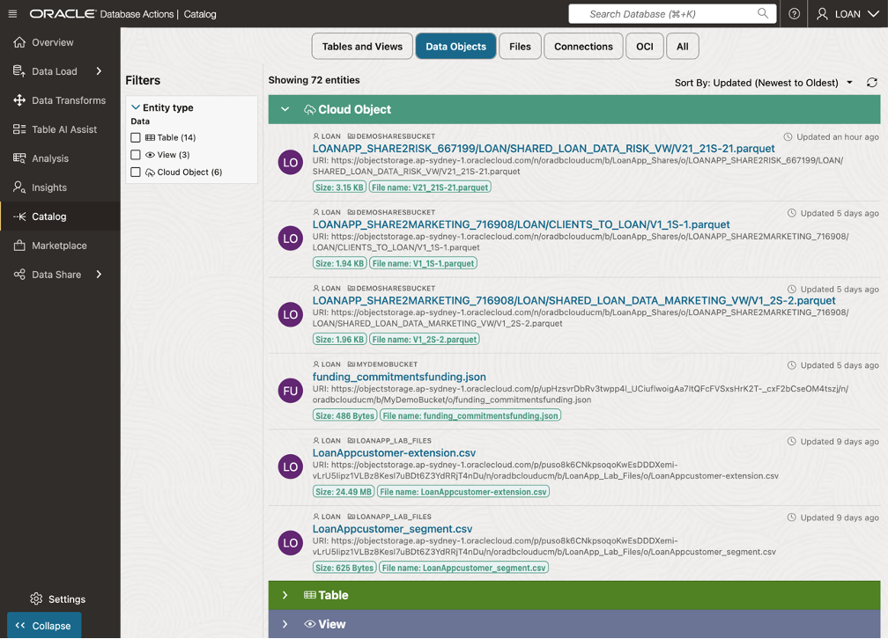
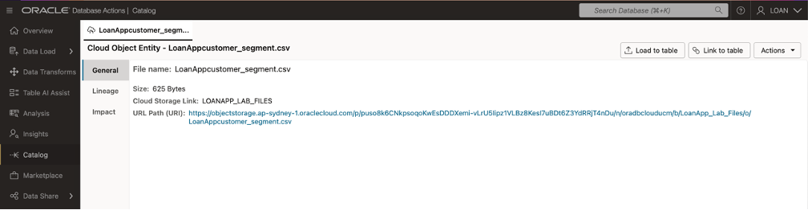

# Load, Link, and Query Object Storage Data from Autonomous Database

## Introduction

IThis lab focuses on loading, linking, and querying object storage data directly from your Autonomous Database instance. You'll learn how to make object storage data locally available for performance optimization or cost reduction while maintaining flexibility for real-time analytics. Using Oracle Data Catalog, you'll link object storage data to your database and create external tables that allow direct querying without time-consuming transfers. Finally, you'll run cross-source queries that combine structured database tables with object storage data to deliver a unified view of financial insights.

By the end of this lab, you will:

   * ***Load Data:*** Understand how to move object storage data into tables in your Autonomous Database for improved performance and persistence.

   * ***Link Data:*** Use Oracle Data Catalog to connect object storage assets to your database.

   * ***Query Data:*** Create external tables to query object storage data directly and combine it with database tables for unified analytics.

## Task 1: Load Object Storage Data into Autonomous Database using Data Catalog

   1. Navigate to your Assigned ADB Instance

   

   1. Select name of desired database.

   

   1. Select **Database Actions** then View all database actions.

   

   1. Sign-out of **Database Actions Launchpad** as ADMIN user.

   

   1. Sign-in at **Database Actions Launchpad** as LOAN user.

   

   1. Select **Data Studio** from the tab menu, then select **Catalog** from the navigation tree.

   1. The **Catalog** page is displayed with the **Tables and Views** tab highlighted.

   

   1. Click on the **Data Objects** tab at the top of the **Catalog** page,  to view the contents of the object storage buckets.

   

   1. Select **LoanAppCustomer-extention.csv** from the list, to display **Cloud Object Entity" page.

   

   1. Select the **Load to Table** button and the **Load Data** page will appear.  Click **Edit (pencil)** icon, in the lower right corner.

   

   1. Select the **Create Table** from the list of options displayed on the resulting page.

   

   1. Enter the name **Customer_Extention** for the table.  Click **Close** button.

   

   1. Click the **Start** button on the **Data Load** page.

   1. Click the **Run** button in the popup window, to start a job that loads data from the Cloud Store.

   

   1. The table will appear on the **Table and View Loads** page, once the job is completes.

   

   1. To generate a report and review the SQL used for the job, click on the table name **Customer_Extension**.   Click the **Close** button when finished.

   

   1. To review details about the query in a SQL Worksheet, click on the **Query** button.

   

   1. The **SQL Worksheet** will appear with the query pre-loaded, the query results available and an analysis of the data set.

   

   1. Select **Catalog** from the navigation tree and the **Customer_Extension** table now appears in the Catalog.

   

   ***Congratulations you have now loaded your Object Storage discovered in your catalog data into your ADB.***

## Task 2: Link Object Storage Data from Data Catalog to ADB.

   1. Select **Data Studio** from the tab menu, then select **Catalog** from the navigation tree.

   1. The **Catalog** page is displayed with the **Tables and Views** tab highlighted.

   

   1. Click on the **Data Objects** tab at the top of the **Catalog** page.

   

   1. Select **LoanAppCustomer-segments.csv** from the list, to display **Cloud Object Entity" page.

   

   1. Select the **Link to Table** button and the **Load Data** page will appear.  Click **Edit (pencil)** icon, in the lower right corner.

   

   1. Select the **Create External Table** from the list of options displayed on the resulting page.

   

   1. Enter the name **Customer_Segment** for the table.  Click **Close** button.

   

   1. Click the **Start** button on the **Link Data** page.

   

   1. Click the **Run** button in the popup window, to start a job that loads data from the Cloud Store.

   

   1. The table will appear on the **Table and View Loads** page, once the job is completes.

   

   1. To review details about the query in a SQL Worksheet, click on the **Query** button.

   

***Congratulations you have now Linked your Object Storage discovered in your catalog and queried it with existing data into your ADB.***

## Acknowledgements
* **Author** - <Name, Title, Group>
* **Contributors** -  <Name, Group> -- optional
* **Last Updated By/Date** - <Name, Month Year>
