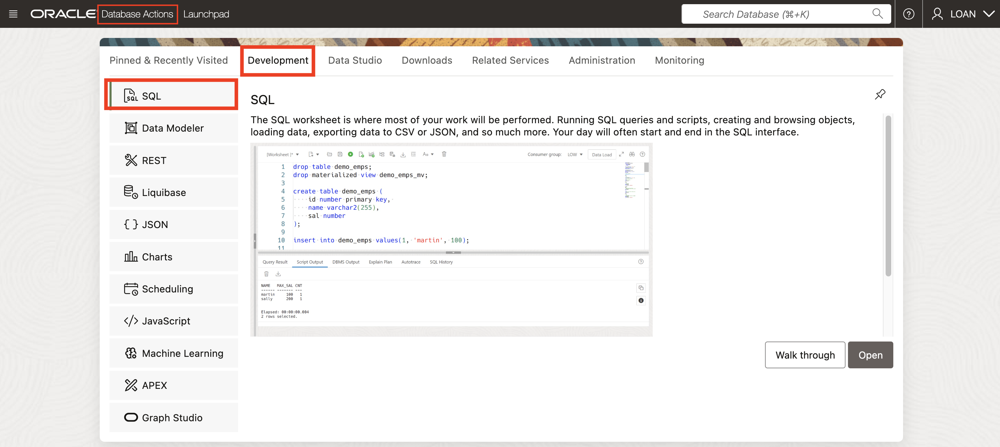

# Load, Link, and Query Object Storage Data from Autonomous Database

## Introduction

At SeersEquities, staying ahead means answering complex questions fast:

* *What’s the current funding mix for active loans?*

* *How do external market shifts affect our pricing models?*

To answer those questions, the data team must not only find the right data—they must **use it efficiently across systems, without bottlenecks or delays**.

In this lab, you’ll take the next step: using Oracle’s tools to **load, link, and query** data stored in cloud object storage—directly from Autonomous Database. You’ll make external data locally available when needed, or link to it in place to save time and cost.

Estimated Time: 45 minutes

### Objectives

By the end of this lab, you will:

* **Load high-value data** into database tables for fast performance or persistence

* **Link data in place** using Oracle Data Catalog to avoid duplication

* **Query across sources**—combining structured and unstructured data for real-time financial insights

By the end, you’ll have the skills to turn raw, external data into a seamless part of SeersEquities’ analytics workflow—ready to power better loan decisions and smarter risk management.


## Task 1: Load Object Storage Data into Autonomous Database using the Catalog Tool. 

1. If you are not yet logged in to **Database Actions**, click **View Login Info**. Copy your **DB ADMIN Password**, and click the **SQL Worksheet** link.  

      

2. For your Username enter **LOAN**. Paste in the password you copied in the previous step.  

      

3. Select **Data Studio** from the tab menu, then select **Catalog** from the left rail.  

        

4.  Click the **Data Objects** tab at the top of the catalog page to view the contents from your object storage buckets.  

        

5. From the list, select **LoanAppcustomer_extension.csv** to open the **Cloud Object Entity** page.  

        

6. Click **Load to Table**.  

        

7. Select **Create Table** in the table section, then change the table name to something more meanful -- like, **CUSTOMER EXTENSION**.  

        

      Click **Load Data**.  

8. In the popup window, click **Go to Data Load** to continue.  

       

9. Once the job completes, the table appears under **Table and View Loads** on the page. Click **Report** to review job details.  

        

10. Review the job details.  Click **SQL** to review the code used.  

        

13. The SQL code is displayed.  

        

      Click **Close**.  

14. To analyze the data load, click **Query**.  

        

15. The SQL Worksheet opens with the query pre-loaded, the results displayed, and an analysis of the dataset.  

        

16. Click **Catalog** in the left rail and you’ll see the **CUSTOMER_EXTENSION** table now listed in the catalog.  

        


You’ve just loaded external object storage data directly into your Autonomous Database—turning a static file into a query-ready table. This move helps optimize performance and makes your data ready for analytics, joins, and future products.  

## Task 2: Link Object Storage Data from Data Catalog to ADB.  

   1. From the **Catalog** page, make sure **Data Objects** is selected and the **Cloud Object** filter is active. Then select **LoanAppcustomer_segment.csv** to open the **Cloud Object Entity** page.  

        

   2. Click the **Link to Table** button to open the **Link Data** page.  

        

   3. Select **Create External Table** in the table section, then change the table name to something more meaningful --- **CUSTOMER_SEGMENT**.  

        

      Click **Link Data**.  

   7. In the popup, click **Go To Data Link** to continue.  

        

   8. Once the job completes, the external table appears under **Table and View Loads** on the page.  Click **Report** to review job details.  

        

   9. Review the job details.  Click **SQL** to review the code used.  

        

   10. The SQL code is displayed.

        

       Click **Close**.  

   11. To analyze the data link, click Query.  

        

   12. The SQL Worksheet opens with the query pre-loaded, the results displayed, and an analysis of the dataset.  

     

You’ve just linked **external object storage data** to your database—**no loading required**. With this external table in place, you can **run queries instantly while avoiding data duplication** and keeping your analytics agile and efficient.  

## Task 3: Query Data in Object Storage and ADB Database.

   1.	Click **Database Actions** in the top banner to open the **Launchpad** page. Select the **Development** tab, then click **SQL** to open the SQL Worksheet.   

    

   2.	Query the **CUSTOMER_EXTENSION** table. Copy and paste the following SQL into the Worksheet, then click the **Run Statement** icon:  

      ```text
      <copy>
      select * from CUSTOMER_EXTENSION e;
      </copy>
      ```

   The output shows information about customers.  

    

   3.	Now query the **CUSTOMER_SEGMENT** external table. Paste the SQL below into the Worksheet, then click **Run**:  

      ```text
      <copy>
     select * from CUSTOMER_SEGMENT s;
      </copy>
      ```

      The output shows defined customer segments.  

        

   4.	Combine data from both tables using a **join**. Paste the query below, then click **Run**:  

      ```text
      <copy>
        select cust_id, first_name, last_name, s.name segment
         from loan.customer_extension e,
               loan.customer_segment  s
         where e.segment_id = s.segment_id;
      </copy>
      ```

   The results show enriched customer profiles with segment labels.  

    

You’ve now combined external object storage data with internal database data—all from a single query. This unlocks richer analytics, enabling SeersEquities to connect customer attributes with segmentation strategies in real time.  

## Conclusion  

In this lab, you’ve learned how to **load, link, and query data** from cloud object storage using Oracle Autonomous Database. Each task brought you closer to a unified data environment—one where internal and external sources work together seamlessly.

By turning static files into live tables or external links, you’ve made **data instantly queryable**. And by joining that data across sources, you've created a **richer, real-time foundation for analytics**.

For SeersEquities, this means **faster decisions, smarter loan products, and more agile data workflows**. For you, it means mastering the tools that make all of that possible.

## Acknowledgements
* **Authors** - Eddie Ambler, Otis Barr
* **Last Updated By/Date** - Kamryn Vinson, June 2025
