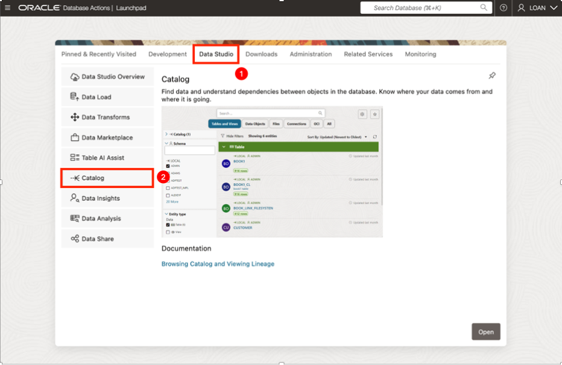
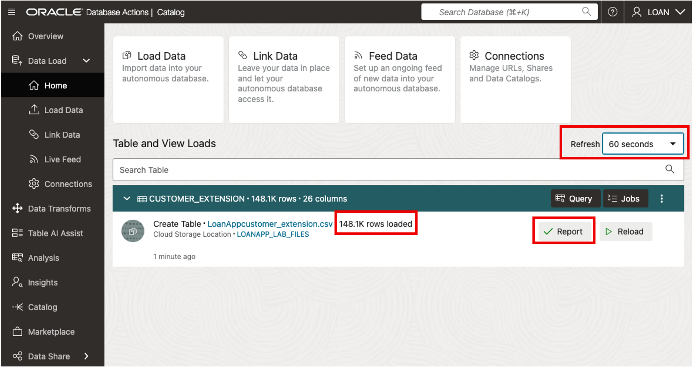
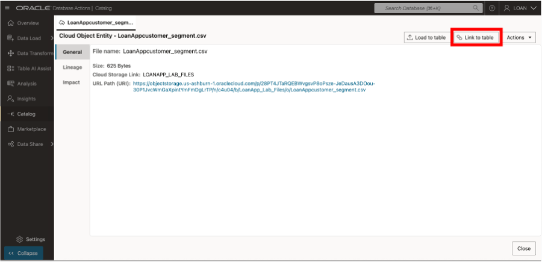
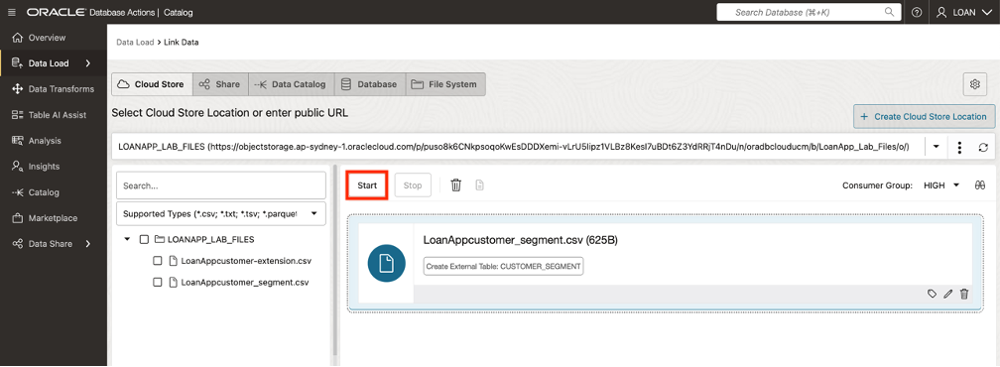

# Load, Link, and Query Object Storage Data from Autonomous Database

## Introduction

This lab is designed to give the Data Engineer/Architect experience utilizing the **Data Load** tools, to gain access to data that resides inside the database on cloud object storage.  

This lab will give you the skills to load, link, and query object storage data directly from your **Autonomous Database** instance.  

You'll learn how to make object storage data locally available for performance optimization or cost reduction while maintaining flexibility for real-time analytics.  

Using **Oracle Data Catalog**, you'll link object storage data to your database and create external tables that allow direct querying without time-consuming transfers.  

Finally, you'll run cross-source queries that combine structured database tables with object storage data to deliver a unified view of financial insights.

By the end of this lab, you will:

   * ***Load Data:*** Understand how to move object storage data into tables in your Autonomous Database when required for improved performance, persistence, or cost savings.

   * ***Link Data:*** Use Oracle Data Catalog to connect object storage assets to your database.

   * ***Query Database & Object Storage Data:*** Query object storage data directly and combine it with data in database tables for unified analytics.

## Task 1: Load Object Storage Data into Autonomous Database using Data Catalog

1. Click **View Login Info**. Copy your DB ADMIN Password and click the **SQL Worksheet** link.

   1. Navigate to your Assigned ADB Instance

2. For your Username enter **LOAN**. Paste in the password you copied in the previous step.

      

3. Select **Data Studio** from the tab menu, then select **Catalog** from the left rail. 

      

4.  Click on the **Data Objects** tab at the top of the Catalog page to view the contents of the object storage buckets.

      

5. Select **LoanApp Customer-extention.csv** from the list, this will take you to the Cloud Object Entity page.

      

5. Select the **Load to Table** button and the Load Data page will appear. 

        

6. Click the **Edit (pencil)** icon, in the lower right corner.  

        

7. In the table section, select **Create Table** from the list of options displayed.  

        

8. Enter **CUSTOMER_EXTENTION** for the name of the table. Click the **Close** button. 

        
 
9. Click the **Start** button on the Data Load page.  

        

10. Click the **Run** button in the popup window, to start a job that loads data from the Cloud Store.  

       

11. The table will appear on the Table and View Loads page, once the job is completed. To generate a report and review the SQL used for the job, click on the **Report** button.  

        

12. Click the **Close** button when finished.  

        

13. To review details about the data in the table using SQL Worksheet, click on the **Query** button.  

        

14. The SQL Worksheet will appear with the query pre-loaded, the query results available, and an analysis of the data set.  

        

15. Select **Catalog** from the left rail and take note that the **Customer_Extension** table now appears in the Catalog.

      

   **Congratulations you have now loaded your Object Storage discovered in your catalog data into your ADB.**

## Task 2: Link Object Storage Data from Data Catalog to ADB.

   1. From the Data Catalog page with Data Objects selected, make sure the Cloud Object filter is selected, then select **LoanAppCustomer_segment.csv** from the list for the Cloud Object Entity page.

      

   2. Select the **Load to Table** button and the Load Data page will appear.

   

   3. Click the **Edit (pencil)** icon, in the lower right corner.

   

   4. In the table section, select **Create External Table** from the list of options.

   

   5. Enter the name **CUSTOMER_SEGMENT** for the table.  Click the **Close** button.

   

   6. Click the **Start** button on the Link Data page.

   

   7. Click the **Run** button in the popup window, to start a job that loads data from the Cloud Store.

   

   8. The table will appear on the Table and View Loads page once the job is completed. To review details about the data in the table using SQL Worksheet, click on the **Query** button.

   

   

   **Congratulations you have now Linked your Object Storage discovered in your catalog and can query it from your ADB.**

## Task 3: Query Data in Object Storage and ADB Database.

   1.	Click the Database Actions in the banner to display the Launchpad page. Click the **Development** tab, and then click **SQL** to display the SQL Worksheet

  

   2.	Let's query the CUSTOMER_EXTENSION table. Copy and paste the following code into your SQL Worksheet, and then click the Run Statement icon in the Worksheet toolbar.

      ```
      <copy>
      select * from CUSTOMER_EXTENSION e;
      </copy>
      ```

   The output shows information about customers.

  

   3.	Let's query the CUSTOMER_SEGMENTS external table. In the SQL Worksheet, copy and paste the following code into your SQL Worksheet to query the data, and then click the Run Statement icon in the Worksheet toolbar.

      ```
      <copy>
     select * from CUSTOMER_SEGMENT s;
      </copy>
      ```

   The output shows defined customer segments.

  

   4.	Create a join combining data from the CUSTOMER_EXTENSION table with data a then click the Run Statement icon in the Worksheet toolbar.

      ```
      <copy>
        select cust_id, first_name, last_name, s.name segment
         from loan.customer_extension e,
               loan.customer_segment  s
         where e.segment_id = s.segment_id;
      </copy>
      ```

   The output shows combined customer information.

  


   **Congratulations you have now combined data stored in Object Storage with data stored in the ADB database.**

## Acknowledgements
* **Authors** - Eddie Ambler, Otis Barr
* **Contributors** - Mike Matthews, Marty Gubar, Kamryn Vinson
* **Last Updated By/Date** - Kamryn Vinson, June 2025
