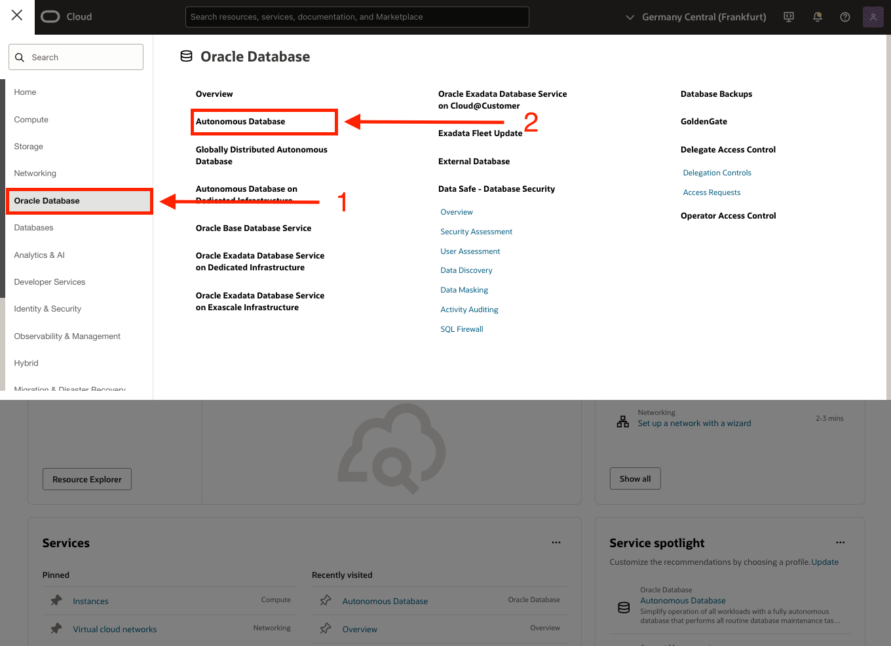

# 🔗 Simplify Data Access and Data Sharing  with Integrated Tools

#### Estimated Lab Time: 20 minutes

## Introduction

In this lab, you’ll discover the key **data platform tools** used with **Autonomous Database (ADB)** to query, manage, transform, explore, and share your data. By the end, you’ll see how these tools work together to help you easily **load data**, **organize it**, **query it**, and **share it**—without needing a deep technical background.

By leveraging the integrated data platform tools with ADB, you’ll see how easy it is to go from **accessing raw data** all the way to **collaborating with other departments** to ensure everyone has the data they need, **exactly** when they need it. 📊🤝

Enjoy the journey and get ready to unlock the full potential of the **Oracle Data Platform** and your **Oracle Autonomous Database**! 🚀

### Prerequisites

This lab assumes you have:

* Completed the Get Started lab
* Successfully launched the hands-on lab environment

## Task 1: Navigate to your assigned ADB instance

1. Navigate to your assigned ADB Instance.

2. Select the name of your assigned database.

## Task 2: Intro to Database Actions

**Database Actions** is a web-based interface that provides development, data, administration, and monitoring tools for Oracle Autonomous Database. It allows users to run SQL queries, manage database objects, and develop REST APIs directly from their browser without requiring additional software installation.

1. From your database instance home page, select "**Database Actions**"

2. Then select "**View all database actions**" from the dropdown list

## Task 3: Intro to Data Studio

**Data Studio** is a suite of tools within Oracle Autonomous Database that simplifies data workflows. It includes features for loading, transforming, analyzing, and sharing data. With its intuitive interface, Data Studio enables users to integrate and analyze data from various sources efficiently.

## Task 4: Intro to Data Catalog

**Data Catalog** centralizes metadata management and data discovery within Oracle Autonomous Database. It allows users to search, organize, and understand data assets across connected systems, making it easier to manage dependencies and ensure compliance.

## Task 5: Intro to Data Load

**Data Load** enables fast and scalable data ingestion into Oracle Autonomous Database. Users can load data from local files, cloud storage, or external databases through a simple interface or automated pipelines, streamlining the integration process.

## Task 6: Intro to Data Share

**Data Share** facilitates secure sharing of data and metadata between Autonomous Databases or with external systems. It supports real-time and versioned sharing models, enabling seamless collaboration without duplicating data.

In this lab, you explored the **integrated tools** within **Oracle Autonomous Database** that simplify **data access**, **transformation**, **analytics**, and **sharing**. These tools empower users to work efficiently across various data workflows without requiring specialized technical expertise. 💡📊

**Continue to the next lab to dive deeper into how these tools work!** 🚀

## Learn More

* [The Catalog Tool](https://docs.oracle.com/en/cloud/paas/autonomous-database/serverless/adbsb/catalog-entities.html)
* [Autonomous Database](https://docs.oracle.com/en/cloud/paas/autonomous-database/index.html)

## Acknowledgements

* **Authors** - Matt Kowalik, Otis Barr
* **Contributors** - Eddie Ambler, Ramona Magadan
* **Last Updated By/Date** - TBC

Copyright (C) Oracle Corporation.
