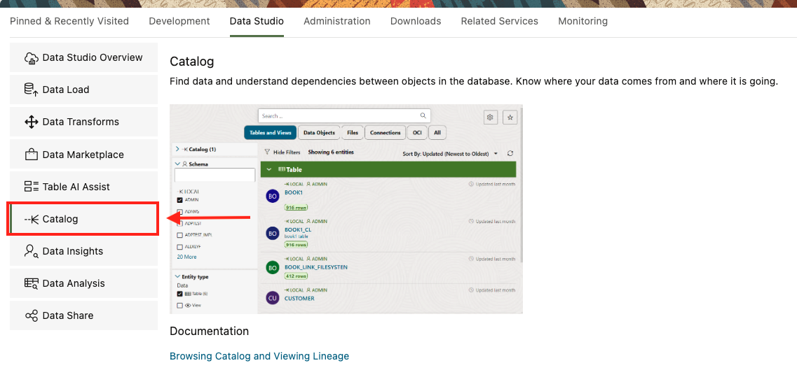

# 🔗 Simplify Data Access and Data Sharing  with Integrated Tools

## Introduction

This lab is designed to give the Data Engineer/Architect expose to the key **Autonomous Database** tools, that we will use in upcoming labs to show you how to gain access to both internal and external data that is required to create and share loan products.

In this lab, you’ll discover the key **data platform tools** used with **Autonomous Database** to query, manage, transform, explore, and share your data. By the end, you’ll see how these tools work together to help you easily **load data**, **organize it**, **query it**, and **share it**—without needing a deep technical background.

By leveraging the integrated data platform tools with ADB, you’ll see how easy it is to go from **accessing raw data** all the way to **collaborating with other departments** to ensure everyone has the data they need, **exactly** when they need it. 📊🤝

Enjoy the journey and get ready to unlock the full potential of the **Oracle Data Platform** and your **Oracle Autonomous Database**! 🚀

Estimated Time: 20 minutes

### Prerequisites

This lab assumes you have:

* Completed the Get Started lab
* Successfully launched the hands-on lab environment

## Task 1: Launch Database Actions

1. Click **View Login Info**. Copy your DB ADMIN Password and click the **SQL Worksheet** link.

      

2. For your Username enter **ADMIN**. Paste in the password you copied in the previous step.

      

3. This will cause the **Database Actions Launchpad** to be displayed 

  

## Task 2: Intro to Data Studio

**Data Studio** is a suite of tools within Oracle Autonomous Database that simplifies data workflows. It includes features for loading, transforming, analyzing, and sharing data. With its intuitive interface, Data Studio enables users to integrate and analyze data from various sources efficiently.

## Task 3: Intro to Data Catalog

**Data Catalog** centralizes metadata management and data discovery within Oracle Autonomous Database. It allows users to search, organize, and understand data assets across connected systems, making it easier to manage dependencies and ensure compliance.

> **NOTE:** In the picture above, the catalog includes quick filters in the top menu for search simplification.  You can combine multiple filters for more refined search results.

<u> **The catalog quick filters are:** </u>

* **Tables and Views** - This filter searches for database tables (both internal and external) and views, including both standard database views and analytic views.

* **Data Objects** - This filter searches for data objects in the database and on connected cloud storage.

    > **NOTE:** This is a superset of the Tables and Views and Files filters.

* **Files** - This filter searches for files in connected cloud storage only.

* **OCI** - This filter searches for other Oracle Cloud Infrastructure objects, such as Autonomous Databases, OCI cloud storage buckets, or registered OCI Data Catalogs. This option is available if you have an OCI credential, which can be created from the **Data Studio Settings** icon.

* **Connections** - This filter searches for connections registered in Data Studio, such as those to external Data Catalogs or databases.

* **All** - This filter searches for all objects in the catalog. Since there can be thousands of objects, this scope may result in slower performance.

## Task 4: Intro to Data Load

**Data Load** enables fast and scalable data ingestion into Oracle Autonomous Database. Users can load data from local files, cloud storage, or external databases through a simple interface or automated pipelines, streamlining the integration process.

## Task 5: Intro to Data Share

**Data Share** facilitates secure sharing of data and metadata between Autonomous Databases or with external systems. It supports real-time and versioned sharing models, enabling seamless collaboration without duplicating data.

## Summary

In summary, you have explored the integrated tools within Oracle Autonomous Database that simplify data access, transformation, analytics, and sharing. These tools empower users to work efficiently across various data workflows without requiring specialized technical expertise. 💡📊

**Continue to the next lab to dive deeper into how these tools work!** 🚀

## Learn More

* [The Catalog Tool](https://docs.oracle.com/en/cloud/paas/autonomous-database/serverless/adbsb/catalog-entities.html)
* [Autonomous Database](https://docs.oracle.com/en/cloud/paas/autonomous-database/index.html)

## Acknowledgements

**Authors** - Eddie Ambler, Otis Barr
* **Contributors** - Mike Matthews, Marty Gubar, Kamryn Vinson
* **Last Updated By/Date** - Kamryn Vinson, June 2025