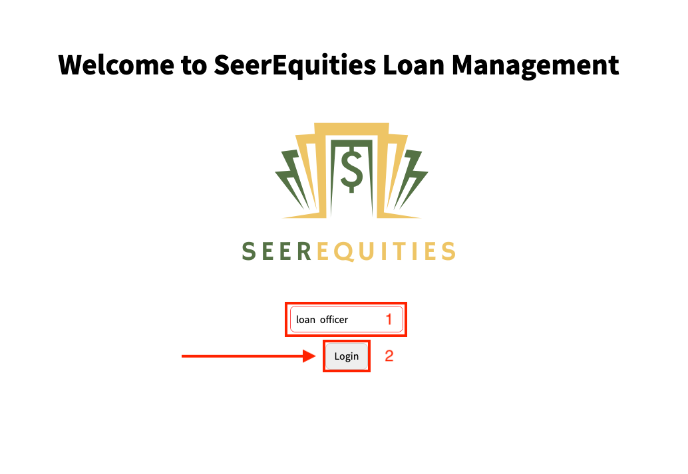
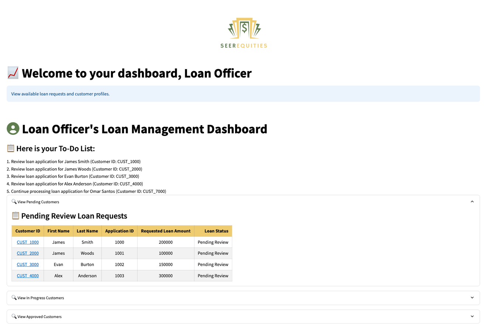
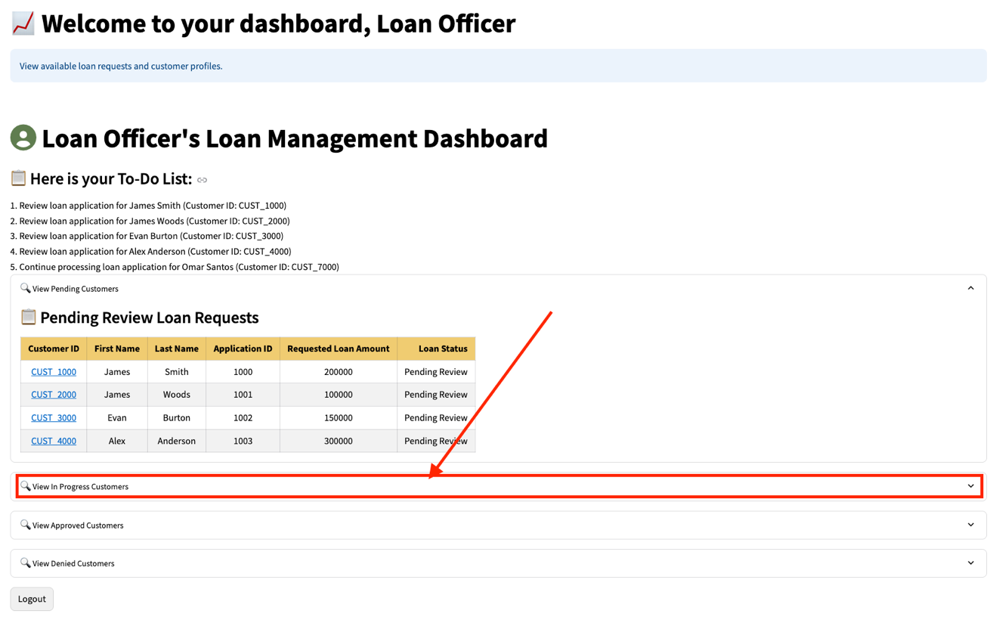
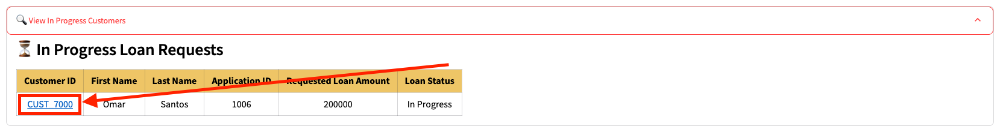
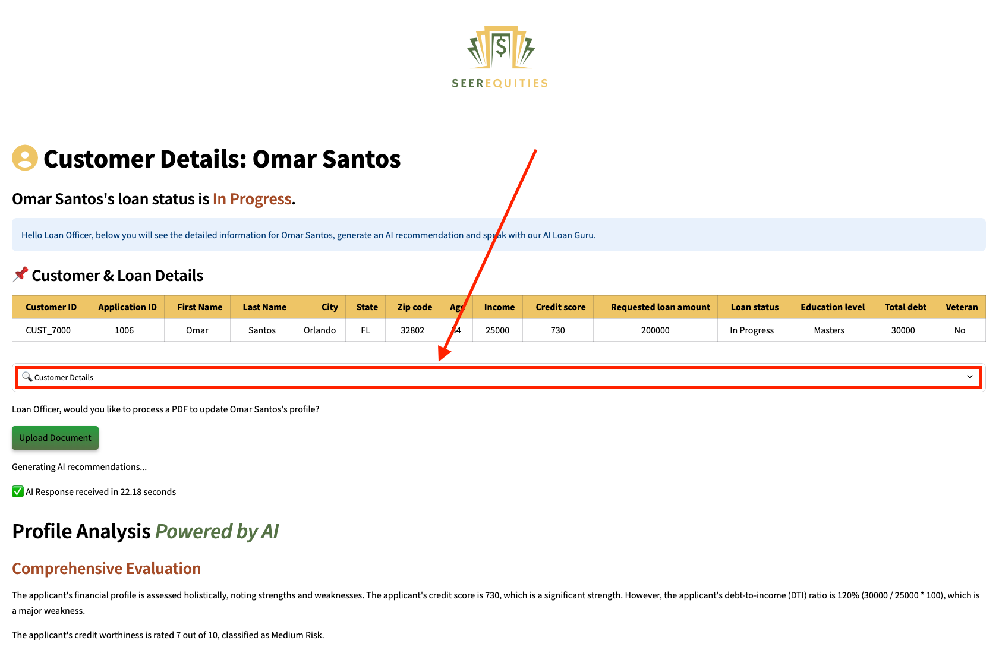
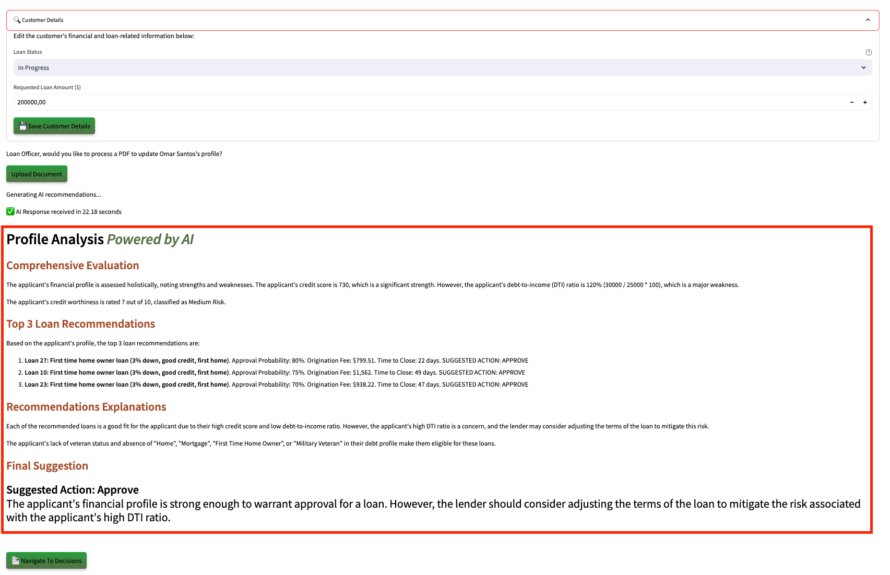
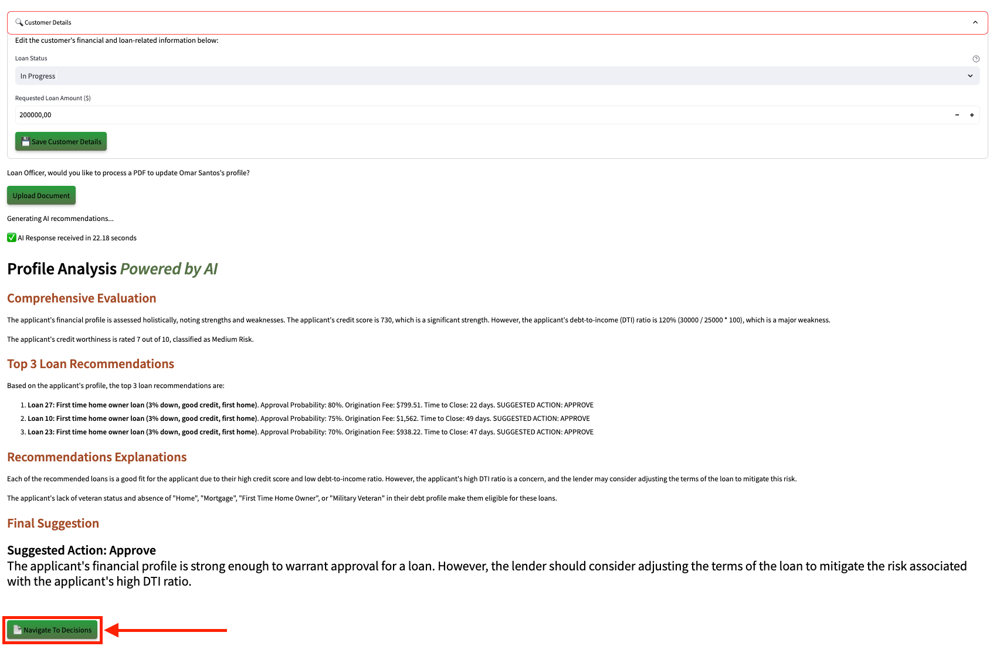
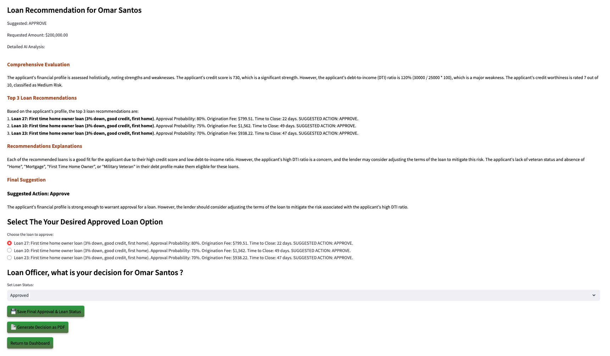
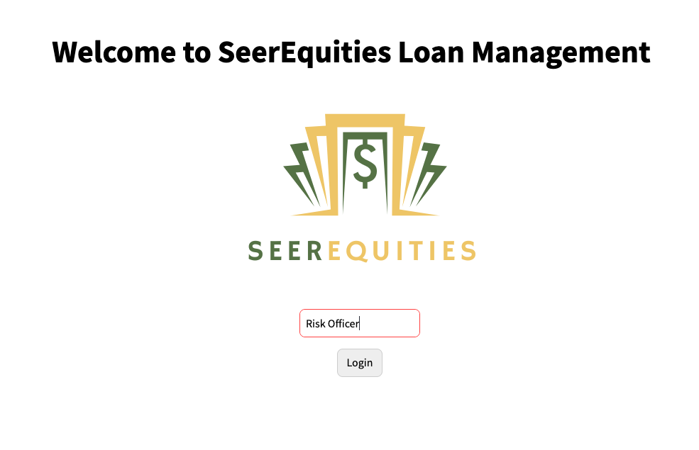

# 🤖 Explore Shared Data Products with GenAI Powered App

#### Estimated Lab Time: 45 minutes

## **Introduction**

At SeerEquities, loan approvals and risk evaluations need to happen quickly and accurately. But until recently, loan officers spent more time hunting for data than actually using it, while risk teams had to rely on outdated reports from IT.

With **Oracle’s Data Platform**, that’s no longer the case.

Loan officers and risk analysts can now have access to real-time data products that combine customer profiles, credit scores, transaction history, and more. Instead of needing to query databases or waiting for reports, users can ask a GenAI-powered application simple questions like:

* “**Which applications are close to approval?**”
* “**Which loan segments are high-risk?**”

In this lab, you'll explore how these shared data products simplify tasks, speed up decision-making, and allow users to make smarter, data-driven choices. You’ll get hands-on with a Loan Management Application powered by Oracle Autonomous Database and see how a unified platform boosts productivity across finance roles.

## Task 1: Demo Loan Officer Interaction with Approval Application

A **loan officer** at **SeerEquities** begins their day by reviewing **pending loan applications** to determine which ones are ready for approval. Previously, this process involved manually gathering data from multiple systems—credit scores, transaction histories, and application details—leading to inefficiencies and delays.

Now, the loan officer logs into the Loan Management Application. With role-based access tailored to their needs, they can instantly view all relevant data in one place. The application uses AI-driven insights to prioritize applications based on approval readiness, saving time and improving accuracy.

1. To access the demo environment, click **View Login Info** in the top left corner of the page. Click the **Start the Demo** link.

    

2. Enter in a username and click **Login**

    

3. Welcome to the dashboard of **SeerEquities**

    

4. Navigate to and click "**View in Progress Customers**"

    

5. Navigate to and click a loan request in progress.

    

6. Navigate to and click "**Customer Details**"

    

7. View **Profile Analysis**

    

    🔍 **Profile Analysis Summary**

    Under the Profile Analysis section, the Loan Officer is presented with an AI-generated evaluation that brings together key insights from the applicant's financial profile. The system highlights the top 3 loan recommendations tailored to the applicant’s needs and creditworthiness, each supported by a clear explanation of why it was selected—whether it's based on income stability, repayment history, or risk profile.

    The AI also provides a comprehensive analysis, summarizing strengths and potential concerns in the application, and finishes with a final recommendation—approve, decline, or request more information—helping the Loan Officer make faster, more confident decisions with data-backed support.

8. Navigate to and click "**Navigate to Decision**"

    

9. When the Loan Officer selects **Navigate to Decision**, they’re taken to a deeper AI-powered evaluation of the applicant's profile.

    This includes:

* A comprehensive analysis of the applicant’s financial standing, credit behavior, and risk indicators.
* The top 3 loan recommendations, tailored to the applicant’s profile and business lending strategy.
* Clear explanations for each recommendation, showing how each option aligns with the applicant’s qualifications.
* A final **AI-driven suggestion**, guiding the officer toward an approval, denial, or further review.

Below the analysis, the officer is presented with a radio selection list of the recommended loan options. After reviewing the insights and selecting a preferred option, the Loan Officer makes the final decision—**approve or reject**—based on both the AI recommendation and their professional judgment. 💼🤖

You, the **Loan Officer** have successfully completed this task and now understand how to leverage real-time data products and AI recommendations to make faster, more informed decisions. 🚀

By utilizing AI tools, the Loan Officer can:

* **Streamline workflows**: Automate document collection, verification, and classification using technologies like Optical Character Recognition (OCR) and Natural Language Processing (NLP), reducing manual errors and accelerating loan processing.
* **Analyze borrower profiles**: Evaluate creditworthiness by analyzing financial data, credit scores, transaction patterns, and alternative data sources such as social media or utility bill payments for a more comprehensive risk assessment.
* **Provide personalized recommendations**: Tailor loan options to individual borrower profiles by considering their financial behavior and market trends, ensuring better alignment between borrower needs and lender strategies.
* **Enhance decision-making**: Generate data-driven insights and predictive analytics to make more informed decisions while ensuring compliance with regulatory standards by eliminating bias in the evaluation process.
* **Improve customer interaction**: Utilize AI-powered chatbots to handle routine inquiries, enabling focus on complex cases and relationship-building, fostering trust and enhancing client satisfaction.

With these capabilities, the Loan Officer can process loans up to **60% faster** while delivering an elegant client experience. Combining AI insights with professional judgment empowers them to approve or reject applications efficiently and confidently. 💼🤖

**You can now continue to the next task.** ✅

---
**Disclaimer**: Please note that your results may vary. The information provided is generated by OCI Generative AI services, and your outcomes may differ from those presented.

---

## Task 2: Demo Risk Officer Interaction with Application

After the Loan Officer completes their review of pending applications, the focus shifts to a **Risk Officer** at SeerEquities. The Risk Officer plays a crucial role in ensuring that the company isn’t overexposed to high-risk loans or concentrated in specific geographic areas. 🌍

Previously, Risk Officers relied on **static reports** generated by IT teams—a process that often left them working with outdated information. Now, using the same **Loan Management Application** but with a different persona view, the **Risk Officer** can access shared data products directly from the marketplace. These include visualizations such as:

* **Risk exposure by region**
* **Credit score distribution across loan types**

1. To access the demo environment, click **View Login Info** in the top left corner of the page. Click the **Start the Demo** link.

    

2. Switch to the **Risk Officer** persona within the Loan Management Application

    

3. Access **shared data products** via the marketplace.

    > ⚠️ **Note:** `<PLACEHOLDER FOR SCREENSHOT>`

4. Use the graph display feature to analyze:

* **Loans by loan type and zip/state**: Identify regions with excessive exposure.

    > ⚠️ **Note:** `<PLACEHOLDER FOR SCREENSHOT>`

* **Loans by loan type and credit score**: Detects trends in high-risk lending.

    > ⚠️ **Note:** `<PLACEHOLDER FOR SCREENSHOT>`

By completing this task, you’ve seen how **Risk Officers** can use shared data products and insights to make proactive decisions that safeguard financial stability. 💼📊

This lab demonstrated how **Oracle’s Data Platform** empowers both **Loan Officers** and **Risk Officers** by providing real-time access to selected and shared data products through a GenAI-powered application.

* **Loan Officers** can streamline approvals with AI-driven recommendations that prioritize applications based on readiness.
* **Risk Officers** can leverage advanced visualizations and natural language queries to monitor exposure levels and mitigate risks effectively.

**Continue to the next lab to learn how this all comes together!** 🚀

## Learn More

* [The Catalog Tool](https://docs.oracle.com/en/cloud/paas/autonomous-database/serverless/adbsb/catalog-entities.html)
* [Autonomous Database](https://docs.oracle.com/en/cloud/paas/autonomous-database/index.html)

## Acknowledgements

* **Authors** - Matt Kowalik, Otis Barr
* **Contributors** - Eddie Ambler, Ramona Magadan
* **Last Updated By/Date** - TBC

Copyright (C) Oracle Corporation.
