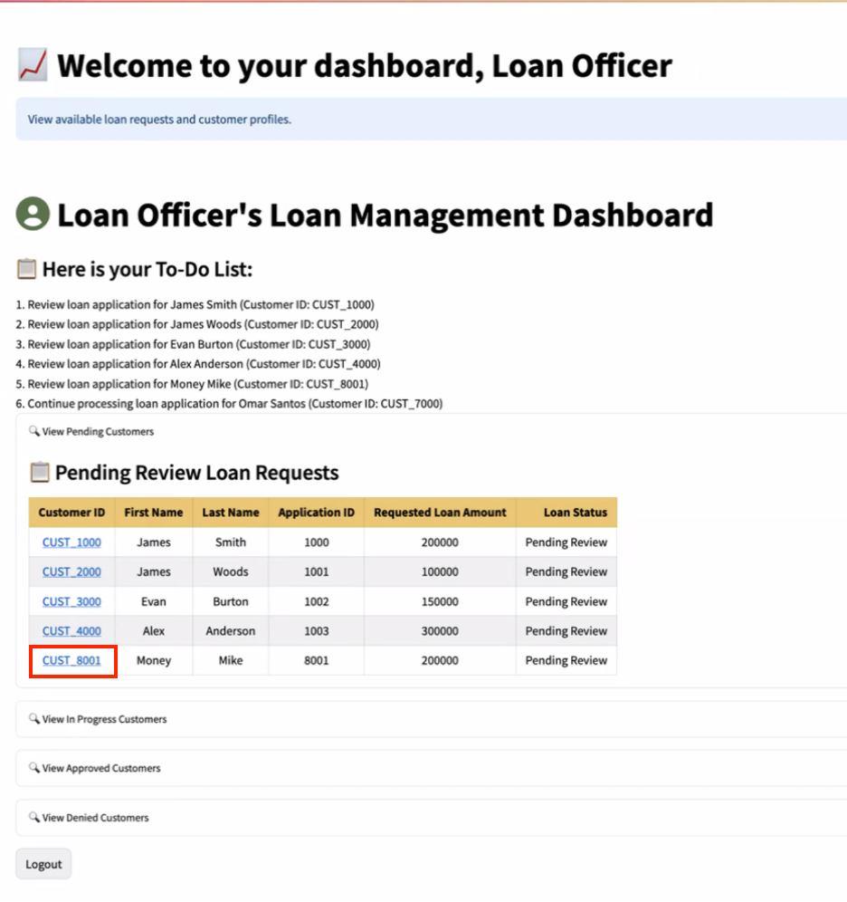

# 🤖 Demo GenAI Powered App on Oracle Data Platform

#### Estimated Lab Time: 45 minutes

## **Introduction**

At SeerEquities, loan approvals and risk evaluations need to happen quickly and accurately. But until recently, loan officers spent more time hunting for data than actually using it, while risk teams had to rely on outdated reports from IT to do their job.

With **Oracle’s Data Platform**, that’s no longer the case.

Loan officers and risk analysts can now have access to real-time data products that combine customer profiles, credit scores, transaction history, and more. Instead of needing to query databases or waiting for reports, users can ask a GenAI-powered application simple questions like:

* "Which loan products provide the lowest monthly cost for this customer?”
* “Which loan products are experiencing loan defaults?”
* “Which loan products are generating the most revenue?”

In this lab, you'll explore how the use of data products simplify tasks, speed up decision-making, and allows users to make smarter, data-driven choices. You’ll also get hands-on experience with a GenAI enabled Loan Management Application powered by Oracle Autonomous Database that will allow you to see how a unified data platform boosts productivity across all of the roles in the organization.

## Task 1: Demo Loan Officer Interaction with Approval Application

A **loan officer** at **SeerEquities** begins their day by reviewing **pending loan applications** to determine which ones are ready for approval. Previously, this process involved manually gathering data from multiple systems—credit scores, transaction histories, and application details—leading to inefficiencies and delays.

Now, the loan officer logs into the Loan Management Application. With role-based access tailored to their needs, they can instantly view all relevant data in one place. The application uses AI-driven insights to process loan applications and provide approval recommendations that save time and improve approval accuracy.

1. To access the demo environment, click **View Login Info** in the top left corner of the page. Click the **Start the Demo** link.

    

2.  **Login** to the Loan Management Application as a Loan Officer.

    * Select Role of **Loan Officer**
    * Enter **Username**
    * Click on **Login** Button

    

3. Welcome to the **SeerEquities** Loan Processing dashboard

    * **Click** on **Cust_8001** to process the loan request for Money Mike.

    

4. This displays the **Customer Details**() page 

    

        * On this page, you can expand the **Customer Details** view which uses JSON Duality to be able to update various fields in the customer application

    * After a few seconds the AI Response is displayed on this page, for you to analyze the GenAI powered Recommendations & Profile Analysis of your user's application

    

Profile Analysis Summary

Under the Profile Analysis section, the Loan Officer is presented with an AI-generated evaluation that brings together key insights from the applicant's financial profile. The system highlights the top 3 loan recommendations tailored to the applicant’s needs and creditworthiness, each supported by a clear explanation of why it was selected—whether it's based on income stability, repayment history, or risk profile.

The AI also provides a comprehensive analysis, summarizing strengths and potential concerns in the application, and finishes with a final recommendation—approve, decline, or request more information—helping the Loan Officer make faster, more confident decisions with data-backed support.

On this page, the AI Chat Bot can be used to ask questions of the data, using natural language. For example, a Loan Officer could ask to see recommendations that delivered the lowest monthly payment with the least amount of money down.

5. Click on the Navigate to Decision button to proceed to the decision-making screen

6. On the decision-making screen, Select the loan that you want to approve from the Loan Recommendations list

7. Back on the decision-making screen: 

    * Select the loan that you want to approve from the Loan Recommendations list 

    * **Click** on **Save Final Approval & Loan Status** Button 

As the Loan Officer, you have now successfully completed the loan application analysis and approval task and now understand how to leverage real-time data access and AI recommendations to make faster, more informed decisions about the best loan data products to approve for your customers.

**<U>By utilizing AI tools, the Loan Officer can:</U>**

Streamline workflows: Automate document collection, verification, and classification using technologies like Optical Character Recognition (OCR) and Natural Language Processing (NLP), reducing manual errors and accelerating loan processing.

Analyze borrower profiles: Evaluate creditworthiness by analyzing financial data, credit scores, transaction patterns, and alternative data sources such as social media or utility bill payments for a more comprehensive risk assessment.

Provide personalized recommendations: Tailor loan options to individual borrower profiles by considering their financial behavior and market trends, ensuring better alignment between borrower needs and lender strategies.

Enhance decision-making: Generate data-driven insights and predictive analytics to make more informed decisions while ensuring compliance with regulatory standards by eliminating bias in the evaluation process.

Improve customer interaction: Utilize AI-powered chatbots to handle routine inquiries, enabling focus on complex cases and relationship-building, fostering trust and enhancing client satisfaction.

With these capabilities, the Loan Officer can process loans up to 80% faster while delivering an elegant client experience. Combining AI insights with professional judgment empowers them to approve or reject applications efficiently and confidently. 💼🤖

## Task 2: Demo Risk Officer Interaction with Application

After the Loan Officers complete their reviews and approvals of pending applications, the focus of the business then shifts to the tasks of the Risk Officers at SeerEquities. The Risk Officers play a crucial role in ensuring that the company isn’t overexposed to high-risk loans and is not selling too many loans in a specific geographic area. 

Previously, risk officers relied on static reports generated by IT teams—a process that often left them working with outdated information. Now, the risk officers can access the shared data products directly without delays. The data can be consumed as standard data sets or visualized using Oracle Property Graphs to quickly analyze the data for:

* Risk exposure by regional concentration
* Credit score distribution across loan types

With this real-time access, the risk officers can proactively identify patterns and mitigate risks before they escalate.

1. To access the demo environment, click View Login Info in the top left corner of the page. Click the Start the Demo link.

2. Login to the Loan Management Application as a Risk Officer.

* Select Role of **Risk Officer**
* Enter **Username**
* **Click** on **Login** Button

**<u>On the Risk Officer Landing Page, use the graph display feature to analyze:</u>**

**Loans by loan type and zip/state:** Identify regions with excessive exposure.

![Graph Zip for Risk Officer](./images/graph-zip-risk-officer.png " "

**Loans by loan type and credit score**: Detect trends in high-risk lending.

* [Autonomous Database](https://docs.oracle.com/en/cloud/paas/autonomous-database/index.html)

## Acknowledgements

* **Authors** - Eddie Ambler, Otis Barr, Matt Kowalik
* **Contributors** - Francis Regalado, Linda Foinding
* **Last Updated By/Date** - 04/21/2025

Copyright (C) Oracle Corporation.
