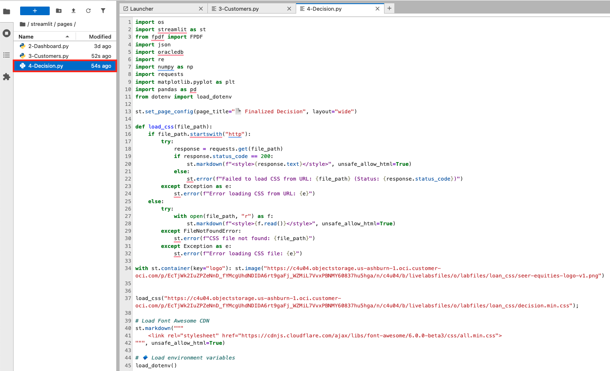
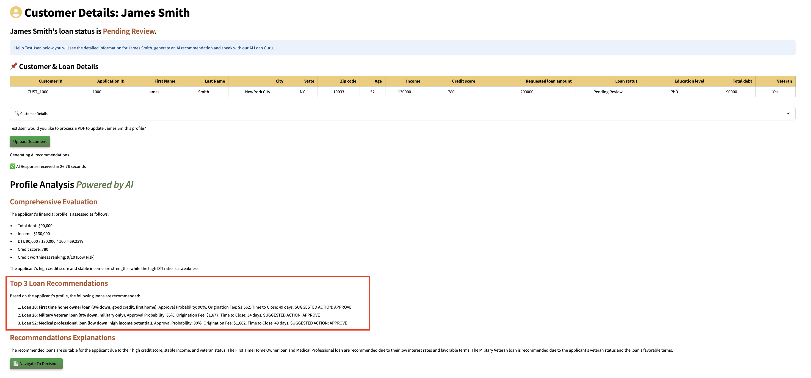

# Code RAG using AI Vector Search

## Introduction

This lab walks you through the steps to...

Estimated Time: 60 minutes

### Objectives

In this lab, you will:
* 
### Prerequisites

This lab assumes you have:
* An Oracle Cloud account

## Task 1: AI Developer Coding Exercise Answer

**Task**:

The company has requested an enhancement to the current loan recommendation system. The loan officer has indicated that the existing 3 loan options are insufficient, and they'd like to see the top 5 loan options instead.

**Instructions**:

1. Update the Customers.py and Decision.py files to make the necessary changes in the code so that the AI prompt returns the top 5 loans instead of the current 3.

2. Ensure the output displays the top 5 loans like the image below: 

    

**Answer**:

1. To navigate to the development environment, click **View Login Info**. Copy the Development IDE Login Password. Click the Start Development IDE link.

    

2. Paste in the Development IDE Login Password that you copied in the previous step. Click **Login**.

    

3. Click **Pages**.

    

4. Select the **Customers.py** file.

    

5. On lines 454 and 455, change the value 3 to **5**, as we need to display the top 5 loan recommendations instead of 3.

    

6. Save the Customers.py file.

    

7. Select the **Decision.py** file.

    

8. On line 456, change the value 3 to **5**.

    

9. On line 470, change the value 3 to **5**.

    

10. On line 485, change the value 3 to **5**.

    

11. Save the Decision.py file.

    

12. Select the **Launcher** tab and open the **terminal**

    

13. Copy the ./run.sh command and paste it into the terminal.

    ````
    <copy>
    ./run.sh
    </copy>
    ````

14. Click the URL displayed in the terminal to launch the SeerEquities Loan Management application.

    

15. Enter in a username and click **Login**.

    

16. On the Dashboard page, from the pending review list, select the Customer ID for **James Smith**.

    

17. This will display the customers loan application details. In approximately 15 seconds, the 5 AI generated loan recommendations will be displayed.

    

**Congratulations, you have successfully completed the AI Developer Coding Exercise!**


## Learn More

*(optional - include links to docs, white papers, blogs, etc)*

* [URL text 1](http://docs.oracle.com)
* [URL text 2](http://docs.oracle.com)

## Acknowledgements
* **Author** - <Name, Title, Group>
* **Contributors** -  <Name, Group> -- optional
* **Last Updated By/Date** - <Name, Month Year>
