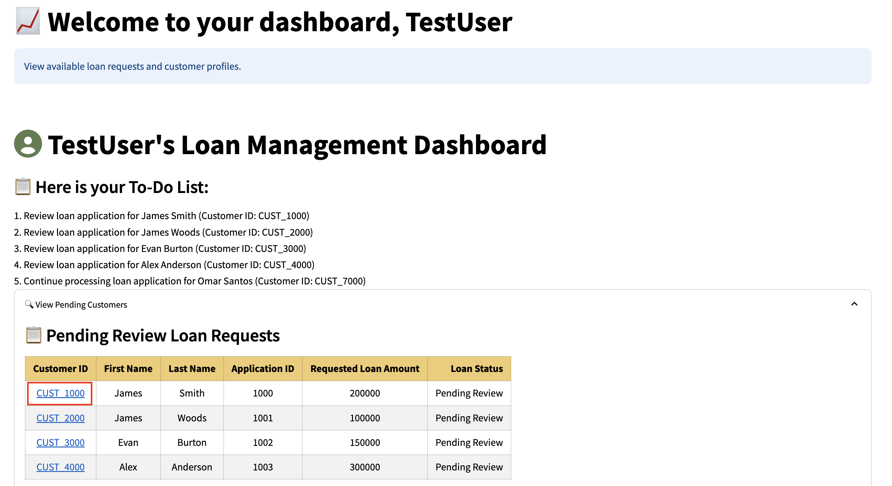
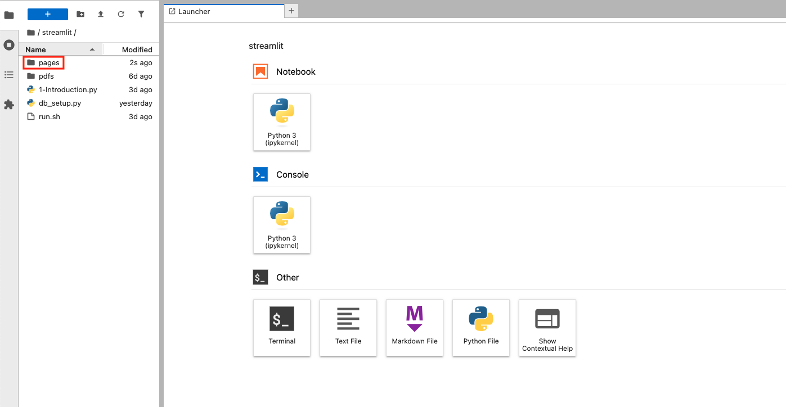

# Code with AI Vector Search step-by-step

## Introduction

In this coding challenge, you’ll focus on **AI Vector Search**. Your mission is to implement a key update to change the way similarities are calculated, improving the accuracy of predictions.

At SeerEquites, the data science team has been using Cosine similarity to assess similarities between customer profiles and predict loan risks. While effective in some contexts, the team recently realized that Cosine similarity wasn’t capturing the full picture of their customers financial profiles.

**Why switch to Euclidean distance?**

Cosine similarity is great when you care about the pattern or direction of someone’s data — not how big or small the numbers are. But in finance, the actual size of the numbers often matters a lot.

Let’s say you’re comparing two customers based on their debt, income, and credit usage. These numbers matter significantly, and big differences can indicate very different levels of risk.

Here’s an example:

* Both customers have the same debt-to-income ratio of 2:1.

* But one earns $20,000 a year, while the other earns $200,000.

Cosine similarity would say these customers are quite similar, because their ratios follow the same pattern. But that’s misleading — the person earning $20,000 is much riskier.

That’s where Euclidean distance comes in. Unlike Cosine similarity, Euclidean distance looks at the actual difference in the numbers. In this case, it would correctly flag that these customers are not similar in a meaningful way, since the scale of their incomes is vastly different.

In finance, where decisions are often made based on key figures like income, debt, and credit usage, Euclidean distance is often a better tool. It takes the size of the numbers into account, which is crucial for making accurate risk predictions.

In this lab, you’ll update the code to switch the similarity measure from Cosine to Euclidean. This change will improve the system’s ability to assess loan risks more accurately, providing more reliable insights for decision-making.

This is your opportunity to sharpen your skills, explore the power of AI-driven search, and make a meaningful impact on a application. Let’s get started!

Estimated Time: 30 minutes

### Objectives

In this lab, you will:
* Enhance your understanding of AI Vector Search by applying it to a developer coding challenge.
* Gain hands-on experience with integrating AI Vector Search and refining application features to meet specific development requirements.

### Prerequisites

This lab assumes you have:
* An Oracle Cloud account
* Successfully completed Lab 1: Run the Demo
* Successfully completed Lab 3: Connect to Development Environment

## Task 1: Challenge Requirements 

Based on the data scientists' evaluation, the company has decided to switch from using Cosine similarity to Euclidean distance. This change aims to enhance the system’s ability to assess loan risks more accurately, ultimately providing more reliable insights to support better decision-making.

Follow the prompts below to update the code based on the new company standard. 

## Task 2: Launch the Application

1. Select the **Launcher** tab and open the **terminal**

    

2. Copy the ./run.sh command and paste it into the terminal.

    ````bash
        $<copy>
        ./run.sh
        </copy>
    ````

3. Click the URL displayed in the terminal to launch the SeerEquities Loan Management application.

    

4. Enter in a username and click **Login**.

    

## Task 3: View the current AI chat bot return variables using Cosine

1. On the Dashboard page, from the pending review list, select the Customer ID for **James Smith**.

    

2. This will display the customers loan application details. In approximately 15 seconds, the AI generated loan recommendations will be displayed.

     

3. Ask the following question to the AI Chat bot.

    ````text
            <copy>
            What about a 4th loan?
            </copy>
    ````   

    Note how the return variables are shown:

    

## Task 4: Modify the Customers.py File

1. Click **Pages**.

    

2. Select the **Customers.py** file.

    

3. Update the Customers.py file to make the necessary changes in the code at lines 845 and 846

    

4. Save the Customers.py file.

    

## Task 5: View results in the Loan application

1. On the Dashboard page, from the pending review list, select the Customer ID for **James Smith**.

    

2. This will display the customers loan application details. In approximately 15 seconds, the AI generated loan recommendations will be displayed.

     

3. Ask the following question to the AI Chat bot.

 ````text
        <copy>
        What about a 4th loan?
        </copy>
````
4. View the new prompt return from the AI chat bot

    


**Congratulations, you have successfully completed the AI Vector Search Challenge!** By switching to Euclidean distance, SeerEquites ensures more precise loan risk evaluations and improves the overall effectiveness of their loan management system.

## Learn More

* [Oracle Database 23ai Documentation](https://docs.oracle.com/en/database/oracle/oracle-database/23/)

## Acknowledgements
* **Authors** - Linda Foinding, Francis Regalado
* **Contributors** - Kamryn Vinson, Eddie Ambler, Kevin Lazarz
* **Last Updated By/Date** - Kamryn Vinson, April 2025
