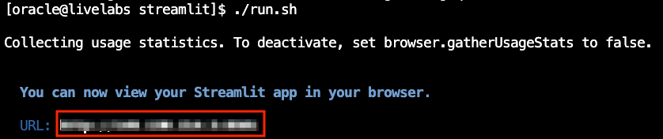

# Code with Generative AI

## Introduction

**Welcome to the Code with Generative AI Challenge!**

In this lab, you will tackle an exciting developer coding challenge focused on **AI Vector Search**. Your goal is to enhance the existing application by implementing an update that will elevate its functionality. This is your opportunity to sharpen your skills and explore the power of AI-driven search.

**Are you up for the challenge?**

If you're ready to dive in, proceed with this lab and start coding. If you prefer a more guided approach with a detailed walkthrough, you can continue to Lab 4b Step-by-step: Code with Generative AI for step-by-step instructions.

Good luck, and enjoy the process!

Estimated Time: 30 minutes


### Objectives
In this lab, you will:
* Enhance your understanding of Generative AI by applying it to a real-world developer coding challenge.
* Gain hands-on experience with fine-tuning and refining application features to meet specific development requirements.


### Prerequisites

This lab assumes you have:
* An Oracle Cloud account
* Successfully completed Lab 1: Run the Demo
* Successfully completed Lab 3: Connect to Development Environment


## Task 1: Challenge Requirements 

The company has requested an enhancement to the current loan recommendation system. The loan officer has indicated that the existing 3 loan options are insufficient, and they'd like to see the top 5 loan options instead.

1. Update the Customers.py and Decision.py files to make the necessary changes in the code so that the AI prompt returns the top 5 loans instead of the current 3.

2. Ensure the output displays the top 5 loans as shown in the image below:

    

## Task 2: Modify the Required Files

In this task, we will show you how to access the files needed to complete the challenge.

1. Click **Pages**.

    

2. Select the **Customers.py** file.

    

3. After making the necessary changes in the Customers.py file so that the AI prompt returns the top 5 loans instead of the current 3, you will need to save the file before opening the Decision.py file.

    

4. Select the **Decision.py** file.

    

5. After making the necessary changes in the Decision.py file so that the AI prompt returns the top 5 loans instead of the current 3, you will need to save the file.

    

## Task 3: Launch the Application

In this task, we will show you how to launch the application.

1. Select the **Launcher** tab and open the **terminal**.

    

2. Copy the ./run.sh command and paste it into the terminal.

    ````bash
        $<copy>
        ./run.sh
        </copy>
    ````

3. Click the URL displayed in the terminal to launch the SeerEquities Loan Management application.

    

4. Enter in a username and click **Login**.

    

## Task 4: View the Results

In this task, we will show you how to view the changes you made in the application.

1. On the Dashboard page, from the pending review list, select the Customer ID for **James Smith**.

    

2. This will display the customers loan application details. In approximately 15 seconds, the 5 AI generated loan recommendations will be displayed.

    

**Congratulations, you have successfully completed the Generative AI Challenge!** You have updated the files to make the necessary changes in the code so that the AI prompt returns the top 5 loans instead of the current 3. The company can now see more loans options and provide better service to their customer.

## Learn More

* [Oracle Database 23ai Documentation](https://docs.oracle.com/en/database/oracle/oracle-database/23/)

## Acknowledgements
* **Authors** - Linda Foinding, Francis Regalado
* **Contributors** - Kamryn Vinson, Eddie Ambler, Kevin Lazarz
* **Last Updated By/Date** - Kamryn Vinson, April 2025
