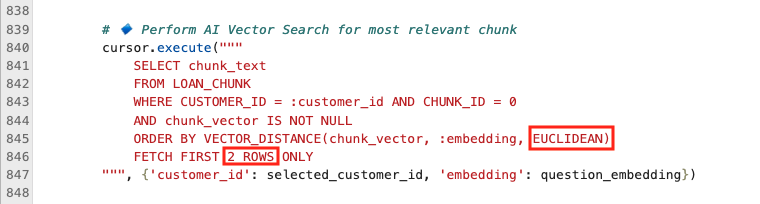

# Code with AI Vector Search

## Introduction

**Welcome to the Code with Generative AI Challenge!**

In this lab, you will tackle an exciting developer coding challenge focused on **AI Vector Search**. Your goal is to enhance the existing application by implementing an update that will change its functionality. This is your opportunity to sharpen your skills and explore the power of AI-driven search. 

You will be tasked with updating various parts of the code due to business requirement changes. 

At SeerEquites, the data science team had been using Cosine similarity to assess similarities between borrower profiles and predict loan risks. While this worked well for high-dimensional data, the company was increasingly handling low-dimensional datasets—borrower profiles with fewer features that carried more specific, meaningful information.

The team discovered that Euclidean distance was a more accurate measure for these low-dimensional datasets, as it accounts for both magnitude and direction, giving more precise results when comparing borrower profiles. This improvement would enhance loan risk assessments, fraud detection, and borrower segmentation.
After evaluating the benefits, the business decided to switch to Euclidean distance to improve model accuracy and better serve their clients.

**Are you up for the challenge?**

If you're ready to dive in, proceed with this lab and start coding. If you prefer a more guided approach with a detailed walkthrough, you can continue to Lab 4b Step-by-step: Code with AI Vector Search for step-by-step instructions.

Good luck, and enjoy the process!

Estimated Time: 30 minutes


### Objectives
In this lab, you will:
* Enhance your understanding of Generative AI by applying it to a developer coding challenge.
* Gain hands-on experience with fine-tuning and refining application features to meet specific development requirements.


### Prerequisites

This lab assumes you have:
* An Oracle Cloud account
* Successfully completed Lab 1: Run the Demo
* Successfully completed Lab 3: Connect to Development Environment


## Task 1: Challenge Requirements 

**About AI Vector Search**

Oracle AI Vector Search is a feature of Oracle Database 23ai that enables efficient searching of AI-generated vectors stored in the database. It supports fast search using various indexing strategies and can handle massive amounts of vector data. This makes it possible for Large Language Models (LLMs) to query private business data using a natural language interface, helping them provide more accurate and relevant results. Additionally, AI Vector Search allows developers to easily add semantic search capabilities to both new and existing applications.

    

**Challenge Requirements** 

Due to the data sciencists evaluation, the company has requested that we start using Eucledian distance instead of Cosine similarity variables as it offers more precise results when dealing with Low-dimensional data. 

Follow the prompts below to update the code based on the new company standard. 

## Task 2: Launch the Application

1. Select the **Launcher** tab and open the **terminal**

    

2. Copy the ./run.sh command and paste it into the terminal.

    ````bash
        $<copy>
        ./run.sh
        </copy>
    ````

3. Click the URL displayed in the terminal to launch the SeerEquities Loan Management application.

    

4. Enter in a username and click **Login**.

    

## Task 3: View the current AI chat bot return variables using Cosine

1. On the Dashboard page, from the pending review list, select the Customer ID for **James Smith**.

    

2. This will display the customers loan application details. In approximately 15 seconds, the AI generated loan recommendations will be displayed.

     

3. Ask the following question to the AI Chat bot.

    ````text
            <copy>
            What about a 4th loan?
            </copy>
    ````   

    Note how the return variables are shown:

    

## Task 4: Modify the Customers.py File

1. Click **Pages**.

    

2. Select the **Customers.py** file.

    

3. Update the Customers.py file to make the necessary changes in the code at lines 845 and 846

    

4. Save the Customers.py file.

    

## Task 5: View results in the Loan application

1. On the Dashboard page, from the pending review list, select the Customer ID for **James Smith**.

    

2. This will display the customers loan application details. In approximately 15 seconds, the AI generated loan recommendations will be displayed.

     

3. Ask the following question to the AI Chat bot.

    ````text
            <copy>
            What about a 4th loan?
            </copy>
    ````
4. View the new prompt return from the AI chat bot

    


**Congratulations, you have successfully completed the AI Vector Search Challenge!** By switching to Euclidean distance, SeerEquites ensures more precise loan risk evaluations and improves the overall effectiveness of their loan management system.

## Learn More

* [Oracle Database 23ai Documentation](https://docs.oracle.com/en/database/oracle/oracle-database/23/)

## Acknowledgements
* **Authors** - Linda Foinding, Francis Regalado
* **Contributors** - Kamryn Vinson, Eddie Ambler, Kevin Lazarz
* **Last Updated By/Date** - Kamryn Vinson, April 2025
