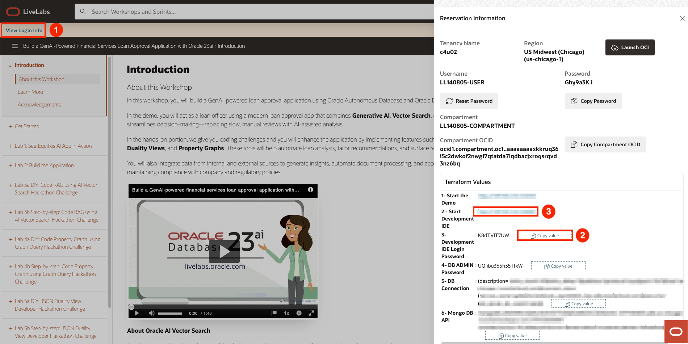
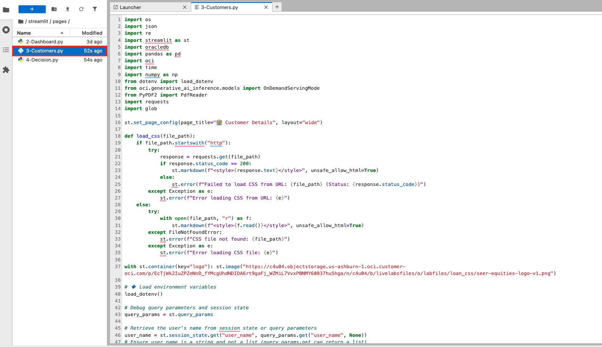
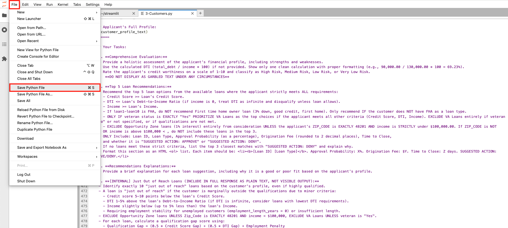

# Code RAG using AI Vector Search

## Introduction
In this lab, you will complete a series of developer coding challenges using various Oracle Database 23ai features. You will be challenged to enhance the current application features to implement various updates. Are you up for the challenge? 

If you are up for the challenge, use the (tab name) tab on the right. If you would like a step-by-step guide on how to complete the challenges, use the (tab name) tab on the left.

Estimated Time: 30 minutes


### Objectives
* Perform the coding required to achieve the enhancement request outlined in the instructions.


### Prerequisites

This lab assumes you have:
* An Oracle Cloud account
   

## Task 1: AI Developer Coding Challenge

**Task**:

The company has requested an enhancement to the current loan recommendation system. The loan officer has indicated that the existing 3 loan options are insufficient, and they'd like to see the top 5 loan options instead.

**Instructions**:

1. Update the Customers.py and Decision.py files to make the necessary changes in the code so that the AI prompt returns the top 5 loans instead of the current 3.

2. Ensure the output displays the top 5 loans as shown in the image below: 

    

**Guidance**:

We will show you how to access the files needed to complete the exercise and how to view the changes you make.

1. To navigate to the development environment, click **View Login Info**. Copy the Development IDE Login Password. Click the Start Development IDE link.

    

2. Paste in the Development IDE Login Password that you copied in the previous step. Click **Login**.

    

3. Click **Pages**.

    

4. Select the **Customers.py** file.

    

5. After making the necessary changes in the Customers.py file so that the AI prompt returns the top 5 loans instead of the current 3, you will need to save the file before opening the Decision.py file.

    

6. Select the **Decision.py** file.

    

7. After making the necessary changes in the Decision.py file so that the AI prompt returns the top 5 loans instead of the current 3, you will need to save the file.

    

8. To view the changes you made to the AI prompt, select the **Launcher** tab and open the **terminal**. 

    

9. Copy the ./run.sh command and paste it into the terminal.

    ````
    <copy>
    ./run.sh
    </copy>
    ````

10. Click the URL displayed in the terminal to launch the SeerEquities Loan Management application.

    

11. Enter in a username and click **Login**.

    

12. On the Dashboard page, from the pending review list, select the Customer ID for **James Smith**.

    

13. This will display the customers loan application details. In approximately 15 seconds, the 5 AI generated loan recommendations will be displayed.

    

## Learn More

*(optional - include links to docs, white papers, blogs, etc)*

* [URL text 1](http://docs.oracle.com)
* [URL text 2](http://docs.oracle.com)

## Acknowledgements
* **Author** - <Name, Title, Group>
* **Contributors** -  <Name, Group> -- optional
* **Last Updated By/Date** - <Name, Month Year>
