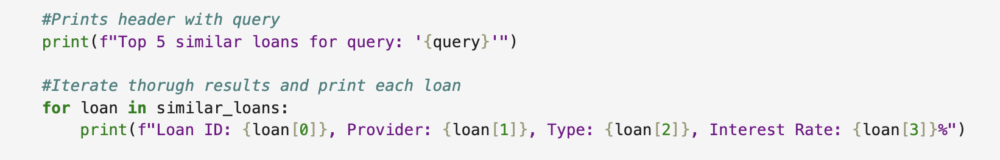
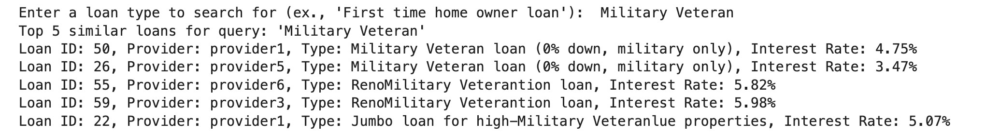

# Match Loans with AI: Vector Search Challenge in Oracle Database 23ai

## **Introduction**

**Welcome to the Code with AI Vector Search Challenge!**

In this workshop, you’ll dive into the exciting world of AI Vector Search using Oracle Database 23ai. Your goal is to **build a loan matching feature** for a financial application using **Similarity Search**.


At SeerEquites, the data science team has been utilizing different techniques with the goal of enabling smarter loan recommendations. They've began to build a similarity search feature that uses AI vector search to understand the meaning behind loan descriptions (e.x., "Affordable Housing Loan") and match them to user queries, even if the words aren’t identical. You’ll see how Oracle Database 23ai’s vector search transforms text into numerical embeddings and finds the most similar loans using cosine similarity.

**Why AI Vector Search?**
Unlike traditional keyword searches, AI Vector Search captures the meaning of text. For example, "Military Veteran Loan" and "Veteran Home Loan" may use different words but mean similar things. By converting loan descriptions into dimensional vectors, Oracle Database 23ai can compare their meanings and rank loans by similarity, making recommendations more accurate and intuitive.

Good luck, and enjoy the process. Let’s get coding!

Estimated Time: 30 minutes

### Objective:
In this lab, you will:
- Connect to Oracle Database 23ai and set up the environment.
- Vectorize loan data from the `MOCK_LOAN_DATA` table into `LOAN_CHUNK`.
- Verify the data was vectorized.
- Run a similarity search to find the top 5 loans matching a user’s query.

### Prerequisites:
This lab assumes you have:
* An Oracle Cloud account.
* Basic knowledge of Python and SQL.
* Successfully completed Lab 1: Run the Demo.
* Successfully completed Lab 3: Connect to Development Environment.

## Task 1: Challenge Requirements 

The data science team at SeerEquites has provided a Jupyter notebook called `ai_vector_search_challenge.ipynb` with four key code cells. The notebook will:

- **Connect to the database and import the necessary libraries and drivers.**
- **Vectorize the `loan_type` column from the `MOCK_LOAN_DATA` table into the `LOAN_CHUNK` table.**
- **Verify the vectorized data by displaying an output.**
- **Implement a Similarity Search to match a user's query to loans.**

1. Open the notebook in your LiveLabs jupyter environment to follow along.
    


## Task 2: Launch the Notebook
1. Once you have opened the **Jupyter Notebook** file by clicking on **`ai_vector_search_challenge.ipynb`**.

    

2. Run the first cell(Environment Setup and Database Connection) to ensure the database connection, python driver and necessary libraries work.

    

    You should see the expected output: 
    </br>
    ```
    Connection successful!
    ```

    

    By seeing this output, you've successfully connected to Oracle Database 23ai and are ready to proceed.

## Task 3: Vectorizing the Loan Data
The second cell vectorizes loan descriptions from the `MOCK_LOAN_DATA` table, storing them as embeddings in the `LOAN_CHUNK` table. This is the first step in enabling similarity search, as vectors allow the database to compare meanings, not just words.

1. Select the second cell (titled Vectorizing Loan Data into LOAN_CHUNK).
    

2. Let's review the code:

    - **Defines a function `vectorize_loan_data()`.**

    - **Clears existing data in `LOAN_CHUNK` where `CHUNK_ID` >= 1000 to avoid duplicates.**
    

    - **Uses `DBMS_VECTOR_CHAIN.UTL_TO_EMBEDDING` to convert each `loan_type` into a 384-dimensional vector using the `DEMO_MODEL`.**
    

    - **Inserts the vectors, along with `CUSTOMER_ID`, `CHUNK_ID`, and `CHUNK_TEXT`, into the `LOAN_CHUNK` table.**
    

    - **Commits the changes and prints a confirmation.**
    

    **Key Concept**: The `DBMS_VECTOR_CHAIN.UTL_TO_EMBEDDING` function transforms text into numerical vectors. The JSON configuration {"provider":"database", "model":"DEMO_MODEL", "dimensions":384} tells Oracle to use a database-provided model to generate 384-dimensional embeddings.

3. Run the cell. Your expected output should be:
    ```
    Vectorized 'loan_data' from 'MOCK_LOAN_DATA' and stored in 'LOAN_CHUNK'.
    ```
    - **This means the loan descriptions are now vectors, ready for similarity search.**

     


## Task 4: Verify the Vectorized Data
The third cell checks that the vectorization worked by querying the first three entries in LOAN_CHUNK. This lets you see the stored loan data, ensuring it’s ready for the next step.

1. Select the third cell in the notebook labled verifying Vectorized Data in LOAN_CHUNK.
   

2. Let's review the code:

    - SQL query is executed to select `CUSTOMER_ID`, `CHUNK_ID`, and `CHUNK_TEXT` from `LOAN_CHUNK` where `CHUNK_ID` >= 1000, limited to 3 rows.
    

    - We fetch the results and print them in a readable format.
    

    **Key Concept:** This step confirms that `loan_type` values from `MOCK_LOAN_DATA` were successfully stored as `CHUNK_TEXT` in `LOAN_CHUNK`, alongside their identifiers.

3. Let's go ahead and run the cell. should expect to see an output similar to:
    
    ```
    Sample data in LOAN_CHUNK:
    - Loan ID: 28, CHUNK ID: 1028, Text: Affordable housing zone loan (1% interest, max income $100k)
    - Loan ID: 29, CHUNK ID: 1029, Text: Construction loan for new builds
    - Loan ID: 30, Chunk ID: 1030, Text: Stated income loan (for self-employed)
    ```

    * This output shows the data is correctly stored and ready for searching.

    

## Task 5: Implement Similarity Search
The fourth cell block brings everything to life: it lets the users input a loan description and find the top 5 similar loans using AI Vector Search's Similarty Search. This is where Oracle Database 23ai's will shine.

1. Go to the fourth cell block in the notebook.
    

2. Let's take a look at what's happening in this cell:
    - The function `looking_for_similar_loans(query)` is defined.
    - Vectorize the user’s query using **`DBMS_VECTOR_CHAIN.UTL_TO_EMBEDDING`**, just like in Task 3.
        

    - Performs a SQL query that:
        - Joins **`LOAN_CHUNK`** and **`MOCK_LOAN_DATA`** to get loan details.
        - Filters for non-null vectors and CHUNK_ID >= 1000.
        - Orders the results by **`VECTOR_DISTANCE`** using cosine similarity to find the closest matches.
        - Limits the results to display the top 5 loans.

            

    - Results are printed to display **Loan IDs**, **Providers**, **Types**, and **Interest Rates**.
    

    - Prompts the user to enter a query and runs the search.
    

    **Key Concept**: The **`VECTOR_DISTANCE`** function computes cosine similarity between the query’s vector and stored vectors in LOAN_CHUNK. Cosine similarity measures how close two vectors are in direction. Experiment by replacing Cosine with Euclidean, Dot or Mahattan and compare the results.

3. Run the cell, then enter a sample query when prompted, ex. "First Time Home Owner Loan."
    

    Expected Output:
    ```
    Enter a loan type to search for (ex., 'First time home owner loan'): 

    Military Veteran

    Top 5 similar loans for query: 'Military Veteran'

    Loan ID: 50, Provider: provider1, Type: Military Veteran loan (0% down, military only), Interest Rate: 4.75%

    Loan ID: 26, Provider: provider5, Type: Military Veteran loan (0% down, military only), Interest Rate: 3.47%

    Loan ID: 55, Provider: provider6, Type: RenoMilitary Veterantion loan, Interest Rate: 5.82%

    Loan ID: 59, Provider: provider3, Type: RenoMilitary Veterantion loan, Interest Rate: 5.98%

    Loan ID: 22, Provider: provider1, Type: Jumbo loan for high-Military Veteranlue properties, Interest Rate: 5.07% 
    ```
    (Note: Results may vary.)

    - This shows the top 5 loans that are most similar in meaning to your query, even if the exact words differ.

    

4. Want to keep exploring? Try:
    - Entering different queries, like "Veteran Loan" or "Low-Income Housing," to see how results change.
    - Change Cosine to Euclidean, Dot, Manhattan or any of the other vector similarities and see how the results vary.

**Congratulations, you have successfully completed the AI Vector Search Challenge!** 

You have successfully:
* Connected to Oracle Database 23ai.
* Vectorized loan descriptions into embeddings.
* Verified the stored data.
* Built a Similarity Search to match user queries to loans.

By completing this challenge, you’ve seen how Oracle 23ai AI Vector Search transforms text into vectors and finds meaningful matches. 
    
## Learn More
* [Oracle Database 23ai Documentation](https://docs.oracle.com/en/database/oracle/oracle-database/23/)
* [Oracle Database 23ai Vector Search](https://www.oracle.com/database/ai-vector-search/)
* [Oracle Ai Vector Search User's Guide](https://docs.oracle.com/en/database/oracle/oracle-database/23/vecse/ai-vector-search-users-guide.pdf)


## Acknowledgements
* **Authors** - Francis Regalado Database Product Manager
* **Contributors** - Kamryn Vinson, Linda Foinding, Eddie Ambler, Kevin Lazarz
* **Last Updated By/Date** - Francis Regalado, April 2025


