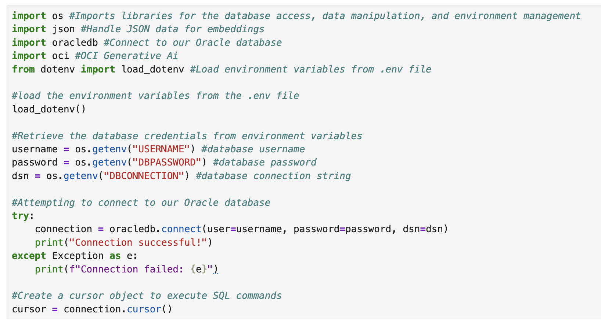
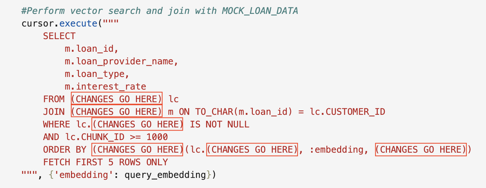

# Match Loans with AI: Vector Search Challenge in Oracle Database 23ai

## **Introduction**

**Welcome to the Code with AI Vector Search Challenge!**

In this workshop, you’ll dive into the exciting world of AI Vector Search using Oracle Database 23ai. Your goal is to **build a loan matching feature** for a financial application using **Similarity Search** by fixing a Jupyter notebook with incomplete code.


At SeerEquites, the data science team has been utilizing different techniques with the goal of enabling smarter loan recommendations. They've began to build a similarity search feature that vectorizes loan descriptions and matches them to user queries, but the code isn't quite right. Some critical parts are missing, marked as (**"CHANGES GO HERE"**) and it's up to you to make it work!

**Why AI Vector Search?**

Traditional keyword searches can miss the mark when it comes to understanding context. For example, "Affordable Housing Loan" and "Low-Income Home Loan" may be similar in meaning, but use different words. AI Vector Search solves this by converting text into numerical vectors(embeddings) that capture meaning, allowing the database to find loans that are conceptually similar, not just textually identical. Using Oracle database 23ai's vector capabilities, you'll use similarity search to find the related data based on it's semantic meaning.


If you're ready to dive in, proceed with this lab and start coding. If you prefer a more guided approach with a detailed walkthrough, you can continue to Lab 5b Step-by-step: Code with AI Vector Search for step-by-step instructions.

Good luck, and enjoy the process. Let’s get coding!

Estimated Time: 30 minutes

### Objective:
In this lab, you will:
- Vectorize loan data from the `MOCK_LOAN_DATA` table into `LOAN_CHUNK` table.
- Verify the data was vectorized.
- Implement a similarity search to find the top 5 matching loans based on a user’s query.

### Prerequisites:
This lab assumes you have:
* An Oracle Cloud account.
* Basic knowledge of Python and SQL.
* Successfully completed Lab 1: Run the Demo.
* Successfully completed Lab 3: Connect to Development Environment.

## Task 1: Challenge Requirements 

The data science team at SeerEquites has provided a Jupyter notebook called `ai_vector_search_challenge.ipynb` with four key code cells. The first cell sets up the environment, but the next three cells which are responsible for vectorizing data, verifiying it and performing similarity search contain errors marked as **"CHANGES GO HERE"**. Your job is to fix these cells in order to make the feature work. The notebook will:

- **Connect to the database and import the necessary libraries and drivers.**
- **Vectorize the `loan_type` column from the `MOCK_LOAN_DATA` table into the `LOAN_CHUNK` table.**
- **Verify the vectorized data by displaying an output.**
- **Implement a Similarity Search to match a user's query to loans.**

1. Open the notebook in your LiveLabs jupyter environment to follow along.
    

## Task 2: Launch the Notebook
1. Once you have opened the **Jupyter Notebook** file by clicking on **`ai_vector_search_challenge.ipynb`**.

    

2. Run the first cell(Environment Setup and Database Connection) to ensure the database connection, python driver and necessary libraries work.

    

    You should see the expected output: 
    </br>
    ```
    Connection successful!
    ```

    

    By seeing this output, you've successfully connected to Oracle Database 23ai and are ready to proceed.

## Task 3: Fix the Vectorizing Loan Data
The second cell defines a function `vectorize_loan_data()` to convert loan descriptions into vectors and store them in the `LOAN_CHUNK` table. It's suppose to:
* Clear existing data in `LOAN_CHUNK` where `CHUNK_ID >= 1000.
* Insert each `loan_type` from `MOCK_LOAN_DATA` into `LOAN_CHUNK` with a vector embedding. 
* Commit the changes.

However, the SQL `INSERT` statement has missing code where the vector is generated. 

1. Go to the second cell block in the notebook.

2. Look for the lines with (CHANGES GO HERE) inside the `INSERT statement:

     

3. Replace the placeholders to generate a 384-dimensional vector for `loan_type`. You'll need a function that converts text to embeddings using the `DEMO_MODEL` provided by the database. 

    ```hide
    Hint: Oracle Database 23ai has a utility called DBMS_VECTOR_CHAIN package to create embeddings. The fuction takes the text(loan_type) and a JSON configuration specifiying the model name and the dimensions. Check the notebook's first cell and other notebook files for clues about the formatting.
    ```

4. Run the cell after making the changes. Your expected output should be:

        Vectorized 'loan_data' from 'MOCK_LOAN_DATA' and stored in 'LOAN_CHUNK'.

      

## Task 4: Verify the Vectorized Data
The third cell block checks if the vectorization worked by querying `LOAN_CHUNK` for the first three entries (`CHUNK_ID >= 1000`). It should display the `CUSTOMER_ID`, `CHUNK_ID`, and `CHUNK_TEXT`(the loan type). The SQL query is incomplete, with multiple "CHANGES GO HERE" placeholders.

1. Go to the third cell block in the notebook.
     

2. Find the SQL query:

    ```
    cursor.execute("""
    SELECT (CHANGES GO HERE) 
    FROM (CHANGES GO HERE)
    WHERE (CHANGES GO HERE) >= 1000 
    FETCH FIRST 3 ROWS ONLY
    """)
    ```

    

3. Fill the missing parts:
    - Select the columns `CUSTOMER_ID`, `CHUNK_ID`, and `CHUNK_TEXT`.
    - Specify the table `LOAN_CHUNK`.
    - Set the condition filter `CHUNK_ID >= 1000`.

4. Update the print statement below the query to match the columns you selected:

    ```
    print(f"- (CHANGES GO HERE): {row[0]}, (CHANGES GO HERE): {row[1]}, (CHANGES GO HERE): {row[2]}")
    ```
    

    Replace the placeholders with meaningful labels like `Loan ID`, `Chunk ID`, and `Text`.

5. Once all the changes have been made, Run the cell. You should expect to see an output similar to:

    ```
    Sample data in LOAN_CHUNK:
    - Loan ID: 28, CHUNK ID: 1028, Text: Affordable housing zone loan (1% interest, max income $100k)
    - Loan ID: 29, CHUNK ID: 1029, Text: Construction loan for new builds
    - Loan ID: 30, Chunk ID: 1030, Text: Stated income loan (for self-employed)
    ```
    

## Task 5: Implement Similarity Search
The fourth cell block is the heart of the challenge: enabling users to input a loan description and find the top 5 similar loans. The function `looking_for_simiar_loans(query)` should:

* Vectorize the user's query.
* Search `LOAN_CHUNK` for similar vectors using cosine distance( Feel free to experiment with other vector similarities such as Euclidean or Dot).
* Join with `MOCK_LOAN_DATA` to get loan details.
* Display the results.

The cell has two incomplete SQL queries with "CHANGES GO HERE."

1. Go to the fourth cell block in the notebook.
    

2. Find the first query that vectorizes the user's query:
    ```
    cursor.execute("""
    SElECT (CHANGES GO HERE)(
        :query,
        (CHANGES GO HERE)
    ) FROM DUAL
    """, {'query':query})
    ```
    
    
    Hint: Replace the placeholder with the same function you used in Task 3 to generate the embeddings, ensuring the query text is converted to a vector.

3. Find the second query for the similarity search:

    ```
    SELECT
        m.loan_id,
        m.loan_provider_name,
        m.loan_type,
        m.interest_rate
    FROM (CHANGES GO HERE) lc
    JOIN (CHANGES GO HERE) m ON TO_CHAR(m.loan_id) = lc.CUSTOMER_ID
    WHERE lc.(CHANGES GO HERE) IS NOT NULL
    AND lc.CHUNK_ID >= 1000
    ORDER BY (CHANGES GO HERE)(lc.(CHANGES GO HERE), :embedding, (CHANGES GO HERE))
    FETCH FIRST 5 ROWS ONLY
    ```
    

    Fill in the placeholders to:
    * Specify the tables `LOAN_CHUNK` and `MOCK_LOAN_DATA`.
    * Check that the vector column isn't null.
    * Use a function to compute cosine distance between the stored vectors and the query's embedding.
    * Identify the vector column in `LOAN_CHUNK`.

    Hint: Oracle Database 23ai provides a **`VECTOR_DISTANCE`** function to compare vectors. You need to specify the vector column in LOAN_CHUNK, the query’s embedding (bound as :embedding), and the distance metric (COSINE). Look at the WHERE and ORDER BY clauses to understand what’s being filtered and sorted.

4. Run the cell, then enter a sample query when prompted, ex. "First Time Home Owner Loan."
    

    Expected Output:
    ```
    Enter a loan type to search for (ex., 'First time home owner loan'): 

    Military Veteran

    Top 5 similar loans for query: 'Military Veteran'

    Loan ID: 50, Provider: provider1, Type: Military Veteran loan (0% down, military only), Interest Rate: 4.75%

    Loan ID: 26, Provider: provider5, Type: Military Veteran loan (0% down, military only), Interest Rate: 3.47%

    Loan ID: 55, Provider: provider6, Type: RenoMilitary Veterantion loan, Interest Rate: 5.82%

    Loan ID: 59, Provider: provider3, Type: RenoMilitary Veterantion loan, Interest Rate: 5.98%

    Loan ID: 22, Provider: provider1, Type: Jumbo loan for high-Military Veteranlue properties, Interest Rate: 5.07% 
    ```
    (Note: Results may vary.)

    

**Congratulations, you have successfully completed the AI Vector Search Challenge!** 

You have successfully:
* Connected to Oracle Database 23ai.
* Vectorized loan descriptions into embeddings.
* Verified the stored data.
* Built a Similarity Search to match user queries to loans.

By fixing the code, you've enabled SeerEquites to recommend loans based on meaning, not just keywords, using Oracle Database 23ai's powerful AI Vector Search. You've learned how to generate embeddings, query vectors and integrate AI with SQL, all skills you can apply to other projects.

## Learn More

* [Oracle Database 23ai Documentation](https://docs.oracle.com/en/database/oracle/oracle-database/23/)
* [Oracle Database 23ai Vector Search](https://www.oracle.com/database/ai-vector-search/)
* [Oracle Ai Vector Search User's Guide](https://docs.oracle.com/en/database/oracle/oracle-database/23/vecse/ai-vector-search-users-guide.pdf)


## Acknowledgements
* **Authors** - Francis Regalado Database Product Manager
* **Contributors** - Kamryn Vinson, Linda Foinding, Eddie Ambler, Kevin Lazarz
* **Last Updated By/Date** - Francis Regalado, April 2025