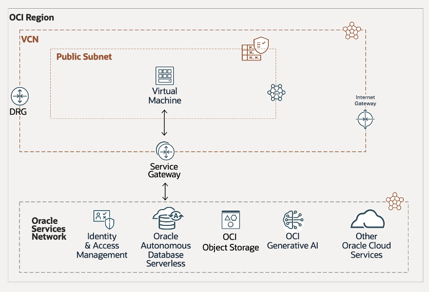

# Architecture & Workshop Features

## Introduction

In this lab, you will explore the architecture behind the workshop that supports the tasks you will perform. We also have a closer look at all the features of the Oracle Database 23ai that were used to build the workshop and the demo application.

Estimated Lab Time: 15 minutes

## Physical Architecture

The SeerEquities loan application runs in an **Oracle Cloud Infrastructure (OCI)** Region, with its application layer in a public subnet inside a **Virtual Cloud Network (VCN)**.

### Architecture Breakdown

- The Application Tier VCN includes:

    - An Internet Gateway for outbound traffic

    - A Service Gateway for access to Oracle Cloud services

    - A Dynamic Routing Gateway (DRG) to connect to the Oracle Services Network

    - A VM in the public subnet runs two containers, including:

        - Open-source Python library for the Loan Approval Demo

        - JupterLab as a browser-based development environment

- The Application Subnet connects to the Oracle Services Network via the Service Gateway, enabling access to:

    - Autonomous Database Serverless

    - OCI Generative AI Services

This architecture provides strong connectivity, scalability, and integration with Oracle cloud-native services to support efficient loan processing and approval.

## Oracle Database 23ai features used in the demo app and in this workshop

### **JSON Duality View**

JSON Relational Duality in Oracle Database 23ai bridges the gap between relational and document data models. It gives developers the flexibility of JSON with the efficiency and power of relational storage. This eliminates the trade-offs of choosing one model over the other.

At the core of this capability is the JSON Relational Duality View, which lets applications read and write JSON while the data remains stored in relational tables.

A key feature that should be highlighted is the ability to connect the database using Mongo DB syntax. This allows developers to interact with collections and documents using a familiar syntax. 

**Where is it used**: We implemented JSON Duality View in the demo app and in this workshop. All data you can view in the dashboard of the demo app is query from JSON Duality Views. In Lab 3, you learn how to interact with JSON Duality View using Oracle's Python driver. But you also learn how to use Oracle's Mongo API to query JSON Duality Views using Mongo DB syntax.

### **AI Vector Search**

Oracle AI Vector Search, a feature of Oracle Database 23ai, enables fast, efficient searches over AI-generated vectors stored in the database. It supports multiple indexing strategies and scales to large datasets. With it, Large Language Models (LLMs) can query private business data using natural language, returning more accurate, context-aware results. Developers can also add semantic search to new or existing applications with minimal effort. A **unique feature** of Oracle Database 23ai is its capability to host ONNX models and deploy them as a database function. This feature allows you to host ONNX models and deploy them as a database function, enabling seamless integration with Oracle Database 23ai.

**Where is it used**: AI Vector Search is a key feature of the demo app and is also a topic in Lab 4 and Lab 5. In Lab 4, you use AI Vector Search to implement a RAG process, while in Lab 5, you specifically implement similarity search.

### **Property Graph**

Oracle Database 23ai supports property graphs, which model relationships using vertices and edges mapped to existing tables, external tables, materialized views, or synonyms. These graphs store metadata—not the actual data—which remains in the underlying objects. You use SQL/PGQ to query and interact with them.

Property graphs simplify working with connected data, such as identifying influencers, predicting trends, or discovering relationships through pattern matching, by offering a more intuitive and efficient way to model and query complex networks.

**Where is it used**: We implemented property graphs in the demo part of this workshop. Loan approval officers can use it to identify potential alternative loans for their customers.

## Acknowledgements
* **Authors** - Kamryn Vinson, Linda Foinding, Francis Regalado
* **Contributors** - Eddie Ambler, Kevin Lazarz
* **Last Updated By/Date** - Kamryn Vinson, April 2025