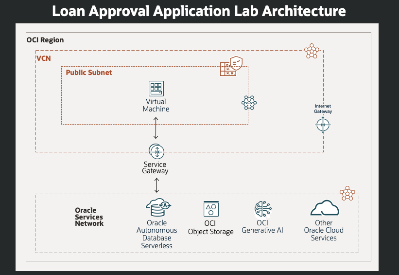
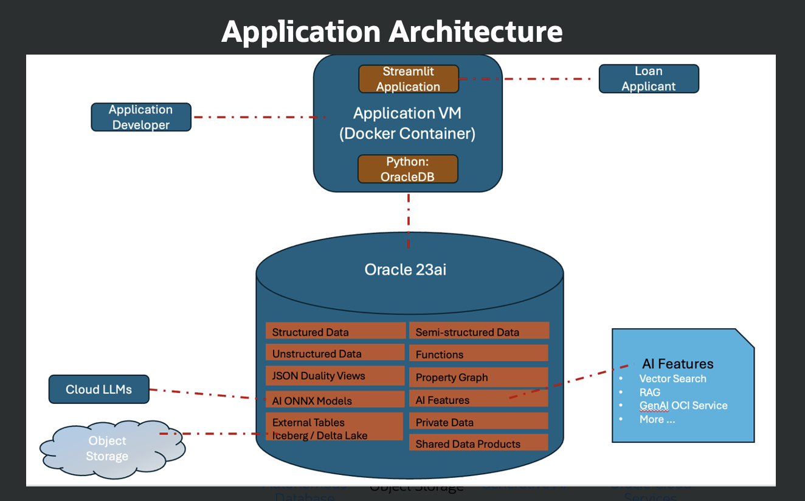

# Application architecture 

## Introduction

This section gives you a background of the logical and physical architecture behind the Seer Equities Loan Management Application

Estimated Time: 5 minutes

### Objectives

* Review the loan approval application physical architecture​
* Review the loan approval application logical architecture

## Task 1: Review Physical Architecture 

## Task 2: Review Logical Architecture 

## Acknowledgements
* **Authors** - Linda Foinding, Francis Regalado
* **Contributors** - Kamryn Vinson, Eddie Ambler, Kevin Lazarz
* **Last Updated By/Date** - Linda Foinding, April 2025