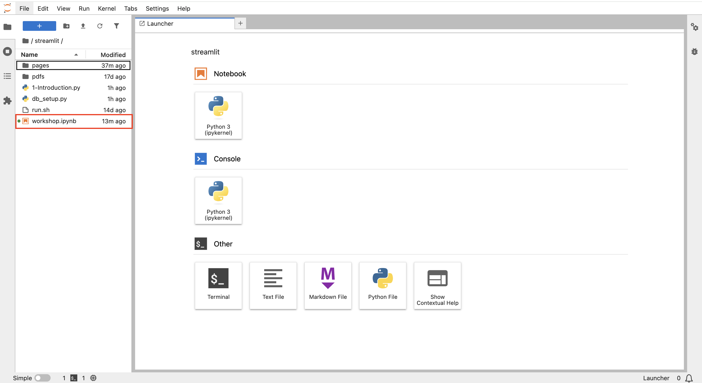
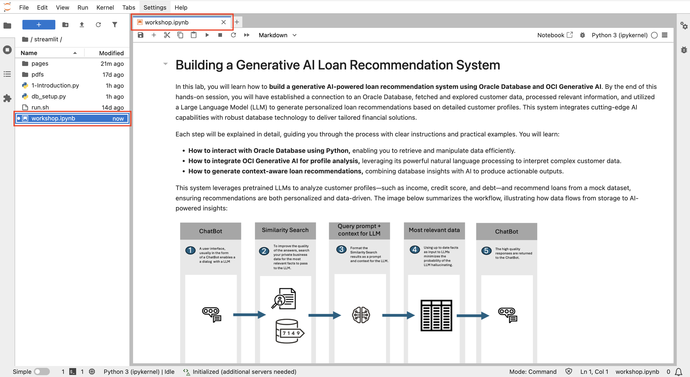

**Build a generative AI-powered loan recommendation system using Oracle Database and OCI Generative AI**

## Introduction

In this lab, you will learn how to **build a generative AI-powered loan recommendation system using Oracle Database and OCI Generative AI**. This application will act as a flexible template that can be adapted to a wide range of use cases. Oracle Database 23Ai will function as the vector data, where you'll store important context for the model to use when generating responses. This approach allows you to create a robust system that retrieves relevant data and combines it with the power of generative AI to deliver accurate, up-to-date answers based on your specific business needs.

Estimated Time: 30 minutes

### Objectives

By the end of this hands-on session, you will have established a connection to an Oracle Database, fetched and explored customer data, processed relevant information, and utilized a Large Language Model (LLM) to generate personalized loan recommendations based on detailed customer profiles. This system integrates cutting-edge AI capabilities with robust database technology to deliver tailored financial solutions.

Throughout this section we will be leveraging a Jupyter Notebook to explore building parts of the application. If you are unfamiliar with notebooks here are a few tips to get started:

• Instructions and code will be mixed together, each having their own blocks. You can use the run button on the code to see it execute. If you accidently hit run on any instructions it will just move to the next block so don't worry.

• When running a code block it will switch from either a [ ] or a [1] (a number inside) to a [*]. When you see the one with a * that means its running. Wait till it switches to a number before moving on.

• If you see any warnings, don't worry, they are probably just letting you know that things are changing, depreciating and you should look at updating to the latest standards. You don't need to do anything.

### Prerequisites

This lab assumes you have:
* An Oracle Cloud account

## Task 1: Login to Jupyter

This task will have you login to the Jupyter environment and run specific notebooks for this lab.

1. To navigate to the development environment, click **View Login Info**. Copy the Development IDE Login Password. Click the Start Development IDE link.

    

2. Paste in the Development IDE Login Password that you copied in the previous step. Click **Login**.

    

## Task 2: Build the application in Jupyter

1. Select the **workshop.ipynb** Jupyter Notebook

    

2. Now, follow the instructions on **workshop.ipynb** notebook 

    

Congratulations, you completed the lab!
You May now proceed to the next lab. 

## Learn More

* [Oracle Database 23ai Documentation](https://docs.oracle.com/en/database/oracle/oracle-database/23/)

## Acknowledgements
* **Authors** - Linda Foinding, Francis Regalado
* **Contributors** - Kamryn Vinson, Eddie Ambler, Kevin Lazarz
* **Last Updated By/Date** - Linda Foinding, April 2025