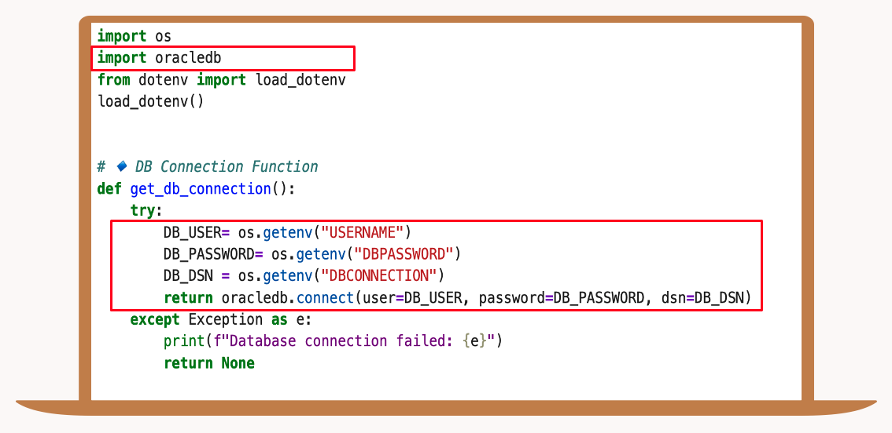
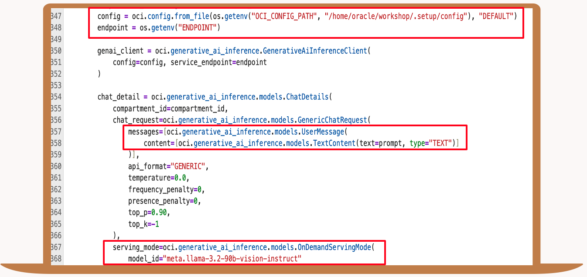
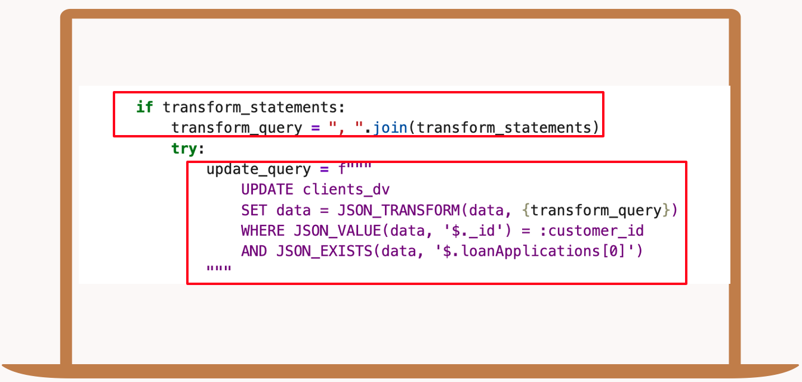

# Build the Application

## Introduction

This lab walks you through the steps to build a GenAI powered loan approval application using Oracle Database 23ai. Start coding in your personalized environment in the cloud and help SeerEquities save time on their loan approval process.

Estimated Time: 20 minutes

### Objectives

In this lab, you will:
* 

### Prerequisites

This lab assumes you have:
* An Oracle Cloud account

## Task 1: Login to Juptyer

1. 

## Task 2: Start the Application

## Task 3: Review Key Application Code Highlights

In this task, we will show you key code highlights used in our application pages.

**Code Highlight: Connect to the Database**

1. This section sets up a secure connection to an Oracle database by importing necessary libraries and loading environment variables from a .env file. The get\_db\_connection function retrieves the database username, password, and connection string, then uses the oracledb library to establish a connection. 

    

**Code Highlight: Onnx Model**

2. This section handles loading an ONNX machine learning model, which we use for generating vector embeddings in our app. It starts by checking if the model already exists in the database; if not, it creates a directory, downloads the model file from object storage, and uses dbms\_vector to load it, replacing any old version if needed.

    

**Code Highlight: Prompt for the AI**

3. Here, we craft a detailed prompt for our RAG—system, directing the AI to step into the shoes of a Loan Approver, relying solely on the data we feed it. It’s tasked with analyzing an applicant’s financial profile against our loan portfolio and business rules, focusing on just the provided context, ignoring any prior knowledge, which ensures our loan suggestions are relevant, without relying on external or outdated information.

    

**Code Highlight: Communicating with GenAI**

4. This is how we communicate with OCI’s Generative AI service, pulling in configuration details like the compartment ID and endpoint from environment variables and a config file. The code sets up the structure for a chat request, embedding our prompt into a user message, enabling AI loan recommendations within the app.

    

**Code Highlight: Embed the Question and Vector Search**

5. This section dives into AI vector search, first, we generates an embedding for a user’s question using Oracle’s dbms\_vector\_chain and our DEMO\_MODEL. Then, it performs an AI vector search in the LOAN_CHUNK table, comparing stored recommendations vector embeddings to the question’s embedding with cosine distance, and pulls back the most relevant text chunk, with a limit of one row.

    

**Code Highlight: Graph Query**

6. Here, we define a query for our LOANS_GRAPH property graph, which connects clients to their loan applications and potential loan options via a customer ID. It extracts critical details—like credit scores, debt-to-income ratios, and loan types—by traversing the graph’s vertices and edges.

    

**Code Highlight: Creating The Property Graph**

7. The graph structure enables complex queries and visualizations in the app, supporting decision-making by mapping interconnections between customer data and loan options. This SQL block creates our loans\_graph property graph , setting up vertices for clients, loan applications, and mock loan data with all their key properties. It also defines edges—like client\_to\_application and CLIENTS\_TO\_LOAN  to link these entities, establishing relationships that we can query and explore.

    

**Code Highlight: JSON Transform**

8. This section dynamically updates customer data in our clients\_dv table by building a flexible JSON\_TRANSFORM query based on a list of transformation statements. It constructs the query by joining those statements—like setting new field values—then applies them to the JSON data for a specific customer, identified by their ID, as long as a loan application exists."

    

## Learn More

*(optional - include links to docs, white papers, blogs, etc)*

* [URL text 1](http://docs.oracle.com)
* [URL text 2](http://docs.oracle.com)

## Acknowledgements
* **Author** - <Name, Title, Group>
* **Contributors** -  <Name, Group> -- optional
* **Last Updated By/Date** - <Name, Month Year>
