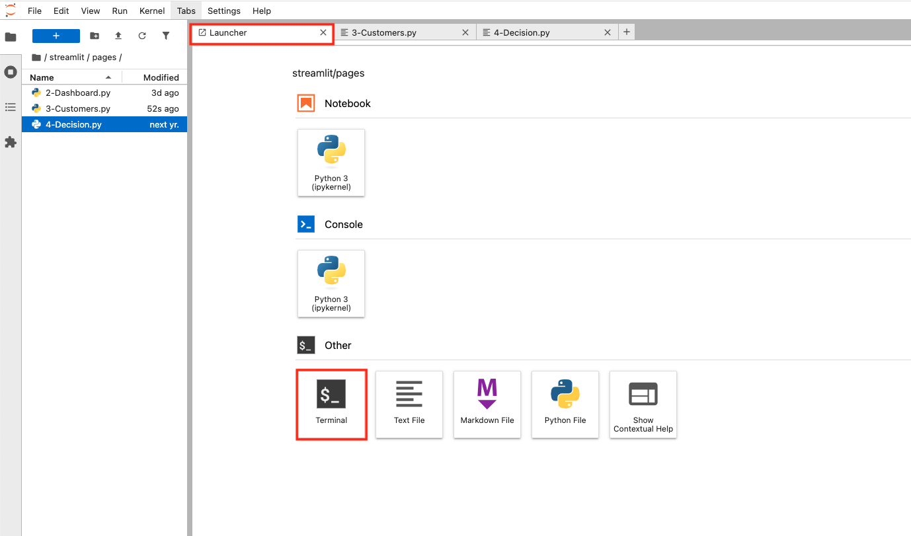

# Code Snippets and Highlights for Building the Application

## Introduction

In this lab, you will learn how to **build a generative AI-powered loan recommendation system using Oracle Database and OCI Generative AI**. This application will act as a flexible template that can be adapted to a wide range of use cases. Oracle Database 23Ai will function as the vector data, where you'll store important context for the model to use when generating responses. This approach allows you to create a robust system that retrieves relevant data and combines it with the power of generative AI to deliver accurate, up-to-date answers based on your specific business needs.

Estimated Time: 20 minutes

### Objectives

By the end of this hands-on session, you will have established a connection to an Oracle Database, fetched and explored customer data, processed relevant information, and utilized a Large Language Model (LLM) to generate personalized loan recommendations based on detailed customer profiles. This system integrates cutting-edge AI capabilities with robust database technology to deliver tailored financial solutions.

Throughout this section we will be leveraging a Jupyter Notebook to explore building parts of the application. If you are unfamiliar with notebooks here are a few tips to get started:

• Instructions and code will be mixed together, each having their own blocks. You can use the run button on the code to see it execute. If you accidentally hit run on any instructions it will just move to the next block so don't worry.
• When running a code block it will switch from either a [ ] or a [1] (a number inside) to a [*]. When you see the one with a * that means its running. Wait till it switches to a number before moving on.
• If you see any warnings, don't worry, they are probably just letting you know that things are changing, depreciating and you should look at updating to the latest standards. You don't need to do anything.


### Prerequisites

This lab assumes you have:
* An Oracle Cloud account

## Task 1: Login to Jupyter

This task will have you login to the Jupyter environment and run specific notebooks for this lab.

1. If you have already logged into the Jupyter environment skip to step 5, otherwise open "View Login Info" section of your workshop.

2. Copy the Jupyter Notebook Password and click the Jupyter Notebook URL.

3. Paste the Jupyter Notebook password you copied in the previous step into the password field.

4. After a successful login, you will see the Jupyter Notebook's landing page.


## Task 2: Launch the Application

1. Select the **Launcher** tab and open the **terminal**

    

2. Copy the ./run.sh command and paste it into the terminal.

    ````bash
        $<copy>
        ./run.sh
        </copy>
        ````

The following section includes a hands-on exercise for building parts of the application using a Jupyter notebook.
You will also be able to review important parts of the python code below.


3. Click the URL displayed in the terminal to launch the SeerEquities Loan Management application.

    

4. Enter in a username and click **Login**.

    

## Task 3: How to Connect to the Database

**Code Highlight: Connect to the Database**

This section sets up a secure connection to an Oracle database by importing necessary libraries and loading environment variables from a .env file. The get\_db\_connection function retrieves the database username, password, and connection string, then uses the oracledb library to establish a connection.

  

## Task 4 Build a GenAI application with Oracle AI Vector Search

**About Oracle AI Vector Search**

Oracle AI Vector Search is a feature of Oracle Database 23ai that enables efficient searching of AI-generated vectors stored in the database. It supports fast search using various indexing strategies and can handle massive amounts of vector data. This makes it possible for Large Language Models (LLMs) to query private business data using a natural language interface, helping them provide more accurate and relevant results. Additionally, AI Vector Search allows developers to easily add semantic search capabilities to both new and existing applications.

**Code Highlight: Onnx Model**

1. First, we load an ONNX machine learning model, which we use for generating vector embeddings in our app. It starts by checking if the model already exists in the database; if not, it creates a directory, downloads the model file from object storage, and uses dbms\_vector to load it, replacing any old version if needed.

    

**Code Highlight: Prompt for the AI**

2. Next, we craft a detailed prompt for our RAG—system, directing the AI to step into the shoes of a Loan Approver, relying solely on the data we feed it. It’s tasked with analyzing an applicant’s financial profile against our loan portfolio and business rules, focusing on just the provided context, ignoring any prior knowledge, which ensures our loan suggestions are relevant, without relying on external or outdated information.

    

**Code Highlight: Communicating with GenAI**

**About Generative artificial intelligence (AI)**

Generative AI excels at creating text responses based on large language models (LLMs) where the AI is trained on a massive number of data points. The generated text is often easy to read and provides detailed responses that are broadly applicable to the questions asked of the software, often called prompts.

3. Now, this is how we communicate with OCI’s Generative AI service by pulling in configuration details like the compartment ID and endpoint from environment variables and a config file. The code sets up the structure for a chat request, embedding our prompt into a user message, enabling AI loan recommendations within the app.

    

**Code Highlight: Embed the Question and Vector Search**

4. Finally, we dive into AI vector search. First, we generates an embedding for a user’s question using Oracle’s dbms\_vector\_chain and our DEMO\_MODEL. Then, it performs an AI vector search in the LOAN_CHUNK table, comparing stored recommendations vector embeddings to the question’s embedding with cosine distance, and pulls back the most relevant text chunk, with a limit of one row.

    

## Task 5 How to incorporate Property Graph into the application

**About Property Graph**

In Oracle Database 23ai we can create property graphs inside the database. These property graphs allow us to map the vertices and edges to new or existing tables, external tables, materialized views or synonyms to these objects inside the database. The property graphs are stored as metadata inside the database meaning they don't store the actual data. Rather, the data is still stored in the underlying objects and we use the SQL/PQG syntax to interact with the property graphs.

Property graphs make the process of working with interconnected data, like identifying influencers in a social network, predicting trends and customer behavior, discovering relationships based on pattern matching and more by providing a more natural and efficient way to model and query them.

**Code Highlight: Graph Query**

1. Here, we define a query for our LOANS_GRAPH property graph, which connects clients to their loan applications and potential loan options via a customer ID. It extracts critical details—like credit scores, debt-to-income ratios, and loan types—by traversing the graph’s vertices and edges.

    

**Code Highlight: Creating The Property Graph**

2. The graph structure enables complex queries and visualizations in the app, supporting decision-making by mapping interconnections between customer data and loan options. This SQL block creates our loans\_graph property graph , setting up vertices for clients, loan applications, and mock loan data with all their key properties. It also defines edges—like client\_to\_application and CLIENTS\_TO\_LOAN  to link these entities, establishing relationships that we can query and explore.

    

## Task 6 How to incorporate JSON Transform into the application

**About JSON Duality View**

JSON Relational Duality is a landmark capability in Oracle Database 23ai, providing game-changing flexibility and simplicity for Oracle Database developers. This feature overcomes the historical challenges developers have faced when building applications using the relational or document models.

JSON Relational Duality helps to converge the benefits of both document and relational worlds. Developers now get the flexibility and data access benefits of the JSON document model, plus the storage efficiency and power of the relational model. The new feature enabling this functionality is JSON Relational Duality View

**Code Highlight: JSON Transform**

This section dynamically updates customer data in our clients\_dv table by building a flexible JSON\_TRANSFORM query based on a list of transformation statements. It constructs the query by joining those statements—like setting new field values—then applies them to the JSON data for a specific customer, identified by their ID, as long as a loan application exists."


## Learn More

* [Oracle Database 23ai Documentation](https://docs.oracle.com/en/database/oracle/oracle-database/23/)

## Acknowledgements
* **Authors** - Linda Foinding, Francis Regalado
* **Contributors** - Kamryn Vinson, Otis Barr, Eddie Ambler, Kevin Lazarz
* **Last Updated By/Date** - Linda Foinding, April 2025
