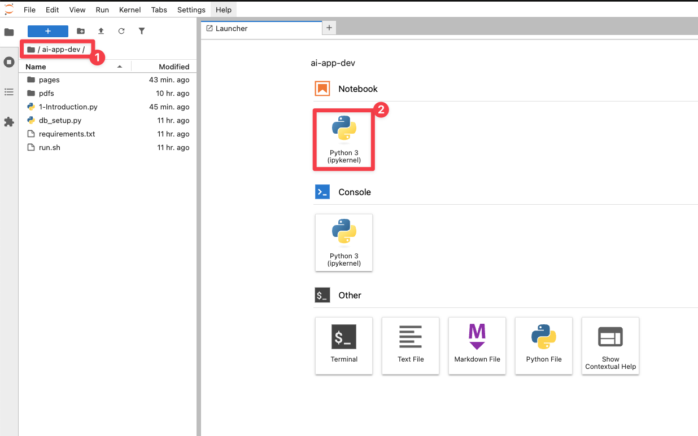
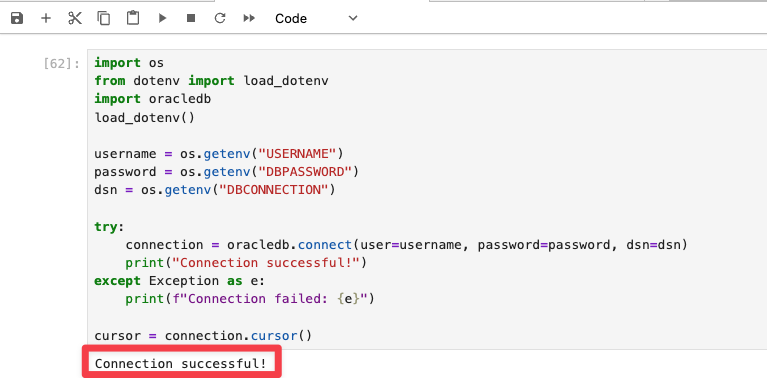

# Start coding with Oracle Database 23ai

## Introduction

In this lab,

Estimated Time: 30 minutes

### Objectives

* Learn some basic Python coding concepts when working with Oracle Database 23ai
  * Connect to database using `oracledb`
  * Create tables using `oracledb`
  * Insert data into tables using `oracledb`
  * Query data from tables using `oracledb` 
  * Create JSON Duality Views using `oracledb`
  * Connect to database using `pymongo` and start using Oracle's Mongo API
  * Query data using using Oracle's Mongo API
  * Update data using Oracle's Mongo API


### Prerequisites

This lab assumes you have:
* An Oracle Cloud account
* Completed lab 1: Run the demo
* Completed lab 2: Connect to the development environment

## Task 1: Create a new Jupyter Notebook

All of the coding examples will be executed in a new Jupyter Notebook.

1. Change to the **ai-app-dev** directory

2. Open a new **Jupyter Notebook** by clicking on **Pyhton(ipykernel)** notebook.

    

## Task 2: Connect to the database using `oracledb`

In this first task, you will connect to an Oracle Database 23ai instance using Oracle's Python driver, `oracledb`. 
`oracledb` is available in PyPi (`pip install oracledb`) and supports in its latest version all of the advanced features of the Oracle Database, including JSON and VECTOR.

1. In the newly created Jupyter Notebook, copy and paste the following code block into an empty cell. This code block imports the `oracledb` Python driver and other libraries that help us to securely read credentials from the environment variables.

    ```python
    <copy>
    import os
    from dotenv import load_dotenv
    import oracledb

    load_dotenv()

    username = os.getenv("USERNAME")
    password = os.getenv("DBPASSWORD")
    dsn = os.getenv("DBCONNECTION")

    try:
        connection = oracledb.connect(user=username, password=password, dsn=dsn)
        print("Connection successful!")
    except Exception as e:
        print(f"Connection failed: {e}")

    cursor = connection.cursor()
    </copy>
    ```
2. Execute the cell by entering **shift + enter** or clicking on the play button.

3. You should see a message that says "Connection successful!" in your notebook. If you do not, check the credentials and try again. 

    

>**Note:** The last line, `cursor = connection.cursor()`, creates a cursor object from the established Oracle database connection. A cursor acts as a control structure that enables the execution of SQL queries and retrieval of results from the database. It is essential for sending SQL commands, fetching data, and iterating through query results. We will be using the cursor object in later steps of this lab. The object persists in the notebook session, so you can use it in subsequent cells without re-establishing the connection. 


## Task 2: Create tables and insert data


## Task 3: Create a JSON Duality View


## Task 4: Connect to the database using `pymongo`

## Task 5: Query data using Oracle's Mongo API

## Task 6: Update data using Oracle's Mongo API

## Task 7: Query relational tables to verify updates made through JSON Duality View