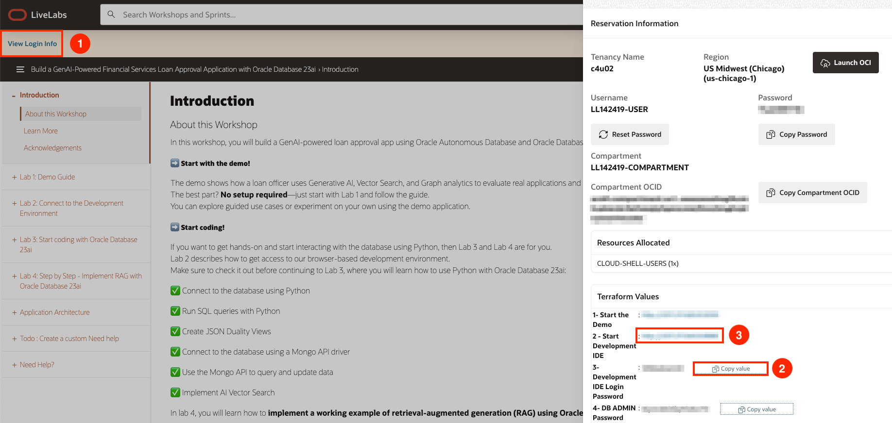
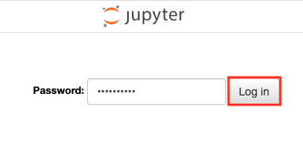

# Connect to Development Environment

## Introduction

In this lab, we will show you how to connect to the development environment. You will complete the challenges in labs 3, 4, and 5 in this environment.

Estimated Time: 5 minutes

### Objective
* Login to Jupyter Notebook

## Task 1: Login to Jupyter Notebook

1. To navigate to the development environment, click **View Login Info**. Copy the Development IDE Login Password. Click the Start Development IDE link.

    

2. Paste in the Development IDE Login Password that you copied in the previous step. Click **Login**.

    

## Acknowledgements
* **Author** - Kamryn Vinson
* **Contributors** -  Linda Foinding, Francis Regalado, Kevin Lazarz
* **Last Updated By/Date** - Kamryn Vinson, April 2025
