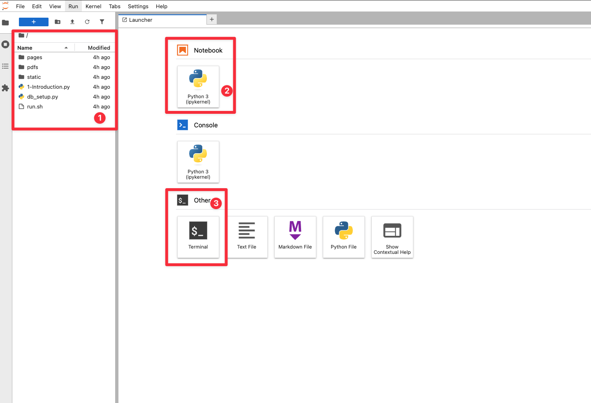

# Connect to Development Environment

## Introduction

In this lab, we will show you how to connect to the development environment. You will complete the challenges in labs 3, 4, and 5 in this environment.

Estimated Time: 5 minutes

### Objective
* Login to Jupyter Notebook

## Task 1: Login to Jupyter Notebook

1. To navigate to the development environment, click **View Login Info**. Copy the Development IDE Login Password. Click the Start Development IDE link.

    

2. Paste in the Development IDE Login Password that you copied in the previous step. Click **Login**.

    

## Task 2: Get familiar with the Development Environment

1. Review the different elements in JupyterLab—your development environment.

    **File browser:** The file browser organizes and manages files within the JupyterLab workspace. It supports drag-and-drop file uploads, file creation, renaming, and deletion. Users can open notebooks, terminals, and text editors directly from the browser. Navigation is fast and intuitive, with breadcrumbs and context menus that surface relevant actions. Users can right-click files to access options like duplicate, shutdown kernel, or open with a specific editor. 

    **Launcher:** The launcher offers a streamlined entry point for starting new activities. Users can create Jupyter Notebooks for interactive coding with live code execution, visualizations, and rich markdown. The terminal provides direct shell access, enabling command-line operations within the JupyterLab environment. These two tools form the core of most workflows, supporting both interactive analysis and system-level tasks from a single interface.

    

    

## Acknowledgements
* **Author** - Kamryn Vinson
* **Contributors** -  Linda Foinding, Francis Regalado, Kevin Lazarz
* **Last Updated By/Date** - Kamryn Vinson, April 2025
