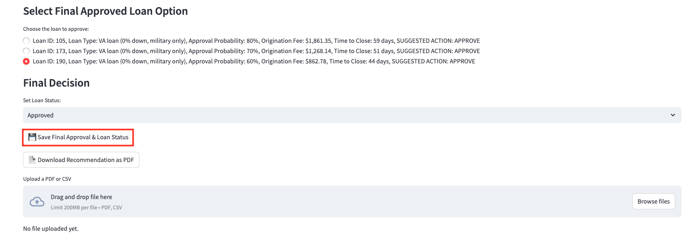
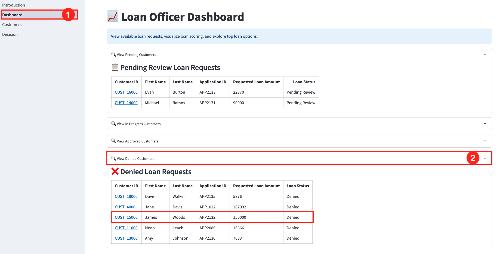
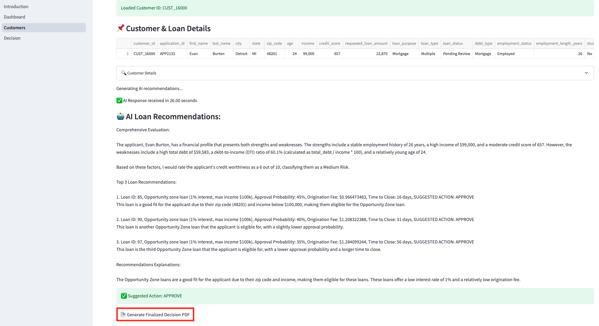

# Title of the Lab

## Introduction

*Describe the lab in one or two sentences, for example:* This lab walks you through the steps to ...

Estimated Lab Time: -- minutes

### About <Product/Technology> (Optional)
Enter background information here about the technology/feature or product used in this lab - no need to repeat what you covered in the introduction. Keep this section fairly concise. If you find yourself needing more than two sections/paragraphs, please utilize the "Learn More" section.

### Objectives

In this lab, you will:
* Begin the demo process of the hands_on loan officer approval use cases

### Prerequisites

This lab assumes you have:

* Completed the Get Started lab
* Successfully launched the demo environment

## Task 1: Demo User with Good Credit

In this first example, we'll navigate through this application to show you the first user being approved with good credit.

1. Select **Dashboard** in the left navigation menu.

    

2. On the Dashboard page, from the pending review list, select the Customer ID for **James Smith**.

    

3. This will display the customers loan application details. In approximately 15 seconds, the AI generated recommendations will be displayed.

    

4. Copy the following prompt into the AI chatbot and press Enter.

    ```
    <copy>
    What would be the top 0% down payment loans?
    </copy>
    ```
    

5. Press the **Generate Finalized Decision PDF** button to save the AI responses and proceed to the final loan disposition. 

    

6. Select **Decision** in the left navigation menu.

    

7. In the **Select Final Approved Loan Option** section, the graph options using Oracle 23ai Property Graph are displayed. This is where the loan officer could choose to request additional information in order to provide a slightly better loan. For this scenario, we will continue with selecting one of the suggested loans.

    

8. Select the AI suggested loan with the lowest time to close. Since our customer wanted the lowest time to close, we would select loan number 3.

    

9. Set the final loan status to **Approved**.

    

10. Click the **Save Final Approval & Loan Status** button. 

    The loan status has been updated to 'Approved' and saved to the customer profile.

    

11. Click the **Download Recommendation as PDF** button. 

    

12. Click **Download PDF**

    

13. Display the message the customer would see by opening the downloaded PDF. 

    

14. Navigate back to the **Dashboard** and expand **View Approved Customers**. We can see that James Smith has been removed from the Pending Review Loan Requests list and has been added to the Approved Loan Requests list.

    

## Task 2: Demo User with Bad Credit

1. Select **Dashboard** in the left navigation menu if you are not on the Dashboard page already.

    

2. On the Dashboard page, from the pending review list, select the Customer ID for **James Woods**.

    

3. This will display the customers loan application details. In approximately 15 seconds, the AI generated recommendations will be displayed.

    

4. Press the **Generate Finalized Decision PDF** button to save the AI responses and proceed to the final loan disposition. 

    

5. Select **Decision** in the left navigation menu.

    

6. Click the **Save Final Approval & Loan Status** button. 

    The loan status has been updated to 'Denied' and saved to the customer profile.

    

7. Click the **Download Recommendation as PDF** button. 

    

8. Click **Download PDF**

    

9. Display the message the customer would see by opening the downloaded PDF. 

    

10. Navigate back to the **Dashboard** and expand **View Denied Customers**. We can see that James Woods has been removed from the Pending Review Loan Requests list and added to the Denied Loan Requests list.

    
  
## Task 3: Opportunity Zone User with low income Good Credit 

1. Select **Dashboard** in the left navigation menu if you are not on the Dashboard page already.

    

2. On the Dashboard page, from the pending review list, select the Customer ID for **Evan Burton**.

    

3. This will display the customers loan application details. In approximately 15 seconds, the AI generated recommendations will be displayed.

    

5. Press the **Generate Finalized Decision PDF** button to save the AI responses and proceed to the final loan disposition. 

    

6. Select **Decision** in the left navigation menu.

    

7. In the **Select Final Approved Loan Option** section, the graph options using Oracle 23ai Property Graph are displayed. This is where the loan officer could choose to request additional information in order to provide a slightly better loan. For this scenario, we will continue with selecting one of the suggested loans.

    
=======
* The demo workshop has been successfully launched

## Task 1: Demo VA User Good Credit

1. Select **Dashboard** in the left navigation menu.

2. On the Dashboard page, from the pending review list, select **James Smith**.

3. This will display the customers loan application details. In approximately 15 seconds, the AI generated recommendations will be displayed.

4. Copy the following prompt into the AI chatbot:
-- add copy tags
What would be the top 0% down payment loans?

5. Press the **Generate Finalized Decision PDF** button to save the AI responses and proceed to the final loan disposition. 

6. Select **Set Final Decision** in the left navigation menu.

7. Press the **Review additional loan options** button. This is where the loan officer could choose to request additional information in order to provide a slightly better loan. For this scenario we will continue with selecting one of the suggested loans

8. Select the AI suggested loan with the lowest time to close. Since our customer wanted the lowest time to close, we would select loan number 2.

9. Set the final loan status to **Approved**.

10. Click the **Save Final Decision Loan Status** button. 

11. Click the **Download Decision as PDF** button. 

-- Pending 12. Click **Download PDF**

12. Display the message the customer would see by opening the downloaded PDF. 

## Task 2: Demo VA User Bad Credit

1. Select **Dashboard** in the left navigation menu.

2. On the Dashboard page, from the pending review list, select **James Woods**.

3. This will display the customers loan application details. In approximately 15 seconds, the AI generated recommendations will be displayed.

4. Press the **Generate Finalized Decision PDF** button to save the AI responses and proceed to the final loan disposition. 

5. Select **Set Final Decision** in the left navigation menu.

6. Click the **Save Final Decision Loan Status** button. 

7. Click the **Download Decision as PDF** button. 

-- Pending 8. Click **Download PDF**

8. Display the message the customer would see by opening the downloaded PDF. 
  
## Task 3: Opp-Zone User low income Good Credit 

1. Select **Dashboard** in the left navigation menu.

2. On the Dashboard page, from the pending review list, select **Evan Burton**.

3. This will display the customers loan application details. In approximately 15 seconds, the AI generated recommendations will be displayed.

5. Press the **Generate Finalized Decision PDF** button to save the AI responses and proceed to the final loan disposition. 

6. Select **Set Final Decision** in the left navigation menu.

7. Press the **Review additional loan options** button. This is where the loan officer could choose to request additional information in order to provide a slightly better loan. 


8. Select the AI suggested opportunity zone loan with the lowest monthly payment. Since our customer wanted the lowest monthly payments, we would select loan number --*Put in loan number*--.

9. Set the final loan status to **Approved**.

10. Click the **Save Final Decision Loan Status** button. 

11. Click the **Download Decision as PDF** button. 

-- Pending 12. Click **Download PDF**

12. Display the message the customer would see by opening the downloaded PDF. 


## Task 4: First Time Home Buyer with Good Credit

1. Select **Dashboard** in the left navigation menu.

2. On the Dashboard page, from the pending review list, select **Michael Ramos**.

## Task 4: First Time Home Buyer Good Credit

1. Select **Dashboard** in the left navigation menu.

2. On the Dashboard page, from the pending review list, select **James Woods**.


3. This will display the customers loan application details. In approximately 15 seconds, the AI generated recommendations will be displayed.

4. Copy the following prompt into the AI chatbot:
-- add copy tags
Show me the lowest down payment?
Show me the lowest monthly payment?

5. Press the **Generate Finalized Decision PDF** button to save the AI responses and proceed to the final loan disposition. 


6. Select **Decision** in the left navigation menu.

6. Select **Set Final Decision** in the left navigation menu.


7. Press the **Review additional loan options** button. This is where the loan officer could choose to request additional information in order to provide a slightly better loan. For this scenario we will 

8. Select the AI suggested opportunity zone loan with the lowest monthly payment. Since our customer wanted the lowest monthly payments, we would select loan number --*Put in loan number*--.

9. Set the final loan status to **Approved**.

10. Click the **Save Final Decision Loan Status** button. 

11. Click the **Download Decision as PDF** button. 

-- Pending 12. Click **Download PDF**

12. Display the message the customer would see by opening the downloaded PDF. 

## Task 5: Edit Customer Details

1. Select **Dashboard** in the left navigation menu.

2. On the Dashboard page, from the pending review list, select **James Woods**.

3. This will display the customers loan application details. In approximately 15 seconds, the AI generated recommendations will be displayed.

4. Copy the following prompt into the AI chatbot:
-- add copy tags
Show me the lowest down payment?
Show me the lowest monthly payment?

5. Press the **Generate Finalized Decision PDF** button to save the AI responses and proceed to the final loan disposition. 

6. Select **Set Final Decision** in the left navigation menu.

7. Press the **Review additional loan options** button. This is where the loan officer could choose to request additional information in order to provide a slightly better loan. 

8. Select the AI suggested opportunity zone loan with the lowest monthly payment. Since our customer wanted the lowest monthly payments, we would select loan number --*Put in loan number*--.

9. Set the final loan status to **Approved**.

10. Click the **Save Final Decision Loan Status** button. 

11. Click the **Download Decision as PDF** button. 

-- Pending 12. Click **Download PDF**

12. Display the message the customer would see by opening the downloaded PDF. 

## Learn More

*(optional - include links to docs, white papers, blogs, etc)*

* [URL text 1](http://docs.oracle.com)
* [URL text 2](http://docs.oracle.com)

## Acknowledgements
* **Author** - <Name, Title, Group>
* **Contributors** -  <Name, Group> -- optional
* **Last Updated By/Date** - <Name, Month Year>
