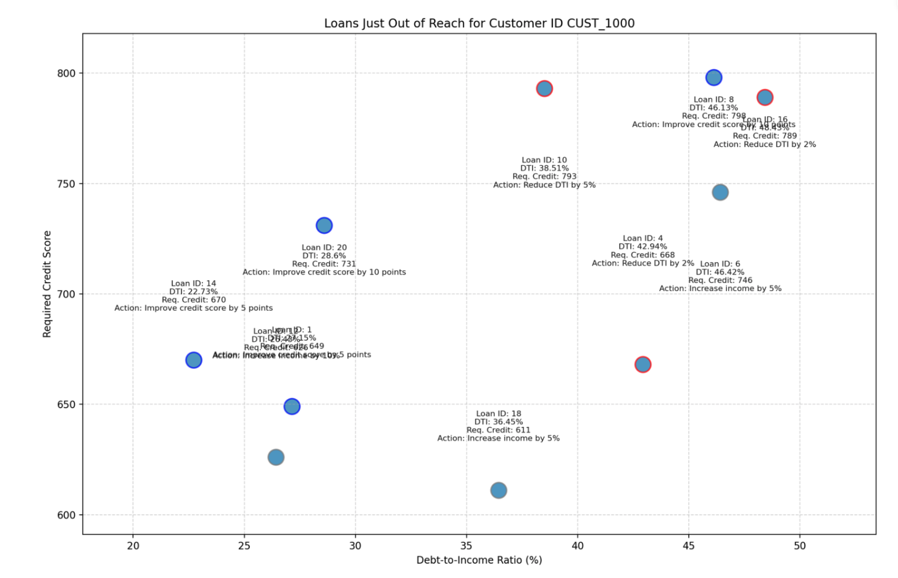
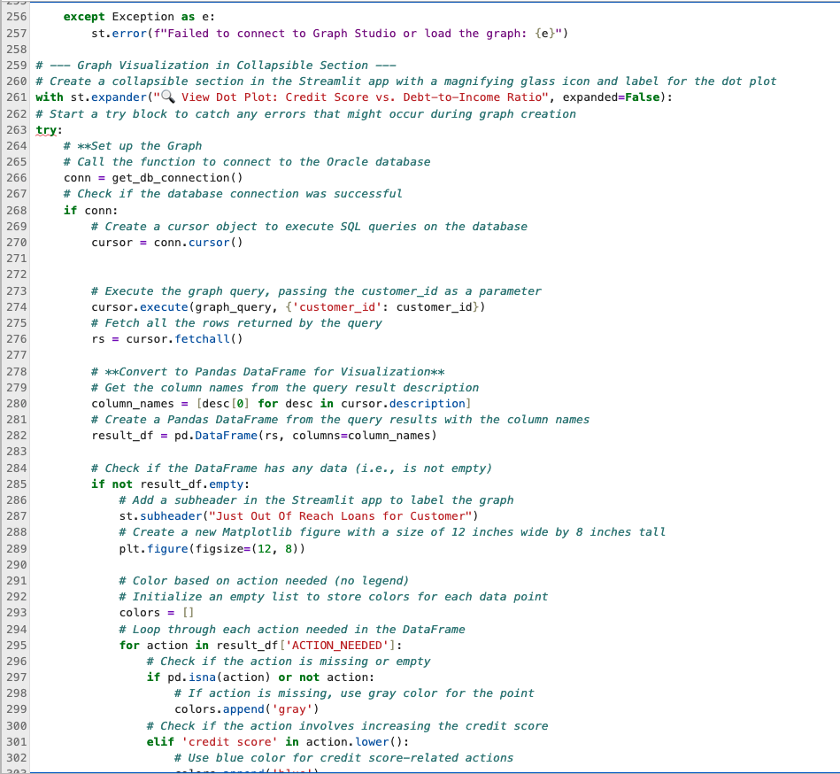
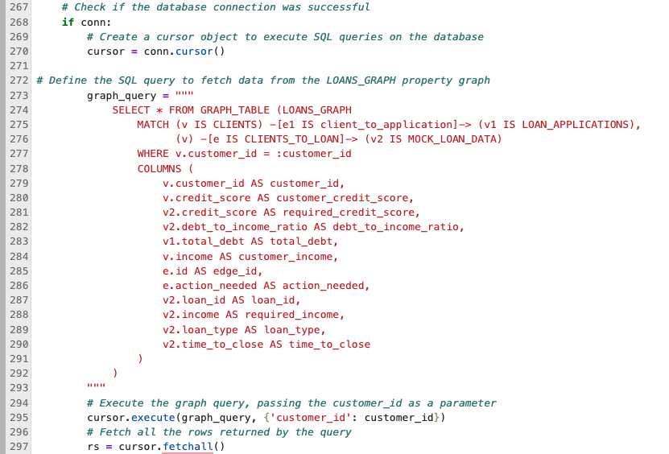
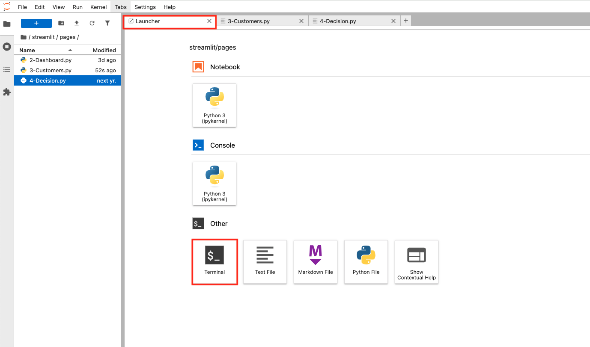
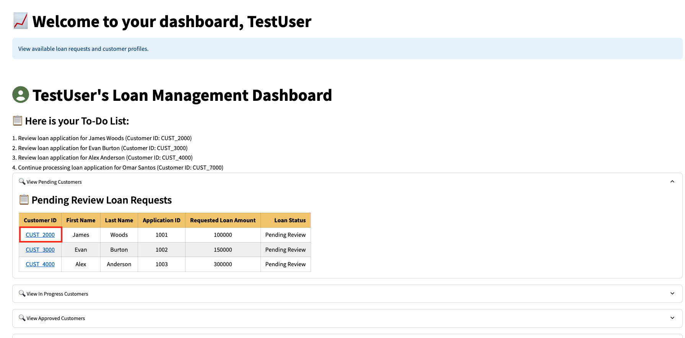
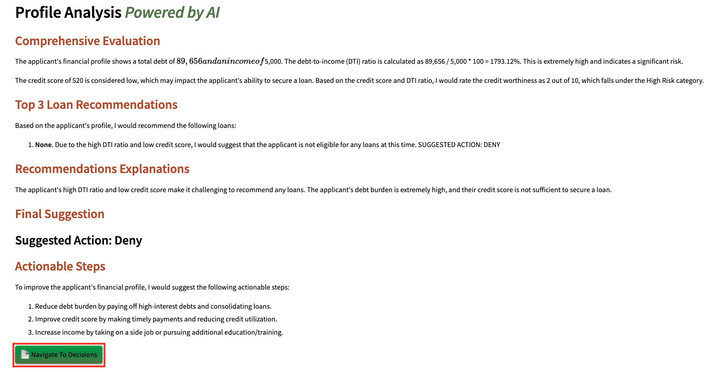

# Code Property Graph using Graph Query Hackathon Challenge step-by-step

## Introduction

In this lab, we’ll provide a step-by-step guide to help you successfully complete the coding challenge from the previous lab. This step-by-step guide will walk you through the necessary updates, providing solutions and insights to help you fully understand how to utilize Graph in a practical scenario. Whether you're refining your existing work or tackling the challenge for the first time, this guide will ensure you gain the skills and confidence needed to implement these powerful features.

Let’s dive in and unlock the full potential of Graph in your application!

Estimated Time: 60 minutes

### Objectives

In this lab, you will:
* Enhance your understanding of Graph by applying it to a real-world developer coding challenge.
* Gain hands-on experience with Graph and refining application features to meet specific development requirements.

### Prerequisites

This lab assumes you have:
* An Oracle Cloud account
* Successfully completed Lab 1: Workshop Details and Prerequisites
* Successfully completed Lab 2: SeerEquities AI App in Action


## Task 1: Hackathon Challenge

The loan officer needs to visualize additional data points in the decision-making process. Specifically, they want to display an additional graph that shows two key metrics: required credit score on one axis and debt-to-income ratio on the other.

1. Update the Decision.py file to add functionality for an additional graph that displays the following metrics: Required Credit Score and Debt-to-Income Ratio (%). The graph should display scatter plots similar to the example provided below, Required Credit Score and Debt-to-Income Ratio (%) are plotted:

    

2. Implement a dropdown that allows the user to select the new graph view.

    

## Task 2: Login to Jupyter Notebook

1. To navigate to the development environment, click **View Login Info**. Copy the Development IDE Login Password. Click the Start Development IDE link.

    

2. Paste in the Development IDE Login Password that you copied in the previous step. Click **Login**.

    

## Task 3: Modify the Decision.py File

1. Click **Pages**.

    

2. Select **Decision.py**.

    

3. Copy the following code block and paste it at line 259 in the Decision.py file.

    ````
    <copy>
# --- Graph Visualization in Collapsible Section ---
# Create a collapsible section in the Streamlit app with a magnifying glass icon and label for the dot plot
with st.expander("🔍 View Dot Plot: Credit Score vs. Debt-to-Income Ratio", expanded=False):
    # Start a try block to catch any errors that might occur during graph creation
    try:
        # **Set up the Graph
        # Call the function to connect to the Oracle database
        conn = get_db_connection()
        # Check if the database connection was successful
        if conn:
            # Create a cursor object to execute SQL queries on the database
            cursor = conn.cursor()


            # Execute the graph query, passing the customer_id as a parameter
            cursor.execute(graph_query, {'customer_id': customer_id})
            # Fetch all the rows returned by the query
            rs = cursor.fetchall()

            # **Convert to Pandas DataFrame for Visualization**
            # Get the column names from the query result description
            column_names = [desc[0] for desc in cursor.description]
            # Create a Pandas DataFrame from the query results with the column names
            result_df = pd.DataFrame(rs, columns=column_names)

            # Check if the DataFrame has any data (i.e., is not empty)
            if not result_df.empty:
                # Add a subheader in the Streamlit app to label the graph
                st.subheader("Just Out Of Reach Loans for Customer")
                # Create a new Matplotlib figure with a size of 12 inches wide by 8 inches tall
                plt.figure(figsize=(12, 8))

                # Color based on action needed (no legend)
                # Initialize an empty list to store colors for each data point
                colors = []
                # Loop through each action needed in the DataFrame
                for action in result_df['ACTION_NEEDED']:
                    # Check if the action is missing or empty
                    if pd.isna(action) or not action:
                        # If action is missing, use gray color for the point
                        colors.append('gray')
                    # Check if the action involves increasing the credit score
                    elif 'credit score' in action.lower():
                        # Use blue color for credit score-related actions
                        colors.append('blue')
                    # Check if the action involves debt-to-income ratio (DTI)
                    elif 'debt-to-income' in action.lower() or 'dti' in action.lower():
                        # Use red color for DTI-related actions
                        colors.append('red')
                    # Check if the action involves employment length
                    elif 'employment length' in action.lower():
                        # Use green color for employment length-related actions
                        colors.append('green')
                    # If action doesn’t match any known type, use gray color
                    else:
                        colors.append('gray')

                # Scatter plot
                # Create a scatter plot with DTI on the x-axis and required credit score on the y-axis
                plt.scatter(
                    result_df[],  # X-axis data: debt-to-income ratio from the DataFrame
                    result_df[],  # Y-axis data: required credit score from the DataFrame
                    alpha=0.7,  # Set transparency of points to 70% for better visibility
                    edgecolors=colors,  # Set the edge colors of points based on action needed
                    linewidths=1.5,  # Set the thickness of the point edges to 1.5
                    s=250  # Set the size of the scatter points to 250
                )

                # Set the label for the x-axis to "Debt-to-Income Ratio (%)"
                plt.xlabel()
                # Set the label for the y-axis to "Required Credit Score"
                plt.ylabel()
                # Set the title of the plot, including the customer ID
                plt.title()

                # Adjust x-axis limits based on DTI
                # Calculate the minimum DTI value and subtract 5 for a buffer
                min_dti = result_df[].min() - 5
                # Calculate the maximum DTI value and add 5 for a buffer
                max_dti = result_df[].max() + 5
                # Set the x-axis limits to the calculated min and max DTI values
                plt.xlim(min_dti, max_dti)

                # Adjust y-axis limits based on required credit score
                # Calculate the minimum credit score and subtract 20 for a buffer
                min_credit = result_df[].min() - 20
                # Calculate the maximum credit score and add 20 for a buffer
                max_credit = result_df[].max() + 20
                # Set the y-axis limits to the calculated min and max credit scores
                plt.ylim(min_credit, max_credit)

                # Annotate each point with Loan ID and Action Needed (manual positioning)
                # Loop through each row in the DataFrame with an index
                for i, row in result_df.iterrows():
                    # Get the action needed text, or use a default if it’s missing
                    action_text = row['ACTION_NEEDED'] if pd.notna(row['ACTION_NEEDED']) else "No action specified"
                    # If the action text is too long (over 39 characters), shorten it and add "..."
                    if len(action_text) > 39:
                        action_text = action_text[:36] + "..."
                    # Set the vertical offset for the annotation: 50 above for even indices, -50 below for odd
                    v_offset = 50 if i % 2 == 0 else -50
                    # Get the y-position of the point (required credit score)
                    y_pos = row[]
                    # Set the height of the annotation box for boundary checking
                    annotation_height = 50
                    # If the annotation would go above the max y-limit, move it below the point
                    if y_pos + v_offset + annotation_height > max_credit:
                        v_offset = -50 - annotation_height
                    # If the annotation would go below the min y-limit, move it above the point
                    elif y_pos + v_offset - annotation_height < min_credit:
                        v_offset = 50 + annotation_height
                    # Add an annotation to the point with loan details
                    plt.annotate(
                        f"Loan ID: {row['LOAN_ID']}\nDTI: {row[]}%\nReq. Credit: {row[]}\nAction: {action_text}",  # Text to display
                        (row[], row[]),  # Position of the point
                        textcoords="offset points",  # Use offset points for positioning
                        xytext=(0, v_offset),  # Offset the text by v_offset vertically
                        ha='center',  # Center-align the text horizontally
                        fontsize=8,  # Set the font size to 8
                        alpha=0.9  # Set the transparency of the text to 90%
                    )
    </copy>
    ````
 

4. Copy the graph query below. Paste the graph query in at line 272.
    ````
    <copy>
            # Define the SQL query to fetch data from the LOANS_GRAPH property graph
            graph_query = """
                SELECT * FROM GRAPH_TABLE (LOANS_GRAPH
                    MATCH (v IS CLIENTS) -[e1 IS client_to_application]-> (v1 IS LOAN_APPLICATIONS),
                          (v) -[e IS CLIENTS_TO_LOAN]-> (v2 IS MOCK_LOAN_DATA)
                    WHERE v.customer_id = :customer_id
                    COLUMNS (
                        v.customer_id AS customer_id,
                        v.credit_score AS customer_credit_score,
                        v2.credit_score AS required_credit_score,
                        v2.debt_to_income_ratio AS debt_to_income_ratio,
                        v1.total_debt AS total_debt,
                        v.income AS customer_income,
                        e.id AS edge_id,
                        e.action_needed AS action_needed,
                        v2.loan_id AS loan_id,
                        v2.income AS required_income,
                        v2.loan_type AS loan_type,
                        v2.time_to_close AS time_to_close
                    )
                )
            """
    </copy>
    ````
 

Edit the part of the script that edits the scatter plot. Change the X and Y axis of the graph to reflect the "DEBT\_TO\_INCOME\_RATIO" and "REQUIRED\_CREDIT\_SCRORE" requested by the loan officer

5. Paste 'DEBT\_TO\_INCOME_RATIO' in the empty bracket at line 340 and 'REQUIRED\_CREDIT\_SCORE' in the empty bracket at line 341.

    ````
    <copy>
    'DEBT_TO_INCOME_RATIO'
    </copy>
    ````

    ````
    <copy>
    'REQUIRED_CREDIT_SCORE'
    </copy>
    ````
 

6. Paste 'Debt-to-Income Ratio (%)' in the empty parentheses at line 349.

    ````
    <copy>
    'Debt-to-Income Ratio (%)'
    </copy>
    ````

7. Paste 'Required Credit Score' in the empty parentheses at line 351.

    ````
    <copy>
    'Required Credit Score'
    </copy>
    ````

8. Paste f'Loans Just Out of Reach for Customer ID {customer_id}' in the empty parentheses at line 353.

    ````
    <copy>
    f'Loans Just Out of Reach for Customer ID {customer_id}'
    </copy>
    ````

 

 9. Paste 'DEBT\_TO\_INCOME\_RATIO' in the empty brackets at lines 357 and 359.

     ````
    <copy>
    'DEBT_TO_INCOME_RATIO'
    </copy>
    ````

 

10. Paste 'REQUIRED\_CREDIT\_SCORE' in the empty brackets at lines 365 and 367.

    ````
    <copy>
    'REQUIRED_CREDIT_SCORE'
    </copy>
    ````

 

11. Paste 'REQUIRED\_CREDIT\_SCORE' in the empty brackets at line 382.

    ````
    <copy>
    'REQUIRED_CREDIT_SCORE'
    </copy>
    ````   

    

12. Paste 'DEBT\_TO\_INCOME\_RATIO' and 'REQUIRED\_CREDIT\_SCORE' in the empty brackets at lines 393 and 394.

    ````
    <copy>
    'DEBT_TO_INCOME_RATIO'
    </copy>
    ````   
    ````
    <copy>
    'REQUIRED_CREDIT_SCORE'
    </copy>
    ````   
    

13. Save the Decision.py file.

    

## Task 4: Launch the Application

1. Open the terminal.

    

2. Copy the ./run.sh command and paste it into the terminal.

    ````bash
        <copy>
        ./run.sh
        </copy>
    ````

3. Click the URL displayed in the terminal to launch the SeerEquities Loan Management application.

    

4. Enter in a username and click **Login**.

    

## Task 5: View the Results

1. On the Dashboard page, from the pending review list, select the Customer ID for **James Woods**.

    

2. This will display the customers loan application details. In approximately 15 seconds, the AI generated loan recommendations will be displayed. Click the **Navigate To Decisions** button.

    

3. Expand the drop down to view the newly added graph.

    

**Congratulations, you have successfully completed the Graph Developer Coding Exercise!**


## Learn More

* [Oracle Database 23ai Documentation](https://docs.oracle.com/en/database/oracle/oracle-database/23/)

## Acknowledgements
* **Author** - Kamryn Vinson
* **Contributors** -  Linda Foinding, Francis Regalado, Eddie Ambler, Kevin Lazarz
* **Last Updated By/Date** - Kamryn Vinson, April 2025
