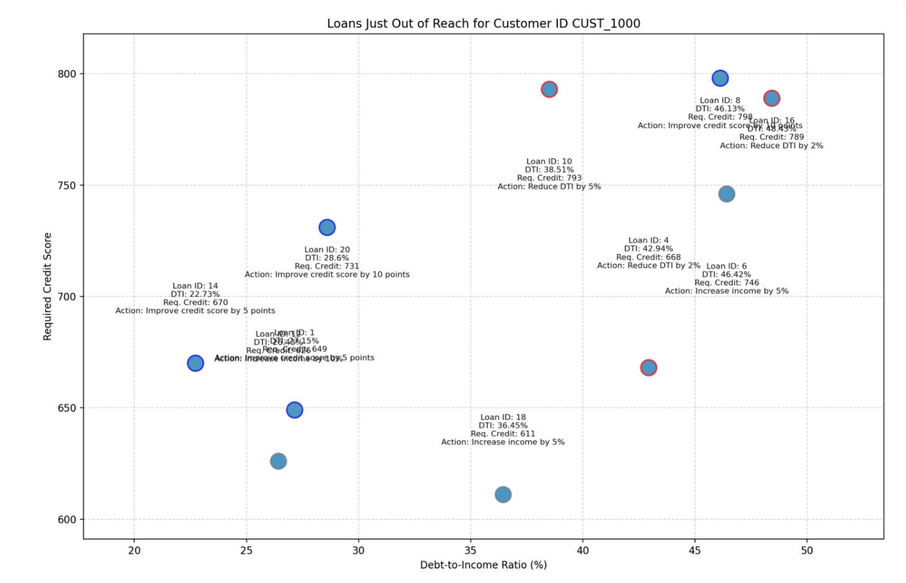
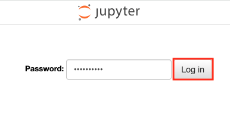
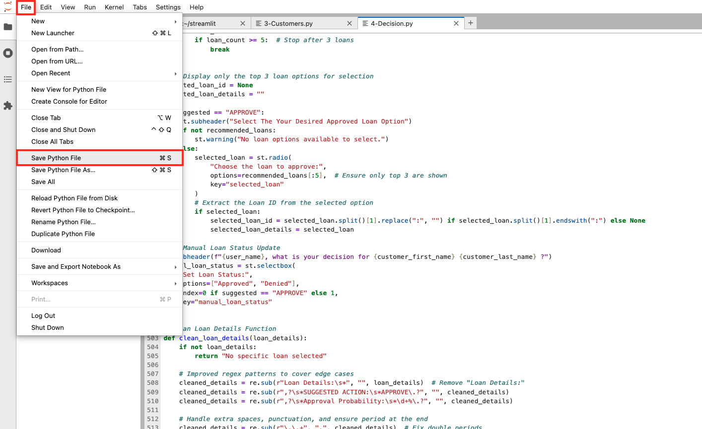
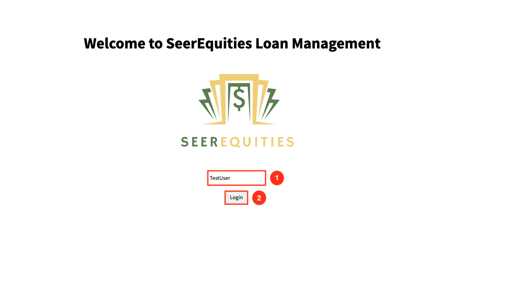

# Code Property Graph using Graph Query Hackathon Challenge

## Introduction

**Welcome to the Code Property Graph using Graph Query Hackathon Challenge!**

In this lab, you will tackle an exciting developer coding challenge focused on **Graph**. Your goal is to enhance the existing application by implementing an update that will elevate its functionality. This is your opportunity to sharpen your skills and explore the power of Graph.

**Are you up for the challenge?**

If you're ready to dive in, proceed with this lab and start coding. If you prefer a more guided approach with a detailed walkthrough, you can continue to Lab 5b Step-by-step: Code Property Graph using Graph Query Hackathon Challenge for step-by-step instructions.

Good luck, and enjoy the process!

Estimated Time: 30 minutes

### Objectives
* Enhance your understanding of Graph by applying it to a real-world developer coding challenge.
* Gain hands-on experience with Graph and refining application features to meet specific development requirements.


### Prerequisites

This lab assumes you have:
* An Oracle Cloud account
* Successfully completed Lab 1: Workshop Details and Prerequisites
* Successfully completed Lab 2: SeerEquities AI App in Action

## Task 1: Graph Developer Coding Challenge

**Task**:

The loan officer is requesting an additional graph to be added to the decision page to visualize additional loan options based on credit score and debt-to-income ratio. Specifically, they want to display an additional graph that shows loan options based on two key metrics: required credit score on one axis and debt-to-income ratio on the other.

**Instructions**:

1. Update the Decision.py file to add functionality for an additional graph that displays the following metrics: Required Credit Score and Debt-to-Income Ratio (%). The graph should display scatter plots similar to the example provided below, Required Credit Score and Debt-to-Income Ratio (%) are plotted:

    

2. Implement a dropdown that allows the user to select the new graph view.

    

**Guidance**:

We will show you how to access the files needed to complete the exercise and how to view the changes you make.

1. To navigate to the development environment, click **View Login Info**. Copy the Development IDE Login Password. Click the Start Development IDE link.

    

2. Paste in the Development IDE Login Password that you copied in the previous step. Click **Login**.

    

3. Click **Pages**.

    


4. Select the **Decision.py** file.

    

5. After making the necessary changes in the Decision.py file to create an additional graph that displays the following metrics: Required Credit Score and Debt-to-Income Ratio (%), you will need to save the file.

    

6. To view the changes you made, select the **Launcher** tab and open the **terminal**. 

    

7. Copy the ./run.sh command and paste it into the terminal.

    ````
    <copy>
    ./run.sh
    </copy>
    ````

8. Click the URL displayed in the terminal to launch the SeerEquities Loan Management application.

    

9. Enter in a username and click **Login**.

    

10. On the Dashboard page, from the pending review list, select the Customer ID for **James Woods**.

    

11. This will display the customers loan application details. In approximately 15 seconds, the AI generated loan recommendations will be displayed. Click the **Navigate To Decisions** button.

    

12. Expand the drop down to view the newly added graph.

    

## Learn More

*(optional - include links to docs, white papers, blogs, etc)*

* [URL text 1](http://docs.oracle.com)
* [URL text 2](http://docs.oracle.com)

## Acknowledgements
* **Author** - <Name, Title, Group>
* **Contributors** -  <Name, Group> -- optional
* **Last Updated By/Date** - <Name, Month Year>
