# Hands On How-To’s

## Introduction

This lab guides you through spinning up and navigating a GenAI-powered loan approval application, designed to streamline the loan processing workflow and significantly reduce the time-consuming paperwork that currently takes months for Loan Officers to handle.

Estimated Lab Time: 30 minutes

### Objectives

In this lab, you will:
* Begin the demo process of the hands_on loan officer approval use cases

### Prerequisites

This lab assumes you have:
* Completed the Get Started lab
* Successfully launched the demo environment

## Task 1: Demo User with Good Credit

In this first example, we'll navigate through this application to show you the first user being approved with good credit.

1. Select **Dashboard** in the left navigation menu.

    

2. On the Dashboard page, from the pending review list, select the Customer ID for **James Smith**.

    

3. This will display the customers loan application details. In approximately 15 seconds, the AI generated recommendations will be displayed.

    

4. Copy the following prompt into the AI chatbot and press Enter.

    ```
    <copy>
    What would be the top 0% down payment loans?
    </copy>
    ```
    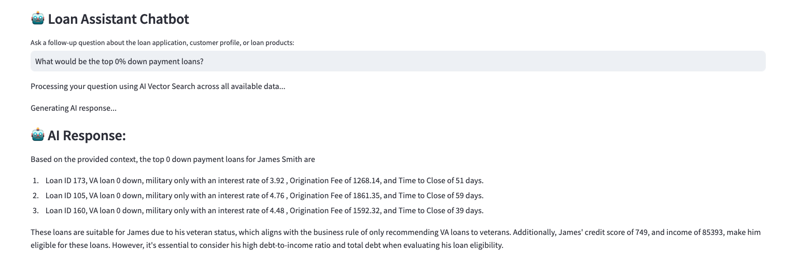

5. Press the **Generate Finalized Decision PDF** button to save the AI responses and proceed to the final loan disposition.

    

6. Select **Decision** in the left navigation menu.

    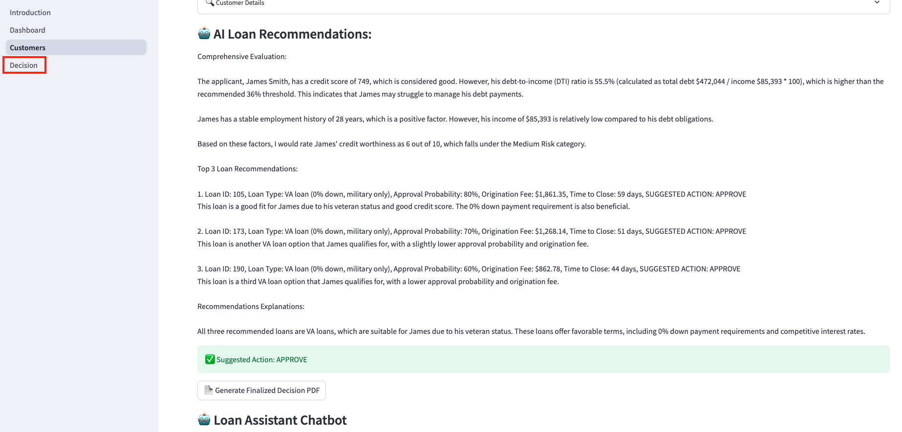

7. In the **Select Final Approved Loan Option** section, the graph options using Oracle 23ai Property Graph are displayed. This is where the loan officer could choose to request additional information in order to provide a slightly better loan. For this scenario, we will continue with selecting one of the suggested loans.

    

8. Select the AI suggested loan with the lowest time to close. Since our customer wanted the lowest time to close, we would select loan number 3.

    

9. Set the final loan status to **Approved**.

    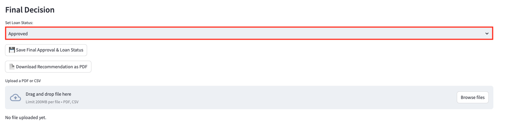

10. Click the **Save Final Approval & Loan Status** button.

    The loan status has been updated to 'Approved' and saved to the customer profile.

    

11. Click the **Download Recommendation as PDF** button.

    

12. Click **Download PDF**

    

13. Display the message the customer would see by opening the downloaded PDF.

    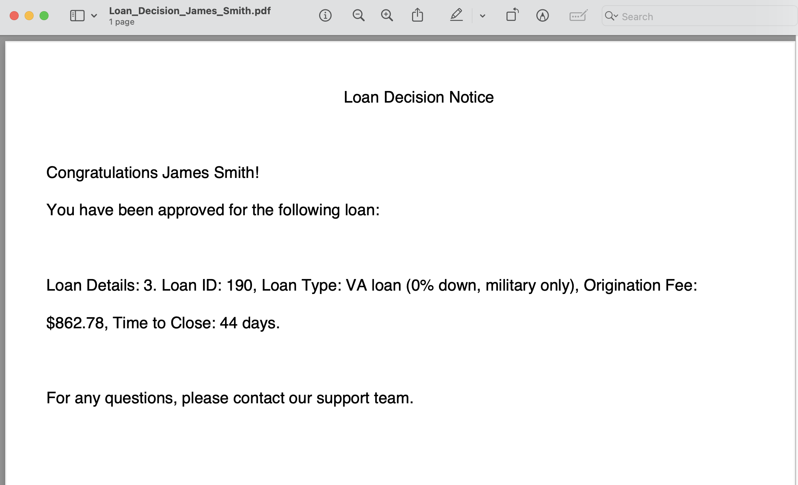

14. Navigate back to the **Dashboard** and expand **View Approved Customers**. We can see that James Smith has been removed from the Pending Review Loan Requests list and has been added to the Approved Loan Requests list.

    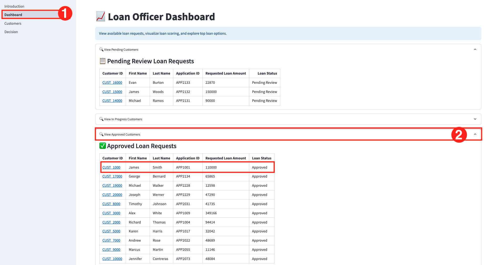

## Task 2: Demo User with Bad Credit

1. Select **Dashboard** in the left navigation menu if you are not on the Dashboard page already.

    

2. On the Dashboard page, from the pending review list, select the Customer ID for **James Woods**.

    

3. This will display the customers loan application details. In approximately 15 seconds, the AI generated recommendations will be displayed.

    

4. Press the **Generate Finalized Decision PDF** button to save the AI responses and proceed to the final loan disposition.

    

5. Select **Decision** in the left navigation menu.

    

6. Click the **Save Final Approval & Loan Status** button.

    The loan status has been updated to 'Denied' and saved to the customer profile.

    

7. Click the **Download Recommendation as PDF** button.

    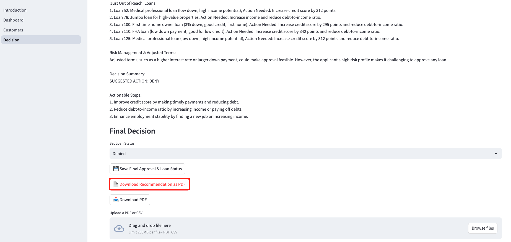

8. Click **Download PDF**

    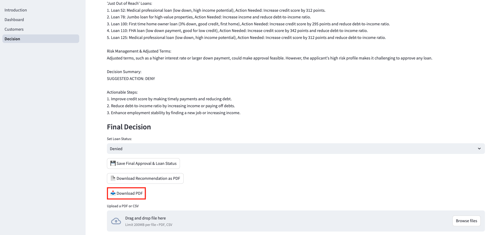

9. Display the message the customer would see by opening the downloaded PDF.

    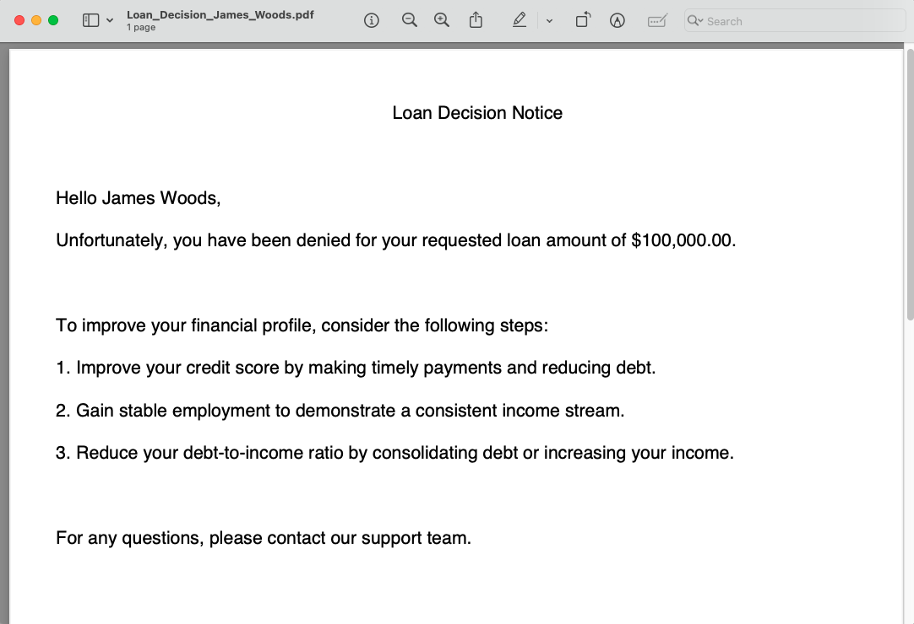

10. Navigate back to the **Dashboard** and expand **View Denied Customers**. We can see that James Woods has been removed from the Pending Review Loan Requests list and added to the Denied Loan Requests list.

    


## Task 3: Opportunity Zone User with Low Income Good Credit

1. Select **Dashboard** in the left navigation menu if you are not on the Dashboard page already.

    

2. On the Dashboard page, from the pending review list, select the Customer ID for **Evan Burton**.

    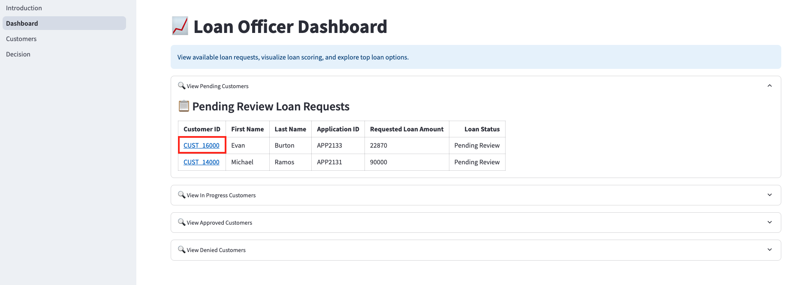

3. This will display the customers loan application details. In approximately 15 seconds, the AI generated recommendations will be displayed.

    

4. Press the **Generate Finalized Decision PDF** button to save the AI responses and proceed to the final loan disposition.

    

5. Select **Decision** in the left navigation menu.

    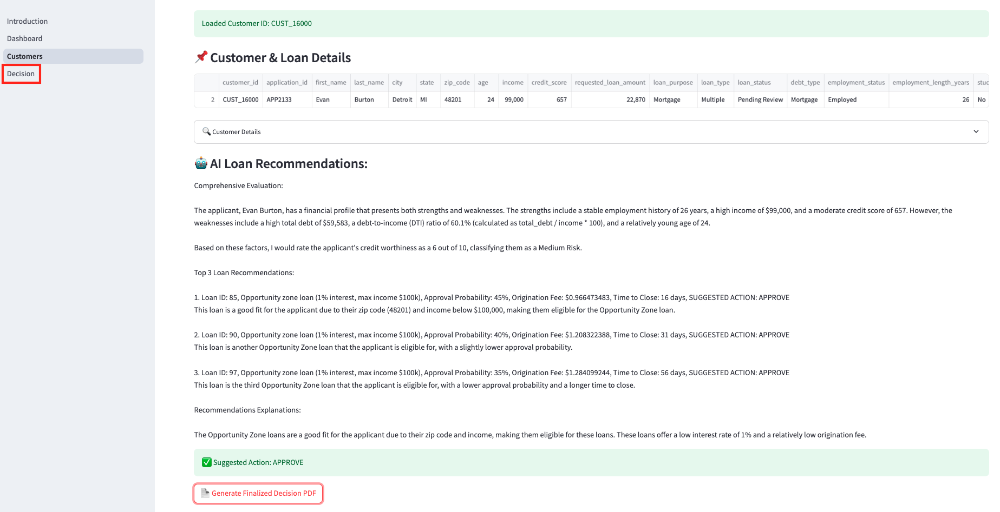

6. In the **Select Final Approved Loan Option** section, the graph options using Oracle 23ai Property Graph are displayed. This is where the loan officer could choose to request additional information in order to provide a slightly better loan. For this scenario, we will continue with selecting one of the suggested loans.

    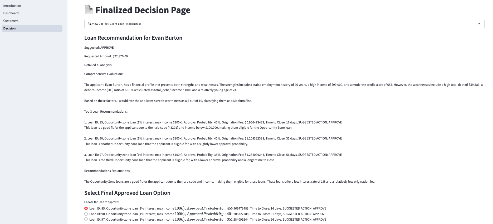


7. Select the AI suggested opportunity zone loan with the lowest time to close. In our case, we would select loan number 1.

    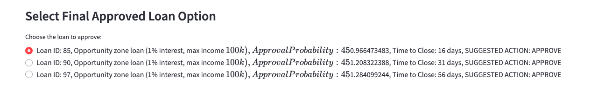

8. Set the final loan status to **Approved**.

    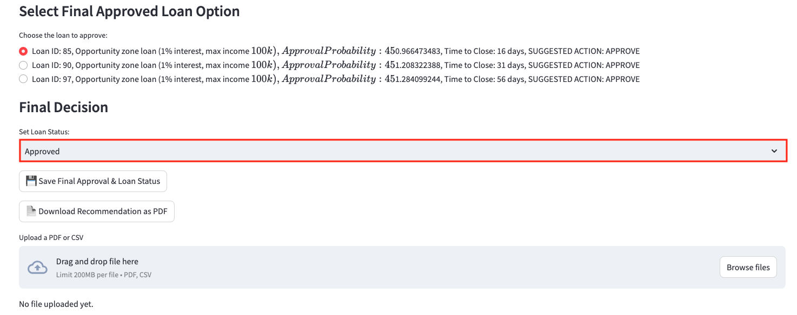

9. Click the **Save Final Approval & Loan Status** button.

    The loan status has been updated to 'Approved' and saved to the customer profile.

    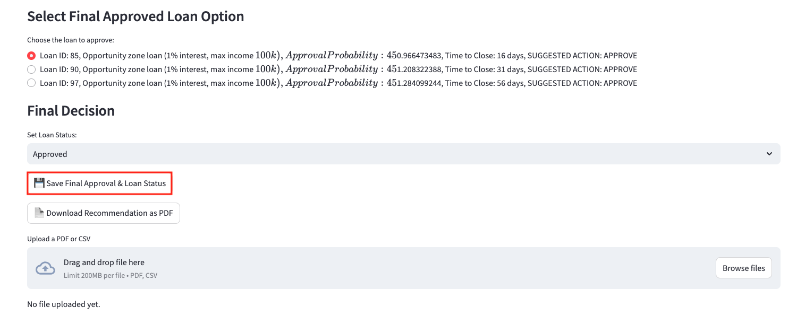

10. Click the **Download Recommendation as PDF** button.

    

11. Click **Download PDF**

    

12. Display the message the customer would see by opening the downloaded PDF.

    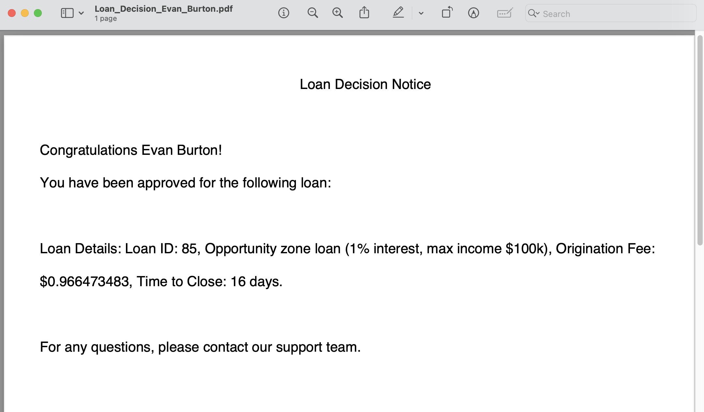

13. Navigate back to the **Dashboard** and expand **View Approved Customers**. We can see that Evan Burton has been removed from the Pending Review Loan Requests list and has been added to the Approved Loan Requests list.

    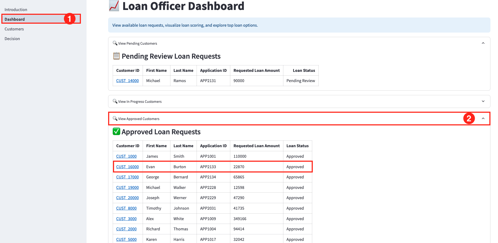

## Task 4: First Time Home Buyer Good Credit

1. Select **Dashboard** in the left navigation menu if you are not on the Dashboard page already.

    

2. On the Dashboard page, from the pending review list, select the Customer ID for **Alex Anderson**.

    

3. This will display the customers loan application details. In approximately 15 seconds, the AI generated recommendations will be displayed.

    

4. Copy the following prompt into the AI chatbot to see the lowest down payment. Press Enter.

    ```
    <copy>
    Show me the lowest down payment.
    </copy>
    ```
    

    Copy the following prompt into the AI chatbot to see the lowest monthly payment. Press Enter.
    ```
    <copy>
    Show me the lowest monthly payment.
    </copy>
    ```
    

5. Press the **Generate Finalized Decision PDF** button to save the AI responses and proceed to the final loan disposition.

    

6. Select **Decision** in the left navigation menu.

    

6. In the **Select Final Approved Loan Option** section, the graph options using Oracle 23ai Property Graph are displayed. This is where the loan officer could choose to request additional information in order to provide a slightly better loan. For this scenario, we will continue with selecting one of the suggested loans.

    

8. Since the AI suggested the first time home owner loan with the lowest monthly payment, we would select loan number 1. This loan is the most suitable option for Michael given his financial profile and loan eligibility.

    

9. Set the final loan status to **Approved**.

    

9. Click the **Save Final Approval & Loan Status** button.

    The loan status has been updated to 'Approved' and saved to the customer profile.

    

10. Click the **Download Recommendation as PDF** button.

    

11. Click **Download PDF**

    

12. Display the message the customer would see by opening the downloaded PDF.

    

13. Navigate back to the **Dashboard** and expand **View Approved Customers**. We can see that Alex Anderson has been removed from the Pending Review Loan Requests list and has been added to the Approved Loan Requests list.

    

## Task 5: Edit Customer Details
For this task, we will edit a customers details.

1. Select **Dashboard** in the left navigation menu if you are not on the Dashboard page already.

    

2. On the Dashboard page, expand **View Denied Customers**. From the Denied Loan Requests list, select the customer ID for **James Woods**.

    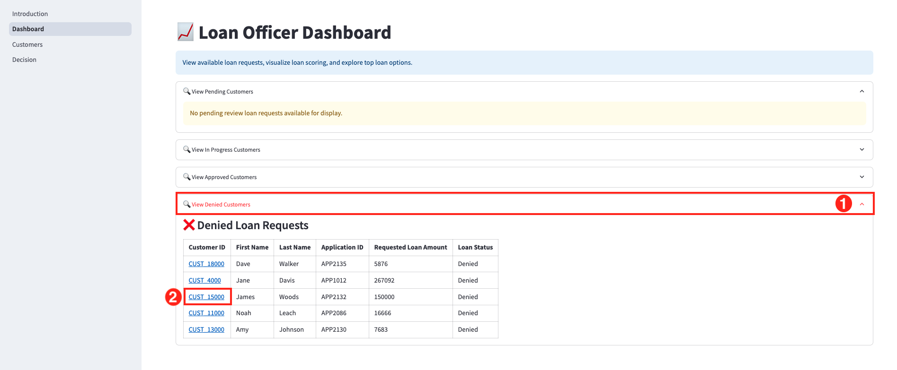

3. On the Customer Details page, expand **Customer Details**.

    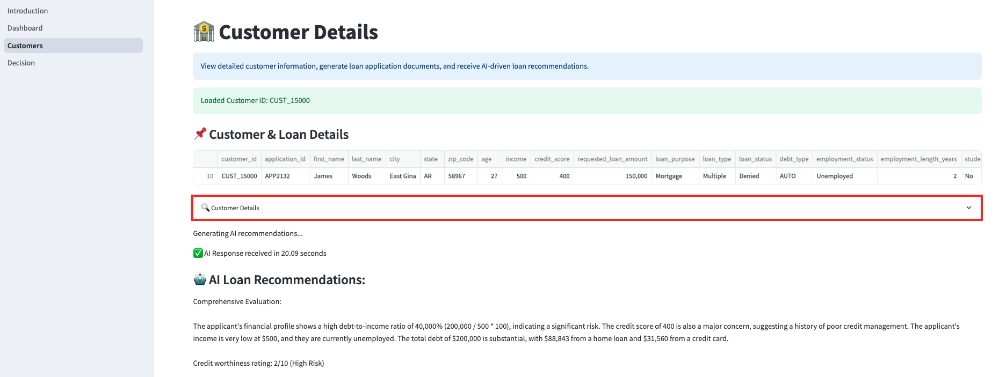

5. Let's change James' loan status from Denied back to **Pending Review**.

    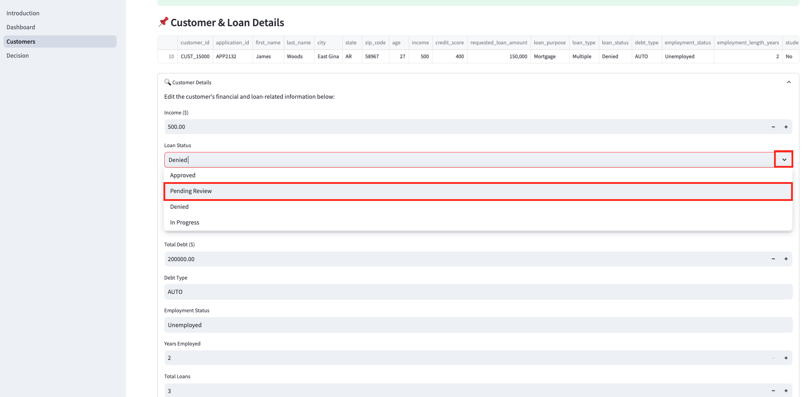

6. Click **Save Customer Details**.

    

7. Navigate back to the Dashboard.

    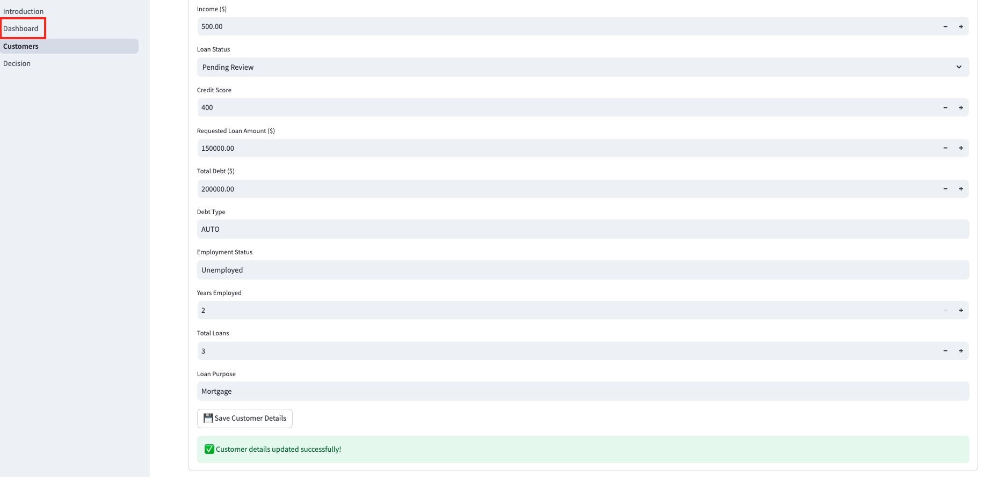

8. We can see that James Woods has been removed from the Denied Loan Requests list and has been added back to the Pending Review Loan Requests list.

    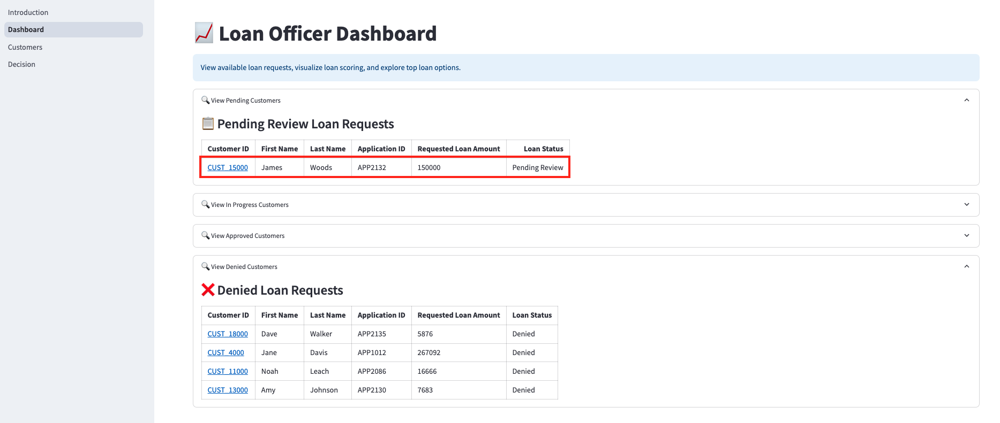


## Learn More

*(optional - include links to docs, white papers, blogs, etc)*

* [URL text 1](http://docs.oracle.com)
* [URL text 2](http://docs.oracle.com)

## Acknowledgements
* **Authors** - Linda Foinding, Francis Regalado
* **Contributors** - Kamryn Vinson, Eddie Ambler, Kevin Lazarz
* **Last Updated By/Date** - Linda Foinding, April 2025