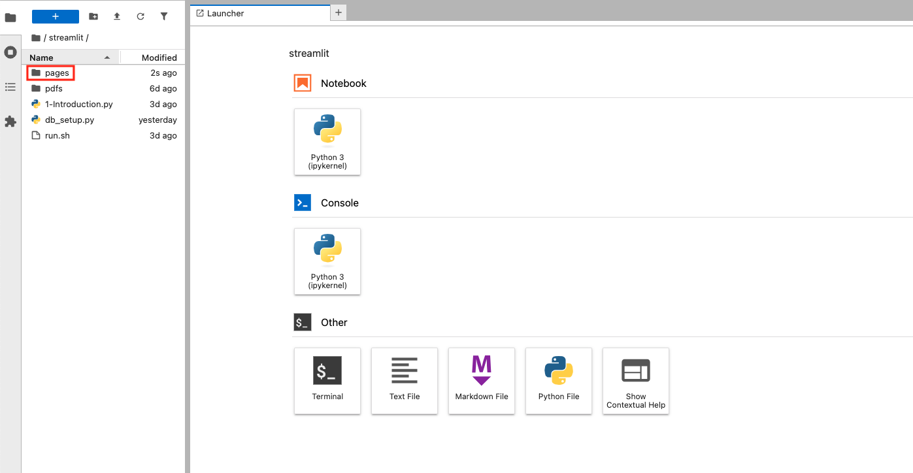
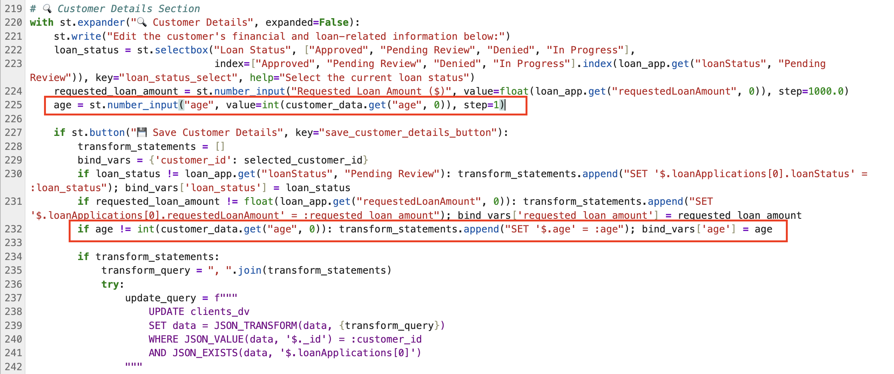
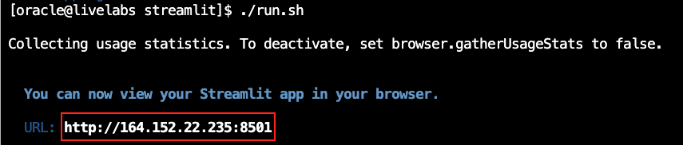

# JSON Duality Views Coding Hackathon Challenge step-by-step

## Introduction

In this lab, we’ll provide a step-by-step guide to help you successfully complete the coding challenge from the previous lab. This step-by-step guide will walk you through the necessary updates, providing solutions and insights to help you fully understand how to utilize JSON duality views in a practical scenario. Whether you're refining your existing work or tackling the challenge for the first time, this guide will ensure you gain the skills and confidence needed to implement these powerful features.

Let’s dive in and unlock the full potential of JSON in your application!

Estimated Time: 15 minutes

### Objectives

In this lab, you will:

* Enhance your understanding of JSON duality views by applying it to a real-world developer coding challenge.

* Gain hands-on experience with JSON duality views and refining application features to meet specific development requirements.

### Prerequisites

This lab assumes you have:

* An Oracle Cloud account

* Successfully completed Lab 1: Workshop Details and Prerequisites

* Successfully completed Lab 2: SeerEquities AI App in Action


## Task 1: JSON Duality Views Coding Exercise


The company has requested an enhancement to the current customer data and would now like to see the parameter for **age** to be reflected.

1. In the Customer.py file, find the 🔍 Customer Details Section at line 219
2. Update the section to include a new parameter for **age**.


## Task 2: Login to Jupiter Notebook

1. To navigate to the development environment, click **View Login Info**. Copy the Development IDE Login Password. Click the Start Development IDE link.

    

2. Paste in the Development IDE Login Password that you copied in the previous step. Click **Login**.

    

## Task 3: Modify the Customers.py File

1. Click **Pages**.

    

2. Select **Customers.py**.

    

**Coding with JSON TRANSFORM**

The code below section dynamically updates customer data in our **clients dv** (dv - stands for duality views) table by building a flexible  **JSON TRANSFORM** query based on a list of transformation statements. It constructs the query by joining those statements—like setting new field values—then applies them to the JSON data for a specific customer, identified by their ID, as long as a loan application exists."

3. Edit the Customer Details Section

    

 a. Copy the following code block and paste it at line 225 in the Customer.py file.

    ````python
         <copy>
        age = st.number_input("age", value=int(customer_data.get("age", 0)), step=1)
                    </copy>
    ````


 b. Copy the following code block and paste it at line 232 in the Customer.py file.

    ````python
         <copy>
        if age != int(customer_data.get("age", 0)): transform_statements.append("SET '$.age' = :age"); bind_vars['age'] = age                
        </copy>
    ````
## Task 4: Launch the Application

1. Open the terminal.

    

2. Copy the ./run.sh command and paste it into the terminal.

    ````bash
         $<copy>
         ./run.sh
         </copy>
    ````

3. Click the URL displayed in the terminal to launch the SeerEquities Loan Management application.

    

4. Enter in a username and click **Login**.

    

## Task 5: View the Results

1. On the Dashboard page, from the pending review list, select the Customer ID for **James Woods**.

    

2. This will display the customers loan application details. Select the **Customer Details** drop down menu and view the new age parameter at the bottom.

    

3. Note: the customer details tab has been updated to reflect the **age** parameter now for all customers.


**Congratulations, you have successfully completed the JSON Duality View Coding Exercise!**

## Learn More

* [Oracle Database 23ai Documentation](https://docs.oracle.com/en/database/oracle/oracle-database/23/)

## Acknowledgements
* **Authors** - Linda Foinding, Francis Regalado
* **Contributors** - Kamryn Vinson, Otis Barr, Ramona Magadan, Eddie Ambler, Kevin Lazarz
* **Last Updated By/Date** - Linda Foinding, April 2025
