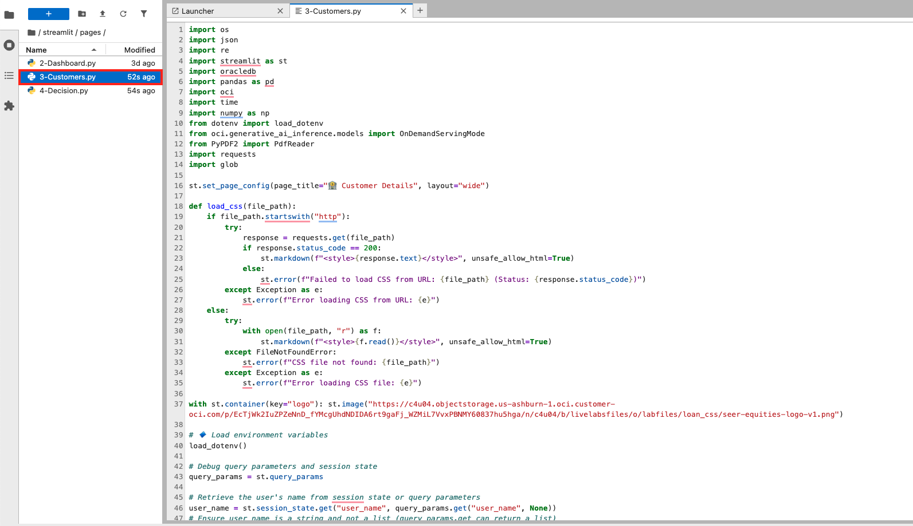
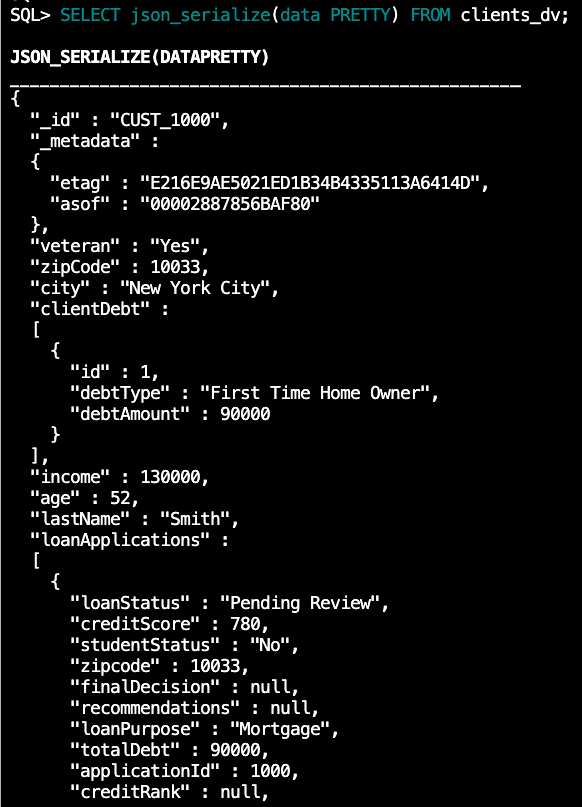
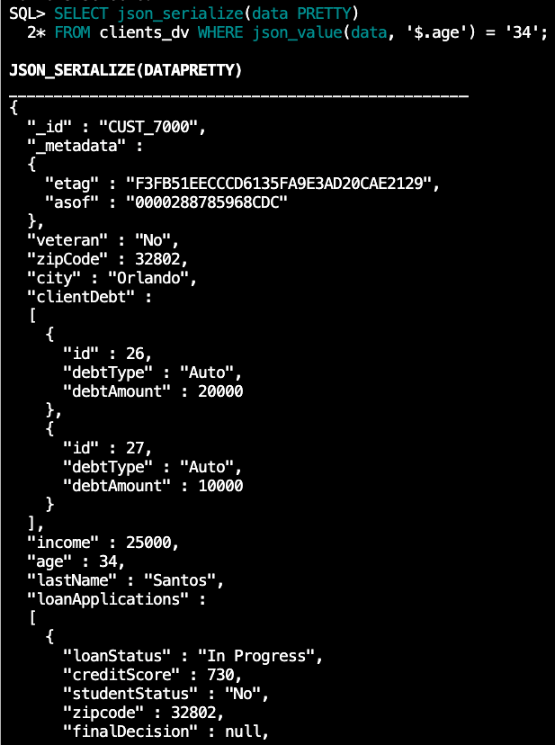
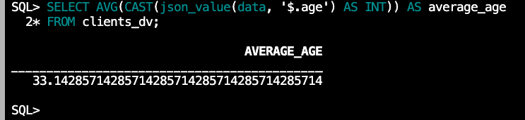

# Code with JSON Duality Views

## Introduction

**Welcome to the JSON Duality Views Challenge!**

In this lab, you will tackle an exciting coding challenge focused on **JSON**. Your goal is to enhance the existing application by implementing an update that will elevate its functionality. 

At SeerEquites, the analytics department has flagged an issue with incorrect customer age data, affecting their reports and insights. To resolve this, loan officers are tasked with manually updating customer ages in the loan application, but currently, they cannot edit the age field. Fortunately, the system was designed with age fields already in the database, so the solution is to update the frontend of the loan application to allow officers to modify the age. Once this is implemented, the analytics department can benefit by using JSON Duality Views to run SQL queries on the updated data, even though it's stored as documents. This will allow the team to access accurate, up-to-date customer ages, improving their reporting and decision-making, while loan officers can ensure the data is correct.

This is your opportunity to sharpen your skills and explore the power of JSON.

**Are you up for the challenge?**

If you're ready to dive in, proceed with this lab and start coding. If you prefer a more guided approach with a detailed walkthrough, you can continue to Lab 7b Step-by-step: JSON Duality Views for step-by-step instructions.

Good luck, and enjoy the process!

Estimated Time: 30 minutes

### Objectives

In this lab, you will:

* Enhance your understanding of JSON duality views by applying it to a coding challenge.

* Gain hands-on experience with JSON duality views and refining application features to meet specific development requirements.

### Prerequisites

This lab assumes you have:
* An Oracle Cloud account
* Successfully completed Lab 1: Run the Demo
* Successfully completed Lab 3: Connect to Development Environment


## Task 1: Challenge Requirements 

This challenge consists of **three steps**: 

* First, update the frontend of the loan application to enable loan officers to view and modify customer ages. 
* Second, calculate the average age across the client base using the corrected information.
* Third, use JSON Duality Views to run SQL queries on the updated data.

## Task 2: Update Application Frontend

The company has requested an enhancement to the current customer data and would now like to see the parameter for **age** to be reflected.

1. Click **Pages**.

    

2. Select the **Customers.py** file.

    

3. In the Customer.py file, find the # 🔍 Customer Details Section at line 219

4. Update the section to include a new parameter for **age**.

5. Save the Customers.py file.

    

## Task 3: Analyzing the Complete Client Data 

The analytics team needs to access the full dataset of client information (e.g., age, income, credit score, loan history) to perform a comprehensive analysis. This command returns the entire data field in JSON format, which could contain detailed client records.

````sql
    <copy>
    SELECT json_serialize(data PRETTY) FROM clients_dv;
    </copy>
````

By examining this data, the analytics team can:

* Identify key patterns in client demographics (e.g., a high proportion of clients in a particular age group applying for certain types of loans).

* Recognize which attributes (such as age, income level, or credit score) are most strongly correlated with loan approval rates or defaults.

* Provide insights that the loan officers can use to suggest customized loan options to clients based on their age and financial background.

    

## Task 4: Analyzing Clients of a Specific Age

A common scenario for a loan officer is to deal with clients who fall into a specific age group. For example, there may be a market trend where people around the age of 34 are showing an increased interest in home loans or refinancing options.

````sql
    <copy>
    SELECT json_serialize(data PRETTY)
    FROM clients_dv WHERE json_value(data, '$.age') = '34';
    </copy>
````

The analytics team can use this query to extract all client data for those who are 34 years old. The output helps identify:

* Whether this demographic is asking for specific types of loans (e.g., home loans vs. personal loans).

* If age 34 clients are more likely to get approved or face any challenges in their loan applications.

* Demographic details like income, credit score, and previous loan history that could influence loan recommendations for 34-year-olds.

Loan officers can then use these insights to:

* Tailor loan offers to meet the needs of 34-year-old clients. 

* Customize interest rates or repayment terms based on the behavior and loan eligibility trends of this age group.

    

## Task 5: Calculating the Average Age of Clients

The analytics team can calculate the average age of all clients in the database. This helps understand the overall age distribution of clients seeking loans. For example, if the average age of clients is 28, it might suggest that younger customers are more likely to apply for loans or require financial products that cater to their specific needs (e.g., first-time homebuyers or education loans).

````sql
    <copy>
    SELECT AVG(CAST(json_value(data, '$.age') AS INT)) AS average_age
    FROM clients_dv;
    </copy>
````

Loan officers can use this data to:

* Adjust their loan offerings to target the most common age group.

* Customize their approach for different age groups by suggesting loan products suited for younger vs. older clients.

* Understand the risk and behavior patterns associated with different age groups—helpful for tailoring loan terms or interest rates.

For instance, if the average age is low, there might be an opportunity to introduce loans tailored for young professionals, like lower-interest student loan consolidation or startup loans. If the average age is high, home equity loans or retirement planning options may be more relevant.



**Congratulations, you have successfully completed the JSON Duality View Coding Exercise!**

## Conclusion
The analytics team can leverage these SQL queries to deliver powerful insights into the client base's age distribution and preferences, enabling loan officers like yourself to offer more personalized, relevant, and profitable loan recommendations. By using the data in a structured way, the loan process becomes more customer-centric, improving satisfaction and potentially increasing the volume and quality of loan products offered.

## Learn More

* [Oracle AI Database Documentation](https://docs.oracle.com/en/database/oracle/oracle-database/23/)

## Acknowledgements
* **Authors** - Linda Foinding, Francis Regalado
* **Contributors** - Ramona Magadan, Eddie Ambler
* **Last Updated By/Date** - Linda Foinding, April 2025
