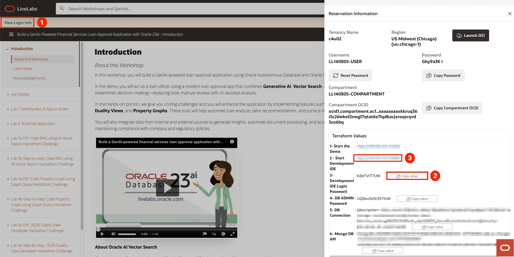

# JSON Duality Views Coding challenge

## Introduction

**Welcome to the JSON Duality Views Coding Challenge!**

In this lab, you will tackle an exciting coding challenge focused on **JSON**. Your goal is to enhance the existing application by implementing an update that will elevate its functionality. This is your opportunity to sharpen your skills and explore the power of JSON.

**Are you up for the challenge?**

If you're ready to dive in, proceed with this lab and start coding. If you prefer a more guided approach with a detailed walkthrough, you can continue to Lab 6b Step-by-step: JSON Duality Views Coding excersise for step-by-step instructions.

Good luck, and enjoy the process!

Estimated Time: 30 minutes

### Objectives

In this lab, you will:

* Enhance your understanding of JSON duality views by applying it to a real-world developer coding challenge.

* Gain hands-on experience with JSON duality views and refining application features to meet specific development requirements.

### Prerequisites

This lab assumes you have:

* An Oracle Cloud account

* Successfully completed Lab 1: Workshop Details and Prerequisites

* Successfully completed Lab 2: SeerEquities AI App in Action


## Task 1: JSON Duality Views Coding Exercise 


The company has requested an enhancement to the current customer data and would now like to see the customer's age to be reflected. 

1. In the Decision.py file, find the clients_dv transform statement
2. Update the clients_dv transform statement to include a parameter for **age** 


## Task 2: Login to Jupiter Notebook

1. To navigate to the development environment, click **View Login Info**. Copy the Development IDE Login Password. Click the Start Development IDE link.

    

2. Paste in the Development IDE Login Password that you copied in the previous step. Click **Login**.

    

## Task 3: Modify the Decision.py File

1. Click **Pages**.

    

2. Select **Decision.py**.

    

**Coding with JSON TRANSFORM**

The code below section dynamically updates customer data in our **clients dv** (dv - stands for duality views) table by building a flexible  **JSON TRANSFORM** query based on a list of transformation statements. It constructs the query by joining those statements—like setting new field values—then applies them to the JSON data for a specific customer, identified by their ID, as long as a loan application exists."

3. Find the following code block in the Decision.py file and age the parameter for age

````python
<copy>
        if transform_statements:
                    transform_query = ", ".join(transform_statements)
                try:
                update_query = f"""
                    UPDATE clients_dv
                    SET data = JSON_TRANSFORM(data, {transform_query})
                    WHERE JSON_VALUE(data, '$._id') = :customer_id
                    AND JSON_EXISTS(data, '$.loanApplications[0]')
                """
                </copy>
````

## Task 4: Launch the Application

1. Open the terminal. 

    

2. Copy the ./run.sh command and paste it into the terminal.

````bash
 $<copy>
    ./run.sh
    </copy>
````

3. Click the URL displayed in the terminal to launch the SeerEquities Loan Management application.

    

4. Enter in a username and click **Login**.

    

## Task 5: View the Results

## Learn More

*(optional - include links to docs, white papers, blogs, etc)*

* [URL text 1](http://docs.oracle.com)
* [URL text 2](http://docs.oracle.com)

## Acknowledgements
* **Author** - <Name, Title, Group>
* **Contributors** -  <Name, Group> -- optional
* **Last Updated By/Date** - <Name, Month Year>
