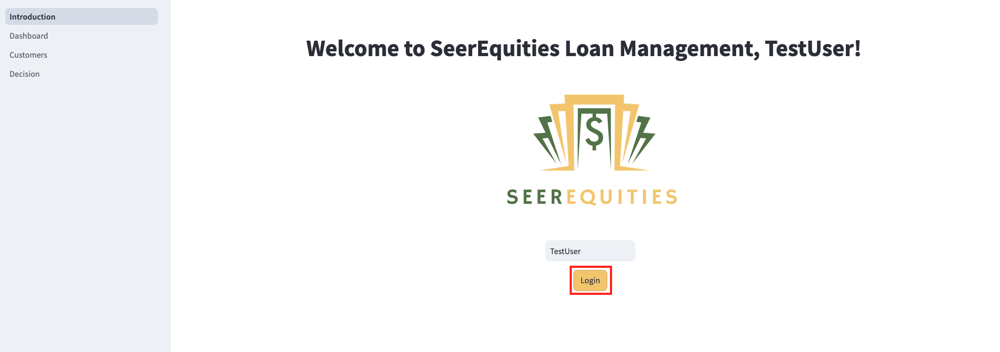

# JSON Duality View Developer Hackathon Challenge

## Introduction

**Welcome to the JSON Duality View Developer Hackathon Challenge!**

In this lab, you will tackle an exciting coding challenge focused on **JSON**. Your goal is to enhance the existing application by implementing an update that will elevate its functionality. This is your opportunity to sharpen your skills and explore the power of JSON.

**Are you up for the challenge?**

If you're ready to dive in, proceed with this lab and start coding. If you prefer a more guided approach with a detailed walkthrough, you can continue to Lab 6b Step-by-step: JSON Duality Views Coding exercise for step-by-step instructions.

Good luck, and enjoy the process!

Estimated Time: 30 minutes

### Objectives

In this lab, you will:

* Enhance your understanding of JSON duality views by applying it to a real-world developer coding challenge.

* Gain hands-on experience with JSON duality views and refining application features to meet specific development requirements.

### Prerequisites

This lab assumes you have:
* An Oracle Cloud account
* Successfully completed Lab 1: Run the Demo
* Successfully completed Lab 3: Connect to Development Environment


## Task 1: JSON Duality Views Coding Exercise

The company has requested an enhancement to the current customer data and would now like to see the parameter for **age** to be reflected.

1. In the Customer.py file, find the # 🔍 Customer Details Section at line 219
2. Update the section to include a new parameter for **age**.

## Task 2: Modify the Customers.py File

1. Click **Pages**.

    

2. Select **Customers.py**.

    

**Coding with JSON TRANSFORM**

The code below section dynamically updates customer data in our **clients dv** (dv - stands for duality views) table by building a flexible  **JSON TRANSFORM** query based on a list of transformation statements. It constructs the query by joining those statements—like setting new field values—then applies them to the JSON data for a specific customer, identified by their ID, as long as a loan application exists."

3. **HINT** Find the following code block in the Customer.py file and add the parameter for age.

    ````python
         <copy>
         # 🔍 Customer Details Section
         with st.expander("🔍 Customer Details", expanded=False):
         st.write("Edit the customer's financial and loan-related information below:")
         loan_status = st.selectbox("Loan Status", ["Approved", "Pending Review", "Denied", "In Progress"], 
                               index=["Approved", "Pending Review", "Denied", "In Progress"].index(loan_app.get("loanStatus", "Pending Review")), key="loan_status_select", help="Select the current loan status")
        requested_loan_amount = st.number_input("Requested Loan Amount ($)", value=float(loan_app.get("requestedLoanAmount", 0)), step=1000.0)
        age = st.number_input("age", value=int(customer_data.get("age", 0)), step=1)
                </copy>
    ````

4. Copy the following code block and paste it in the Customer.py file.

    ````python
    <copy>
        age = st.number_input("age", value=int(customer_data.get("age", 0)), step=1)
                    </copy>
    ````


5. Copy the following code block and paste it in the Customer.py file.

    ````python
    <copy>
        if age != int(customer_data.get("age", 0)): transform_statements.append("SET '$.age' = :age"); bind_vars['age'] = age                
        </copy>
    ````

## Task 3: Launch the Application

1. Open the terminal.

    

2. Copy the ./run.sh command and paste it into the terminal.

    ````bash
         $<copy>
         ./run.sh
         </copy>
    ````

3. Click the URL displayed in the terminal to launch the SeerEquities Loan Management application.

    

4. Enter in a username and click **Login**.

    

## Task 4: View the Results

**Congratulations, you have successfully completed the JSON Duality View Coding Exercise!**

## Learn More

* [Oracle Database 23ai Documentation](https://docs.oracle.com/en/database/oracle/oracle-database/23/)

## Acknowledgements
* **Authors** - Linda Foinding, Francis Regalado
* **Contributors** - Kamryn Vinson, Otis Barr, Ramona Magadan, Eddie Ambler, Kevin Lazarz
* **Last Updated By/Date** - Linda Foinding, April 2025
