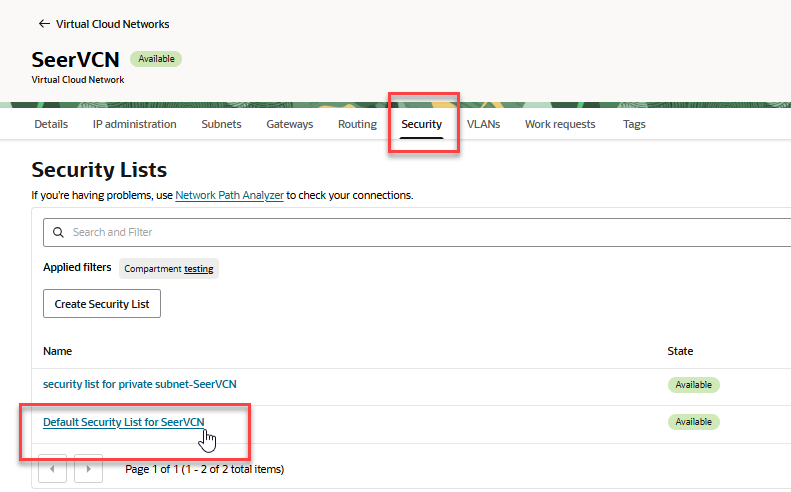
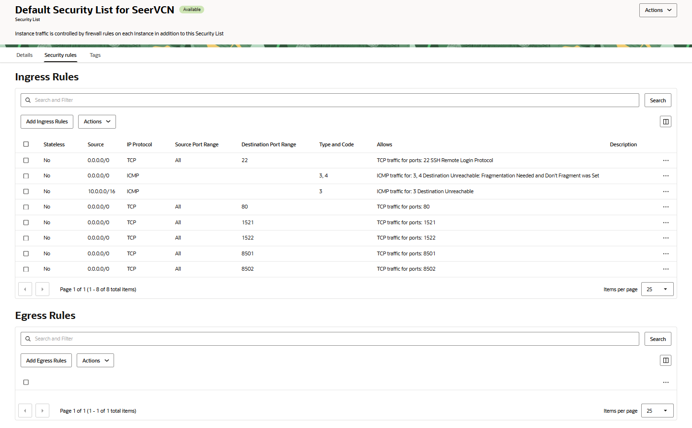
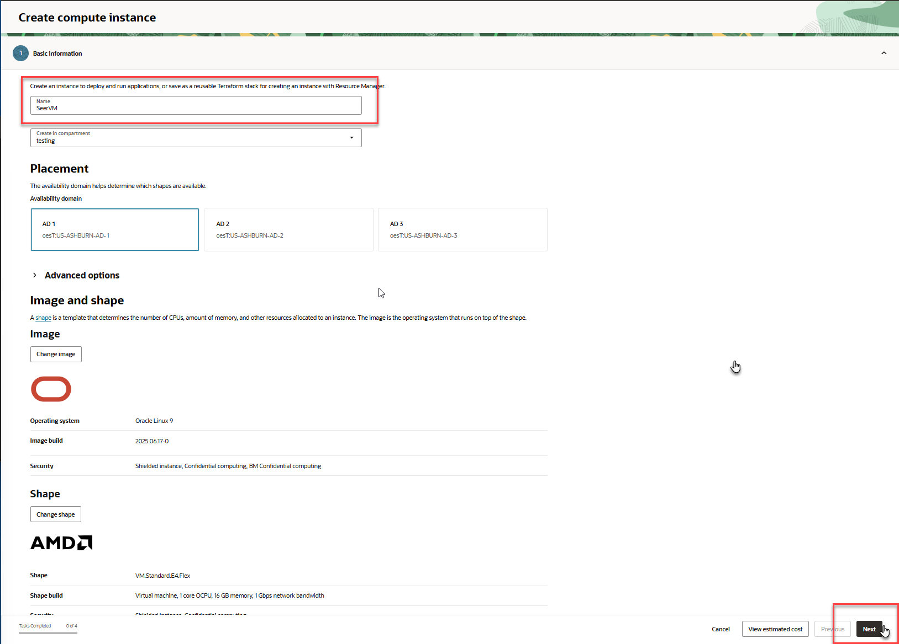
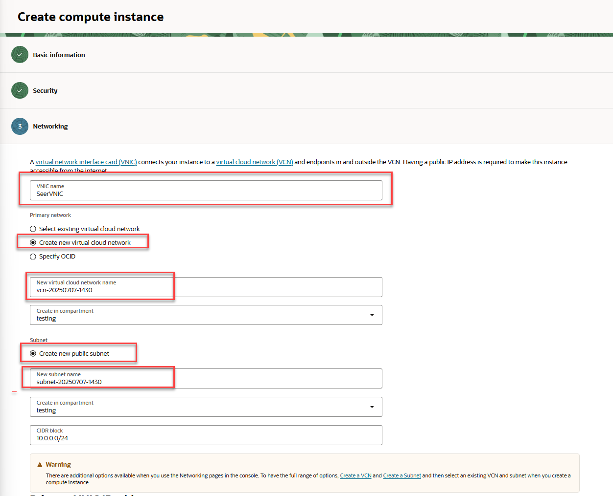
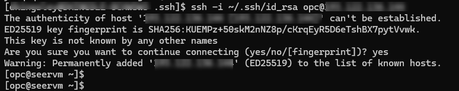
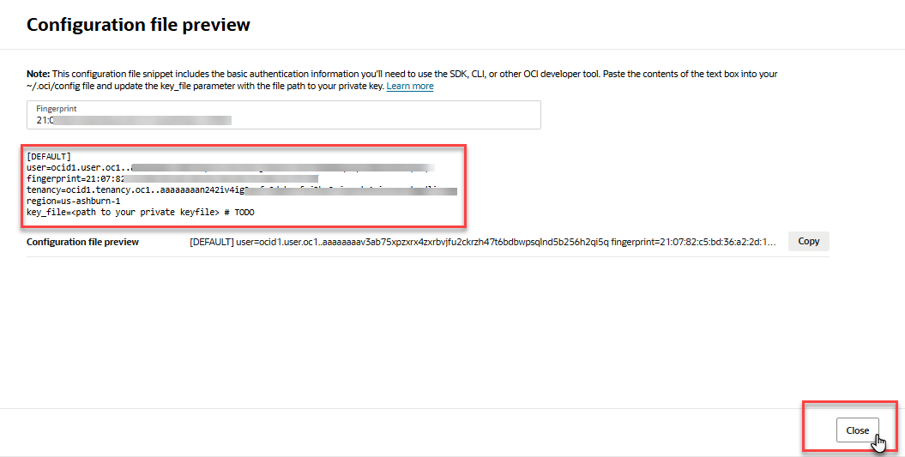
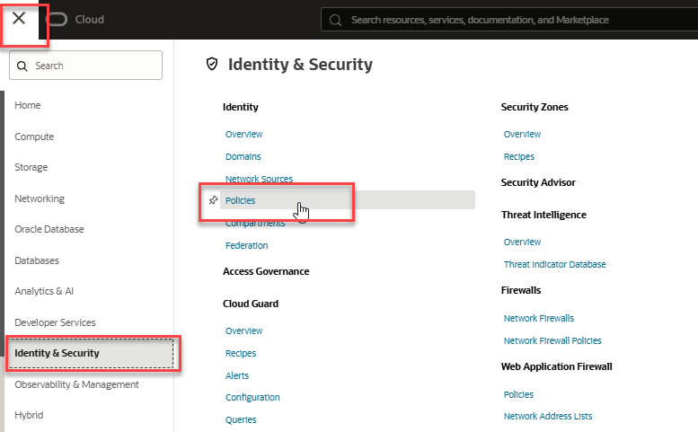
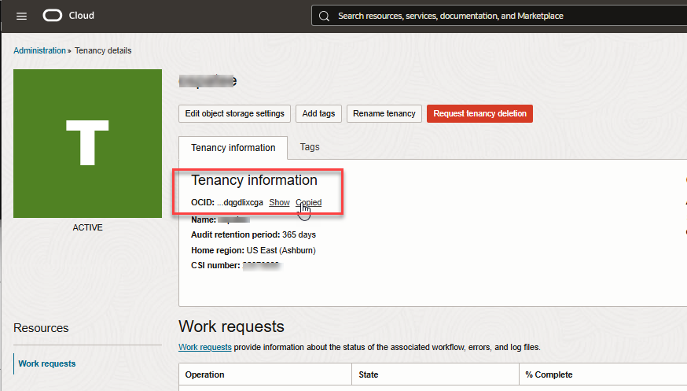
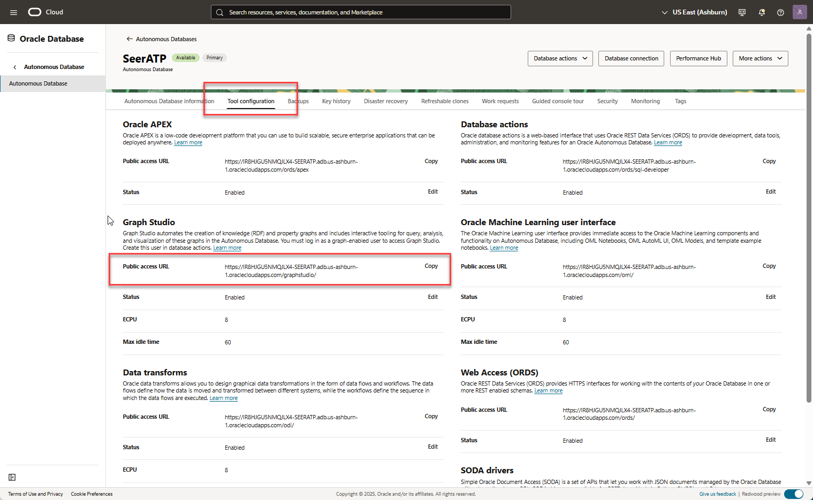
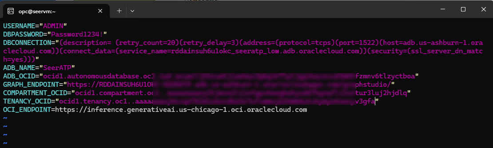

# How-to Install and Run the Application on OCI

## Introduction

This lab will show you how to setup and run the Seer Equities Loan Approval application on OCI. This guide is designed to walk you through the complete setup process, which includes provisioning required services and installing dependencies enabling you to launch and run the application on OCI.

The document is structured to help you meet all prerequisites, configure both the Autonomous Database and the OCI Generative AI Service, and troubleshoot any issues that may arise during setup. Whether you're new to Oracle Cloud Infrastructure or simply deploying for development and testing, this step-by-step guide will ensure a smooth setup experience.

Estimated Time: 60 minutes

### Objectives

By the end of this section, you will be able to:

- Provision and connect to an OCI VM and an Oracle Autonomous Database.

- Set up a Python-based local development environment.

- Configure access to OCI Generative AI services.

- Securely store your credentials and configuration details.

- Launch and interact with the application using Streamlit.

>   💡Note: This guide is intended for development and testing purposes. For production deployment, additional configuration and security hardening will be required.

Let’s get started!

## Task 1: Create a Virtual Cloud Network

Follow these steps to create a Virtual Cloud Network (VCN).

1. From the Oracle Cloud homepage, click the navigation menu in the top left corner. Select **Networking** then **Virtual Cloud Networks**.

   

2. Click the **Actions** drop-down and select **Start VCN Wizard**.

   

3. Select the big button labeled **Create VCN with Internet Connectivity** then click **Start VCN Wizard**.

   

4. In the **Basic Information** section, enter a name for your VCN. For example, use **SeerVCN**. Choose and verify the compartment you wish to use. Then click the **Next** button.

   

5. Review the VCN details in the next screen. The Wizard will create a VCN complete with an IPv4 CIDR block, public network address, subnets, internet gateway, and more. Click the **Create** button.

   

6. After a few moments the VCN will be created. Click the **View VCN** button to view details.

7. In the VCN details screen, click the **Security** tab and click on the link for **Default Security List for SeerVCN**.

    

In the next step, you'll create 5 ingress rules to allow traffic on specific ports within your VCN.

8. Click the **Security Rules** tab, then click the **Add Ingress Rules** under the Ingress Rules section. Note that port 22 is already enabled for SSH communication.

    

9. For each rule, add 0.0.0.0/0 as the **Source CIDR** and add the specific port below to the **Destination Port Range** field. Click **+ Another Ingress Rule** after each entry.

Add 5 rules using the below information. 

| Ingress Rule #  | Source CIDR | Port # |
| ------------- | ------------- | ------------ |
| 1  | 0.0.0.0/0  | 80    |
| 2  | 0.0.0.0/0  | 1521    |
| 3  | 0.0.0.0/0  | 1522    |
| 4  | 0.0.0.0/0  | 8501    |
| 5  | 0.0.0.0/0  | 8502    |
{: title="Ingress rules"}

When you've added all 5 ingress rules, click the **Add Ingress Rules** button at the bottom right of the page.

 

Your default security list should look like the below screenshot.

 

## Task 2: Create a Compute Instance

1. Click the Navigation menu in the top left and select **Compute** then **Instances**.

    

2. Verify that the filter reflects the correct compartment and click **Create Instance**.

    

3. Name the instance **SeerVM**, verify you're in the correct compartment, and accept all the defaults. Click the **Next** button.

    > **Note**: While all operating systems are supported, we recommend using Oracle Linux 9 as the operating system. The application runs on any available shape, including shapes available in the OCI Always Free tier.

    

4. Click **Next** on the Security screen.

5. In the **Networking** section name the VNIC - *SeerVNIC*. Verify that you are selecting the network you created earlier in the lab, in the right compartment with the correct public subnet.

    

    In the **Add SSH Keys** section, you can generate a new SSH key pair or use your favorite existing keys.

6. To generate a new key pair, click the radio button next to **Generate a key pair for me**. Then click the **Download private key** button to save the file to your local downloads directory. Click the button to **Download public key** to your local computer so you have both keys for safe-keeping.

    

    In Task 3, you'll need the SSH keys to gain access to the compute instance where you'll configure and run the software for this lab. Feel free to move the SSH keys to the .ssh directory of your terminal application. This will vary depending on which terminal emulator you're using on your system.

7. You can also utilize an existing key pair if you already have one. Choose the radio button for **Upload public key file (.pub)** and drop the file on the box or click it to locate the file and upload it to the VM.

    

8. Alternately, you can paste the contents of an existing public key. Locate the key you want to use and open it up in an editor. Copy and paste the contents of the key into the field

    

9. Once you've completed the SSH Key section, click the **Next** button to continue.

10. On the Boot Volume section, accept the defaults and choose **Next**.

11. Review the VM configuration information. Look in the Networking section and verify that **Public IPv4 address** = **Yes**. Click the **Create** button.

    
    
12. In a few moments, the instance will provision. When the state = **Succeeded** click the **<- Instances** breadcrumb at the top of the screen.

    

13. Click the instance name in the Instances list to go to the Instance details screen.

14. Locate the **Public IP address** in the Instance access section and copy the Public IP address. You'll need this in the next task.

15. Copy your **Public IP**. You will need this in the next task.

    

## Task 3: Update the VM and install packages

In this task you'll update the VM and install necessary packages to establish any dependencies we might need later in the lab when running the python scripts.

1. Open your favorite terminal application and navigate to the folder where your ssh keys are stored.

    

2. Run the command below to login to the Virtual Machine. Replace ssh\_key\_name with the name of your private key. Replace public\_ip with the public IP from the VM you created earlier.

    ````
        <copy>
        ssh -i ssh_key_name opc@public_ip
        </copy>
    ````

3. Run the command below to update the VM. It will take a few minutes.

    ````
        <copy>
        sudo yum update -y
        </copy>
    ````

    

4. Once the VM has been updated you can install the rest of the packages. Run the commands below:

    To run the application, Python version 3.11 is required.
    ````
        <copy>
        sudo yum install python3.11
        </copy>
    ````

    ````
        <copy>
        sudo yum install python3-pip -y
        </copy>
    ````

    ````
        <copy>
        sudo yum install python3.11-pip -y
        </copy>
    ````

    ````
        <copy>
        pip install --upgrade pip
        </copy>
    ````

5. Install Streamlit with the command below:

    ````
        <copy>
        pip install streamlit
        </copy>
    ````

6. Run the install commands below:

    ````
        <copy>
        pip install oracledb
        </copy>
    ````

    ````
        <copy>
        pip install oci
        </copy>
    ````

    ````
        <copy>
        pip install python-dotenv
        </copy>
    ````

    ````
        <copy>
        pip install PyPDF2
        </copy>
    ````

    ````
        <copy>
        pip install pandas network matplotlib
        </copy>
    ````

    ````
        <copy>
        pip install scipy fpdf
        </copy>
    ````

    ````
        <copy>
        sudo dnf install java-17-openjdk-devel -y
        </copy>
    ````

## Task 4: Provision an Autonomous Database

The application requires an Autonomous Database. Follow the steps to provision an Oracle Autonomous Transaction Database.

1. Click the navigation menu in the upper left of the OCI console, choose **Oracle Database** then **Autonomous Database**.

   

2. Verify that the filter option reflects the correct compartment and click the **Create Autonomous Database** button.

   

3. Use the information in the table below to fill out the **Create Autonomous Database Serverless** form. Proceed to the next step for instructions on setting up **Network Access**.


    | Field Name | Input |
    | ------------- | ------------ |
    | Display Name  | SeerATP   |
    | Database Name | SeerATP    |
    | Compartment | Verify correct compartment    |
    | Workload Type | ATP    |
    | Database Version | 23ai |
    | ECPU Count | 2   |
    | Password | Password1234!    |
    {: title="ADB configuration details overview"}


   

1. In the **Network access** section, choose **Secure access from allowed IPs and VCNs only**. In the **IP notation type** drop-down, choose **CIDR block**. For values, enter **0.0.0.0/0**. Verify that **Require mutual TLS (mTLS) authentication** is disabled. Click the **Create** button.

   

2. The ATP Database will enter the provisioning state. In a few minutes the state will turn from Provisioning to Available.

    

3. Once the state changes to **Available**, the Autonomous Transaction Processing database is ready to use! Review the database details.

    

## Task 5: Setting Up OCI Generative AI Service

OCI Generative AI is a fully managed service available via API to seamlessly integrate language models into a wide range of use cases, including writing assistance, summarization, analysis, and chat. You can quickly integrate OCI Generative AI with Autonomous Database to apply AI models to your data.

1. Click on the **Profile** icon on the right top header, then click **User Settings**.

    

2. On the **User Settings** page, click the tab for **Tokens and Keys**, then click the **Add API key** button under **API Keys**.

    

3. Click the radio button for **Generate API Key Pair** and click **Download private key**. The key will be downloaded to your browsers designated Downloads directory.

    

4. After downloading the private key. Click **Add**. 

    

5. A window will pop up with the information necessary to create an API configuration file. This contains the Fingerprint, Tenancy OCID, region, and User OCID that you'll need to establish communications. Copy these values and store in a text file, you will need them for the next task. Click the **Close** button when you're finished.

    

6. If you misplace the copied information, you can retrieve the configuration file data anytime by locating the key, then clicking on the ellipsis at the end of the record, then choose **View configuration file**.

    

    Next you will need to create a policy to allow you to use OCI Generative AI within your compartment. *It's important that your policy references the compartment where your Autonomous Database is deployed.* The policy will be necessary for Autonomous Database to interact with OCI Generative AI.

7. Open the Navigation menu and click **Identity & Security**. Under Identity, click **Policies**.

    

8. Verify the applied filter is set to the correct compartment and click **Create policy**. Paste the following into the appropriate fields:

    | Field       | Information             |
    | ----------- | ----------------------- |
    | Name        | PublicGenAI             |
    | Description | Public GenAI Policy     |
    | Compartment | Select your compartment |
    {: title="OCI Gen AI details"}

   

9. Under **Policy Builder** click **Show Manual Editor**, this will open the Policy Builder.

    

10. Copy the policy below and paste it into the field, Replace [compartment_name] with the name of your compartment. Then click **Create**.

    ````
        <copy>
        allow any-user to manage generative-ai-family in compartment [compartment_name]
        </copy>
    ````

    

    You've added a policy to allow users to manage the GenAI service in your compartment.

   

## Task 6: Setting up the Local Environment

1. Return to the terminal connected to the VM. Now we'll create the virtual environment.

2. Create the file system structure for the application. Type or copy/paste the following commands from the home directory of your VM.

    ````
        <copy>
        mkdir -p ~/loan/streamlit/pages
        </copy>
    ````

3. Navigate to the loan directory:

    ````
        <copy>
        cd ~/loan
        </copy>
    ````
4. Create the setup directory.
    ````
        <copy>
        mkdir .setup/
        </copy>
    ````

5. Navigate to the .setup directory with the command below:

    ````
        <copy>
        cd .setup
        </copy>
    ````

6. In the `.setup` directory, you will create a copy of your OCI API key. Create a new file named `oci\_api_key.pem`. Use vi, nano or your favorite editor.

    ````
        <copy>
        nano oci_api_key.pem
        </copy>
    ````

7. Locate the API Key you downloaded in Task 5, Step 4. Open it in a text editor and copy the contents of the key and paste it into the oci_api_key.pem file you have open in the editor. Save the file.

    

8. In the .setup directory, use your favorite editor to create a file called 'config'. You will paste the API key configuration information into this file. Create the file.

    ````
        <copy>
        nano config
        </copy>
    ````

9. Insert the information you copied from the API Key configuration file preview into the config file. Be sure to add the full path to your API key. Save the file.

    > 💡Note: Replace all placeholders in brackets with OCI credentials and the full path to the api key file you just created.

    ````
        <copy>
        [DEFAULT] 
        user=[Your user id]
        fingerprint=[xx:xx:xx:xx:xx:xx:xx:xx:xx:xx:xx:xx:xx:xx:xx:xx] 
        key_file= [Path to your key_file=~/.oci/oci_api_key.pem] 
        tenancy=[Your tenenacy id] 
        region=[Your region]
        </copy>
    ````

    To find these values again, navigate to **User Settings** -> **API keys**. Click the three dots on the right of your key and click **View configuration file**.

    

10. Navigate to the pages directory:

    ````
        <copy>
        cd ../streamlit/pages/
        </copy>
    ````

11. Create a file named '.env'. The .env file will contain the database connection details.

    ````
        <copy>
        nano .env
        </copy>
    ````

12. The following information needs to be collected and inserted into the .env file. Replace the values with the actual values you obtained during the provisioning of the Autonomous Database. Instructions for gathering this information follows below in steps 21-33.

    ````
        <copy>
        USERNAME=[Your_DB_Username] 

        DBPASSWORD=[Your_DB_Password] 

        DBCONNECTION=[Your_DB_Connection_String]

        COMPARTMENT_OCID=[Your_DB_Compartment_ID]

        ENDPOINT=[Your_Endpoint_url]


        TENANCY_OCID=[Your_Tenancy_OCID]

        ADB_NAME=[Your_ADB_Name]

        ADB_OCID=[Your_DB_OCI_ID] 

        GRAPH_ENDPOINT=[Your_Graph_Endpoint_url]
        </copy>
    ````

13. The database username should be 'admin'. Use the password that you assigned to the admin user. (Password1234!)

14. Find your database connection string by selecting navigating to **Oracle Database**, choose **Autonomous Database**, then choose the ATP you created earlier in the lab, **SeerATP**. At the top of the screen, click the button labeled **Database Connection**. Click **Cancel** to close the screen.

    

15. Locate the connection labeled *seeratp_low*. Click the elipsis at the far right and choose *Copy*. Paste the result into your configuration file.

    

16. To find the compartment OCID, navigate to **Identity & Security**, select **Compartments**, then click on the link of the compartment you're using for this lab.

17. Locate the compartment OCID and click the *Copy* link. Paste the compartment OCID into your .env file.

    

18. You'll use a Generative AI endpoint that's already created for you. Paste the below endpoint url in the .env file:

    ````
        <copy>
        https://inference.generativeai.us-chicago-1.oci.oraclecloud.com
        </copy>
    ````

19. Locate the tenancy OCID. From the OCI Console home screen, click the tenancy name link under the **Home** title.

    

20. Copy the tenancy OCID and paste it into the .env file.

    

21. Navigate back to your Autonomous Database. Click **Oracle Database**, **Autonomous Database**, then the name of your Autonomous Database.

22. Copy your Autonomous Database Name and OCID and paste them into your .env file.

    

23. While still in the ATP details screen, click the **Tool Configuration** tab. Copy the Graph Studio Public access URL and paste it into the .env file.

    

24. Your .env file should look similar to the screenshot below.

    

25. Save and close the .env file.

26. Copy the .env file up one level into the streamlit directory.

    ````
        <copy>
        cp .env ../
        </copy>
    ````

    

## Task 7: Create the Application Pages

1. At this point we will begin to create the application pages. First you'll need to create the introduction page. Navigate to the streamlit direcotry and create an empty file named *1-Introduction.py* with your favorite editor.

    ````
        <copy>
        nano 1-Introduction.py
        </copy>
    ````

2. Click the link below to open the 1-Introduction.py file in a browser.

    [**1-Introduction.py**](https://objectstorage.us-ashburn-1.oraclecloud.com/p/rOAMCUypdo4N2cz8lDG1RKGKqvobYX4_zkXCZrVZPLMy0xgbgkKX4QgnOjJYOxyZ/n/c4u04/b/livelabsfiles/o/developer-library/1-Introduction.py)

3. Copy the contents of the file (Use CTRL-A to select all text on the page) and paste it into the file you opened in the terminal. Save and close the file.

4. Navigate to the pages folder.

    ````
        <copy>
        cd pages/
        </copy>
    ````

5. Create a Virtual Environment. It is recommended to create a virtual environment to isolate application dependencies. In your terminal, run the following command to create a virtual environment.

    ````
        <copy>
        python3.11 -m venv loan_env
        </copy>
    ````

    This will create a directory called loan_env that will contain your virtual environment.

6. Enable the firewall for the application port. Run the following commands:

    ````
        <copy>
        sudo firewall-cmd --zone=public --add-port=8501/tcp --permanent
        </copy>
    ````

    ````
        <copy>
        sudo firewall-cmd --reload
        </copy>
    ````

    ````
        <copy>
        nohup streamlit run 1-Introduction.py --server.port 8501 --server.address 0.0.0.0 > streamlit.log 2>&1 &
        </copy>
    ````

    

<!-- Does the below command mean 'create the file'? The file doesn't exist. Is that a problem? -->

7. Create the streamlit.service file to allow management of the streamlit app like any other service.

    ````
        <copy>
        sudo nano /etc/systemd/system/streamlit.service
        </copy>
    ````

8. Paste the following information into the file. Verify the user is 'opc', the working directory is where you installed streamlit and the port is set to 8501.

    ````
        <copy>
        [Unit]
        Description=Streamlit Loan Approval App
        After=network.target

        [Service]
        User=opc
        WorkingDirectory=/home/opc/loan/streamlit/
        ExecStart=/bin/bash -c 'source /home/opc/loan/streamlit/pages/loan_env/bin/activate && streamlit run 1-Introduction.py --server.port 8501 --server.address 0.0.0.0'
        Restart=always

        [Install]
        WantedBy=multi-user.target
        </copy>
    ````

    

9. Activate the virtual environment. Change directories to /home/opc/loan/streamlit/pages and enter the following command.

    ````
        <copy>
        cd /home/opc/loan/streamlit/pages
        source loan_env/bin/activate
        </copy>
    ````

10. Install the following applications in the virtual environment.

    ````
        <copy>
        pip install streamlit
        </copy>
    ````

    ````
        <copy>
        pip install --upgrade pip
        </copy>
    ````

    ````
        <copy>
        pip install oracledb
        </copy>
    ````

    ````
        <copy>
        pip install oci
        </copy>
    ````

    ````
        <copy>
        pip install python-dotenv PyPDF2
        </copy>
    ````

    ````
        <copy>
        pip install pandas network matplotlib scipy fpdf
        </copy>
    ````

    ````
        <copy>
        sudo dnf install java-17-openjdk-devel -y
        </copy>
    ````

11. Reload the daemons and enable streamlit

    ````
        <copy>
        sudo systemctl daemon-reload
        </copy>
    ````
<!-- got an error here -->
    ````
        <copy>
        sudo systemctl enable streamlit
        </copy>
    ````

    ````
        <copy>
        sudo systemctl start streamlit
        </copy>
    ````

    ````
        <copy>
        sudo systemctl status streamlit
        </copy>
    ````

Streamlit is up and running. Click Control + C on your keyboard to escape.

12. Navigate back to the Streamlit folder:

    ````
        <copy>
        cd ..
        </copy>
    ````

In the next few tasks, you'll create python files that enable the application.

<!-- Wouldn't it be easier to have a zip file created of the 4 files and just download it and unzip it?  -->

13. Create the db_setup.py file.

    ````
        <copy>
        touch db_setup.py
        </copy>
    ````

14. Click the link below to open the contents of the db_setup.py file in a browser window.

    [**db_setup.py**](https://objectstorage.us-ashburn-1.oraclecloud.com/p/-MZXZF8LlBdq2B8eq-UvPg9-zX40Y5xV5gaE9176nVkSYef4P14YpPr7gtvdEfqA/n/c4u04/b/livelabsfiles/o/developer-library/db_setup.py)

15. Select the contents of the file (CTRL-A), right-click and select copy. Change to the terminal window, open the file 'db_setup.py' for editing in your favorite editor and paste the copied contents.  Save the file.

16. Navigate to the pages folder:

    ````
        <copy>
        cd pages/
        </copy>
    ````

17. Create three empty files. 2-Dashboard-py, 3-Customers.py, and 4-Decision.py

    ````
        <copy>
        touch 2-Dashboard.py 3-Customers.py 4-Decision.py
        </copy>
    ````

18. Click the link below to open the contents of the 2-Dashboard.py file in a browser window.

    [**2-Dashboard.py**](https://objectstorage.us-ashburn-1.oraclecloud.com/p/_d4KzEhL1znyVepLf-HSVlEbhRyFJ1CO1sC_A7GncJKVrfiGXjrl_8K-pUv2Q17p/n/c4u04/b/livelabsfiles/o/developer-library/2-Dashboard.py)

19. Select all text on the web page (CTRL-A), right-click and choose 'copy'. 

20. Open the file 2-Dashboard.py for editing in the terminal and paste the contents into the file. Save the file.

    ````
        <copy>
        nano 2-Dashboard.py
        </copy>
    ````

21. Click the link below to open the 3-Customers.py file in a browser window.

    [**3-Customers.py**](https://objectstorage.us-ashburn-1.oraclecloud.com/p/Z9SCnYXf0ndxHFK-YN5qoJRt5J9NsaQCyTgyzA4D3yDLOr9Uiozh9wke7XIxpVF7/n/c4u04/b/livelabsfiles/o/developer-library/3-Customers.py)

22. Select all text on the web page (CTRL-A), right-click and choose 'copy'. 

23. Open the file 3-Customers.py for editing in the terminal and paste the contents into the file. Save the file.

    ````
        <copy>
        nano 3-Customers.py
        </copy>
    ````

24. Click the link below to open the 4-Decision.py file in a browser window.

    [**4-Decision.py**](https://objectstorage.us-ashburn-1.oraclecloud.com/p/984KmB9sb2CyNKmovcvj8yDRzjPI1pTNgemWt4IuJOuIAUTvabetm_jdLIoy8IO3/n/c4u04/b/livelabsfiles/o/developer-library/4-Decision.py)

25. Select all text on the web page (CTRL-A), right-click and choose 'copy'. 

26. Open the file 4-Decision.py for editing in the terminal and paste the contents into the file. Save the file.

    ````
        <copy>
        nano 4-Decision.py
        </copy>
    ````

27. Navigate back to the Streamlit folder:

    ````
        <copy>
        cd ..
        </copy>
    ````

## Task 8: Launch the Application

1. Start Streamlit:

    ````
        <copy>
        sudo systemctl start streamlit
        </copy>
    ````

2. Load the tables:

    ````
        <copy>
        python3.11 db_setup.py
        </copy>
    ````

3. Open an incognito window in your browser.

4. Type your IP address from Task #2, followed by :8501 into the incognito window.

5. Success! You should see the application start screen.

    

6. Login with any username and run through the demo.

    

Congratulations, you have built and configured the Loan Management application using Oracle Cloud Insfrastructure, Oracle Autonomous Database, and Oracle GenAI!


## Troubleshooting
If you encounter any issues during the setup, here are a few common troubleshooting tips:

* **Missing Keys or Permissions**: Double-check your .oci/config for typos and ensure the key file path is correct and readable. 

* **OCI SDK Errors**: Ensure the required OCI Python SDK is installed:

    ````
        <copy>
        pip install oci
        </copy
    ````

* **GenAI Access Issues**: Verify your user/group has the correct IAM policy applied.

* **Virtual Environment Not Activating**: Ensure that you're using the correct command for your operating system. If the issue persists, try recreating the virtual environment.

* **Dependencies Installation Issues**: Double-check the requirements.txt file to ensure it contains the correct package names. If a specific package fails, you can try installing it manually with pip install <package-name>.

* **Database Connection Errors**: Ensure that the database credentials in the .env file are correct and that you have access to the Autonomous Database. 

## Additional Notes

* Your .oci/config and .environment files contain sensitive credentials. Do not commit them to version control.

* Keep your oci\_api\_key.pem secure and never share it.

* If you use multiple OCI profiles, you can add them to ~/.oci/config and reference them explicitly in your code.

* This setup is intended for development and local testing purposes. If you're looking to deploy the application in production, additional configuration and security hardening may be required.

* Ensure that your system's Python version is compatible (3.9 or higher) and that the virtual environment is activated whenever you work on the application.

## Conclusion

By following the steps outlined above, you should be able to set up and run the application locally. If you face any issues, refer to the troubleshooting section or contact the support team for assistance.

You may now **proceed to the next lab**.

## Learn More

- [Generative AI Documentation](https://docs.oracle.com/en-us/iaas/Content/generative-ai/home.htm)

## Acknowledgements

- **Created By/Date** - Kamryn Vinson, Linda Foinding, Kevin Lazarz
- **Last Updated By/Date** - Dan Kingsley, July 2025