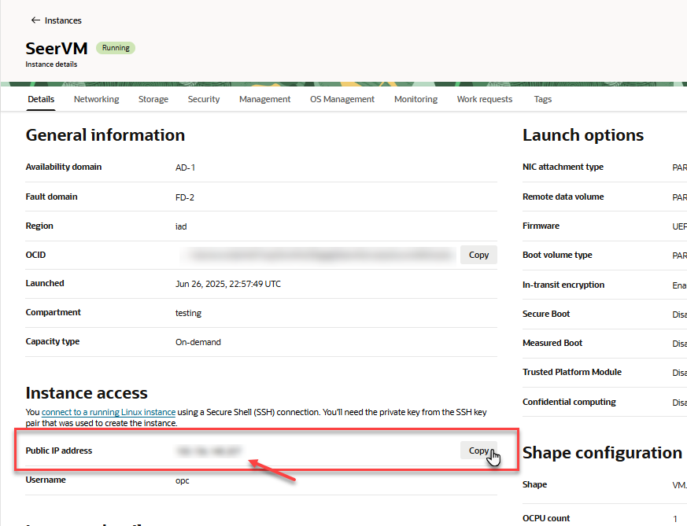
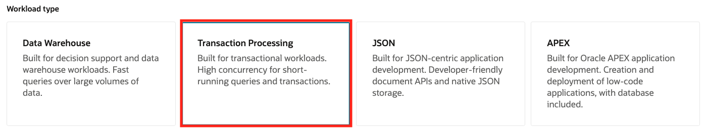
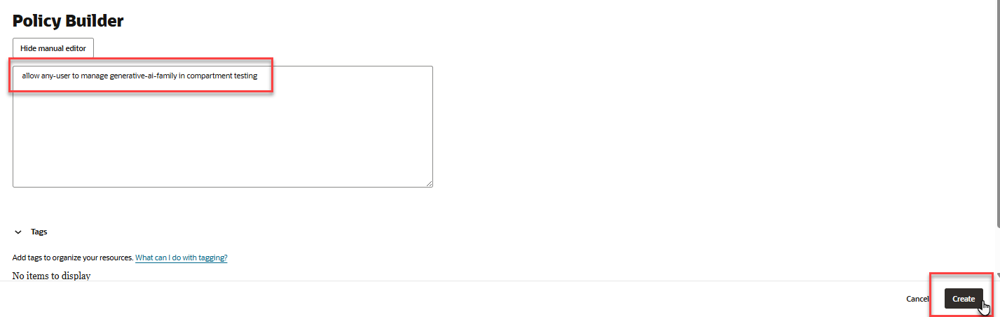
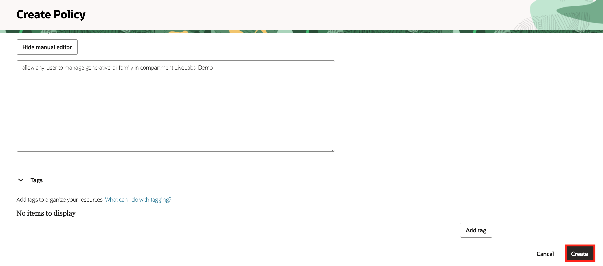
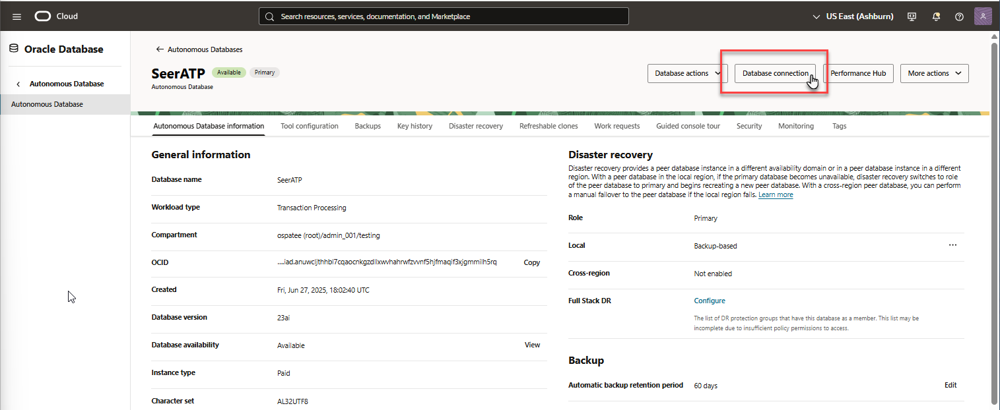
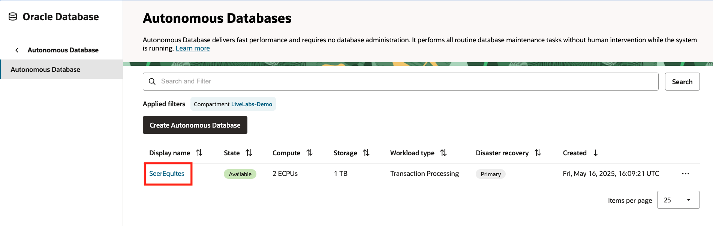

# How-to Run Application Locally

## Introduction

In this section, you will learn how to run the Seer Equities Loan Approval application locally. This guide is designed to walk you through the complete setup process—from provisioning required services to installing dependencies and launching the application on your local machine.

The document is structured to help you meet all prerequisites, configure both the Autonomous Database and the OCI Generative AI Service, and troubleshoot any issues that may arise during setup. Whether you're new to Oracle Cloud Infrastructure or simply deploying locally for development and testing, this step-by-step guide will ensure a smooth setup experience.

Estimated Time: 20 minutes

### Objectives

By the end of this section, you will be able to:

- Provision and connect to an Autonomous Database

- Set up a Python-based local development environment

- Configure access to OCI Generative AI services

- Securely store your credentials and configuration details

- Launch and interact with the application using Streamlit

>   💡Note: This guide is intended for local development and testing purposes. For production deployment, additional configuration and security hardening will be required.

Let’s get started!

## Task 1: Create a Virtual Cloud Network

Follow these steps to create a Virtual Cloud Network (VCN).

1. From the Oracle Cloud homepage, click the navigation menu in the top left corner. Select **Networking** -> **Virtual Cloud Networks**.

   

2. Select the **Create VCN** button.

   

3. Enter a name for your VCN. For example, we named ours **SeerEquites**. Next, choose the compartment where you'd like to create the VCN. 

   

4. In the IPv4 CIDR Blocks field, enter 10.0.0.0/16 and click **Add to List**.

   

5. **Use DNS Hostnames in this VCN:** Leave this option checked. 

6. You can specify a **DNS Label** for the VCN, or you can let the Console generate one for you.

   

7. Click **Create VCN**.

   

8. The VCN is available. Select your VCN name.

   

9. Click the **Subnets** tab and click **Create Subnet**.

   

10. Enter a name for your Subnet. For example, we named ours **SeerEquites**.

   

11. For **Subnet Type**, select **Regional**.

   

12. In the IPv4 CIDR Blocks field, enter 10.0.0.0/16.

13. **Subnet Access:** Select **Public Subnet**

   

14. **Use DNS Hostnames in this Subnet:** Leave this option checked. 

15. You can specify a **DNS Label** for the Subnet, or you can let the Console generate one for you.

   

16. Click **Create Subnet**.

   

17. The subnet has been created. Select your subnet.

    

18. Click the **Security** tab and click on your security list.

    

19. Now we are going to create Ingress rules to control which ports can send traffic to a specific resource within a Virtual Cloud Network. Click **Security rules** -> **Add Ingress Rules**.

    

20. In the **Source CIDR** field, enter **0.0.0.0/0**

21. In the **Destination Port Range** field, enter **22**. Click **+ Another Ingress Rule**.

    

22. For Ingress Rule 2, in the **Source CIDR** field, enter **0.0.0.0/0**

23. In the **Destination Port Range** field, enter **80**. Click **+ Another Ingress Rule**.

    

24. For Ingress Rule 3, in the **Source CIDR** field, enter **0.0.0.0/0**

25. In the **Destination Port Range** field, enter **1521**. Click **+ Another Ingress Rule**.

    

26. For Ingress Rule 4, in the **Source CIDR** field, enter **0.0.0.0/0**

27. In the **Destination Port Range** field, enter **1522**. Click **+ Another Ingress Rule**.

    

28. For Ingress Rule 5, in the **Source CIDR** field, enter **0.0.0.0/0**

29. In the **Destination Port Range** field, enter **8501**. Click **+ Another Ingress Rule**.

    

30. For Ingress Rule 6, in the **Source CIDR** field, enter **0.0.0.0/0**

31. In the **Destination Port Range** field, enter **8502**. Click **+ Another Ingress Rule**.

    

32. Click **Add Ingress Rules**.

    

## Task 2: Create a Compute Instance

1. Click the button in the top left corner to open the navigation menu. Select **Compute** -> **Instances**.

    

2. Click **Create Instance**.

    

3. Give your instance a name. 

4. Select an Availability domain.

    

5. Accept all defaults and click **Next**. 

    

6. Click **Next**.

    

7. Give your VNIC a name. Select your existing virtual cloud network. Select your existing subnet.

    

8. Continue the instance configuration:
    - **Automatically assign private IPv4 address**: Check this option.
    - **Generate a key pair for me**: Check this option.
    - Select the buttons to download your public and private keys.
    - Click **Next**.

    

9. Click **Next**.

    

10. Review the information and click **Create**. 

    

11. The instance has been provisioned. Click **Instances**. 

    

12. Copy your **Public IP**. You will need this in the next task.

    


## Task 3: Install Packages

1. Open your terminal and navigate to the folder where your ssh keys are stored.

    

2. Run the command below. Replace ssh\_key\_name with the name of your private key. Replace public\_ip with the public IP you copied earlier.

    ````
        <copy>
        ssh -i ssh_key_name opc@public_ip
        </copy>
    ````

3. Run the command below to update the VM. It will take a few minutes.

    ````
        <copy>
        sudo yum update -y
        </copy>
    ````

4. Now that the update for the VM is complete, we can install the rest of the packages. Run the commands below:

    To run the application, Python version 3.11 is required.
    ````
        <copy>
        sudo yum install python3.11
        </copy>
    ````

    ````
        <copy>
        sudo yum install python3-pip -y
        </copy>
    ````

    ````
        <copy>
        sudo yum install python3.11-pip -y
        </copy>
    ````    

    ````
        <copy>
        pip3.11 install --upgrade pip
        </copy>
    ````

5. Install Streamlit with the command below:

    ````
        <copy>
        pip install streamlit
        </copy>
    ````

6. Run the install commands below:

    ````
        <copy>
        pip install oracledb
        </copy>
    ````

    ````
        <copy>
        pip install oci
        </copy>
    ````

    ````
        <copy>
        pip install python-dotenv
        </copy>
    ````

    ````
        <copy>
        pip install PyPDF2
        </copy>
    ````

    ````
        <copy>
        pip install pandas
        </copy>
    ````

    ````
        <copy>
        pip install network
        </copy>
    ````

    ````
        <copy>
        pip install matplotlib
        </copy>
    ````

    ````
        <copy>
        pip install scipy
        </copy>
    ````

    ````
        <copy>
        pip install fpdf
        </copy>
    ````

    ````
        <copy>
        sudo dnf install java-17-openjdk-devel -y
        </copy>
    ````
## Task 4: Provision an Autonomous Database

Before you can run the application, you need to provision an **Autonomous Database** and obtain the following connection details: 

* **Username** 

* **Password** 

* **Database Connection String (DB Connection)** 

1. Click the navigation menu in the upper left to show top level navigation choices.

   

3. Click **Oracle Database** -> **Autonomous Database**.

   

4. Click **Create Autonomous Database** to start the instance creation process.

   

5. This brings up the **Create Autonomous Database** screen where you will specify the configuration of the instance. Provide basic information for the autonomous database:

   **Display Name** - Enter a memorable name for the database for display purposes. For this lab, we used **SeerEquites**.<br><br>
   **Database Name** - Use letters and numbers only, starting with a letter. Maximum length is 14 characters. (Underscores not initially supported.) For this lab, we used **SeerEquites**.<br><br>
   **Compartment** - Select a compartment for the database from the drop-down list. In the example below, **LiveLabs-Demo** was created ahead of time and chosen.<br><br>

   

6. Choose a workload type. Select the workload type for your database. For this lab, we chose **Transaction Processing** as the workload type.<br><br>

   

7. Configure the database:

   **Choose database version** - Select a database version from the available versions.<br><br>
   **Compute auto scaling** - Enable this option.

   
8. Create administrator credentials. **We will need the DB Username and Password for our .env file later. Take note of these credentials.** 

   **Password** and **Confirm Password** - Specify the password for ADMIN user of the service instance. The password must meet the following requirements:<br><br>
   1) The password must be between 12 and 30 characters long and must include at least one uppercase letter, one lowercase letter, and one numeric character.<br><br>
   2) The password cannot contain the username.<br><br>
   3) The password cannot contain the double quote (") character.<br><br>
   4) The password must be different from the last 4 passwords used.<br><br>
   5) The password must not be the same password that is set less than 24 hours ago.<br><br>
   6) Re-enter the password to confirm it. Make a note of this password.

   

9. Choose network access:

   For this lab, accept the default, **Secure access from everywhere**.<br><br>
   If you want to allow traffic only from the IP addresses and VCNs you specify where access to the database from all public IPs or VCNs is blocked, select **Secure access from allowed IPs and VCNs only**.<br><br>
   If you want to restrict access to a private endpoint within an OCI VCN, select **Private endpoint access only**.<br><br>
   If the **Require mutual TLS (mTLS) authentication** option is selected, mTLS will be required to authenticate connections to your Autonomous Database. TLS connections allows Oracle Data Provider for .NET to connect to your Autonomous Database without a wallet. See the [documentation for network options](https://docs.oracle.com/en/cloud/paas/autonomous-database/adbsa/support-tls-mtls-authentication.html#GUID-3F3F1FA4-DD7D-4211-A1D3-A74ED35C0AF5) for options to allow TLS, or to require only mutual TLS (mTLS) authentication.

   

10. Click **Create**.

    

11. Your instance will begin provisioning. In a few minutes the state will turn from Provisioning to Available. At this point, your Autonomous Transaction Processing database is ready to use! Have a look at your instance's details here including its name, database version, CPU count and storage size.

    
    Provisioning an Autonomous Database instance.

    
    Autonomous Database instance successfully provisioned.

## Task 5: Setting Up OCI Generative AI Service

1. Click **User Settings** -> **Tokens and Keys**. 

    

2. Click **Add API Key**. 

    

3. Choose **Generate API Key Pair**. Click **Download private key**. 

    

4. After downloading the private key. Click **Add**. 

    

5. Note the Fingerprint, Tenancy OCID, and User OCID from the page. Copy these values. You will need them for task 6.

    


Create a policy that will allow you to use OCI Generative AI within your previously defined compartment. **Make sure your policy uses the compartment where your Autonomous Database is deployed.** The policy will be necessary for Autonomous Database to interact with OCI Generative AI.

9. From the Console, open the Navigation menu and click **Identity & Security**. Under Identity, click **Policies**.

    

10. Click **Create policy** and paste the following into the appropriate fields:

    **Name:** PublicGenAI 

    **Description:** Public Gen AI Policy 

    **Compartment:** select your own compartment 

    

11. Click **Show Manual Editor**. 

    

12. Copy the policy below and paste it into the field.

    ````
        <copy>
        allow any-user to manage generative-ai-family in compartment [compartment_name]
        </copy>
    ````
    > Replace [compartment\_name] with the name of your compartment.

    

13. Click **Create**.

    

OCI Generative AI is a fully managed service available via API to seamlessly integrate language models into a wide range of use cases, including writing assistance, summarization, analysis, and chat. You can quickly integrate OCI Generative AI with Autonomous Database to apply AI models to your data.

## Task 6: Setting up the Local Environment

1. Now that that's done, we are going to create the virtual environment of directories. 

    ````
        <copy>
        mkdir -p ~/loan
        </copy>
    ````

2. Navigate to the loan directory:

    ````
        <copy>
        cd ~/loan
        </copy>
    ````

3. Once in the loan directory, create the next directory with the command below:

    ````
        <copy>
        mkdir -p ~/loan/streamlit/pages
        </copy>
    ````

    ````
        <copy>
        mkdir .setup/
        </copy>
    ````

4. Navigate to the .setup directory with the command below:

    ````
        <copy>
        cd .setup
        </copy>
    ````

5. Now we are going to paste our OCI API key. Run the command below:

    ````
        <copy>
        nano oci_api_key.pem
        </copy>
    ````

6. Open the key you downloaded. Copy the contents of the key and paste it into the terminal.

7. Create the Config file:

    ````
        <copy>
        nano config
        </copy>
    ````

8. Insert the variables below into the config file: 

    > 💡Note: Replace all placeholders with your actual OCI credentials and key file path you obtained in task 5.

    ````
        <copy>
        [DEFAULT] 
        user=[ocid1.user.oc1..exampleuniqueID]
        fingerprint=[xx:xx:xx:xx:xx:xx:xx:xx:xx:xx:xx:xx:xx:xx:xx:xx] 
        key_file= [key_file=~/.oci/oci_api_key.pem] 
        tenancy=[ocid1.tenancy.oc1..exampleuniqueID] 
        region= us-chicago-1  
        </copy>
    ````

    If you did not copy these values, navigate to **User Settings** -> **API keys**. Click the three dots on the right and click **View configuration file**. Copy that and paste it into the config file in the terminal. Save the file and exit.

9. Run the pwd command:

    ````
        <copy>
        pwd
        </copy>
    ```` 
10. Copy your directory

11. Open the config file:

    ````
        <copy>
        nano config
        </copy>
    ````

12. On the key_file line, delete the contents after the =. Paste in the directory you copied after the =. Add a / at the end. Save and exit the file.

13. Run the ls command:

    ````
        <copy>
        ls
        </copy>
    ````

14. Copy the name of the oci pem key.

15. Open the config file:

    ````
        <copy>
        nano config
        </copy>
    ````

16. Add the name of the oci pem key on the key_file line after the /. Save and exit the file.

17. Run the following command:

    ````
        <copy>
        cd ..
        </copy>
    ````

18. Navigate to the pages directory:

    ````
        <copy>
        cd streamlit/pages/
        </copy>
    ````

19. Create the .env file. You need to create a .env file to configure the database connection details.

    ````
        <copy>
        nano .env
        </copy>
    ````

20. Insert the variables below into the file. Replace the values with the actual values you obtained during the provisioning of the Autonomous Database. You should have captured your database username and password in task 4 of this lab. 

    ````
        <copy>
        DB_USERNAME=Your_DB_Username 

        DB_PASSWORD=Your_DB_Password 

        DB_CONNECTION_STRING=Your_DB_Connection_String

        COMPARTMENT_OCID=Your_DB_Compartment_ID

        ENDPOINT=Your_Endpoint_url 


        TENANCY_OCID=Your_Tenancy_OCID

        ADB_NAME=Your_ADB_Name

        ADB_OCID=Your_DB_OCI_ID 

        GRAPH_ENDPOINT=Your_Graph_Endpoint_url
        </copy>
    ````

21. Find your database connection string by selecting **Database Connection**.

    

22. Copy the low connection string. This is the connection string you will place into the .env file.

    

23. To locate your compartment OCID, navigate to **Identity & Security** -> **Compartments**.

    

24. Select your compartment.

    

25. Copy your compartment OCID. Place the compartment OCID into your .env file.

    

26. Paste this in as your endpoint url in the .env file:

    ````
        <copy>
        https://inference.generativeai.us-chicago-1.oci.oraclecloud.com
        </copy>
    ````

27. Now we are going to locate the tenancy OCID. Click the profile button in the top right of the console. Click **Tenancy**.

    

28. Copy the tenancy OCID. Paste it into the .env file.

    

29. Navigate back to your Autonomous Database. Click **Oracle Database** -> **Autonomous Database**.

   

30. Select your Autonomous Database.

    

31. Copy your Autonomous Database Name and OCID. Paste these variables into your .env file.

    

32. To locate your graph endpoint, click the **Tool Configuration** tab. Copy the Graph Studio Public access URL and paste it into the .env file.

    

    You should now have all of the credentials for your .env file filled in.

    

33. Save and close the .env file.

34. Run the cat command.

    ````
        <copy>
        cat .env
        </copy>
    ````

35. Copy the contents of the .env file.

36. Run the following command:

    ````
        <copy>
        cd ..
        </copy>
    ````

37. Create the .env file in the streamlit folder.

    ````
        <copy>
        nano .env
        </copy>
    ````

38. Paste the copied contents into the .env file. Save and close the file.


## Task 7: Create the Application Pages

1. Now, we are going to create the introduction page. Run the following command:

2. Run the following command:

    ````
        <copy>
        nano 1-Introduction.py
        </copy>
    ````

3. Copy the following into your 1-Introduction.py file:

    ````
        <copy>
        INSERT CONTENT
        </copy>
    ````

4. Save and close the file.

5. Navigate to the pages folder.

    ````
        <copy>
        cd pages/
        </copy>
    ````

6. Create a Virtual Environment. It is recommended to create a virtual environment to isolate the dependencies. In your terminal, run the following command to create a virtual environment: 


    ````
        <copy>
        python3.11 -m venv loan_env
        </copy>
    ````

    This will create a directory called loan_env that contains your virtual environment.

7. So now, let's enable the firewall for our ports. Run the following commands:

    ````
        <copy>
        sudo firewall-cmd --zone=public --add-port=8501/tcp --permanent
        </copy>
    ````

    ````
        <copy>
        sudo firewall-cmd --reload
        </copy>
    ````

    ````
        <copy>
        nohup streamlit run introduction.py --server.port 8501 --server.address 0.0.0.0 > streamlit.log 2>&1 &
        </copy>
    ````

8. Open the file using the command below:

    ````
        <copy>
        sudo nano /etc/systemd/system/streamlit.service
        </copy>
    ````
9. Paste the following into the file:

    ````
        <copy>
        INSERT CONTENT
        </copy>
    ````

10. Activate the virtual environment with the following command:

    ````
        <copy>
        source loan_env/bin/activate
        </copy>
    ````

11. Install everything that's needed in the virtual environment:

    ````
        <copy>
        pip install streamlit
        </copy>
    ````

    ````
        <copy>
        pip install --upgrade pip
        </copy>
    ````

    ````
        <copy>
        pip install oracledb
        </copy>
    ````

    ````
        <copy>
        pip install oci
        </copy>
    ````

    ````
        <copy>
        pip install python-dotenv
        </copy>
    ````

    ````
        <copy>
        pip install PyPDF2
        </copy>
    ````

    ````
        <copy>
        pip install pandas network matplotlib scipy fpdf
        </copy>
    ````

    ````
        <copy>
        sudo dnf install java-17-openjdk-devel -y
        </copy>
    ````

    ````
        <copy>
        sudo systemctl daemon-reload
        </copy>
    ````

    ````
        <copy>
        sudo systemctl enable streamlit
        </copy>
    ````

    ````
        <copy>
        sudo systemctl start streamlit
        </copy>
    ````

    ````
        <copy>
        sudo systemctl status streamlit
        </copy>
    ````

    Streamlit is up and running. Click Control + C on your keyboard to escape.

12. Navigate back to the Streamlit folder:

    ````
        <copy>
        cd ..
        </copy>
    ````

13. Create the db_setup.py file:

    ````
        <copy>
        nano db_setup.py
        </copy>
    ````

14. Copy the following into your db_setup.py file:

    ````
        <copy>
        INSERT CONTENT
        </copy>
    ````

15. Save and close the file.

16. Navigate to the pages folder:

    ````
        <copy>
        cd pages/
        </copy>
    ````

17. Create the 2-Dashboard.py file:

    ````
        <copy>
        nano 2-Dashboard.py
        </copy>
    ````
18. Copy the following into your 2-Dashboard.py file:

    ````
        <copy>
        INSERT CONTENT
        </copy>
    ````

17. Create the 5_Marketing_Home.py file:

    ````
        <copy>
        nano 5_Marketing_Home.py
        </copy>
    ````
18. Copy the following into your 5_Marketing_Home.py file:

    ````
        <copy>
        INSERT CONTENT
        </copy>
    ````

19. Navigate back to the Streamlit folder:

    ````
        <copy>
        cd ..
        </copy>
    ````

20. Start Streamlit:

    ````
        <copy>
        sudo systemctl start streamlit
        </copy>
    ````

21. Load the tables:

    ````
        <copy>
        python3.11 db_setup.py
        </copy>
    ````
## Task 8: Launch the Application

1. Open an incognito window in your browser. 

2. Type your IP address from Task #2, followed by :8501 into the incognito window.

## Task 3: Unzip the Code

1. Unzip the application code to a directory of your choice on your local machine: 

    
    [**Application Code**] (https://objectstorage.us-ashburn-1.oraclecloud.com/p/fiiLFGXKlmgrZKSwKQkD2Wc7mf5b8OsPUmIsw4rNUPcbBO31Za8T1NNoGAf0l4_S/n/c4u04/b/livelabsfiles/o/developer-library/pages.zip)   


2. Navigate to the folder where the code is located. 

    cd /path/to/your/unzipped/code 
     


## Troubleshooting
If you encounter any issues during the setup, here are a few common troubleshooting tips: 

* **Missing Keys or Permissions**: Double-check your .oci/config for typos and ensure the key file path is correct and readable. 

* **OCI SDK Errors**: Ensure the required OCI Python SDK is installed: 

    ````
        <copy>
        pip install oci
        </copy
    ````  

* **GenAI Access Issues**: Verify your user/group has the correct IAM policy applied. 

* **Virtual Environment Not Activating**: Ensure that you're using the correct command for your operating system. If the issue persists, try recreating the virtual environment. 

* **Dependencies Installation Issues**: Double-check the requirements.txt file to ensure it contains the correct package names. If a specific package fails, you can try installing it manually with pip install <package-name>. 

* **Database Connection Errors**: Ensure that the database credentials in the .env file are correct and that you have access to the Autonomous Database. 

## Additional Notes
* Your .oci/config and .environment files contain sensitive credentials. Do not commit them to version control. 

* Keep your oci\_api\_key.pem secure and never share it. 

* If you use multiple OCI profiles, you can add them to ~/.oci/config and reference them explicitly in your code. 

* This setup is intended for development and local testing purposes. If you're looking to deploy the application in production, additional configurations may be required. 

* Ensure that your system's Python version is compatible (3.9 or higher) and that the virtual environment is activated whenever you work on the application. 

## Conclusion
By following the steps outlined above, you should be able to set up and run the application locally. If you face any issues, refer to the troubleshooting section or contact the support team for assistance. 

You may now **proceed to the next lab**.

## Learn More

- [Generative AI Documentation](https://docs.oracle.com/en-us/iaas/Content/generative-ai/home.htm)

## Acknowledgements

- **Created By/Date** - Kamryn Vinson, Linda Foinding, Kevin Lazarz
- **Last Updated By/Date** - Kamryn Vinson, May 2025