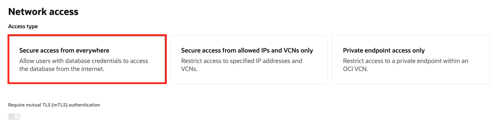
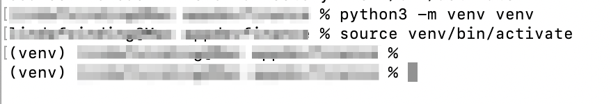
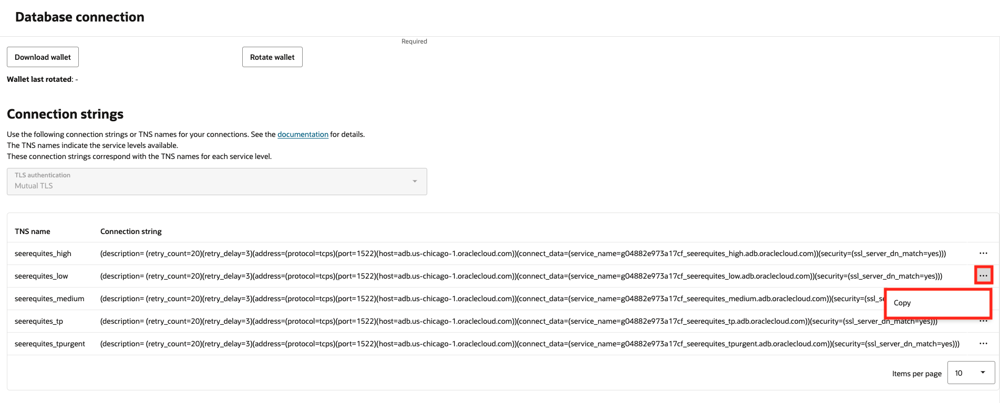
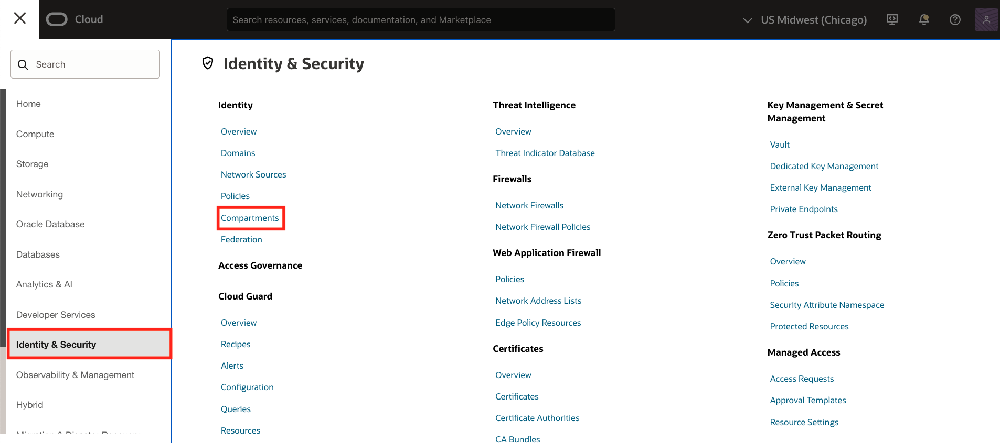
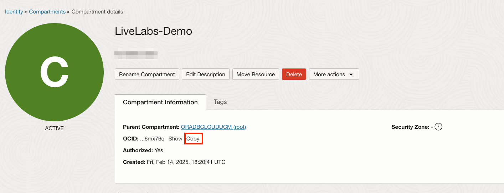
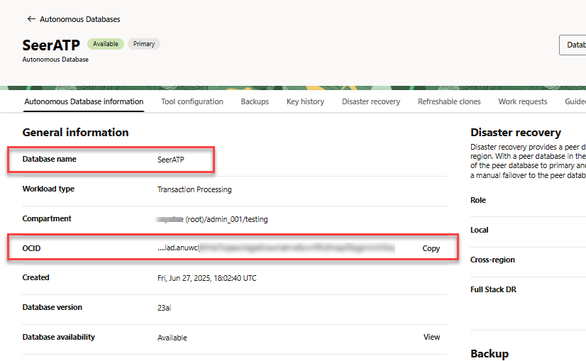
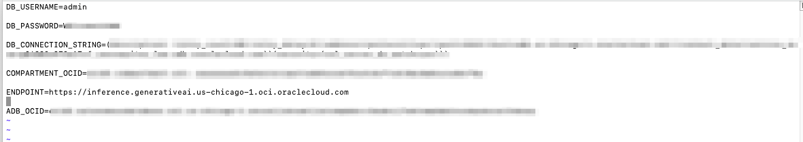
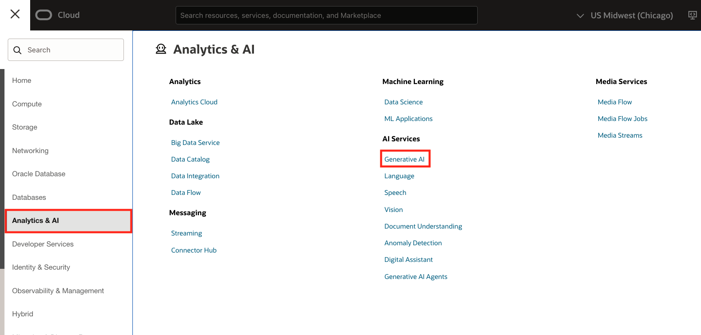

# How-to Run Application Locally

## Introduction

In this section, you will learn how to run the Seer Equities Loan Approval application locally. This guide is designed to walk you through the complete setup process—from provisioning required services to installing dependencies and launching the application on your local machine.

The document is structured to help you meet all prerequisites, configure both the Autonomous Database and the OCI Generative AI Service, and troubleshoot any issues that may arise during setup. Whether you're new to Oracle Cloud Infrastructure or simply deploying locally for development and testing, this step-by-step guide will ensure a smooth setup experience.

Estimated Time: 20 minutes

### Objectives

By the end of this section, you will be able to:

- Provision and connect to an Autonomous Database

- Set up a Python-based local development environment

- Configure access to OCI Generative AI services

- Securely store your credentials and configuration details

- Launch and interact with the application using Streamlit

>   💡Note: This guide is intended for local development and testing purposes. For production deployment, additional configuration and security hardening will be required.

Let’s get started!


## Task 1: Provision an Autonomous Database

Before you can run the application, you need to provision an **Autonomous Database** and obtain the following connection details: 

* **Username** 

* **Password** 

* **Database Connection String (DB Connection)** 

1. Click the navigation menu in the upper left to show top level navigation choices.

   

3. Click **Oracle Database** -> **Autonomous Database**.

   

4. Click **Create Autonomous Database** to start the instance creation process.

   

5. This brings up the **Create Autonomous Database** screen where you will specify the configuration of the instance. Provide basic information for the autonomous database:

   **Display Name** - Enter a memorable name for the database for display purposes. For this lab, we used **SeerEquites**.<br><br>
   **Database Name** - Use letters and numbers only, starting with a letter. Maximum length is 14 characters. (Underscores not initially supported.) For this lab, we used **SeerEquites**.<br><br>
   **Compartment** - Select a compartment for the database from the drop-down list. In the example below, **LiveLabs-Demo** was created ahead of time and chosen.<br><br>

   

6. Choose a workload type. Select the workload type for your database. For this lab, we chose **Transaction Processing** as the workload type.<br><br>

   

7. Configure the database:

   **Choose database version** - Select a database version from the available versions.<br><br>
   **Compute auto scaling** - Enable this option.

   
8. Create administrator credentials. **We will need the DB Username and Password for our .env file later. Take note of these credentials.** 

   **Password** and **Confirm Password** - Specify the password for ADMIN user of the service instance. The password must meet the following requirements:<br><br>
   1) The password must be between 12 and 30 characters long and must include at least one uppercase letter, one lowercase letter, and one numeric character.<br><br>
   2) The password cannot contain the username.<br><br>
   3) The password cannot contain the double quote (") character.<br><br>
   4) The password must be different from the last 4 passwords used.<br><br>
   5) The password must not be the same password that is set less than 24 hours ago.<br><br>
   6) Re-enter the password to confirm it. Make a note of this password.

   

9. Choose network access:

   For this lab, accept the default, **Secure access from everywhere**.<br><br>
   If you want to allow traffic only from the IP addresses and VCNs you specify where access to the database from all public IPs or VCNs is blocked, select **Secure access from allowed IPs and VCNs only**.<br><br>
   If you want to restrict access to a private endpoint within an OCI VCN, select **Private endpoint access only**.<br><br>
   If the **Require mutual TLS (mTLS) authentication** option is selected, mTLS will be required to authenticate connections to your Autonomous Database. TLS connections allows Oracle Data Provider for .NET to connect to your Autonomous Database without a wallet. See the [documentation for network options](https://docs.oracle.com/en/cloud/paas/autonomous-database/adbsa/support-tls-mtls-authentication.html#GUID-3F3F1FA4-DD7D-4211-A1D3-A74ED35C0AF5) for options to allow TLS, or to require only mutual TLS (mTLS) authentication.

   

10. Click **Create**.

    

11. Your instance will begin provisioning. In a few minutes the state will turn from Provisioning to Available. At this point, your Autonomous Transaction Processing database is ready to use! Have a look at your instance's details here including its name, database version, CPU count and storage size.

    
    Provisioning an Autonomous Database instance.

    
    Autonomous Database instance successfully provisioned.

## Task 2: Unzip the Code

1. Unzip the application code to a directory of your choice on your local machine: 

    
    [**Application Code**] (https://objectstorage.us-ashburn-1.oraclecloud.com/p/fiiLFGXKlmgrZKSwKQkD2Wc7mf5b8OsPUmIsw4rNUPcbBO31Za8T1NNoGAf0l4_S/n/c4u04/b/livelabsfiles/o/developer-library/pages.zip)   


2. Navigate to the folder where the code is located. 

    cd /path/to/your/unzipped/code 
    


## Task 3: Install Python 3.9 or Higher 

To run the application, Python version 3.9 or higher is required. Follow the steps below to ensure Python is installed on your machine. 

1. Run the following command to check which version of Python is installed.

    ````
        <copy>
        python3 --version
        </copy>
    ````
    

2. If Python 3.9+ is not installed, download and install Python 3.9 or higher from the [**official website**](https://www.python.org/downloads/).

    

## Task 4: Setting Up the Local Environment 

1. Create a Virtual Environment. It is recommended to create a virtual environment to isolate the dependencies. In your terminal, run the following command to create a virtual environment: 


    ````
        <copy>
        python3 -m venv venv
        </copy>
    ````

    This will create a directory called venv that contains your virtual environment. 


2. Enable the Virtual Environment. Once the virtual environment is created, activate it using the following commands based on your operating system: 

    On macOS/Linux: 

    ````
        <copy>
        source venv/bin/activate
        </copy>
    ```` 

    On Windows: 

    ````
        <copy>
        .\\venv\\Scripts\\activate 
        </copy>
    ```` 

    After activation, your terminal should show (venv) at the beginning of the line, indicating that the virtual environment is active. 
        

3. Install Streamlit and Dependencies. The application has a set of required dependencies that need to be installed. You can install them using the requirements.txt file. 

    Run the following commands to install all dependencies: 

    ````
        <copy>
        pip install oci 
        </copy>
    ```` 

    ````
        <copy>
        pip install streamlit 
        </copy>
    ```` 

    ````
        <copy>
        pip freeze > requirements.txt 
        </copy
    ```` 

    ````
        <copy>
        pip install -r requirements.txt
        </copy
    ```` 

    This will ensure that all required libraries are installed within your virtual environment. 

    

4. Create a .env File. You need to create a .env file in the root directory of the project to configure the database connection details. Create the .env file with the following format:
 
    ````
        <copy>
        touch .env
        </copy
    ````

5. Open the file using the command below.
    ````
        <copy>
        vi .env
        </copy
    ````

6. Insert the variables below into the file. Replace the values with the actual values you obtained during the provisioning of the Autonomous Database. You should have captured your database username and password in task 1 of this lab. 

    DB\_USERNAME=Your\_DB\_Username 

    DB\_PASSWORD=Your\_DB\_Password 

    DB\_CONNECTION\_STRING=Your\_DB\_Connection\_String

    COMPARTMENT\_OCID=Your\_DB\_Compartment\_ID

    ENDPOINT=Your\_endpoint\_url 

    ADB\_OCID=Your\_DB\_OCI\_ID 

7. Find your database connection string by selecting **Database Connection**.

    

8. Copy the low connection string. This is the connection string you will place into the .env file.

    

9. To locate your compartment OCID, navigate to **Identity & Security** -> **Compartments**.

    

10. Select your compartment.

    

11. Copy your compartment OCID. Place the compartment OCID into your .env file.

    

12. Paste this in as your endpoint url in the .env file:

    ````
        <copy>
        https://inference.generativeai.us-chicago-1.oci.oraclecloud.com
        </copy
    ````
13. Navigate back to your Autonomous Database to copy your ADB OCID. Click **Oracle Database** -> **Autonomous Database**.

   

14. Select your Autonomous Database.

    

15. Copy your Autonomous Database OCID. Paste it into your .env file.

    

    You should now have all of the credentials for your .env file filled in.

    

## Task 5: Setting Up OCI Generative AI Service

1. Click **User Settings** -> **Tokens and Keys**. 

    

2. Click **Add API Key**. 

    

3. Choose **Generate API Key Pair**. Click **Download private key**. 

    

4. After downloading the private key. Click **Add**. 

    

5. Note the Fingerprint, Tenancy OCID, and User OCID from the page. 

    

6. Navigate back to your terminal and paste the following command in to create a config directory. 

    ````
        <copy>
        mkdir -p ~/.oci
        </copy
    ```` 

7.  Create or edit the config file at ~/.oci/config with the following command: 

    ````
        <copy>
        touch config
        </copy
    ````

8.  Open the config file.

    ````
        <copy>
        vi config
        </copy
    ```` 

9. Insert the variables below: 

    > 💡Note: Replace all placeholders with your actual OCI credentials and key file path except region, which must be us-chicago.

    ````
        <copy>
        [DEFAULT] 
        user=[ocid1.user.oc1..exampleuniqueID]
        fingerprint=[xx:xx:xx:xx:xx:xx:xx:xx:xx:xx:xx:xx:xx:xx:xx:xx] 
        key_file= [key_file=~/.oci/oci_api_key.pem] 
        tenancy=[ocid1.tenancy.oc1..exampleuniqueID] 
        region= us-chicago-1  
        </copy
    ````

Create a policy that will allow you to use OCI Generative AI within your previously defined compartment. **Make sure your policy uses the compartment where your Autonomous Database is deployed.** The policy will be necessary for Autonomous Database to interact with OCI Generative AI.

10. From the Console, open the Navigation menu and click **Identity & Security**. Under Identity, click **Policies**.

    

11. Click **Create policy** and paste the following into the appropriate fields:

    **Name:** PublicGenAI 

    **Description:** Public Gen AI Policy 

    **Compartment:** select your own compartment 

    

12. Click **Show Manual Editor**. 

    

12. Copy the policy below and paste it into the field.

    ````
        <copy>
        allow any-user to manage generative-ai-family in compartment [compartment_name]
        </copy
    ````
    > Replace [compartment\_name] with the name of your compartment.

    

14. Click **Create**.

    

OCI Generative AI is a fully managed service available via API to seamlessly integrate language models into a wide range of use cases, including writing assistance, summarization, analysis, and chat. You can quickly integrate OCI Generative AI with Autonomous Database to apply AI models to your data.

15. Make sure you are in the US Midwest(Chicago) region:

    

16. From the Console, open the Navigation menu and click **Analytics & AI**. Click **Generative AI**.

    

## Task 6: Run the Application

1. Now that everything is set up, you can start the application by running the following command: 

    ````
        <copy>
        streamlit run 1-introduction.py
        </copy
    ````

    This will start the application locally, using both your Autonomous Database and OCI GenAI services. 


## Troubleshooting
If you encounter any issues during the setup, here are a few common troubleshooting tips: 

* **Missing Keys or Permissions**: Double-check your .oci/config for typos and ensure the key file path is correct and readable. 

* **OCI SDK Errors**: Ensure the required OCI Python SDK is installed: 

    ````
        <copy>
        pip install oci
        </copy
    ````  

* **GenAI Access Issues**: Verify your user/group has the correct IAM policy applied. 

* **Virtual Environment Not Activating**: Ensure that you're using the correct command for your operating system. If the issue persists, try recreating the virtual environment. 

* **Dependencies Installation Issues**: Double-check the requirements.txt file to ensure it contains the correct package names. If a specific package fails, you can try installing it manually with pip install <package-name>. 

* **Database Connection Errors**: Ensure that the database credentials in the .env file are correct and that you have access to the Autonomous Database. 

## Additional Notes
* Your .oci/config and .environment files contain sensitive credentials. Do not commit them to version control. 

* Keep your oci\_api\_key.pem secure and never share it. 

* If you use multiple OCI profiles, you can add them to ~/.oci/config and reference them explicitly in your code. 

* This setup is intended for development and local testing purposes. If you're looking to deploy the application in production, additional configurations may be required. 

* Ensure that your system's Python version is compatible (3.9 or higher) and that the virtual environment is activated whenever you work on the application. 

## Conclusion
By following the steps outlined above, you should be able to set up and run the application locally. If you face any issues, refer to the troubleshooting section or contact the support team for assistance. 

You may now **proceed to the next lab**.

## Acknowledgements

- **Created By/Date** - Linda Foinding, Kevin Lazarz
- **Contributor** - Kamryn Vinson
- **Last Updated By/Date** - Kamryn Vinson, May 2025