# How-to Install and Run the Application on OCI

## Introduction

This lab will show you how to setup and run the Seer Equities Loan Approval application on OCI. This guide is designed to walk you through the complete setup process, which includes provisioning required services and installing dependencies enabling you to launch and run the application on OCI.

The document is structured to help you meet all prerequisites, configure both the Autonomous Database and the OCI Generative AI Service, and troubleshoot any issues that may arise during setup. Whether you're new to Oracle Cloud Infrastructure or simply deploying for development and testing, this step-by-step guide will ensure a smooth setup experience.

Estimated Time: 60 minutes

### Objectives

By the end of this section, you will be able to:

- Provision and connect to an OCI VM and an Oracle Autonomous Database.

- Set up a Python-based local development environment.

- Configure access to OCI Generative AI services.

- Securely store your credentials and configuration details.

- Launch and interact with the application using Streamlit.

>   💡Note: This guide is intended for development and testing purposes. For production deployment, additional configuration and security hardening will be required.

Let’s get started!

## Task 1: Create a virtual cloud network and a compute instance

1. Click the Navigation menu in the top left and select **Compute** then **Instances**.

    

2. Verify that the filter reflects the correct compartment and click **Create Instance**.

    

3. Name the instance **SeerVM**, verify you're in the correct compartment, and accept all the defaults. Click the **Next** button.

    > **Note**: While all operating systems are supported, we recommend using Oracle Linux 9 as the operating system. The application runs on any available shape, including shapes available in the OCI Always Free tier.

    

4. On the Security screen, click **Next**.

5. In the **Networking** section name the VNIC - *SeerVNIC*. Check the radio button to **Create new virtual cloud network**. Verify that the radio button for **Create new public subnet** is checked.

    

    In the **Add SSH Keys** section, you can generate a new SSH key pair or use your favorite existing keys.

6. To generate a new key pair, click the radio button next to **Generate a key pair for me**. Then click the **Download private key** button to save the file to your local downloads directory. Click the button to **Download public key** to your local computer so you have both keys for safe-keeping.

    

    In a future task you'll need the SSH keys to gain access to the compute instance where you'll configure and run the software for this lab. Feel free to move the SSH keys to the .ssh directory of your terminal application. This will vary depending on which terminal emulator you're using on your system.

7. You can also utilize an existing key pair if you already have one. Choose the radio button for **Upload public key file (.pub)** and drop the file on the box or click it to locate the file and upload it to the VM.

    

8. Alternately, you can paste the contents of an existing public key. Locate the key you want to use and open it up in an editor. Copy and paste the contents of the key into the field

    

9. Once you've completed the SSH Key section, click the **Next** button to continue.

10. On the Boot Volume section, accept the defaults and choose **Next**.

11. Review the VM configuration information. Look in the Networking section and verify that **Public IPv4 address** = **Yes**. Click the **Create** button.

    
    
12. The instance will begin provisioning and in a few moments the state will change to **Succeeded** and then to **Running**.

   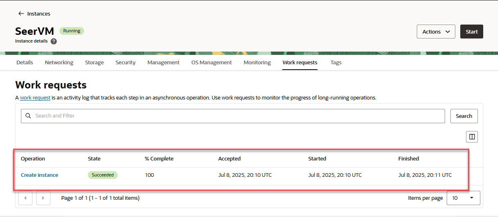

In the next step, you'll add 5 ingress rules to allow traffic on specific ports within your VCN.

13. Click on the **Navigation Menu** and select **Networking** then **Virtual Cloud Networks**.

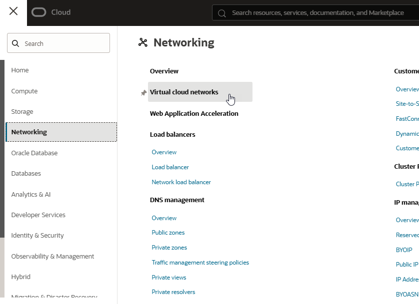

14. Click the VCN link that was created along with your compute instance.

15. Click the **Security** tab, then click on the **Default Security List for vcn-xxxxx**.

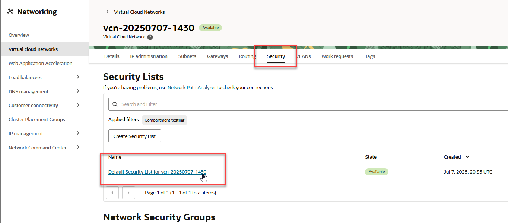

16. Click the **Security Rules** tab, then click the **Add Ingress Rules** under the Ingress Rules section. Note that port 22 is already enabled for SSH communication.

    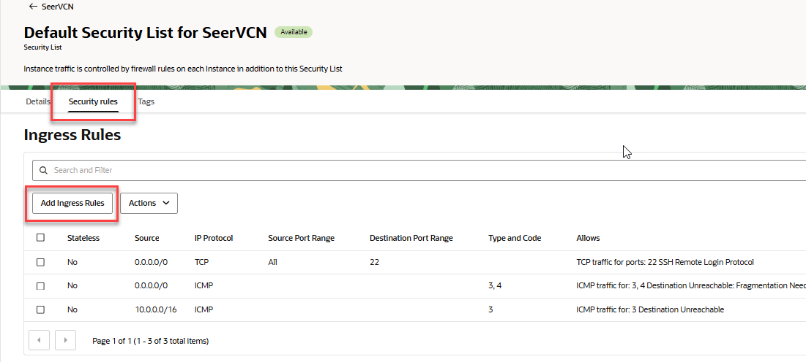

17. For each rule, add 0.0.0.0/0 as the **Source CIDR** and add the specific port below to the **Destination Port Range** field. Click **+ Another Ingress Rule** after each entry.

Add 5 rules using the below information. 

| Ingress Rule #  | Source CIDR | Port # |
| ------------- | ------------- | ------------ |
| 1  | 0.0.0.0/0  | 80    |
| 2  | 0.0.0.0/0  | 1521    |
| 3  | 0.0.0.0/0  | 1522    |
| 4  | 0.0.0.0/0  | 8501    |
| 5  | 0.0.0.0/0  | 8502    |
    {: title="Ingress rules"}


When you've added all 5 ingress rules, click the **Add Ingress Rules** button at the bottom right of the page.

 

Your default security list should look like the below screenshot.

 

## Task 2: Access and update the VM

1. Click on the **Navigation Menu** select **Compute** then **Instances**

    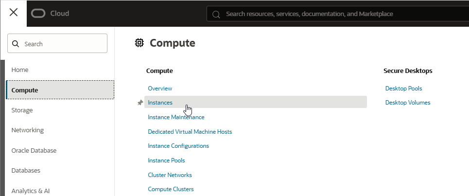

2. Click on the link to the SeerVM instance you created earlier.

3. Locate the **Public IP address** in the Instance access section copy the **Public IP**.

    

4. Type or copy/paste the following command into your terminal. Replace ssh\_key\_name with the name of your private key. Replace public\_ip with the public IP you just copied from your VM. The '-i' switch allows you to specify the location where your SSH keys are stored.

    ````
        <copy>
        ssh -i ~/.ssh/ssh_key_name opc@public_ip
        </copy>
    ````

    


6. Run the command below to update the VM. It will take a few minutes.

    ````
        <copy>
        sudo yum update -y
        </copy>
    ````

    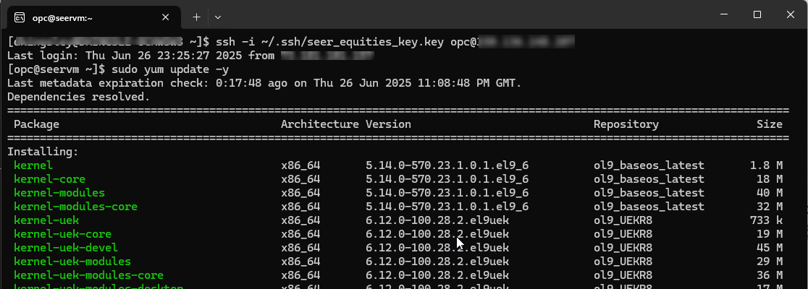

7. Once the VM has been updated install python3.11, pip, and the oci cli application. Run the commands below:

    ````
        <copy>
        sudo yum install python3.11 -y
        </copy>
    ````

    ````
        <copy>
        sudo yum install python3-pip -y
        </copy>
    ````

    ````
        <copy>
        sudo yum install python3.11-pip -y
        </copy>
    ````

    ````
        <copy>
        pip install --upgrade pip
        </copy>
    ````

    ```
        <copy>
        sudo dnf install python39-oci-cli -y
        </copy>

<!-- Commenting out as these aren't needed.They're duplicates of what's being installed in the virtual environment later

5. Install Streamlit with the command below:

    ````
        <copy>
        pip install streamlit
        </copy>
    ````

6. Run the install commands below:

    ````
        <copy>
        pip install oracledb
        </copy>
    ````

    ````
        <copy>
        pip install oci
        </copy>
    ````

    ````
        <copy>
        pip install python-dotenv
        </copy>
    ````

    ````
        <copy>
        pip install PyPDF2
        </copy>
    ````

    ````
        <copy>
        pip install pandas network matplotlib
        </copy>
    ````

    ````
        <copy>
        pip install scipy fpdf
        </copy>
    ````

    ````
        <copy>
        sudo dnf install java-17-openjdk-devel -y
        </copy>
    ````
-->


## Task 3: Provision an Autonomous Database

The application is built for Autonomous Database. Follow the steps to provision an Oracle Autonomous Transaction Database.

1. Click the navigation menu in the upper left of the OCI console, choose **Oracle Database** then **Autonomous Database**.

   

2. Verify that the filter option reflects the correct compartment and click the **Create Autonomous Database** button.

   

3. Use the information in the table below to fill out the **Create Autonomous Database Serverless** form. Proceed to the next step for instructions on setting up **Network Access**.

    | Field Name | Input |
    | ------------- | ------------ |
    | Display Name  | SeerATP   |
    | Database Name | SeerATP    |
    | Compartment | Verify correct compartment    |
    | Workload Type | ATP    |
    | Database Version | 23ai |
    | ECPU Count | 2   |
    | Password | Password1234!    |
    {: title="ADB configuration details overview"}

   

1. In the **Network access** section, choose **Secure access from allowed IPs and VCNs only**. In the **IP notation type** drop-down, choose **CIDR block**. For values, enter **0.0.0.0/0**. Verify that **Require mutual TLS (mTLS) authentication** is disabled. Click the **Create** button.

   

2. The ATP Database will enter the provisioning state.

    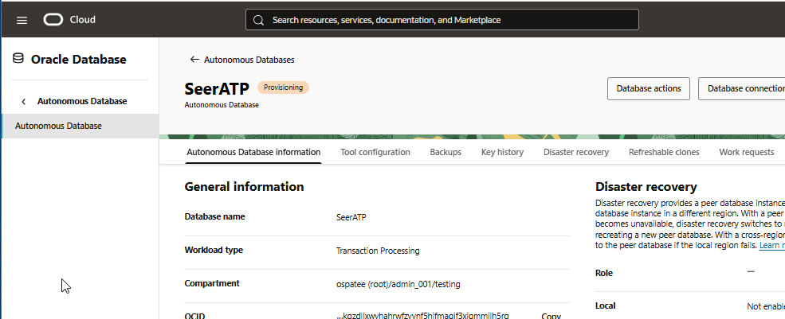

3. Once the state changes to **Available**, the Autonomous Transaction Processing database is ready to use!

    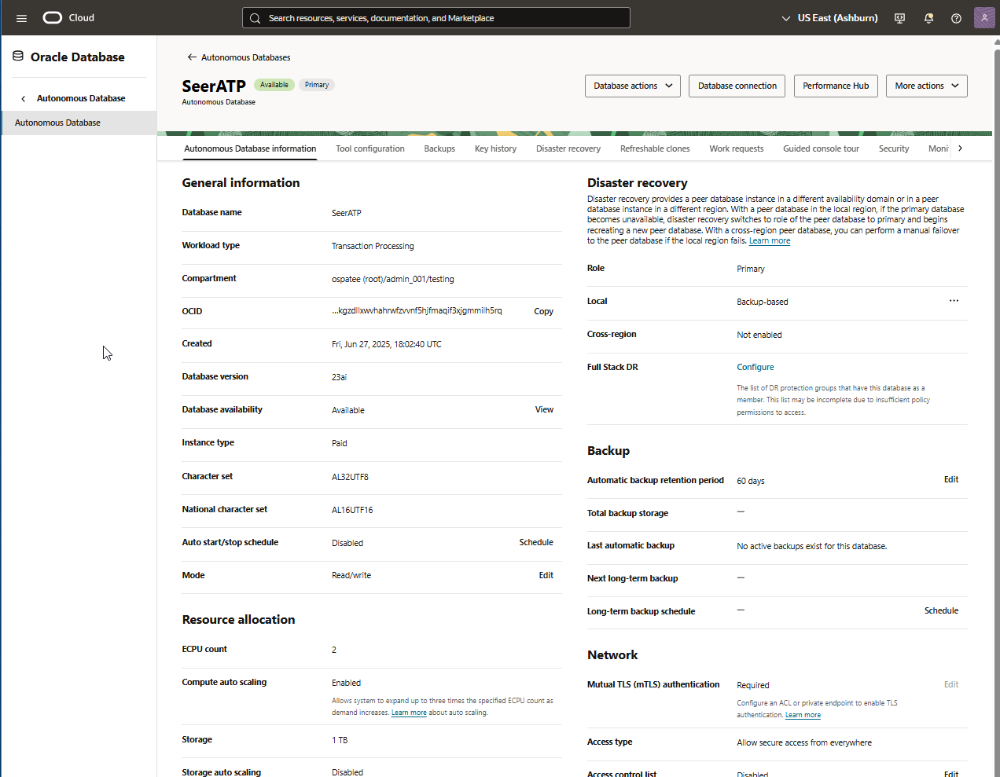

## Task 5: Setting up the Local Environment

The application environment has been created and zipped up for you in a downloadable package.

1. Return to the terminal connected to the VM. From the /home/opc directory, enter the following command in your terminal to download the application package to your virtual machine.

```
    <copy>
    wget https://c4u04.objectstorage.us-ashburn-1.oci.customer-oci.com/p/EcTjWk2IuZPZeNnD_fYMcgUhdNDIDA6rt9gaFj_WZMiL7VvxPBNMY60837hu5hga/n/c4u04/b/livelabsfiles/o/database/ai-app-build-local.zip
    </copy>
```

2. Unzip the file.

```
    <copy>
    unzip ai-app-build-local.zip
    </copy>
```

Next we're going to generate an oci configuration file that will contain user credentials and other settings needed for interacting with Oracle Cloud. In order to prepare for this step you'll need to gather the user OCID, the tenancy OCID, and the tenancy region and store these in a text file.

3. Find the user OCID:  Click the profile icon in the upper right corner of the OCI console and choose **User settings**.

    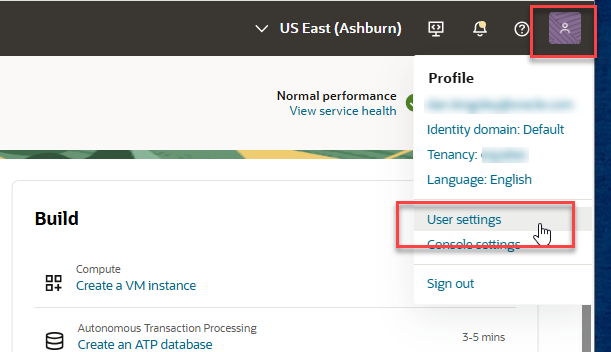

4. In the My profile screen, locate the **OCID** field and click **Copy** to the right of the OCID field. Store this information in a text file.

    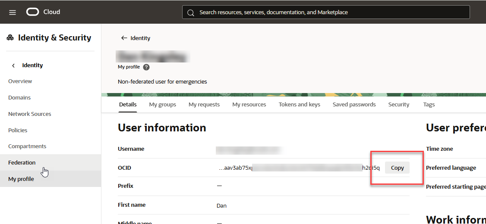
 
5. Tenancy OCID: Click the profile icon in the upper right corner of the OCI console and choose **Tenancy:*your tenancy name***

   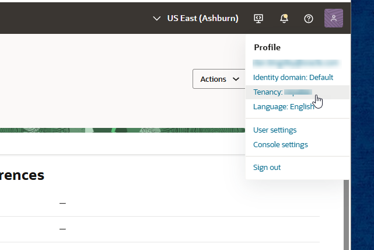

6. Locate the tenancy OCID and click the **Copy** button to copy the OCID. Paste it into your text file.

   

7. Identify the home region of your tenancy located on the top bar of the console toward the right. Note that information in your text file.

   

8. With the above information handy, run the following command in the terminal.

```
    <copy>
    oci setup config
    </copy>
```
9. Hit return to accept the default config file location of /home/opc/.oci/config

10. Enter your user OCID, tenancy OCID, and select your region from the list by using the corresponding number.

11. When asked if you want to generate a new API key, answer 'Y' for yes.

12. Press **Enter** to accept the default creation directory of /home/opc/.oci

13. Press **Enter** to accept the default name of *oci_api_key*.

14. Enter *N/A* twice to eliminate the need for a passphrase. (Your output won't show up in the terminal screen.)

Next you'll create an environment file for the application.

15. Create the .env file that will hold connection information for your application.

````
    <copy>
    touch .env
    </copy>
````

16. Use your favorite editor to open and edit the file.

    ````
        <copy>
        nano .env
        </copy>
    ````

17. The following information needs to be collected and inserted into the .env file. Copy the 9 lines below and paste them in the .env file. Follow the steps below to gather the required information and place it in the file.

    ```
    <copy>
    USERNAME=""
    DBPASSWORD=""
    DBCONNECTION=""
    ADB_NAME=""
    ADB_OCID=""
    GRAPH_ENDPOINT=""
    COMPARTMENT_OCID=""
    TENANCY_OCID=""
    ENDPOINT=https://inference.generativeai.us-chicago-1.oci.oraclecloud.com
    </copy>
    ```

18. The database username should be 'admin'. Use the password that you assigned to the admin user. (Password1234!). Make sure all the information you enter into the file stays between the quotes.

19. Find your database connection string by selecting navigating to **Oracle Database**, choose **Autonomous Database**, then choose the ATP you created earlier in the lab, **SeerATP**. At the top of the screen, click the button labeled **Database Connection**.

    

20. Locate the connection labeled *seeratp_low*. Click the ellipsis at the far right and choose *Copy*. Paste the result into your configuration file. **Note:** Make sure to enclose the connection string in single quotes.  Click **Cancel** to close the screen when you're done.

    

21. Copy your Autonomous Database Name and OCID and paste them into your .env file.

    

22. While still in the ATP details screen, click the **Tool Configuration** tab. Copy the Graph Studio Public access URL and paste it into the .env file.

    

23. To find the compartment OCID, navigate to **Identity & Security**, select **Compartments**, then click on the link of the compartment you're using for this lab.

24. Locate the compartment OCID and click the *Copy* link. Paste the compartment OCID into your .env file.

    

25. Locate the tenancy OCID. From the OCI Console home screen, click the tenancy name link under the **Home** title.

    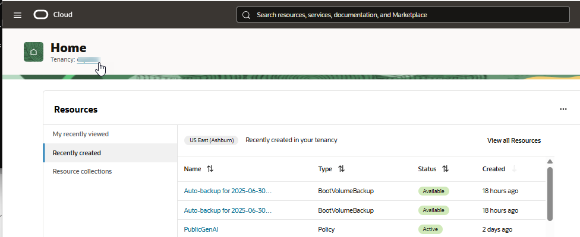

26. Copy the tenancy OCID and paste it into the .env file.

    

27. Copy the below url and paste it into your file as the endpoint.

    ````
        <copy>
        https://inference.generativeai.us-chicago-1.oci.oraclecloud.com
        </copy>
    ````

28. Your .env file should look similar to the screenshot below. (*Don't forget the sinqle quotes around the connection string!*)

    

29. Save and close the .env file.

## Task 4: Create the application environment

1. Create a Virtual Environment. It is recommended to create a virtual environment to isolate application dependencies. In your terminal, run the following command to create a virtual environment.

    ````
        <copy>
        python3.11 -m venv loan_env
        </copy>
    ````

    This will create a directory called loan_env that will contain your virtual environment.

2. Enable the firewall for the application port. Run the following commands:

    ````
        <copy>
        sudo firewall-cmd --zone=public --add-port=8501/tcp --permanent
        </copy>
    ````

    ````
        <copy>
        sudo firewall-cmd --reload
        </copy>
    ````

    ````
        <copy>
        nohup streamlit run 1-Introduction.py --server.port 8501 --server.address 0.0.0.0 > streamlit.log 2>&1 &
        </copy>
    ````

    

3. Create the streamlit.service file to allow management of the streamlit app like any other service.

    ````
        <copy>
        sudo nano /etc/systemd/system/streamlit.service
        </copy>
    ````


4. Copy and paste the following information into the file. Verify the user is 'opc' and the port is set to 8501.

    ````
        <copy>
        [Unit]
        Description=Streamlit Loan Approval App
        After=network.target

        [Service]
        User=opc
        WorkingDirectory=/home/opc
        ExecStart=/bin/bash -c 'source /home/opc/loan_env/bin/activate && streamlit run 1-Introduction.py --server.port 8501 --server.address 0.0.0.0'
        Restart=always

        [Install]
        WantedBy=multi-user.target
        </copy>
    ````


<!--  Commenting out for directory location changes that I'm not sure will work.

8. Paste the following information into the file. Verify the user is 'opc', the working directory is where you installed streamlit and the port is set to 8501.

    ````
        <copy>
        [Unit]
        Description=Streamlit Loan Approval App
        After=network.target

        [Service]
        User=opc
        WorkingDirectory=/home/opc/loan/streamlit/
        ExecStart=/bin/bash -c 'source /home/opc/loan/streamlit/pages/loan_env/bin/activate && streamlit run 1-Introduction.py --server.port 8501 --server.address 0.0.0.0'
        Restart=always

        [Install]
        WantedBy=multi-user.target
        </copy>
    ````

    

    -->

5. Activate the virtual environment. Enter the following command.

    ````
        <copy>
        source loan_env/bin/activate
        </copy>
    ````

6. Run the following command to upgrade pip.

    ````
        <copy>
        pip install --upgrade pip
        </copy>
    ````

<!-- Need to add the correct applications to requirements.txt

streamlit
oracledb
oci
python-dotenv
PyPDF2
pandas
network
matplotlib
scipy
fpdf

-->

7. Install the required applications from the supplied requirements.txt file.

    ```
        <copy>
        pip install -r requirements.txt
        </copy>
    ```

8. Install java.

    ````
        <copy>
        sudo dnf install java-17-openjdk-devel -y
        </copy>
    ````

9. Install sqlcl

    ````
        <copy>
        sudo yum install sqlcl -y
        </copy>
    ````
10. Reload the daemons and enable streamlit

    ````
        <copy>
        sudo systemctl daemon-reload
        </copy>
    ````

    ````
        <copy>
        sudo systemctl enable streamlit
        </copy>
    ````

    ````
        <copy>
        sudo systemctl start streamlit
        </copy>
    ````

    ````
        <copy>
        sudo systemctl status streamlit
        </copy>
    ````

Streamlit is up and running. Press Control + C on your keyboard to escape.


## Task 5: Launch the Application

1. Navigate to the *dbinit* subdirectory.

    ````
        <copy>
        cd ~/dbinit
        </copy>
    ````

2. Change the permissions on the shell_script.sh file to executable.

    ```
        <copy>
        chmod +x shell_script.sh
        </copy>
    ```

3. Run shell script file to populate the database and configure the application. Run the following command.

    ````
        <copy>
        ./shell_script.sh
        </copy>
    ````

4. Open a web browser.

5. Type in the IP address of the VM followed by :8501 into the incognito window.. You can obtain it from the OCI Console - VM details screen.

6. Success! You should see the application start screen.

    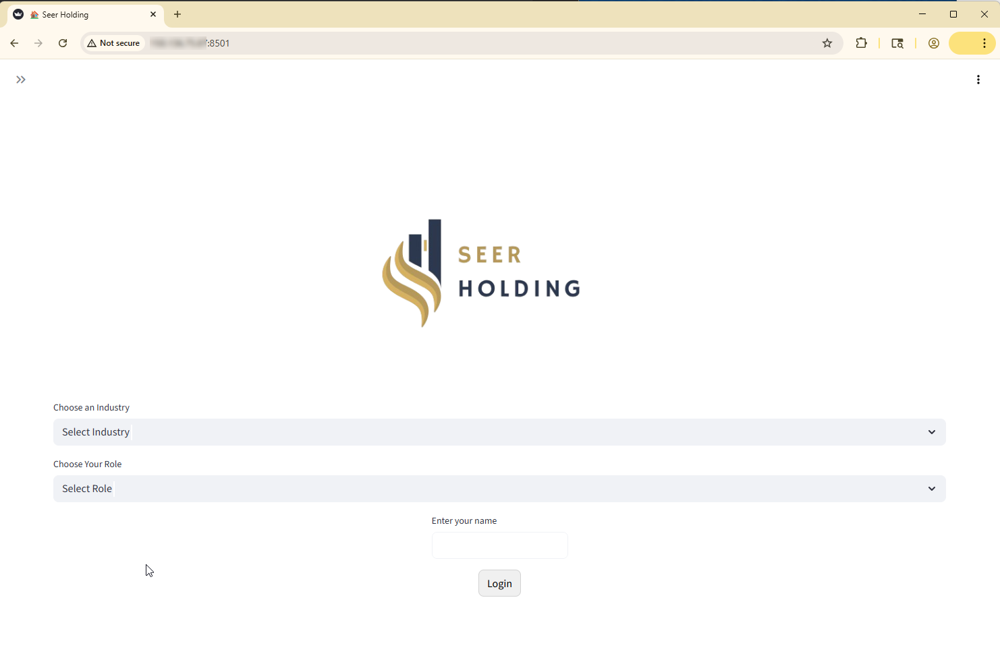

Congratulations, you have built and configured the Loan Management application using Oracle Cloud Insfrastructure, Oracle Autonomous Database, and Oracle GenAI!


## Troubleshooting
If you encounter any issues during the setup, here are a few common troubleshooting tips:

* **Missing Keys or Permissions**: Double-check your .oci/config for typos and ensure the key file path is correct and readable. 

* **OCI SDK Errors**: Ensure the required OCI Python SDK is installed:

    ````
        <copy>
        pip install oci
        </copy
    ````

* **GenAI Access Issues**: Verify your user/group has the correct IAM policy applied.

* **Virtual Environment Not Activating**: Ensure that you're using the correct command for your operating system. If the issue persists, try recreating the virtual environment.

* **Dependencies Installation Issues**: Double-check the requirements.txt file to ensure it contains the correct package names. If a specific package fails, you can try installing it manually with pip install <package-name>.

* **Database Connection Errors**: Ensure that the database credentials in the .env file are correct and that you have access to the Autonomous Database. 

## Additional Notes

* Your .oci/config and .environment files contain sensitive credentials. Do not commit them to version control.

* Keep your oci\_api\_key.pem secure and never share it.

* If you use multiple OCI profiles, you can add them to ~/.oci/config and reference them explicitly in your code.

* This setup is intended for development and local testing purposes. If you're looking to deploy the application in production, additional configuration and security hardening may be required.

* Ensure that your system's Python version is compatible (3.9 or higher) and that the virtual environment is activated whenever you work on the application.

## Conclusion

By following the steps outlined above, you should be able to set up and run the application locally. If you face any issues, refer to the troubleshooting section or contact the support team for assistance.

You may now **proceed to the next lab**.

## Learn More

- [Generative AI Documentation](https://docs.oracle.com/en-us/iaas/Content/generative-ai/home.htm)

## Acknowledgements

- **Created By/Date** - Kamryn Vinson, Linda Foinding, Kevin Lazarz
- **Last Updated By/Date** - Dan Kingsley, July 2025