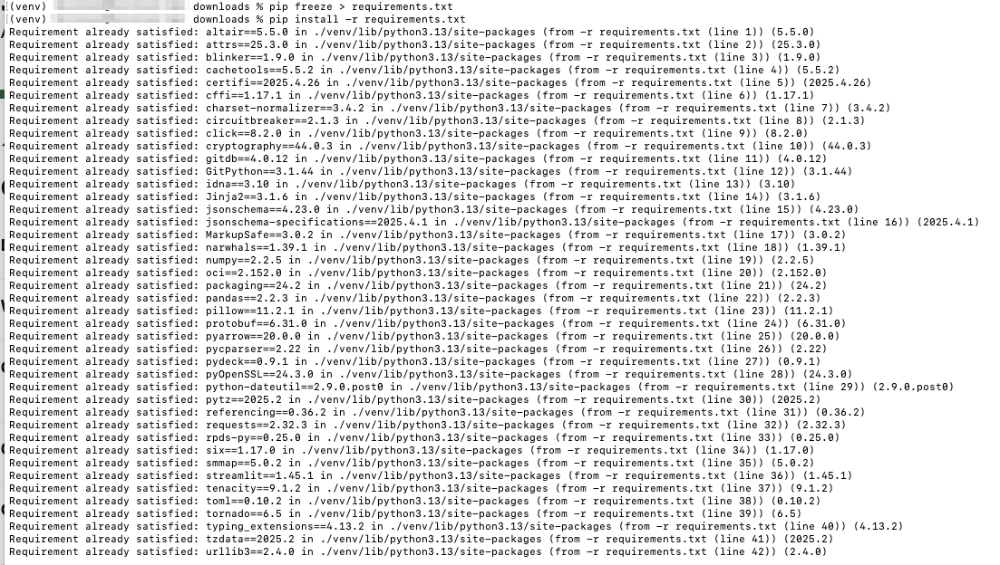

# How-to Run Application Locally

## Introduction

In this section, you will learn how to run the Seer Equities Loan Approval application locally. This guide is designed to walk you through the complete setup process—from provisioning required services to installing dependencies and launching the application on your local machine.

The document is structured to help you meet all prerequisites, configure both the Autonomous Database and the OCI Generative AI Service, and troubleshoot any issues that may arise during setup. Whether you're new to Oracle Cloud Infrastructure or simply deploying locally for development and testing, this step-by-step guide will ensure a smooth setup experience.

Estimated Time: 20 minutes

### Objectives

By the end of this section, you will be able to:

- Provision and connect to an Autonomous Database

- Set up a Python-based local development environment

- Configure access to OCI Generative AI services

- Securely store your credentials and configuration details

- Launch and interact with the application using Streamlit

>   💡Note: This guide is intended for local development and testing purposes. For production deployment, additional configuration and security hardening will be required.

Let’s get started!


## Task 1: Provision an Autonomous Database

Before you can run the application, you need to provision an **Autonomous Database** and obtain the following connection details: 

* **Username** 

* **Password** 

* **Database Connection String (DB Connection)** 

1. 


Ensure you have the necessary credentials and access to the database before proceeding. 

## Task 2: Unzip the Code

1. Unzip the application code to a directory of your choice on your local machine: 

    
    [**Application Code**] (https://objectstorage.us-ashburn-1.oraclecloud.com/p/fiiLFGXKlmgrZKSwKQkD2Wc7mf5b8OsPUmIsw4rNUPcbBO31Za8T1NNoGAf0l4_S/n/c4u04/b/livelabsfiles/o/developer-library/pages.zip)   


2. Navigate to the folder where the code is located. 

    cd /path/to/your/unzipped/code 
    


## Task 3: Install Python 3.9 or Higher 

To run the application, Python version 3.9 or higher is required. Follow the steps below to ensure Python is installed on your machine. 

1. Run the following command to check which version of Python is installed.

    ````
        <copy>
        python3 --version
        </copy>
    ````
    

2. If Python 3.9+ is not installed, download and install Python 3.9 or higher from the [**official website**](https://www.python.org/downloads/).

    

## Task 4: Setting Up the Local Environment 

1. Create a Virtual Environment. It is recommended to create a virtual environment to isolate the dependencies. In your terminal, run the following command to create a virtual environment: 


    ````
        <copy>
        python3 -m venv venv
        </copy>
    ````

    This will create a directory called venv that contains your virtual environment. 


2. Enable the Virtual Environment. Once the virtual environment is created, activate it using the following commands based on your operating system: 

    On macOS/Linux: 

    ````
        <copy>
        source venv/bin/activate
        </copy>
    ```` 

    On Windows: 

    ````
        <copy>
        .\\venv\\Scripts\\activate 
        </copy>
    ```` 

    After activation, your terminal should show (venv) at the beginning of the line, indicating that the virtual environment is active. 
        

3. Install Streamlit and Dependencies. The application has a set of required dependencies that need to be installed. You can install them using the requirements.txt file. 

    Run the following commands to install all dependencies: 

    ````
        <copy>
        pip install oci 
        </copy>
    ```` 

    ````
        <copy>
        pip install streamlit 
        </copy>
    ```` 

    ````
        <copy>
        pip freeze > requirements.txt 
        </copy
    ```` 

    ````
        <copy>
        pip install -r requirements.txt
        </copy
    ```` 

    This will ensure that all required libraries are installed within your virtual environment. 

    

4. Create a .env File. You need to create a .env file in the root directory of the project to configure the database connection details. Create the .env file with the following format:
 
    ````
        <copy>
        touch .env
        </copy
    ````

5. Insert the variables below into the file: 

    DB\_USERNAME=<Your_DB_Username> 

    DB\_PASSWORD=<Your_DB_Password> 

    DB\_CONNECTION\_STRING=<Your_DB_Connection_String> 

    COMPARTMENT\_OCID=<Your_DB_Compartment_ID> 

    ENDPOINT=<Your-endpoint_url> 

    ADB\_OCID=<Your_DB_OCI_ID> 


    Replace <Your_DB_Username>, <Your_DB_Password>, and <Your_DB_Connection_String> with the actual values you obtained during the provisioning of the Autonomous Database. 


## Task 5: Setting Up OCI Generative AI Service

To enable the application to interact with OCI Generative AI APIs, follow these steps: 

1. Create an OCI API Key 

Log in to the OCI Console. 

Navigate to User Settings > API Keys. 

Click Add API Key. 

Choose Generate API Key Pair: 

Save the private key (oci_api_key.pem) securely. 

Note the Fingerprint, Tenancy OCID, and User OCID from the page. 

Create a config directory: 

mkdir -p ~/.oci 

2. Set Up the .oci/config File 

Create or edit the config file at ~/.oci/config with the following format: 

touch config 

 

insert variables below: 

 
user=<ocid1.user.oc1..exampleuniqueID> 
fingerprint=<xx:xx:xx:xx:xx:xx:xx:xx:xx:xx:xx:xx:xx:xx:xx:xx> 
key_file= <key_file=~/.oci/oci_api_key.pem> 
tenancy=<ocid1.tenancy.oc1..exampleuniqueID> 
region= us-chicago-1  

 

Note: Replace all placeholders with your actual OCI credentials and key file path except region, which must be us-chicago. 

3. Enable Access to GenAI Resources 

    Make sure the user or group associated with your credentials has policies to access the GenAI services. A sample policy: 

    allow group GenAIUsers to use generative-ai-family in tenancy 

    Name: PublicGenAI 

    Description: Public Gen AI Policy 

    Compartment: select your own compartment 

    Policy: allow any-user to manage generative-ai-family in compartment LiveLabsDemo 

    You can define this policy in Identity > Policies in the OCI Console. 

## Task 6: Run the Application

Now that everything is set up, you can start the application by running the following command: 

streamlit run 1-introduction.py 


This will start the application locally, using both your Autonomous Database and OCI GenAI services. 


## Troubleshooting
If you encounter any issues during the setup, here are a few common troubleshooting tips: 

Missing Keys or Permissions: Double-check your .oci/config for typos and ensure the key file path is correct and readable. 

OCI SDK Errors: Ensure the required OCI Python SDK is installed: 

pip install oci  

GenAI Access Issues: Verify your user/group has the correct IAM policy applied. 

Virtual Environment Not Activating: Ensure that you're using the correct command for your operating system. If the issue persists, try recreating the virtual environment. 

Dependencies Installation Issues: Double-check the requirements.txt file to ensure it contains the correct package names. If a specific package fails, you can try installing it manually with pip install <package-name>. 

Database Connection Errors: Ensure that the database credentials in the .env file are correct and that you have access to the Autonomous Database. 

## Additional Notes
Your .oci/config and .environment files contain sensitive credentials. Do not commit them to version control. 

Keep your oci_api_key.pem secure and never share it. 

If you use multiple OCI profiles, you can add them to ~/.oci/config and reference them explicitly in your code. 

This setup is intended for development and local testing purposes. If you're looking to deploy the application in production, additional configurations may be required. 

Ensure that your system's Python version is compatible (3.9 or higher) and that the virtual environment is activated whenever you work on the application. 

## Conclusion
By following the steps outlined above, you should be able to set up and run the application locally. If you face any issues, refer to the troubleshooting section or contact the support team for assistance. 

You may now **proceed to the next lab**.

## Acknowledgements

- **Created By/Date** - Kamryn Vinson
- **Contributor** - Linda Foinding
- **Last Updated By/Date** - Linda Foinding, April 2025