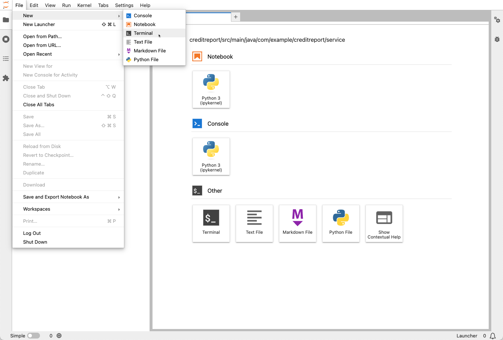
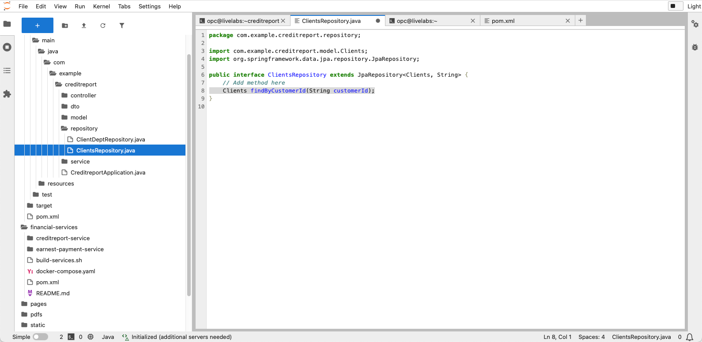

# Create a Creditreport Microservice

## Introduction

**Welcome to the Microservice creditreport Challenge!**

In this lab, you will tackle an exciting coding challenge focused on **microservice, spring boot and Oracle cloud Spring Boot starter for database**. Your goal is to enhance the existing application by implementing an update that will create a GET REST endpoint that produces a creditreport that the frontend UI than will consume and the loan officer can see the information.

Spring Boot is a Java framework that makes it easier to create and run Java applications. It simplifies the configuration and setup process, allowing developers to focus more on writing code for their applications.

Spring Boot Starter is a set of convenient dependency descriptors you can include in your application to simplify the setup of Spring applications. It provides a way to bundle common dependencies and configurations, allowing developers to get started quickly with minimal setup.

At SeerEquites, the loan officer will see the creditreport in his dashboard and make decisions based on the report.

This is your opportunity to sharpen your skills and explore the power of microservices, Spring Boot and Spring Oracle Cloud Database starter.

**Are you up for the challenge?**

If you're ready to dive in, proceed with this lab and start coding.

Good luck, and happy coding!

Estimated Time: 20 minutes

### Objectives

In this lab, you will:

* Download and unpack the stub code.
* Configure the application to use Spring Cloud Oracle Database Starter for Universal Connection Pooling (UCP).
* Use the OCI console Code Editor to write code (JPA, DTO, REST endpoint and more).
* Test the application at various stages

### Prerequisites

This lab assumes you have:

* An Oracle Cloud account
* Successfully completed Lab 1: Run the Demo
* Successfully completed Lab 3: Connect to Development Environment
* A good understanding of Java

## Task 1: Open the Code Editor

Open the Code Editor by clicking on the little computer icon and select *Code Editor* (it will take a minute or two for the Code Editor to start)


When the Code Editor has started your screen will look something like this:


## Task 2: Get the stub application and open in Code Editor

In the Code Editor open a terminal by clicking *Terminal -> New Terminal*.



In the terminal window execute the following command to download the stub code.

```bash
wget https://c4u04.objectstorage.us-ashburn-1.oci.customer-oci.com/p/EcTjWk2IuZPZeNnD_fYMcgUhdNDIDA6rt9gaFj_WZMiL7VvxPBNMY60837hu5hga/n/c4u04/b/livelabsfiles/o/labfiles%2Fcreditreport.zip
```


When the download is complete execute the following command to unzip the file

```bash
unzip labfiles%2Fcreditreport.zip; cd creditreport
```

From the File menu select *Open*. Select the creditreport folder.


You may get questions about Accepting a Red Hat extension and A trust questions. Select *accept* and *Yes*

Click the *Explorer* button (looks like 2 documents in the top left corner) and expand the folders.


Feel free to look around in the stub code.

* The `controller` package contains the Spring REST controller. You will be modifying this file by creating a REST endpoint.
* The `dto` package contains the DTOs (Data Transfer Objects). Ypu will use the DTOs when creating the creditreport service.
* The `model` package contains the JPA entities (Clients and ClientDebt). They reflect the Oracle autonomous database 23ai tables that the service is using.
* The `repository` package contains the JpaRepositories. It contains API for basic CRUD operations and also API for pagination and sorting. You will be modifying the ClientsRepository. You will enhance the CLients JPA repository.
* The `service` package contains the logic that creates the creditreport DTO. You will create this logic.

## Task 3: Set Java runtime to Java 17

Open a terminal (or use the one already opened) and execute the following commandL

```bash
csruntimectl java set graalvmeejdk-17
```

## Task 4: Run the application and add Spring Cloud Oracle Database starter for UCP

In a terminal window execute the following command. This will download all the dependencies needed for the application. However the application will not start, if you look at the logfile you will see that the application is failing to start the Universal Connection Pool (UCP).

```bash
cd $HOME/creditreport; mvn spring-boot:run
```


```log
2025-04-10T20:56:00.408Z ERROR 10194 --- [creditreport] [           main] o.h.engine.jdbc.spi.SqlExceptionHelper   : UCP-0: Unable to start the Universal Connection Pool 
```

To resolve the problem we need to add Spring Cloud Oracle Database starter for UCP dependency to the application. Open the `pom.xml` file and add the following dependency

```xml
<dependency>
    <groupId>com.oracle.database.spring</groupId>
    <artifactId>oracle-spring-boot-starter-ucp</artifactId>
    <version>25.1.0</version>
</dependency>
```

Make sure you put the dependency in the right location (e.g. inside the `<dependencies>` tag). Save the file.


In a terminal window run tha application again.

```bash
cd $HOME/creditreport; mvn spring-boot:run
```

The console log will look something like this:

```log
2025-04-10T21:07:41.900Z  INFO 13325 --- [creditreport] [           main] c.e.c.CreditreportApplication            : Started CreditreportApplication in 9.992 seconds (process running for 10.318)
```

In a new terminal window (keep the application running) execute the following command:

```bash
curl -v  http://localhost:8080/creport/CUST_1000
```

The output will look like this:

```log
<username>@codeeditor:creditreport (us-sanjose-1)$ curl -v  http://localhost:8080/creport/CUST_1000
*   Trying ::1...
* TCP_NODELAY set
* Connected to localhost (::1) port 8080 (#0)
> GET /creport/CUST_1000 HTTP/1.1
> Host: localhost:8080
> User-Agent: curl/7.61.1
> Accept: */*
> 
< HTTP/1.1 200 
< Content-Length: 0
< Date: Thu, 10 Apr 2025 21:09:47 GMT
< 
* Connection #0 to host localhost left intact
```

The command will not return any data, this is the GET REST endpoint you now will build.

Stop the application by typing `Ctrl-C` in the terminal window where the application is running.

## Task 5: Add JPA Repository findByCustomerID method

Open the JPA repository class `ClientsRepository.java` and add the following method and save the file.

```java
Clients findByCustomerId(String customerId);
```



This method returns a Client object for a specific `customerId` from th`CLIENTS` table in the Autonomous Database 23ai that the application is using.

## Task 6: Create the service that creates the creditreport

Open the Service class `CreditReportService.java` and add the following code to the `CreditReportDTO` method. Make sure that you delete the already existing `return null` statement. Don't forget to save the file.

```java
    // Find the client using the JPA repository method
    Clients client = clientsRepository.findByCustomerId(customerId);
    if (client == null) {
      return null;
    }

    // Set total dept to 0
    debtByCustomer = 0;

    // Create a List with client_depts
    List<ClientDeptDTO> clientDeptDTOs = client.getClientDepts().stream().map(clientDebt -> {

        // Add up total debt for customer
        debtByCustomer = debtByCustomer + clientDebt.getDebtAmount();

        ClientDeptDTO clientDeptDTO = new ClientDeptDTO();
        clientDeptDTO.setId(clientDebt.getId());
        clientDeptDTO.setDebtType(clientDebt.getDebtType());
        clientDeptDTO.setDebtAmount(clientDebt.getDebtAmount());
        return clientDeptDTO;
    }).toList();

    // Create the Creditreport aka ClientDTO
    CreditreportDTO creditreportDTO = new CreditreportDTO();
    creditreportDTO.setCreditReportId(reportId());
    creditreportDTO.setCustomerId(client.getCustomerId());
    creditreportDTO.setGenerationDate(new Date());
    creditreportDTO.setCreditScore(calculateCreditScore());
    creditreportDTO.setTotalDebtAmount(debtByCustomer);
    creditreportDTO.setClientDepts(clientDeptDTOs);

    return creditreportDTO;
```


Click *File -> Save All*. In a terminal window run the following command to make sure that the application compiles and runs properly:

```bash
cd $HOME/creditreport; mvn spring-boot:run
```

The application should start and you will get a log message that looks like this:

```log
2025-04-16T12:29:17.446-05:00  INFO 23912 --- [creditreport] [           main] o.s.b.w.embedded.tomcat.TomcatWebServer  : Tomcat started on port 8080 (http) with context path '/'
2025-04-16T12:29:17.451-05:00  INFO 23912 --- [creditreport] [           main] c.e.c.CreditreportApplication            : Started CreditreportApplication in 15.625 seconds (process running for 15.872)
```

Stop the application by pressing `Ctrl-c`.

## Task 7: Create the GET REST Endpoint

Open the `RestController` class called CreditReportController.java and add the following code to the `getReport` method. Make sure that you delete the already existing `return null` statement.

```java
    log.info("*** Getting creditreport for customer ID: " + customerId);

    CreditreportDTO creditreportDTO = creditReportService.getClientWithDepts(customerId);
    return creditreportDTO != null ? ResponseEntity.ok(creditreportDTO) : ResponseEntity.notFound().build();
```


Click *File -> Save All*. In a terminal window run the following command to make sure that the application compiles and runs properly:

```bash
cd $HOME/creditreport; mvn spring-boot:run
```

The application should start and the log output will look similar to this:

```log
2025-04-16T12:38:57.809-05:00  INFO 25978 --- [creditreport] [           main] o.s.b.w.embedded.tomcat.TomcatWebServer  : Tomcat started on port 8080 (http) with context path '/'
2025-04-16T12:38:57.814-05:00  INFO 25978 --- [creditreport] [           main] c.e.c.CreditreportApplication            : Started CreditreportApplication in 14.617 seconds (process running for 14.844)
```

Keep the application running, you will test the endpoint in the next task.

## Task 8: Test the REST endpoint

Open a terminal window (or use an existing one) and execute the following command:

```bash
curl -s  http://localhost:8080/creport/CUST_3000 | jq
```

The endpoint response will look like this

```json
{
  "creditReportId": "2bdbeca2-d2b7-4e4f-916b-508435f1c66b",
  "customerId": "CUST_3000",
  "creditScore": 596,
  "generationDate": "2025-04-16T17:44:56.318+00:00",
  "clientDepts": [
    {
      "id": 5,
      "debtType": "Personal",
      "debtAmount": 5000
    },
    {
      "id": 6,
      "debtType": "Business",
      "debtAmount": 22000
    }
  ],
  "totalDebtAmount": 27000
}
```

The JSON document above, is what the `CreditreportDTO` object contains. The document is created with data from the `CLIENTS` and `CLIENT_DEPT` tables. The `creditScore` is a random number between 500 and 900, so is the `creditReportId`.

If you look at the output window where the application is running you can see that the application is using JPA to query the Oracle Autonomous Database 23ai and construct the creditreport.

```log
2025-04-16T12:54:31.399-05:00  INFO 29083 --- [creditreport] [nio-8080-exec-5] c.e.c.controller.CreditreportController  : *** Getting creditreport for customer ID: CUST_3000
Hibernate: select c1_0.customer_id,c1_0.age,c1_0.city,c1_0.first_name,c1_0.income,c1_0.last_name,c1_0.state,c1_0.veteran,c1_0.zip_code from clients c1_0 where c1_0.customer_id=?
Hibernate: select cd1_0.customer_id,cd1_0.id,cd1_0.application_id,cd1_0.debt_amount,cd1_0.debt_type from client_debt cd1_0 where cd1_0.customer_id=?
```

**Congratulations, you have successfully completed Create a Creditreport Microservice Coding Exercise!**

## Learn More

* [Spring Cloud Oracle Starters](https://oracle.github.io/spring-cloud-oracle/latest/reference/html/index.html)
* [Oracle Database 23ai Documentation](https://docs.oracle.com/en/database/oracle/oracle-database/23/)
* [OCI Code Editor](https://docs.oracle.com/en-us/iaas/Content/API/Concepts/code_editor_intro.htm)

## Acknowledgements

* **Authors** - Andy Tael
* **Contributors** -
* **Last Updated By/Date** - Andy Tael, April 2025
