# Rapid Spatial Development with Oracle Database 23ai

## Introduction

In this lab you are asked to quickly prototype an app that is able to project ocean rise and it’s potential impact on property flood insurance. You have been provided data that predicts the ocean rise in the Boston area in 2040, 2060 and 2080.  

Estimated Time: 30 minutes
### Objectives

In this lab, you will:
* Use Data Load to populate a table with GeoJSON data.
* Quickly create 2 REST APIs using Oracle Rest Services.
* Learn about Oracle's GEO Spatial features

### Prerequisites

This lab assumes you have:
* Successfully completed Lab 1: Run the Demo

## Setup

Log into the Database Actions Console

On the Reservation Information page

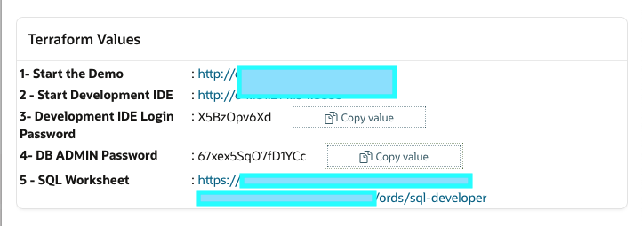

Copy the DB ADMIN Password and click the SQL Worksheet link

Login with

Username: Spatial

Password: DB ADMIN Password

The first page is the Database Actions LandingPage
The image below shows the Development Options. In this Lab, Rest Services will be used to create Rest Endpoints

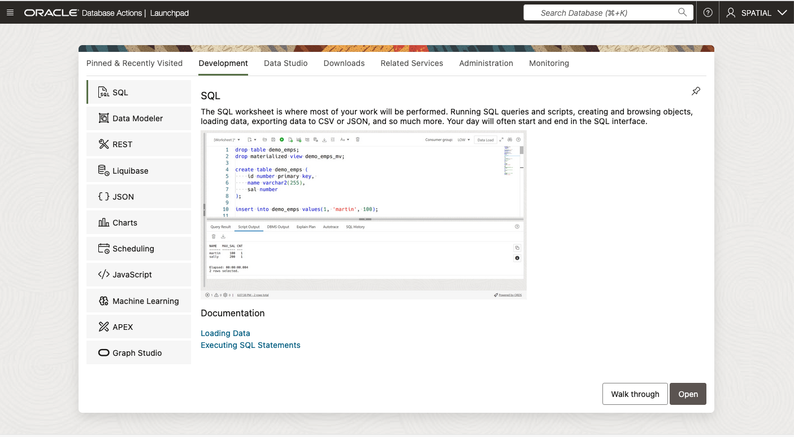

In the next task, Data Load will be used to import the floodzones GeoJSON data

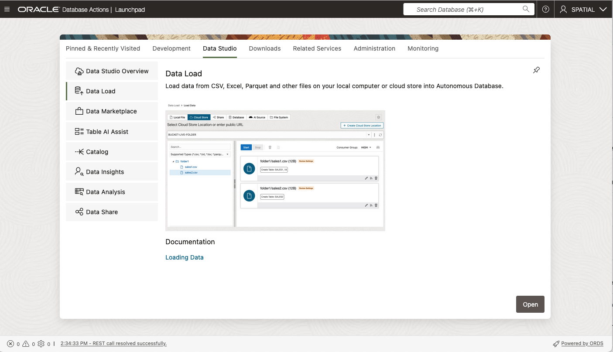

## Task 1: Import Data

In this task, load the floodzones data into a new floodzones table.

The data is located in an OCI Bucket.  Download the file from
```
<copy>
https://c4u04.objectstorage.us-ashburn-1.oci.customer-oci.com/p/EcTjWk2IuZPZeNnD_fYMcgUhdNDIDA6rt9gaFj_WZMiL7VvxPBNMY60837hu5hga/n/c4u04/b/livelabsfiles/o/labfiles%2Ffloodzonecdd_converted_geojson.json
</copy>
```
and save it as floodzones.json.

There are 3 rows and each row contains:

* FID - a unique identifier

* Desc - description of data

* Geometry - a GeoJSON representation of ocean rise in a specific year

[GeoJSON](https://geojson.org/) is an open standard format based on JSON for representing simple geographical features—such as points, lines, and polygons—along with their associated attributes.

Use DataLoad from Database Actions to create a floodzones table from the local file floodzones.json

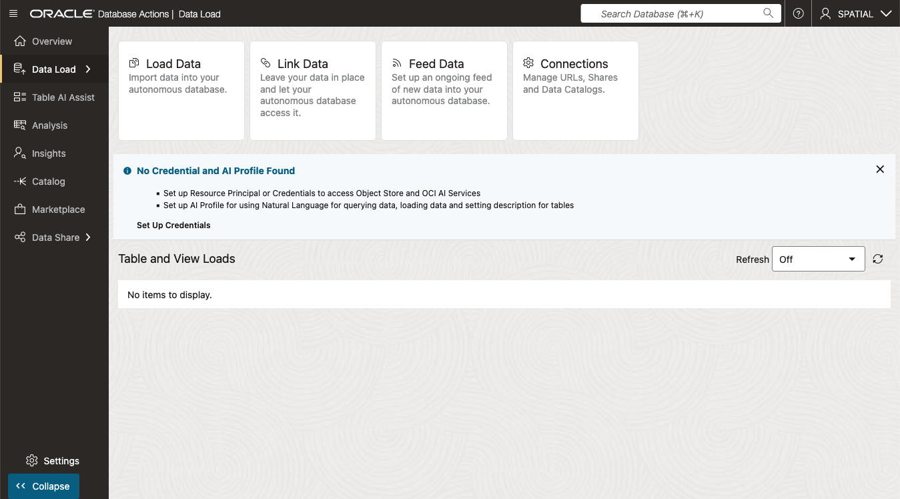

Select Load Data and select Local File, floodzones.json

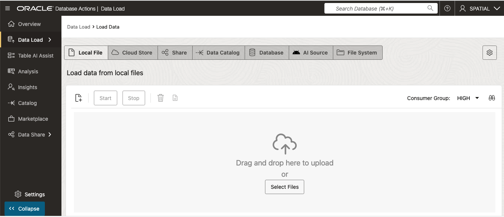

Load the Data as a Table

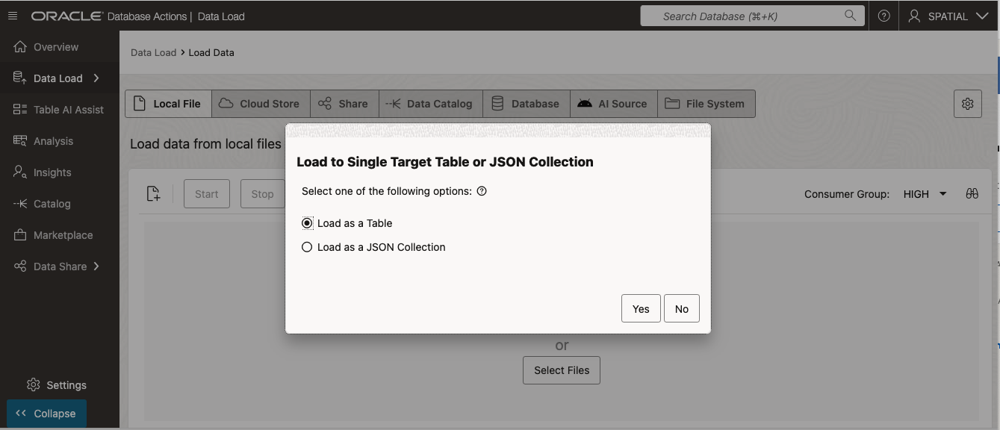

Run the data load job.  This is what success looks like

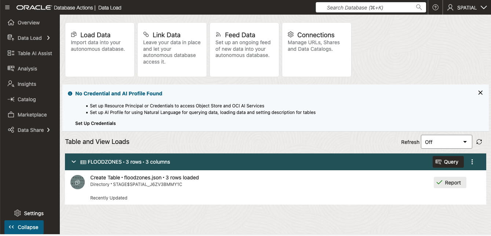

Check the table in the SQL Console

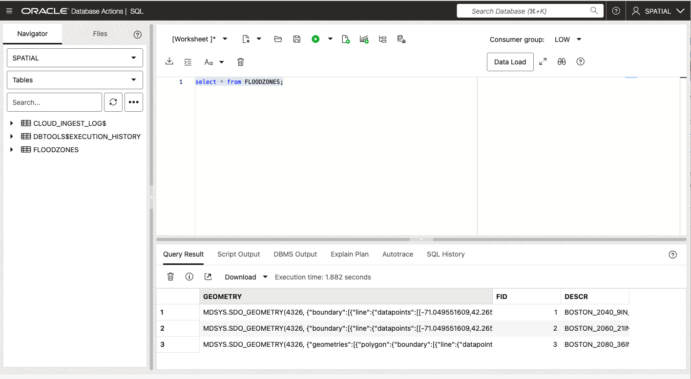

Note that Geometry in the database is now type SDO_Geometry

Oracle [Spatial](https://www.oracle.com/database/spatial-database/) uses the [`SDO_GEOMETRY`](https://docs.oracle.com/en/database/oracle/oracle-database/23/spatl/sdo_geometry-object-type.html) type because it offers a powerful and flexible framework for storing and analyzing spatial data directly within the database. This approach enables efficient querying, integration with GIS tools, and support for complex geospatial applications across industries like urban planning, transportation, environmental management, and more.
Key Reasons for Using `SDO_GEOMETRY`

1. **Unified Storage Model**:

    Oracle Spatial uses the object-relational model to represent geometries, allowing an entire geometry to be stored in a single column of type `SDO_GEOMETRY` within a table. This simplifies the management of spatial data

2. **Support for Complex Geometries**: 

    The `SDO_GEOMETRY` type can represent a wide range of spatial objects, including points, lines, polygons, and multi-part geometries. It supports both simple and complex geometric shapes.

3. **Efficient Querying with Spatial Indexes**:

    Oracle Spatial provides specialized spatial indexing (e.g., R-tree indexes) that enables efficient querying of spatial data based on location or geometry relationships (e.g., containment, intersection). Functions like `SDO_FILTER` and `SDO_RELATE` are optimized for spatial queries.

4. **Integration with Coordinate Systems**:

    The `SDO_SRID` attribute allows geometries to be associated with specific coordinate systems (spatial reference systems). This ensures consistency and accuracy in geospatial calculations

## Task 2: Create Rest APIs using Rest Services

Use Rest Services to create 2 APIs

1. floodzone2040 - return GeoJSON coordinates of the predicted ocean rise in Boston in 2040
2. isFlooded2040 - determine if the lon/lat coordinates will fall in a floodone in 2040

Use Rest Services from Database Actions 

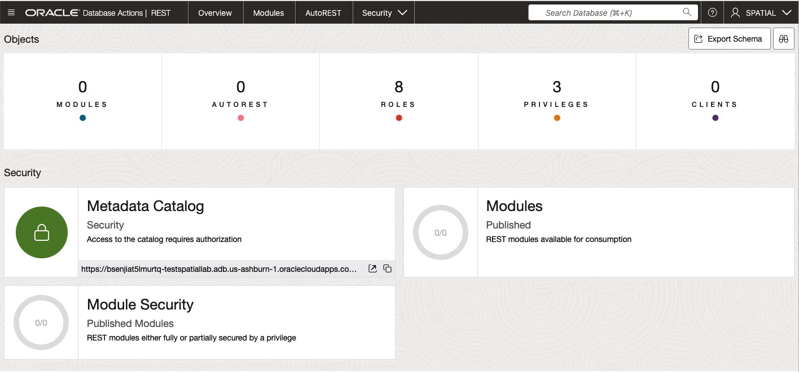

When creating REST APIs, they are in the form of module/template/handler

Simply put,

* Module is the Rest endpoint definition

* Template is the Rest endpoint parameters

* Handler is the SQL

### floodzone2040

Create the module by clicking MODULES in the upper left and click **Create Module** on the Modules page

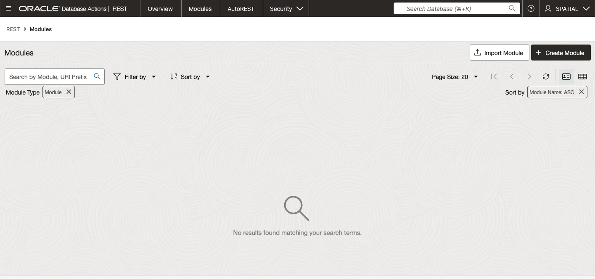

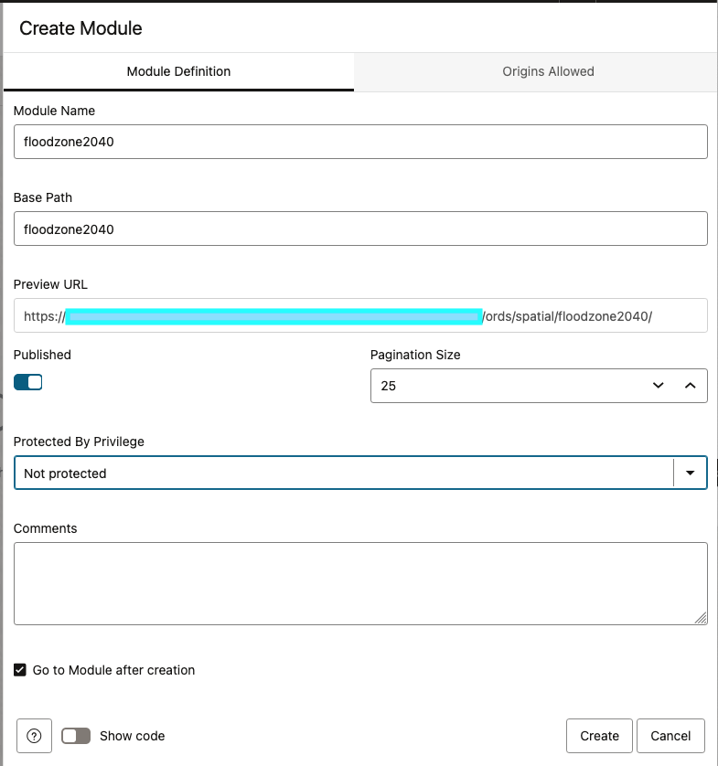

* Module Name is floodzone2040
* Base Path is floodzone2040
* Preview URL shows the Rest endpoint
* Protected By Privilege is Not protected. This is a public API

Create the Template by clicking **Create Template**

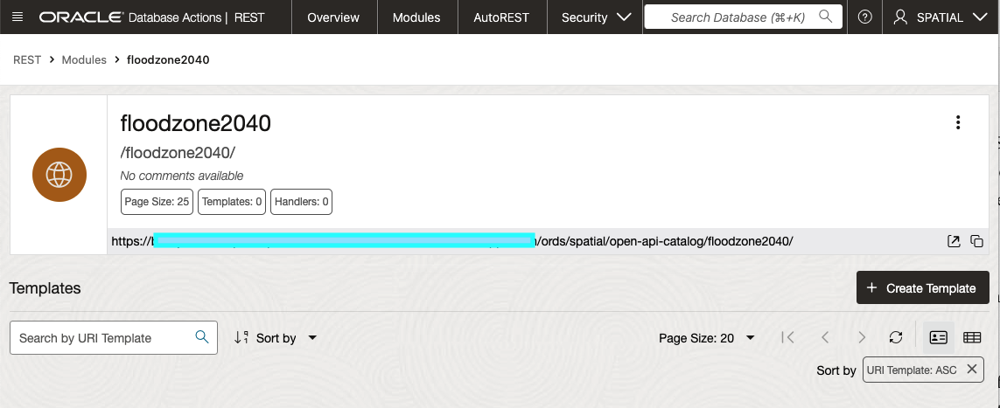
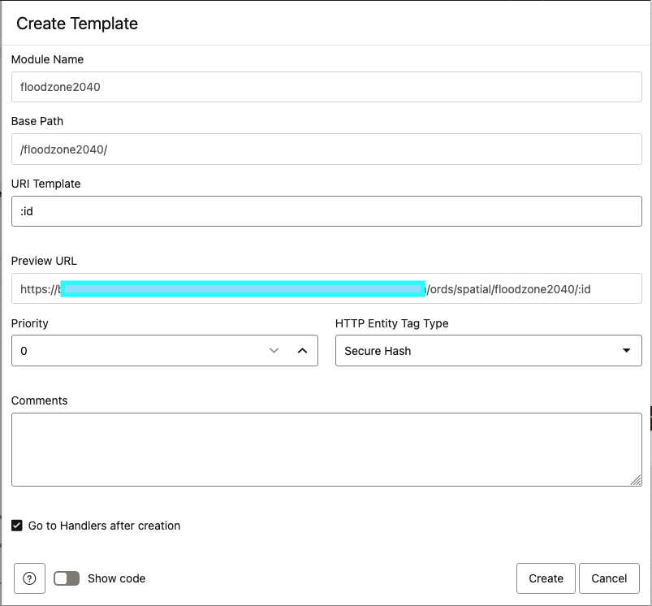

URI Template - will take an id that correlates to fid in the database table

Create the Handler by clicking **Create Handler**

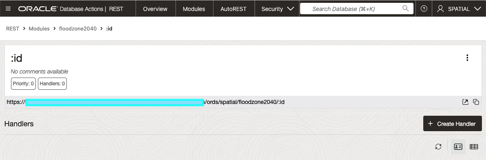
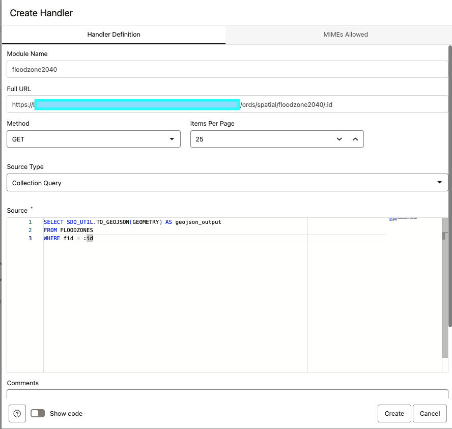

* Method is a GET
* Pagination is set to 25
* Source Type is Collection Query
* Source is the query to run

Conceptually, the **source type** in Oracle REST Data Services (ORDS) refers to the type of data source or logic that a RESTful service handler will execute to generate its response. It determines how ORDS processes the input (SQL query, PL/SQL block, or other data) and transforms it into the desired output format (e.g., JSON, binary, CSV).


| **Source Type**            | **Description**                                                             | **Result Format** | **HTTP Methods** |
|----------------------------|-----------------------------------------------------------------------------|-------------------|------------------|
| `Collection Query`         | Returns multiple rows as a JSON array                                       | JSON              | GET              |
| `Collection Item`          | Returns one row as a JSON object                                            | JSON              | GET              |
| `CSV Query`                | Returns multiple rows as CSV                                                | CSV               | GET              |
| `Media`                    | Returns binary data with HTTP Content-Type header                           | Binary            | GET              |
| `PL/SQL`                   | Executes a PL/SQL block and returns a result or custom response             | JSON/custom       | POST, PUT, DELETE |


This query retrieves the spatial geometry from the FLOODZONES table for a specific feature identified by `fid = :id`, converts that geometry into GeoJSON format using `SDO_UTIL.TO_GEOJSON`, and returns the resulting GeoJSON as `geojson_output`.

```
<copy>
SELECT SDO_UTIL.TO_GEOJSON(GEOMETRY) AS geojson_output
FROM FLOODZONES
WHERE fid = :id
</copy>
```

Create the Handler

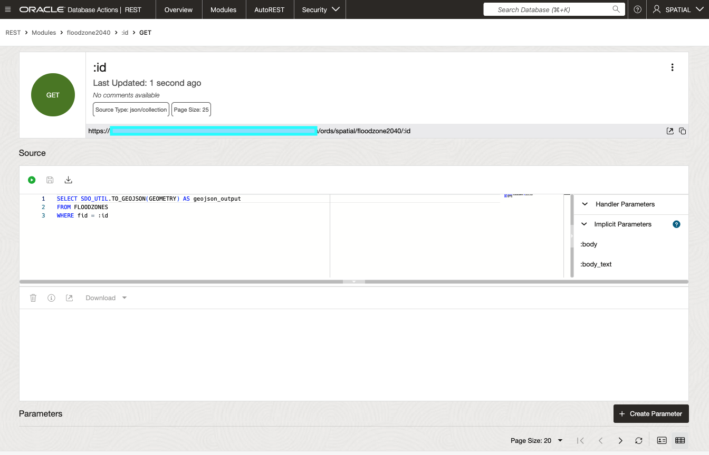

Test the query by clicking the Green Play button
Bind id to 1 which is the key for 2040 floodzone data

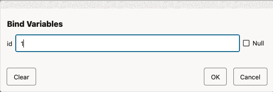

Success

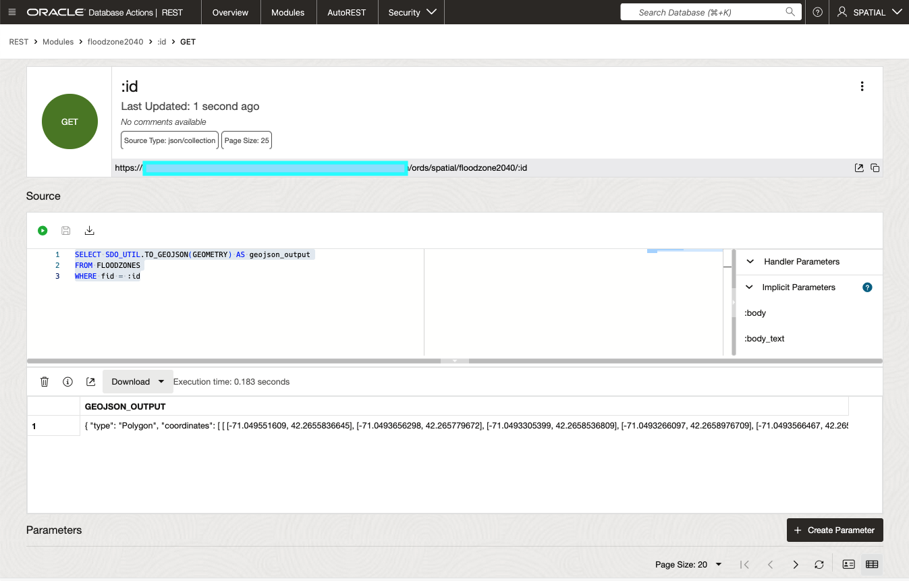

Test the public Rest Endpoint by clicking Open in New Tab button to the left of URI

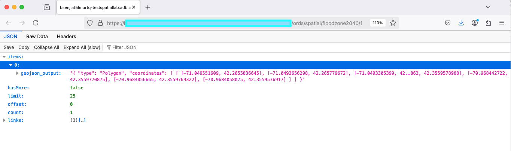

To check that what was returned is valid GeoJSON, copy the geojson_output and paste into [GeoJSON Tools](https://geojson.tools/)

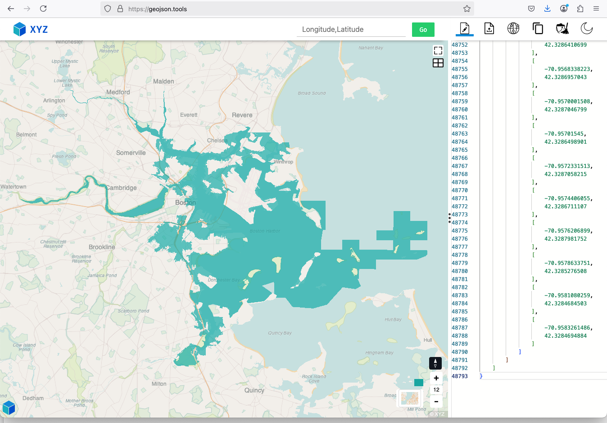

There was alot of information but that was fairly straighforward.  The next API is going to take [longitude,latitude] coordinates and check if the location falls within the 2040 flood zone. 

### isFlooded2040

Create the Module for isFlooded2040

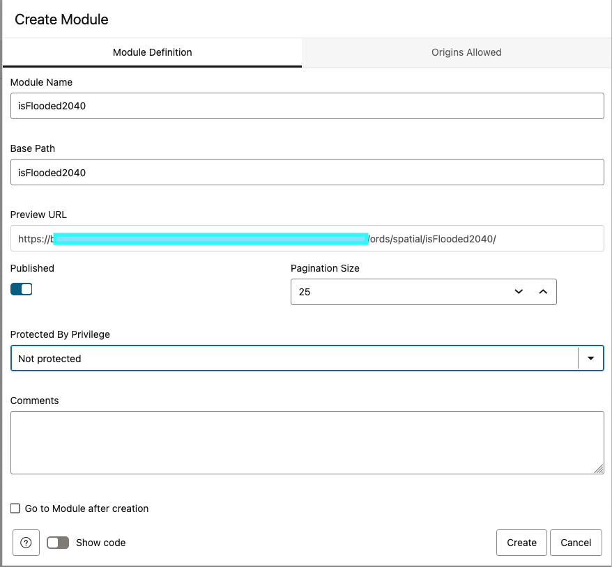

* Module Name is isFlooded2040
* Base Path is isFlooded2040
* Preview URL shows the Rest endpoint
* Protected By Privilege is Not protected. This is a public API

Create the Template. It will take longitude and latitude 

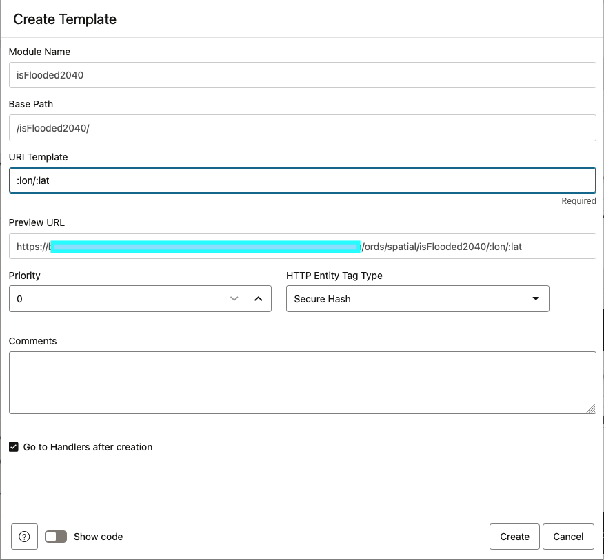

URI Template - will take coordinates, longitude then latitude

Create the Handler

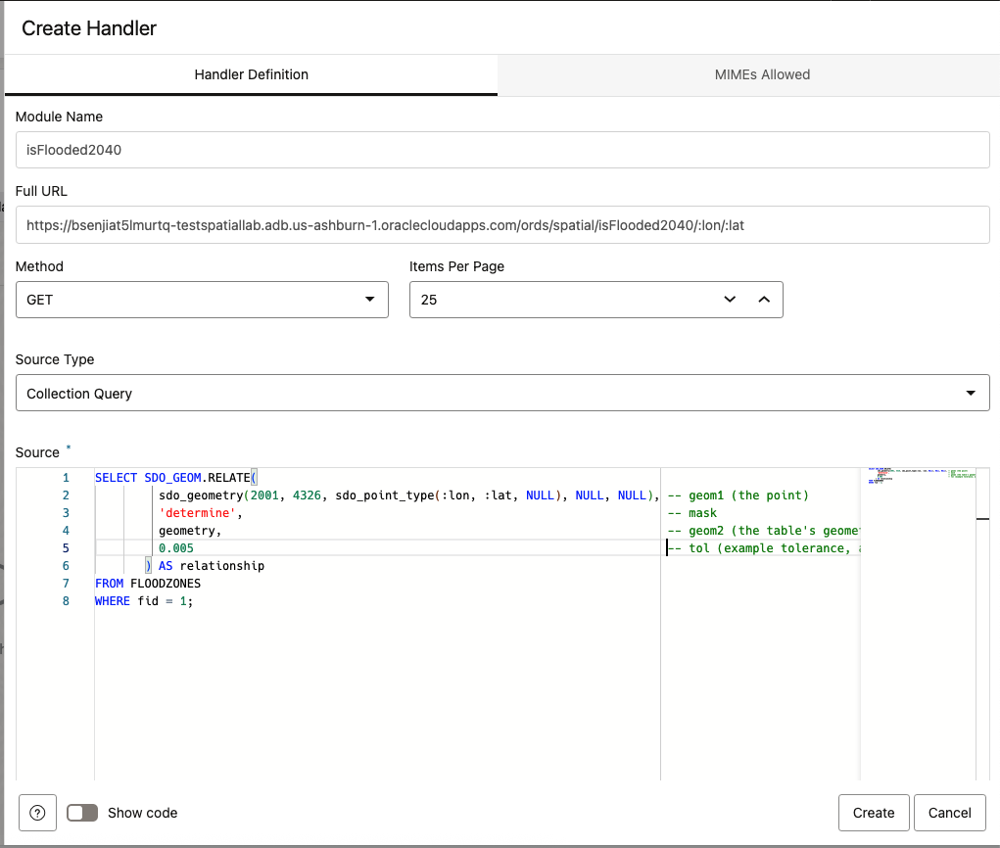

* Method is a GET
* Pagination is set to 25
* Source Type is Collection Query
* Source is the query to run

This query computes the spatial relationship between a point (with longitude :lon and latitude :lat) and the geometry of the feature in the FLOODZONES table where fid = 1. It uses the [`SDO_GEOM.RELATE`](https://docs.oracle.com/en/database/oracle/oracle-database/23/spatl/sdo_geom-relate.html) function with the 'determine' mask to return the type of spatial relationship (e.g., contains, overlaps) between the point and the specified flood zone geometry. The result is returned as relationship.

```
<copy>
SELECT SDO_GEOM.RELATE(
         sdo_geometry(2001, 4326, sdo_point_type(:lon, :lat, NULL), NULL, NULL), -- geom1 (the point)
         'determine',                                                            -- mask
         geometry,                                                               -- geom2 (the table's geometry)
         0.005                                                                   -- tol (example tolerance, adjust as needed)
       ) AS relationship
FROM FLOODZONES
WHERE fid = 1;
</copy>
```

To Test, use the following coordinates
[-71.042972,42.272597]
This is the location of Tenean Beach Boston

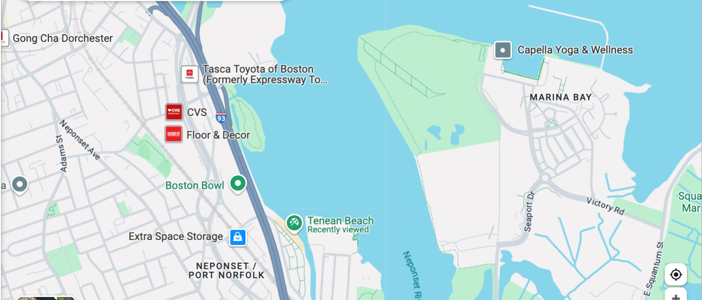

Test the public Rest Endpoint by clicking Open in New Tab button to the left of URI
Bind the variables to the coordinates above and see how Tenean Beach fares in 2040

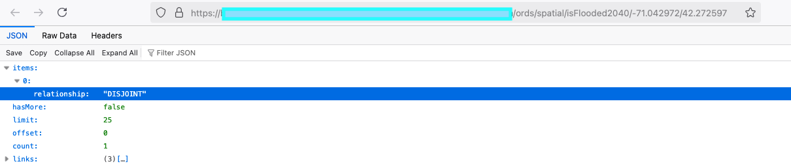

Successful call and good news for Tenean Beach. The relationship is Disjoint
The relationship between the point and the polygon is DISJOINT. The result of DISJOINT simply means that no spatial overlap exists between your input point and any geometry in the dataset.

## Spatial Challenge

Create Rest API isFlooded2080. Determine Tenean Beach flood status in 2080.

## Learn More

* [Oracle Database 23ai Documentation](https://docs.oracle.com/en/database/oracle/oracle-database/23/)

## Acknowledgements
* **Authors** - Doug Drechsel
* **Contributors** - Mark Nelson, Kevin Lazarz
* **Last Updated By/Date** - Doug Drechsel, April 2025