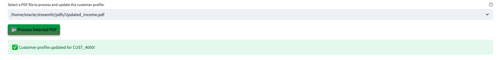
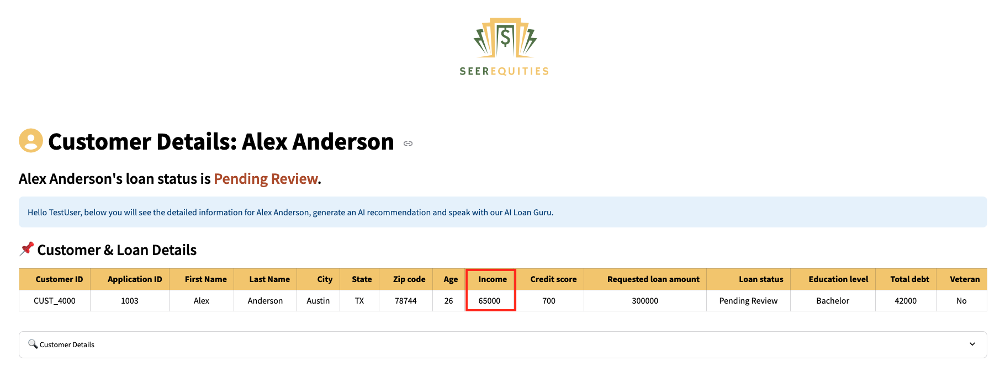

# Demo Guide

## Introduction

In this lab, you will step into the role of a loan officer using a next-generation loan approval application powered by Oracle Database 23ai.  
You will work with real loan applications and see how Generative AI, Vector Search, and Graph analytics replace manual review with faster, AI-driven decision-making.

**Disclaimer**: Please note that your results may vary. The information provided is generated by OCI Generative AI services, and your outcomes may differ from those presented.

Estimated Lab Time: 30 minutes

### Objectives

In this lab, you will:

* Walk through a demo of the SeerEquities Loan Approval application as a loan officer persona
  
* Explore the challenges associated with loan approval processing time and  
learn how the SeerEquities Loan Management app reduces processing and approval time!

### Prerequisites

This lab assumes you have:

* An Oracle account to submit your a LiveLabs Sandbox reservation.

## Task 1: Launch the application

1. To access the demo environment, click **View Login Info** in the top left corner of the page. Click the **Start the Demo** link.

    

2. Enter in a username and click **Login**.

    

3. Welcome to the SeerEquities Loan Management application! Congratulations, you are now connected to the demo environment. You can now execute the different tasks for this Lab.

    

## Task 2: Demo - Customer with strong credit score

In this first example, you will use the application to approve a customer with strong credit score. The first user on your to-do list is James Smith.

1. On the Dashboard page, from the pending review list, select the Customer ID for **James Smith**.

    

2. Opening James Smith’s profile reveals his loan application details—name, location, requested amount, debt, and credit score.  
   OCI Generative AI automatically generates personalized recommendations based on his data.

    

3. At the bottom of James Smith’s profile, you will find the **AI Loan Guru**—a chatbot built to answer questions about loan options.  
When prompted, the system uses **RAG** to generate a response. It converts the question and loan data into embeddings, performs a similarity search, and then uses **OCI Generative AI** to turn the enriched context into a clear, natural language answer.  
If the customer calls with a question, you can quickly enter it into the recommendation engine to generate a relevant response. 

    **Copy** the question below into the AI chatbot and press **Enter**. What does the AI Loan Guru recommend?

    ```text
    <copy>
    What would be the top 0% down payment loans?
    </copy>
    ```

    

4. Select the **Navigate To Decisions** button.

    

    After navigating to the decisions page, the AI evaluation runs in the background. It analyzes James’s profile and matches it against available loan options in the database.  
    A custom AI prompt ensures the system uses only internal data—never the internet. In this case, the AI returns three loan options, each with a clear explanation.  
    All options are displayed alongside the AI’s final recommendation: approval.

5. In the **Select Final Approved Loan Option** section, the available loan options are displayed. The loan officer can choose to request more information to refine the offer, but for this scenario, we will proceed by selecting one of the suggested loans.

    

6. Select the AI-recommended loan labeled as the military veteran loan with the shortest time to close. In this example, that is Loan 26—the only military veteran option shown. Proceed by selecting Loan 26.

    

7. Set the final loan status to **Approved**, then click **Save Final Approval & Loan Status** to complete the process.

    The loan status has been updated to 'Approved' and saved to the customer profile.

    

8.  Click the **Generate Decision as PDF** button.

    

9.  Click **Download PDF**

    

10. Display the message the customer would see by opening the downloaded PDF.

    

11. Click the **Return to Dashboard** button to navigate back to the Dashboard.

    

12. Expand **View Approved Customers**. We can see that James Smith has been removed from the Pending Review Loan Requests list and has been added to the Approved Loan Requests list.

    

**Conclusion**

Once you select and save one of the 3 loans recommended by the AI: 

✅ The customer's loan status is updated.

✅ A finalized PDF decision document is generated.  

✅ The dashboard reflects the change in real-time — marking James as Approved.

Congratulations, you have just approved your first customer loan! Proceed to the next task.

## Task 3: Demo - Denying a customer with high risk
In this example, you will navigate the application to review a customer who is denied. The second user on your to-do list is James Woods.

1. On the Dashboard page, from the pending review list, select the Customer ID for **James Woods**.

    

2. Opening James Woods’s profile displays his loan application details.  
   Within a few seconds, the AI generates automatically recommendations. In this case, the system evaluates a less favorable profile and identifies key risk factors.

    This customer has:

    * **$5000 in income**
    * A **low credit score**
    * And is requesting a **high loan amount**

    Despite the risk factors, the AI evaluates the profile and suggests next steps.  
    In this case, it recommends a denial—but also provides clear, actionable guidance to help the customer improve their chances of approval in the future.

    

3. Select the **Navigate to Decisions** button.

    

4. Expand **View Dot Plot: Client-Loan Relationships** to view the graph.

    

    On the decision page, the loan officer can use **Operational Property Graph** to explore near-approval loan scenarios. Built with **Oracle Graph**, this feature visually maps loans just out of reach and highlights what adjustments—like increasing income or reducing debt—could improve eligibility.

    

5. The loan status is set to **Denied**. Click the **Save Final Approval & Loan Status** button.

    The loan status has been updated to 'Denied' and saved to the customer profile.

    

6. Press the **Generate Decision as PDF** button to save the AI responses and proceed to the final loan disposition.

    

7. Click the **Download PDF** button.

    

8. Display the message the customer would see by opening the downloaded PDF.

    

9. Click the **Return to Dashboard** button to navigate back to the Dashboard.

    

10. Expand **View Denied Customers**. You will see that James Woods has been moved from the **Pending Review Loan Requests** list to the **Denied Loan Requests** list.

    

**Conclusion**

Congratulations, you have finished reviewing a customer with high financial risk! Proceed to the next task.

## Task 4: Demo - Update customer details

Lastly, let’s explore how the system handles profile updates. In this task, you will edit a customer’s details. In this example, the customer was asked to submit updated proof of income.

1. On the Dashboard page, from the **Pending Review Loan Requests** list, select the customer ID for **Alex Anderson**.

    

2. We will upload a document to update Alex's income. Before uploading the document, note that the customer’s income is currently listed as $25,000. On the Customer Details page, click the **Upload Document** button.

    

3. The PDF file has been loaded. Click the **Process Selected PDF** button.

    

4. The customer profile has been updated.

    

5. Refresh the page and note that the income has been updated to $65,000. Thanks to JSON Transform and JSON Duality Views, only the relevant field is modified — leaving the rest of the profile UNTOUCHED.

    

**Conclusion**

Once the document is uploaded:

✅ The system automatically detects the new income data.

✅ Then their profile will be updated from $25,000 to $65,000.

✅ And thanks to JSON Transform and JSON Duality Views, only the relevant field is modified — leaving the rest of the profile UNTOUCHED.

## Summary

In conclusion our Loan Management App was able to leverages Oracle database 23ai technologies to:

✅ Automate profile evaluations

✅ Provide AI-driven loan recommendations by using an RAG model powered by a Oracle Database 23ai's AI Vector Search and OCI Generative AI service

✅ Enable seamless profile updates with JSON Duality Views

✅ And empower loan officers with actionable insights through Operational Property Graphs 

By combining these advanced tools, the application enables faster, smarter decisions and delivers clear guidance on how customers can improve their eligibility.
 
**Next:** How about learning how the application was implemented in Python? Continue with the next labs and start developing!

## Learn More

* [Oracle Database 23ai Documentation](https://docs.oracle.com/en/database/oracle/oracle-database/23/)

## Acknowledgements
* **Authors** - Kamryn Vinson, Linda Foinding, Francis Regalado
* **Contributors** - Eddie Ambler, Kevin Lazarz
* **Last Updated By/Date** - Kamryn Vinson, April 2025