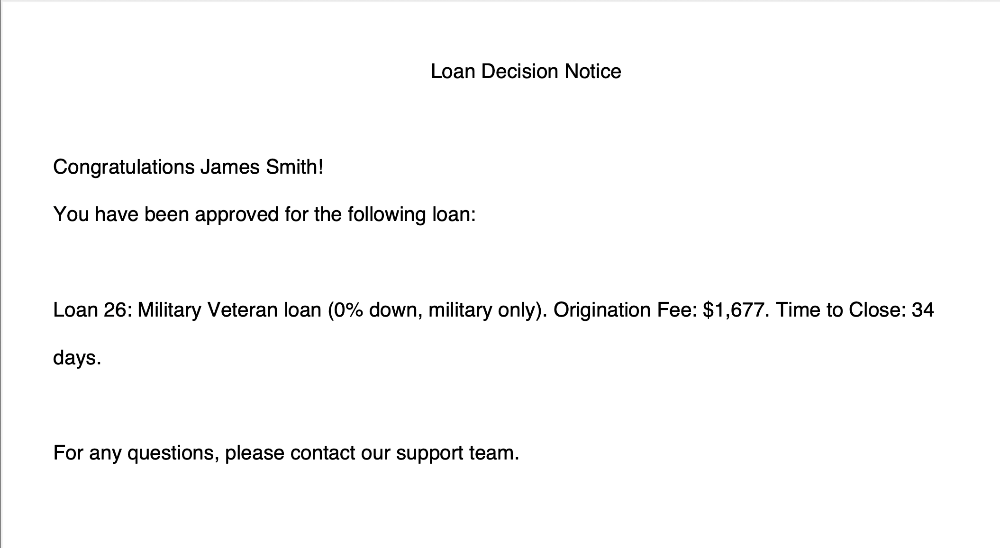
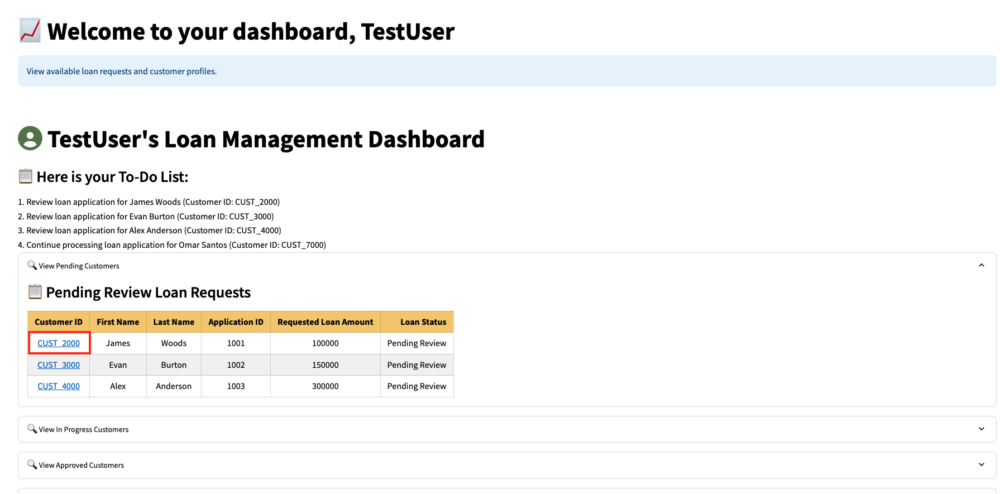
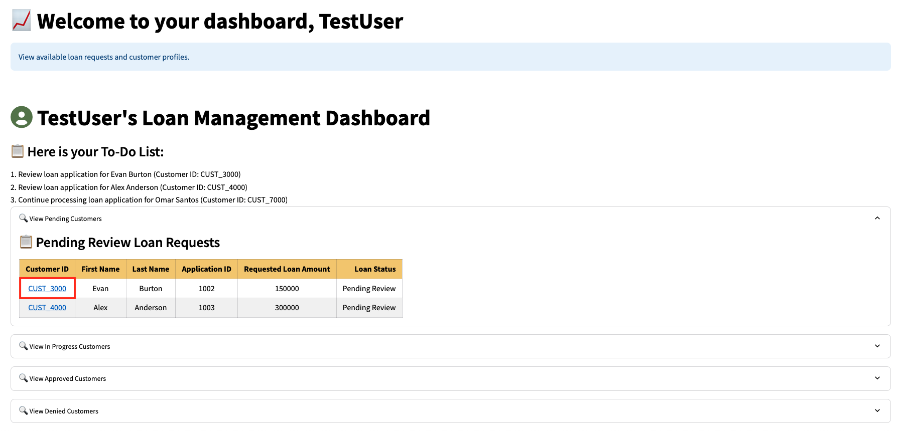
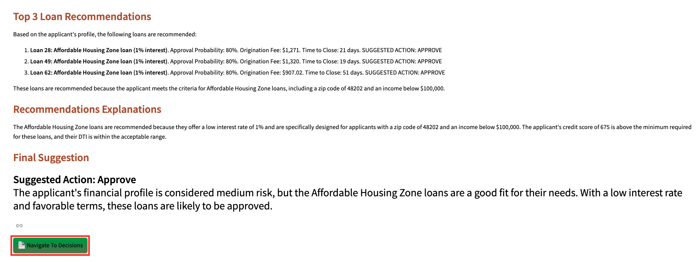
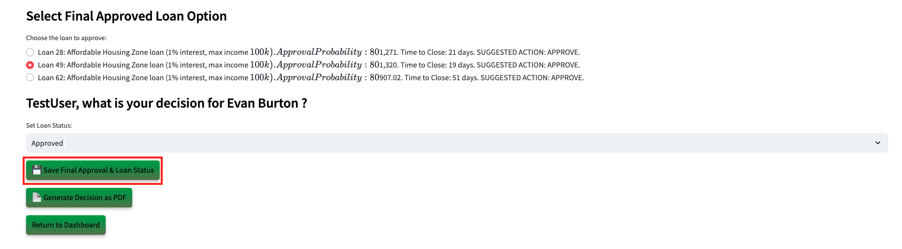
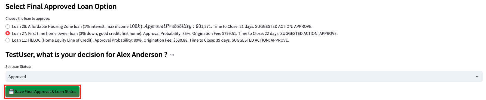

# SeerEquities AI App in Action

## Introduction

In this lab, you will step into the role of a loan officer using a next-generation loan approval application powered by Oracle Database 23ai. You will work with real loan applications and see how Generative AI, Vector Search, and Graph analytics replace manual review with faster, AI-driven decision-making.

Estimated Lab Time: 45 minutes

### Objectives

In this lab, you will:
* Walk through a demo of the SeerEquities Loan Approval application as a loan officer persona
* Explore the challenges associated with loan approval processing time and learn how the SeerEquities Loan Management app reduces processing and approval time by over 80%!

### Prerequisites

This lab assumes you have:
* Completed the Get Started lab
* Successfully launched the demo environment

## Task 1: Launch the Application

1. To access the demo environment, click **View Login Info** in the top left corner of the page. Click the Start the Demo link.

    

2. Enter in a username and click **Login**.

    

3. Welcome to the SeerEquities Loan Management application! Congratulations, you are now connected to the demo environment. You can now execute the different tasks for this Lab.

    

## Task 2: Demo User Approved

In this first example, we'll navigate through this application to show you the first user being approved with good credit.

1. On the Dashboard page, from the pending review list, select the Customer ID for **James Smith**.

    

3. This will display the customers loan application details. In approximately 15 seconds, the AI generated recommendations will be displayed.

    

4. Copy the following prompt into the AI chatbot and press Enter.

    ```text
    <copy>
    What would be the top 0% down payment loans?
    </copy>
    ```
    
    

5. Select the **Navigate To Decisions** button.

    

6. In the **Select Final Approved Loan Option** section, the graph options using Oracle 23ai Property Graph are displayed. This is where the loan officer could choose to request additional information in order to provide a slightly better loan. For this scenario, we will continue with selecting one of the suggested loans.

    

7. Select the AI suggested loan that displays the military veteran loan with the shortest time to close. In our case, we are shown one military veteran loan. We will select loan 26 in our case.

    

8. Set the final loan status to **Approved**. Click the **Save Final Approval & Loan Status** button.

    The loan status has been updated to 'Approved' and saved to the customer profile.

    

9. Click the **Generate Decision as PDF** button.

    

10. Click **Download PDF**

    

11. Display the message the customer would see by opening the downloaded PDF.

    

12. Click the **Return to Dashboard** button to navigate back to the Dashboard.

    

13. Expand **View Approved Customers**. We can see that James Smith has been removed from the Pending Review Loan Requests list and has been added to the Approved Loan Requests list.

    

## Task 3: Demo User Denied

1. On the Dashboard page, from the pending review list, select the Customer ID for **James Woods**.

    

2. This will display the customers loan application details. In approximately 15 seconds, the AI generated recommendations will be displayed.

    

3. Select the **Navigate to Decisions** button.

    

4. The loan status is set to **Denied**. Click the **Save Final Approval & Loan Status** button.

    The loan status has been updated to 'Denied' and saved to the customer profile.

    

5. Press the **Generate Decision as PDF** button to save the AI responses and proceed to the final loan disposition.

    

6. Click the **Download PDF** button.

    

7. Display the message the customer would see by opening the downloaded PDF.

    

8. Click the **Return to Dashboard** button to navigate back to the Dashboard.

    

9. Expand **View Denied Customers**. We can see that James Woods has been removed from the Pending Review Loan Requests list and added to the Denied Loan Requests list.

    

## Task 4: Demo Opportunity Zone User

1. On the Dashboard page, from the pending review list, select the Customer ID for **Evan Burton**.

    

2. This will display the customers loan application details. In approximately 15 seconds, the AI generated recommendations will be displayed.

    

3. Select the **Navigate To Decisions** button.

    


4. In the **Select Final Approved Loan Option** section, the graph options using Oracle 23ai Property Graph are displayed. This is where the loan officer could choose to request additional information in order to provide a slightly better loan. For this scenario, we will continue with selecting one of the suggested loans.

    


5. Select the AI suggested opportunity zone loan with the lowest time to close. In our case, we would select loan number 49.

    

7. Set the final loan status to **Approved**.

    

8. Click the **Save Final Approval & Loan Status** button.

    The loan status has been updated to 'Approved' and saved to the customer profile.

    

9. Click the **Generate Decision as PDF** button.

    

10. Click **Download PDF**

    

11. Display the message the customer would see by opening the downloaded PDF.

    

12. Click the **Return to Dashboard** button to navigate back to the Dashboard.

    

13. Expand **View Approved Customers**. We can see that Evan Burton has been removed from the Pending Review Loan Requests list and has been added to the Approved Loan Requests list.

    

## Task 5: Demo First Time Home Buyer

1. On the Dashboard page, from the pending review list, select the Customer ID for **Alex Anderson**.

    

2. This will display the customers loan application details. In approximately 15 seconds, the AI generated recommendations will be displayed.

    

3. Copy the following prompt into the AI chatbot to see the lowest down payment. Press Enter.

    ```text
    <copy>
    Show me the lowest down payment.
    </copy>
    ```
    

    Copy the following prompt into the AI chatbot to see the lowest monthly payment. Press Enter.

    ```text
    <copy>
    Show me the lowest monthly payment.
    </copy>
    ```
    

4. Select the **Navigate to Decisions** button.

    

5. In the **Select Final Approved Loan Option** section, the graph options using Oracle 23ai Property Graph are displayed. This is where the loan officer could choose to request additional information in order to provide a slightly better loan. For this scenario, we will continue with selecting one of the suggested loans.

    

6. Since the AI suggested the first time home owner loan with the lowest monthly payment, we would select loan number 27. This loan is the most suitable option for Michael given his financial profile and loan eligibility.

    

7. Set the final loan status to **Approved**.

    

8. Click the **Save Final Approval & Loan Status** button.

    The loan status has been updated to 'Approved' and saved to the customer profile.

    

9. Click the **Generate Decision as PDF** button.

    

10. Click **Download PDF**

    

11. Display the message the customer would see by opening the downloaded PDF.

    

12. Click the **Return to Dashboard** button to navigate back to the Dashboard.

    

13. Expand **View Approved Customers**. We can see that Alex Anderson has been removed from the Pending Review Loan Requests list and has been added to the Approved Loan Requests list.

    

## Task 6: Edit Customer Details
For this task, we will edit a customers details.

1. On the Dashboard page, expand **View Denied Customers**. From the Denied Loan Requests list, select the customer ID for **James Woods**.

    

2. On the Customer Details page, expand **Customer Details**.

    

3. Let's change James' loan status from Denied back to **Pending Review**.

    

4. Click **Save Customer Details**.

    

5. Scroll down to the bottom of the page and click the **Return to Dashboard** button.

    

6. We can see that James Woods has been removed from the Denied Loan Requests list and has been added back to the Pending Review Loan Requests list.

    

## Learn More

* [Oracle Database 23ai Documentation](https://docs.oracle.com/en/database/oracle/oracle-database/23/)

## Acknowledgements
* **Authors** - Linda Foinding, Francis Regalado
* **Contributors** - Kamryn Vinson, Eddie Ambler, Kevin Lazarz
* **Last Updated By/Date** - Linda Foinding, April 2025