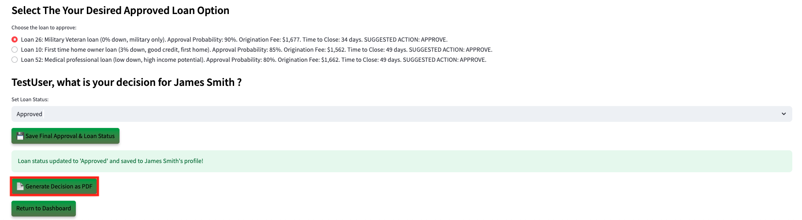
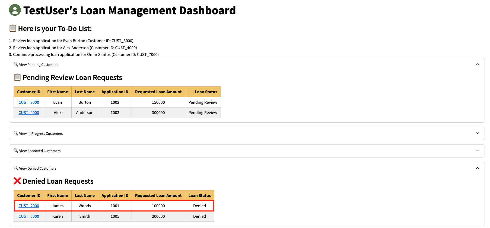
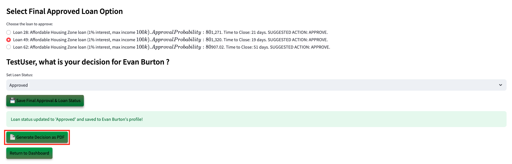
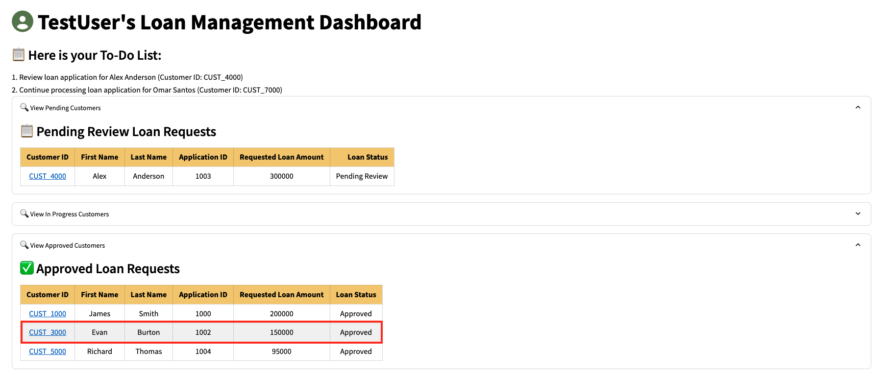
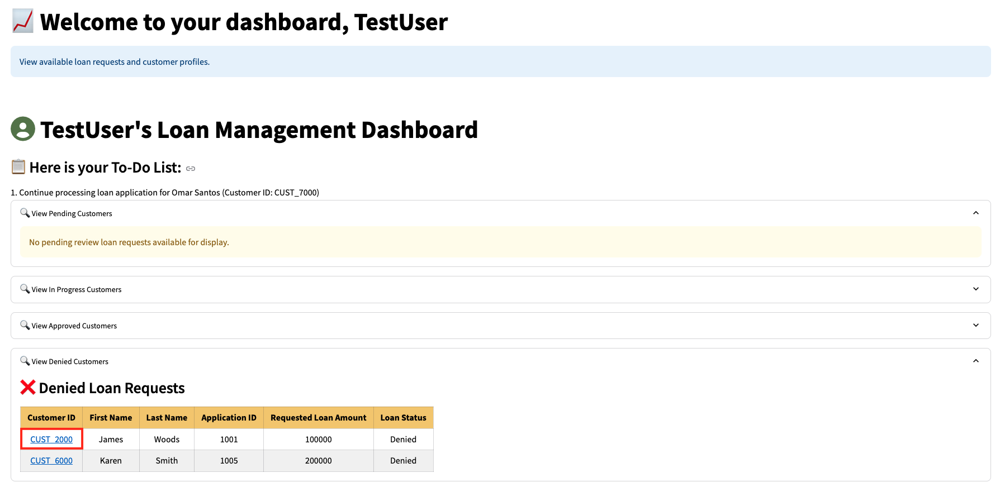

# Seer Equities AI App in Action

## Introduction

This lab guides you through spinning up and navigating a GenAI-powered loan approval application, designed to streamline the loan processing workflow and significantly reduce the time-consuming paperwork that currently takes months for Loan Officers to handle.

Estimated Lab Time: 45 minutes

### Objectives

In this lab, you will:
* Begin the demo process of the hands_on loan officer approval use cases

### Prerequisites

This lab assumes you have:
* Completed the Get Started lab
* Successfully launched the demo environment

## Task 1: Demo User Approved

In this first example, we'll navigate through this application to show you the first user being approved with good credit.

1. Select **Dashboard** in the left navigation menu.

    

2. On the Dashboard page, from the pending review list, select the Customer ID for **James Smith**.

    

3. This will display the customers loan application details. In approximately 15 seconds, the AI generated recommendations will be displayed.

    

4. Copy the following prompt into the AI chatbot and press Enter.

    ```
    <copy>
    What would be the top 0% down payment loans?
    </copy>
    ```
    

5. Press the **Generate Finalized Decision PDF** button to save the AI responses and proceed to the final loan disposition. 

    

6. Select **Decision** in the left navigation menu.

    

7. In the **Select Final Approved Loan Option** section, the graph options using Oracle 23ai Property Graph are displayed. This is where the loan officer could choose to request additional information in order to provide a slightly better loan. For this scenario, we will continue with selecting one of the suggested loans.

    

8. Select the AI suggested loan with the lowest time to close. Since our customer wanted the lowest time to close, we would select loan number 3.

    

9. Set the final loan status to **Approved**.

    

10. Click the **Save Final Approval & Loan Status** button. 

    The loan status has been updated to 'Approved' and saved to the customer profile.

    

11. Click the **Download Recommendation as PDF** button. 

    

12. Click **Download PDF**

    

13. Display the message the customer would see by opening the downloaded PDF. 

    

14. Navigate back to the **Dashboard** and expand **View Approved Customers**. We can see that James Smith has been removed from the Pending Review Loan Requests list and has been added to the Approved Loan Requests list.

    

## Task 2: Demo User Denied

1. Select **Dashboard** in the left navigation menu if you are not on the Dashboard page already.

    

2. On the Dashboard page, from the pending review list, select the Customer ID for **James Woods**.

    

3. This will display the customers loan application details. In approximately 15 seconds, the AI generated recommendations will be displayed.

    

4. Press the **Generate Finalized Decision PDF** button to save the AI responses and proceed to the final loan disposition. 

    

5. Select **Decision** in the left navigation menu.

    

6. Click the **Save Final Approval & Loan Status** button. 

    The loan status has been updated to 'Denied' and saved to the customer profile.

    

7. Click the **Download Recommendation as PDF** button. 

    

8. Click **Download PDF**

    

9. Display the message the customer would see by opening the downloaded PDF. 

    

10. Navigate back to the **Dashboard** and expand **View Denied Customers**. We can see that James Woods has been removed from the Pending Review Loan Requests list and added to the Denied Loan Requests list.

    
  
   
## Task 3: Demo Opportunity Zone User

1. Select **Dashboard** in the left navigation menu if you are not on the Dashboard page already.

    

2. On the Dashboard page, from the pending review list, select the Customer ID for **Evan Burton**.

    

3. This will display the customers loan application details. In approximately 15 seconds, the AI generated recommendations will be displayed.

    

4. Press the **Generate Finalized Decision PDF** button to save the AI responses and proceed to the final loan disposition. 

    

5. Select **Decision** in the left navigation menu.

    

6. In the **Select Final Approved Loan Option** section, the graph options using Oracle 23ai Property Graph are displayed. This is where the loan officer could choose to request additional information in order to provide a slightly better loan. For this scenario, we will continue with selecting one of the suggested loans.

    


7. Select the AI suggested opportunity zone loan with the lowest time to close. In our case, we would select loan number 1.

    

8. Set the final loan status to **Approved**.

    

9. Click the **Save Final Approval & Loan Status** button. 

    The loan status has been updated to 'Approved' and saved to the customer profile.

    

10. Click the **Download Recommendation as PDF** button. 

    

11. Click **Download PDF**

    

12. Display the message the customer would see by opening the downloaded PDF. 

    

13. Navigate back to the **Dashboard** and expand **View Approved Customers**. We can see that Evan Burton has been removed from the Pending Review Loan Requests list and has been added to the Approved Loan Requests list.

    

## Task 4: Demo First Time Home Buyer

1. Select **Dashboard** in the left navigation menu if you are not on the Dashboard page already.

    

2. On the Dashboard page, from the pending review list, select the Customer ID for **Michael Ramos**.

    

3. This will display the customers loan application details. In approximately 15 seconds, the AI generated recommendations will be displayed.

    

4. Copy the following prompt into the AI chatbot to see the lowest down payment. Press Enter.

    ```
    <copy>
    Show me the lowest down payment.
    </copy>
    ```
    

    Copy the following prompt into the AI chatbot to see the lowest monthly payment. Press Enter.
    ```
    <copy>
    Show me the lowest monthly payment.
    </copy>
    ```
    

5. Press the **Generate Finalized Decision PDF** button to save the AI responses and proceed to the final loan disposition. 

    

6. Select **Decision** in the left navigation menu.

    

6. In the **Select Final Approved Loan Option** section, the graph options using Oracle 23ai Property Graph are displayed. This is where the loan officer could choose to request additional information in order to provide a slightly better loan. For this scenario, we will continue with selecting one of the suggested loans.

    

8. Since the AI suggested the first time home owner loan with the lowest monthly payment, we would select loan number 1. This loan is the most suitable option for Michael given his financial profile and loan eligibility.

    

9. Set the final loan status to **Approved**.

    

9. Click the **Save Final Approval & Loan Status** button. 

    The loan status has been updated to 'Approved' and saved to the customer profile.

    

10. Click the **Download Recommendation as PDF** button. 

    

11. Click **Download PDF**

    

12. Display the message the customer would see by opening the downloaded PDF. 

    

13. Navigate back to the **Dashboard** and expand **View Approved Customers**. We can see that Michael Ramos has been removed from the Pending Review Loan Requests list and has been added to the Approved Loan Requests list.

    

## Task 5: Edit Customer Details
For this task, we will edit a customers details.

1. Select **Dashboard** in the left navigation menu if you are not on the Dashboard page already.

    

2. On the Dashboard page, expand **View Denied Customers**. From the Denied Loan Requests list, select the customer ID for **James Woods**.

    

3. On the Customer Details page, expand **Customer Details**.

    

5. Let's change James' loan status from Denied back to **Pending Review**.

    

6. Click **Save Customer Details**.

    

7. Navigate back to the Dashboard.

    

8. We can see that James Woods has been removed from the Denied Loan Requests list and has been added back to the Pending Review Loan Requests list.

    


## Task 6: Review Key Application Code Highlights

In this task, we will show you key code highlights used in our application pages.

**Code Highlight: Connect to the Database**

1. This section sets up a secure connection to an Oracle database by importing necessary libraries and loading environment variables from a .env file. The get\_db\_connection function retrieves the database username, password, and connection string, then uses the oracledb library to establish a connection. 

    

**Code Highlight: Onnx Model**

2. This section handles loading an ONNX machine learning model, which we use for generating vector embeddings in our app. It starts by checking if the model already exists in the database; if not, it creates a directory, downloads the model file from object storage, and uses dbms\_vector to load it, replacing any old version if needed.

    

**Code Highlight: Prompt for the AI**

3. Here, we craft a detailed prompt for our RAG—system, directing the AI to step into the shoes of a Loan Approver, relying solely on the data we feed it. It’s tasked with analyzing an applicant’s financial profile against our loan portfolio and business rules, focusing on just the provided context, ignoring any prior knowledge, which ensures our loan suggestions are relevant, without relying on external or outdated information.

    

**Code Highlight: Communicating with GenAI**

4. This is how we communicate with OCI’s Generative AI service, pulling in configuration details like the compartment ID and endpoint from environment variables and a config file. The code sets up the structure for a chat request, embedding our prompt into a user message, enabling AI loan recommendations within the app.

    

**Code Highlight: Embed the Question and Vector Search**

5. This section dives into AI vector search, first, we generates an embedding for a user’s question using Oracle’s dbms\_vector\_chain and our DEMO\_MODEL. Then, it performs an AI vector search in the LOAN_CHUNK table, comparing stored recommendations vector embeddings to the question’s embedding with cosine distance, and pulls back the most relevant text chunk, with a limit of one row.

    

**Code Highlight: Graph Query**

6. Here, we define a query for our LOANS_GRAPH property graph, which connects clients to their loan applications and potential loan options via a customer ID. It extracts critical details—like credit scores, debt-to-income ratios, and loan types—by traversing the graph’s vertices and edges.

    

**Code Highlight: Creating The Property Graph**

7. The graph structure enables complex queries and visualizations in the app, supporting decision-making by mapping interconnections between customer data and loan options. This SQL block creates our loans\_graph property graph , setting up vertices for clients, loan applications, and mock loan data with all their key properties. It also defines edges—like client\_to\_application and CLIENTS\_TO\_LOAN  to link these entities, establishing relationships that we can query and explore.

    

**Code Highlight: JSON Transform**

8. This section dynamically updates customer data in our clients\_dv table by building a flexible JSON\_TRANSFORM query based on a list of transformation statements. It constructs the query by joining those statements—like setting new field values—then applies them to the JSON data for a specific customer, identified by their ID, as long as a loan application exists."

    

## Learn More

*(optional - include links to docs, white papers, blogs, etc)*

* [URL text 1](http://docs.oracle.com)
* [URL text 2](http://docs.oracle.com)

## Acknowledgements
* **Authors** - Francis Regalado, Eddie Ambler
* **Contributors** -  Kamryn Vinson, Linda Foinding, Otis Barr
* **Last Updated By/Date** - Kamryn Vinson, March 2025
