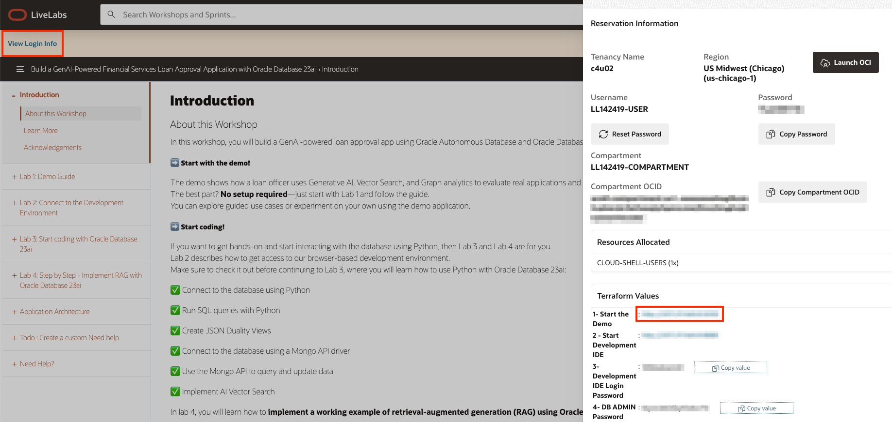
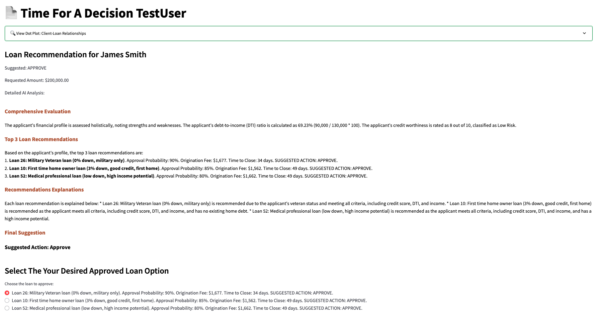
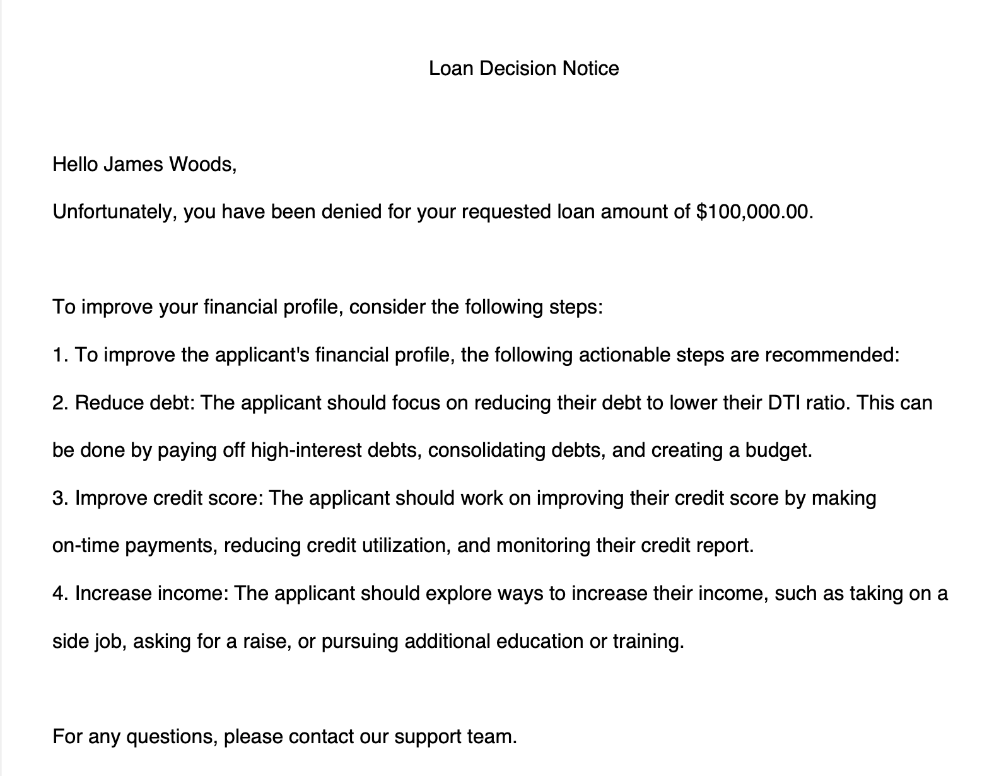
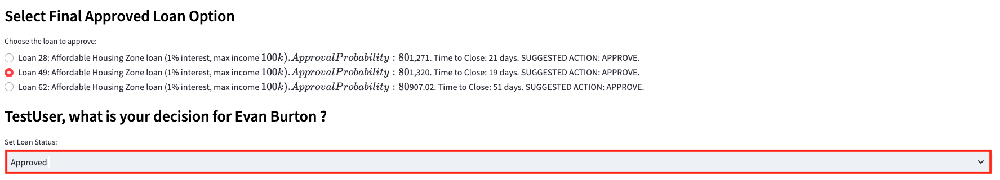

# Run the Demo

## Introduction

In this lab, you will step into the role of a loan officer using a next-generation loan approval application powered by Oracle Database 23ai. You will work with real loan applications and see how Generative AI, Vector Search, and Graph analytics replace manual review with faster, AI-driven decision-making.

**Disclaimer**: Please note that your results may vary. The information provided is generated by OCI Generative AI services, and your outcomes may differ from those presented.


Estimated Lab Time: 45 minutes

### Objectives

In this lab, you will:
* Walk through a demo of the SeerEquities Loan Approval application as a loan officer persona
* Explore the challenges associated with loan approval processing time and learn how the SeerEquities Loan Management app reduces processing and approval time by over 80%!

## Task 1: Launch the Application

1. To access the demo environment, click **View Login Info** in the top left corner of the page. Click the **Start the Demo** link.

    

2. Enter in a username and click **Login**.

    

3. Welcome to the SeerEquities Loan Management application! Congratulations, you are now connected to the demo environment. You can now execute the different tasks for this Lab.

    

## Task 2: Demo User Approved

In this first example, we'll navigate through this application to show you the first user being approved with good credit. The first customer on our to do list is James Smith. 

1. On the Dashboard page, from the pending review list, select the Customer ID for **James Smith**.

    

2. This will display the customers loan application details. In approximately 15 seconds, the AI generated recommendations will be displayed.  Opening James' profile reveals a detailed view of his information — including his name, location, requested loan amount, debt, and credit score. 

    

    At the bottom of James' profile, you'll find the **AI Loan Guru** — our chatbot designed to answer questions about loan options. For example, if you ask it a question, the system combines **RAG**, **AI Vector Search**, an **Onnx Model** stored in the database, and **GenAI** to generate a response. The system then converts both the loan data and the user's question into embeddings (which are numerical representations) and performs a **Vector Search** to identify the most relevant response.

3. If the customer calls and requests additional information, you can promptly input their question into the recommendation engine to generate a relevant response. Copy the following question into the AI chatbot and press Enter.

    ```text
    <copy>
    What would be the top 0% down payment loans?
    </copy>
    ```
    
    

4. Select the **Navigate To Decisions** button.

    

    After navigating to the decisions page, the AI Evaluation process runs quietly in the background. It analyzes James' profile and compares it against the available loan options in our database. To ensure recommendations align with loan officer priorities, we’ve engineered a custom AI prompt that strictly references the database — never reaching out to the internet. In this case, our AI gave us 3 different loan recommends, each with clear explanations for why these options were chosen. The available loan options are displayed alongside the AI's final recommendation — in this instance, an approval.

5. In the **Select Final Approved Loan Option** section, the loan options are displayed. This is where the loan officer could choose to request additional information in order to provide a slightly better loan. For this scenario, we will continue with selecting one of the suggested loans.

    

6. Select the AI suggested loan that displays the military veteran loan with the shortest time to close. In our case, we are shown one military veteran loan. We will select loan 26 in our case.

    

7. Set the final loan status to **Approved**. Click the **Save Final Approval & Loan Status** button.

    The loan status has been updated to 'Approved' and saved to the customer profile.

    

8. Click the **Generate Decision as PDF** button.

    

9. Click **Download PDF**

    

10. Display the message the customer would see by opening the downloaded PDF.

    

11. Click the **Return to Dashboard** button to navigate back to the Dashboard.

    

12. Expand **View Approved Customers**. We can see that James Smith has been removed from the Pending Review Loan Requests list and has been added to the Approved Loan Requests list.

    

Once you select and save one of the 3 loans recommended by the AI: 

✅ The customer's loan status is updated.

✅ A finalized PDF decision document is generated.  

✅ And thanks to **JSON Duality Views**, the dashboard reflects the change in real-time — marking James as Approved.

Congratulations, you have just approved your first customer loan! Proceed to the next task.

## Task 3: Demo User Denied
In this example, we'll navigate through this application to show you a user being denied. The second customer on our to do list is James Woods.

1. On the Dashboard page, from the pending review list, select the Customer ID for **James Woods**.

    

2. This will display the customers loan application details. In approximately 15 seconds, the AI generated recommendations will be displayed. Now, let's examine a scenario — one where the customer has a less favorable profile. 

    This next customer has: 
    * **$5000 in income** 
    * A **low credit score** 
    * And is requesting a **high loan amount** 

    Despite these challenges, our AI still evaluates the profile and suggests next steps. In this case, the system recommends a denial — but it doesn't stop there. It also outlines actionable steps the customer can take to improve their chances of qualifying in the future.

    

3. Select the **Navigate to Decisions** button.

    

    On the decision page, our loan officer can look at graph data using **Operational Property Graph**, created using Graph Query to find just out of reach loans. With this feature, we can visually map out loans that are just out of reach for the customer and identify exactly what changes are needed to improve their eligibility. The loan officer can use the graph to reveal how increasing their income by a certain amount or reducing their debt could improve their chances of approval. 

    

4. The loan status is set to **Denied**. Click the **Save Final Approval & Loan Status** button.

    The loan status has been updated to 'Denied' and saved to the customer profile.

    

5. Press the **Generate Decision as PDF** button to save the AI responses and proceed to the final loan disposition.

    

6. Click the **Download PDF** button.

    

7. Display the message the customer would see by opening the downloaded PDF.

    

8. Click the **Return to Dashboard** button to navigate back to the Dashboard.

    

9. Expand **View Denied Customers**. We can see that James Woods has been removed from the Pending Review Loan Requests list and added to the Denied Loan Requests list.

    

Congratulations, you have just denied your first customer loan! Proceed to the next task.

## Task 4: Demo Affordable Housing Zone User

1. On the Dashboard page, from the pending review list, select the Customer ID for **Evan Burton**.

    

2. This will display the customers loan application details. In approximately 15 seconds, the AI generated recommendations will be displayed.

    

3. Select the **Navigate To Decisions** button.

    


4. In the **Select Final Approved Loan Option** section, the loan options are displayed. This is where the loan officer could choose to request additional information in order to provide a slightly better loan. For this scenario, we will continue with selecting one of the suggested loans.

    


5. Select the AI suggested affordable housing zone loan with the lowest time to close. In our case, we would select loan number 49.

    

7. Set the final loan status to **Approved**.

    

8. Click the **Save Final Approval & Loan Status** button.

    The loan status has been updated to 'Approved' and saved to the customer profile.

    

9. Click the **Generate Decision as PDF** button.

    

10. Click **Download PDF**

    

11. Display the message the customer would see by opening the downloaded PDF.

    

12. Click the **Return to Dashboard** button to navigate back to the Dashboard.

    

13. Expand **View Approved Customers**. We can see that Evan Burton has been removed from the Pending Review Loan Requests list and has been added to the Approved Loan Requests list.

    

## Task 5: Edit Customer Details
Lastly, let's explore how the system handles profile updates. For this task, we will edit a customers details. In this example, a customer was asked to provide additional documentation — specifically an updated proof of income. 

1. On the Dashboard page, expand **View Denied Customers**. From the Denied Loan Requests list, select the customer ID for **Alex Anderson**.

    

Before we upload the document, note that the customers income currently reflects $25,000. any updates are saved instantly using **JSON Transform**, powered by **JSON Duality Views**. This ensures that data remains accurate without altering unrelated details.

2. On the Customer Details page, click the **Upload Document** button.

    


5. Scroll down to the bottom of the page and click the **Return to Dashboard** button.

    

Once the document is uploaded: 

✅ The system automatically detects the new income data. 

✅ Then their profile will be updated from $25,000 to $65,000. 

✅ And thanks to JSON Transform and JSON Duality Views, only the relevant field is modified — leaving the rest of the profile UNTOUCHED. 

With this updated profile, our AI reevaluates the customers eligibility and identifies three approved loan options. Now we can make our final decision, and generate a PDF. The dashboard updates immediately, marking the customer's status as Approved.

## Conclusion

In conclusion our Loan Management App was able to leverages Oracle database 23ai technologies to: 

✅ Automate profile evaluations 

✅ Provide AI-driven loan recommendations 

✅ Enable seamless profile updates with JSON Duality Views 

✅ And empower loan officers with actionable insights through Operational Property Graphs 

By combining these advanced tools, the application helps YOU make faster, smarter decisions — while providing clear guidance for areas that need improvement. 

## Learn More

* [Oracle Database 23ai Documentation](https://docs.oracle.com/en/database/oracle/oracle-database/23/)

## Acknowledgements
* **Authors** - Linda Foinding, Francis Regalado
* **Contributors** - Kamryn Vinson, Eddie Ambler, Kevin Lazarz
* **Last Updated By/Date** - Linda Foinding, April 2025