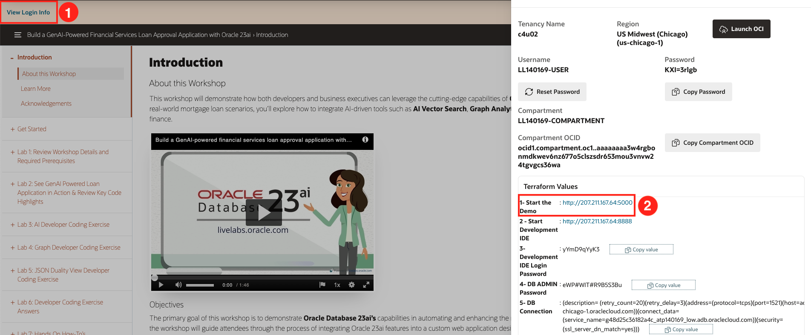
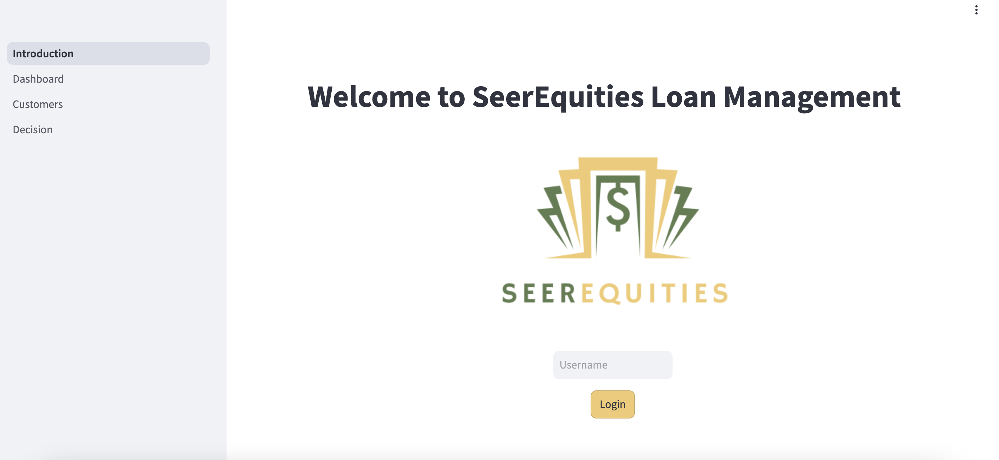
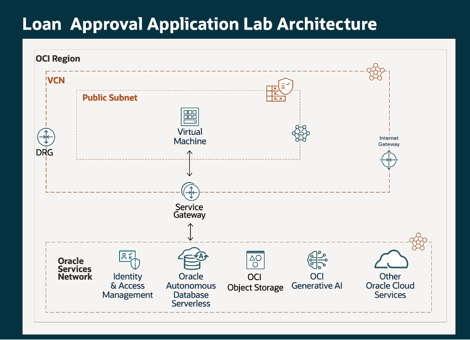
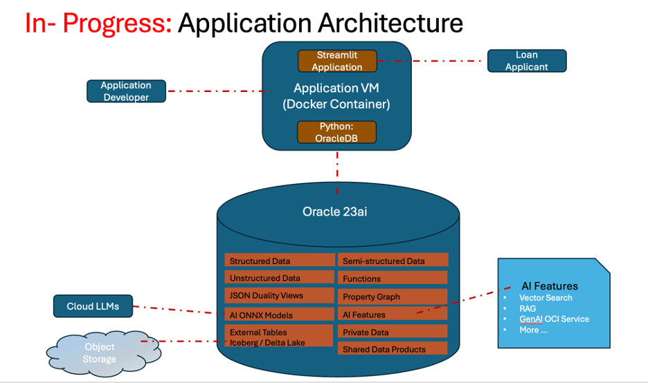

# Workshop Details and Prerequisites

## Introduction

This lab walks you through the steps to build a GenAI powered loan approval application using Oracle Database 23ai. Start coding in your personalized environment in the cloud and help SeerEquities save time on their loan approval process.

Estimated Time: 20 minutes

### Objectives

In this lab, you will:
* Complete the workshop setup
* Review the physical architecture
* Review the logical architecture
* Review the data model

### Prerequisites

This lab assumes you have:
* An Oracle Cloud account

## Task 1: Workshop Setup

1. To access the demo environment, click **View Login Info** in the top left corner of the page. Click the Start the Demo link.

    

2. Welcome to the SeerEquities Loan Management application! You will perform the tasks for lab 2 in this environment. 

    

## Task 2: Physical Architecture 

## Task 3: Logical Architecture 

## Task 4: Data Model 

## Learn More

*(optional - include links to docs, white papers, blogs, etc)*

* [URL text 1](http://docs.oracle.com)
* [URL text 2](http://docs.oracle.com)

## Acknowledgements
* **Author** - <Name, Title, Group>
* **Contributors** -  <Name, Group> -- optional
* **Last Updated By/Date** - <Name, Month Year>
