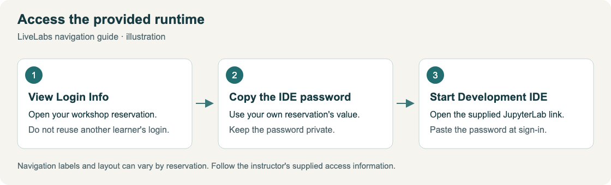
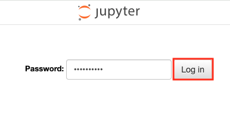
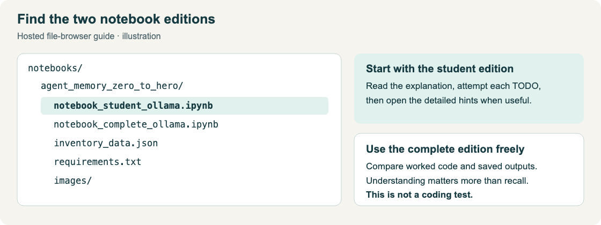
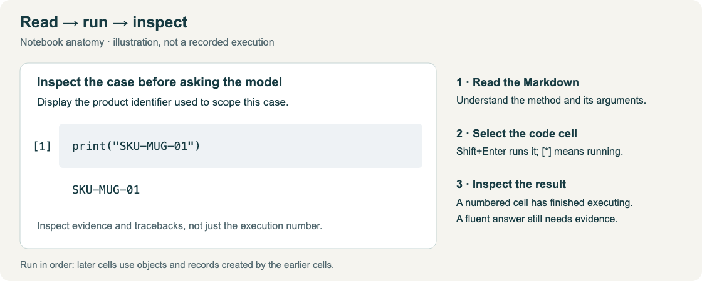

# Connect to the Development Environment

## Introduction

Open the provided JupyterLab environment and work through **Agent Memory: Introduction to context and memory engineering**. You will use the synthetic inventory story from the introduction, not a live purchasing system.

Estimated Time: 5 minutes to connect; 150–180 minutes for the notebook activities.

### Objectives

- Sign in to the provided development environment.
- Open the correct student notebook and locate its complete equivalent.
- Work through the Parts and numbered TODOs in order, inspecting each result.
- Recognize the expected evidence and the limits of the agent's authority.

## Task 1: Sign in to the provided JupyterLab environment

1. In your LiveLabs reservation, open **View Login Info**. Copy the **Development IDE Login Password**, then select **Start Development IDE**.

    

    The illustration shows the navigation sequence, not actual credentials. Use the values from your own reservation and keep them private.

2. Paste that password into the JupyterLab login form and select **Log in**.

    

3. In JupyterLab's file browser, open **`notebooks/agent_memory_zero_to_hero`**, then double-click **`notebook_student_ollama.ipynb`**.

    

    This workshop uses the Ollama edition. Open **`notebook_complete_ollama.ipynb`** alongside it whenever you want to see the worked solution or a recorded output.

4. If the workshop folder is missing, ask the instructor to confirm the lab image. The provided JupyterLab runtime must contain both notebooks, their data and diagrams, and the configured database and model services.

## Task 2: Work through the notebook's learning journey

1. Start at Part 1. Read the human inventory process and the architecture views before executing code. Distinguish the proposed quantity, approved quantity and order-submission status.

2. Use **Shift+Enter** or JupyterLab's **Run** button to execute a cell. Read the Markdown before each code cell. Run the supplied non-TODO cells too: they create state used by later exercises.

    

3. Work through the **17 numbered TODOs**. Open the expandable hints and use the complete version freely. This is not a coding test: explain what each step adds to context, tools, memory or control.

4. Wait while a code cell shows `[*]`. A numbered execution indicator means the cell finished; inspect its output and any traceback. There is no required green success message, and a fluent model answer is not proof that its claims are supported.

5. In the student notebook, an unfinished TODO intentionally raises `NotImplementedError`. Complete that exercise, then rerun its cell before continuing. For another error, keep the traceback and ask the instructor rather than skipping state-producing cells.

6. Keep the run ID stable while completing one case. The procedure-seeding cell can be repeated: it reuses existing records and adds only missing procedures. For a fresh full run, start from the configuration cell. Do not regenerate `RUN_ID` midway through a case or assume every write cell is safely repeatable.

7. In Part 9, review the exact full handover before deciding whether to save it. Declining is valid. Saving a reviewed handover does not place a supplier order. The cleanup cells delete only this run's two case threads and their dependent live records.

## Your TODO checklist

| TODO | What you will do | Topic you will learn |
|---|---|---|
| 1 | Ask the bare model | Working memory and context |
| 2 | Run the tool-using agent | The agent loop without persistence |
| 3 | Embed text inside Oracle | Representations and model contracts |
| 4 | Define planner labels | User/thread scopes versus authorization |
| 5 | Configure background extraction | Turning episodes into typed memories |
| 6 | Supersede the old proposal | Refining knowledge while preserving history |
| 7 | Recall current facts and linked history | Graph-aware retrieval |
| 8 | Configure bounded vector recall | Retrieval limits and context budgets |
| 9 | Offload the historical worksheet | Episodic memory and source references |
| 10 | Expose inventory recall | Host-controlled evidence selection |
| 11 | Run the memory aware loop | Ingestion, recall and reasoning together |
| 12 | Prune returned evidence | Context selection versus stored knowledge |
| 13 | Observe a memory search | Local operation-level diagnostics |
| 14 | Assemble a context card | Bounded working-memory construction |
| 15 | Compare the two product scopes | Relevance filters are not permissions |
| 16 | Require review before a write | Action authority and exact-draft approval |
| 17 | Reuse a reviewed lesson | Procedural memory across cases |

## What to observe as the agent evolves

| Stage | What to inspect | What it demonstrates |
|---|---|---|
| Bare model with notes | Compare the answer with the supplied case evidence | The initial answer depends on information in the context window |
| Fresh call without notes | Look for unknowns or unsupported claims | A previous answer is not automatic cross-call memory |
| Transient tool loop | Inspect the actual procedure-tool call and observation | General tool knowledge does not restore the missing case conversation |
| Oracle memory lifecycle | Check each note's extraction checkpoint, capture labels, candidates and reviewed current/history pair | Old records must not mask a failed update; processing success is not factual verification |
| Memory aware agent | Observe a recall call in a fresh session and check its cited facts | Durable evidence can reconstruct useful working context |
| Retrieval and context assembly | Read returned ranks, budgets, pruning and context-card contents | Retrieval budgets do not cap the whole card; reserve room for other prompt content and the answer |
| Human review and cleanup | Inspect the blocked unapproved write and scoped row counts | Action authority and record lifecycle remain application responsibilities |

The complete notebook preserves actual model outputs, including mistakes. Wording and automatic extraction can vary; use the evidence and the section's learning objective to assess the result.

## Conclusion

You have connected to the provided runtime and followed the progression from a bare model to a memory aware agent. Explain how episodic, semantic and procedural records become working context, and why durable storage does not by itself establish correctness or permission to act.

Select **Take the quiz!** in the workshop navigation to consolidate what you learned.

## Acknowledgements

* **Author** — Richmond Alake
* **Scaffold reference** — developer workshop pattern by Kirk Kirkconnell
* **Last Updated By/Date** — Richmond Alake, October 2026
