# Clean up lab resources

## Introduction

You can permanently delete the database instance, the compute instance, and VCN that you created in the lab. Terminating any of these resources permanently removes them and deletes any data they are storing. However, automatic backups are not deleted if you have chosen Recovery Appliance or NFS as a backup destination. You can delete automatic backups directly from the Recovery Appliance or NFS.

This lab walks you through the steps to terminate an Oracle Autonomous Database instance, a compute instance, and VCN.

For the purpose of this lab, an Oracle Autonomous Transaction Processing database instance named DEMOATP will be deleted. The compute host, Web-Server, and VCN, OCI\_HOL\_VCN will then be terminated.

Estimated lab time - 5 minutes

### Objectives

- Terminate an Oracle Autonomous Database instance.
- Terminate a compute instance.
- Terminate a VCN.

### Prerequisites

- Completed the previous labs to the point that an Oracle Autonomous Database, compute instance, and network have been created.

## Task 1: Terminate an Oracle Autonomous Database Instance

1. If you are using a free account, in the Oracle Cloud console, you need to be in the region where your Oracle Autonomous Database resources is provisioned. You can see your current default **Region** in the top right-hand corner of the page. To change the default region, click on the **Region** drop-down and choose the region where your Oracle Autonomous Database resource is provisioned.

    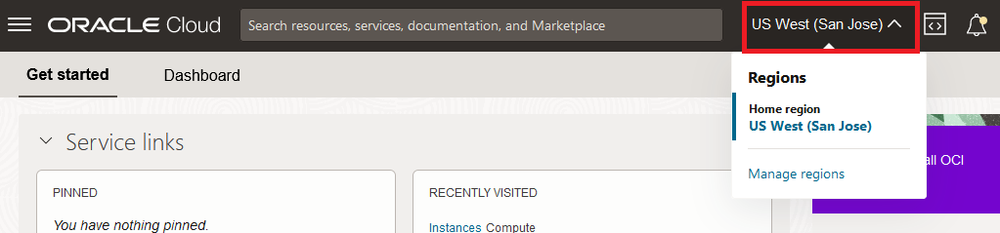

2. Click on navigation menu, search **Oracle Database** and choose **Autonomous Transaction Processing**.

    **Note:** You can also directly access your Oracle Autonomous Transaction Processing service in the **Quick Actions** section of the dashboard.

    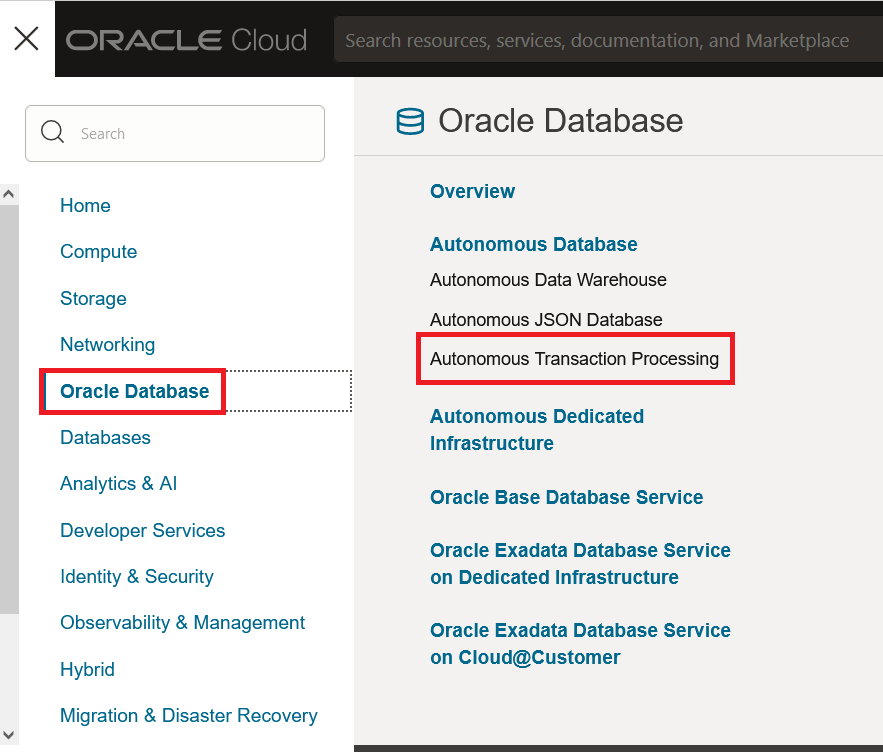

3. From the compartment drop-down menu select the **Compartment** where your Oracle Autonomous Database resource is provisioned (i.e. MyCompartment). 

   From the databases displayed, click the **Display Name** of the database you wish to terminate (i.e. QUICKSTART).

    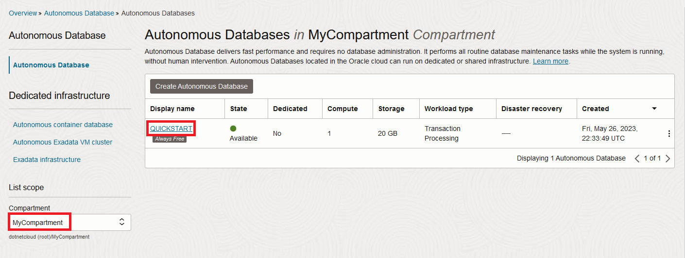

4. CLick **More Actions** on the next web page. Scroll down and click **Terminate**.

    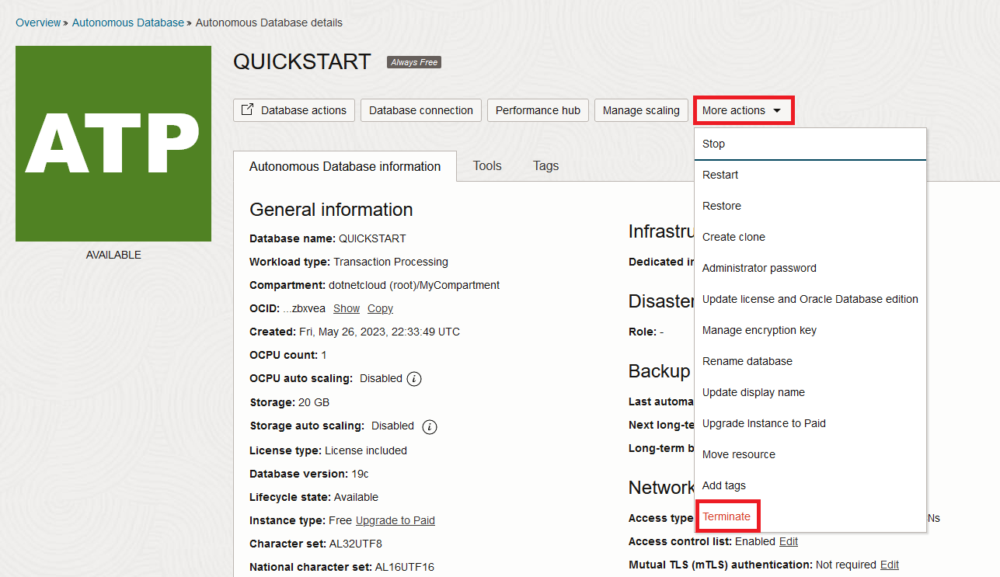

5. Confirm that you wish to terminate this Oracle Autonomous Database in the confirmation dialog. Type the database name in the input field (i.e. QUICKSTART) and click **Terminate Autonomous Database**.

    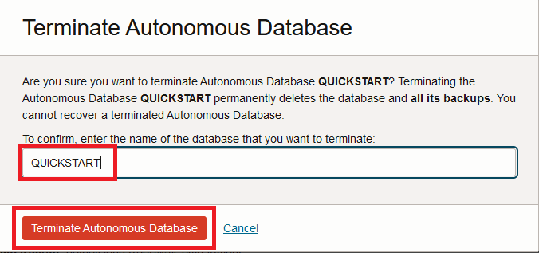

6.  Your instance will begin to terminate. 

    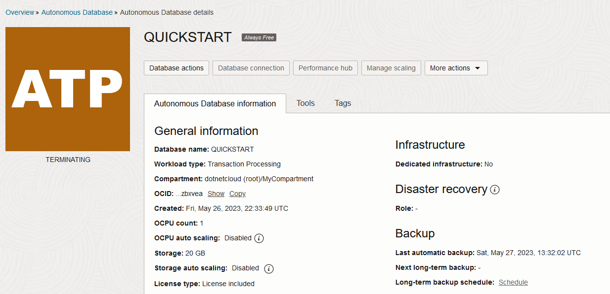

7. After a few minutes, the instance is terminated.

    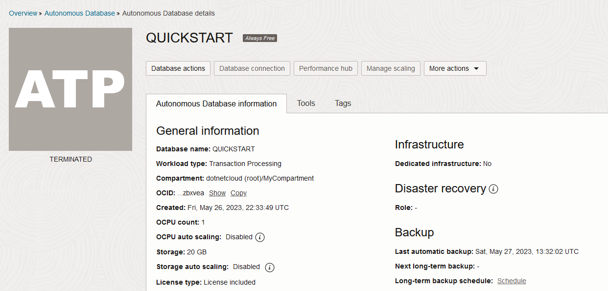

    You have successfully terminated an Oracle Autonomous Database instance.

## Task 2: Terminate a Compute Instance

1. Click the **Navigation Menu** in the upper left. Navigate to **Compute**, and select **Instances**.

	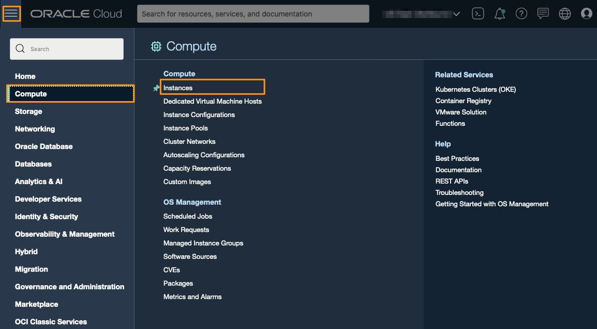

2. Under **Instances**, find the compute instance you wish to terminate (i.e. Web-Server). Move the scroll bar to the right, if necessary, to reveal the vertical ellipsis menu for that instance. Click the menu and select **Terminate**.

	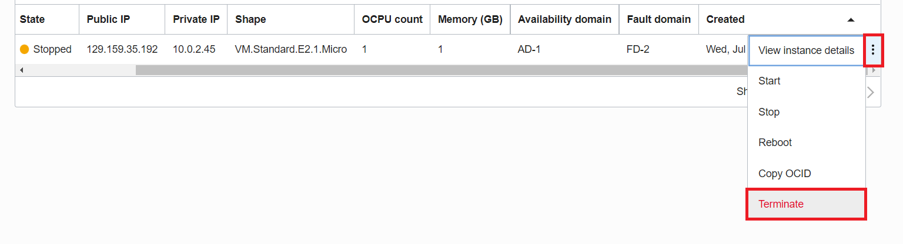

3. Confirm your intent to terminate the compute instance by ticking the checkbox to permanently delete the boot volume and clicking the **Terminate instance** button.

	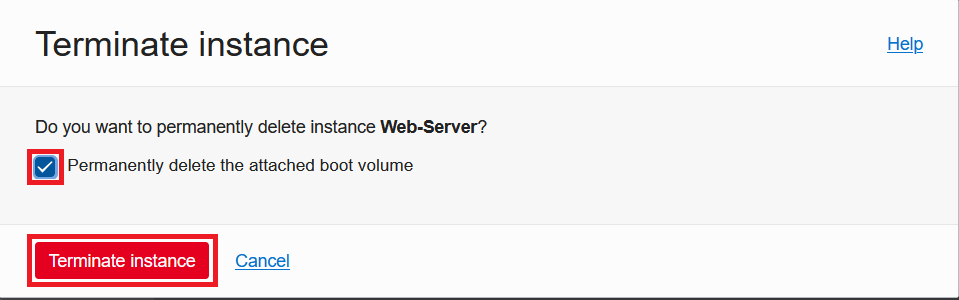

4. Your instance will begin to terminate. The lifecycle State will change to Terminating.

	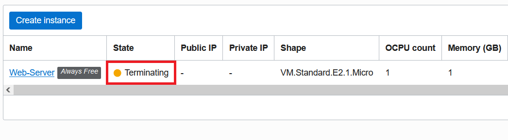

5. Once the instance is terminated, the lifecycle State will change to Terminated.

	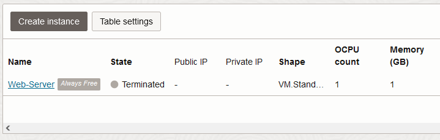

You have succesfully terminated your compute instance.

## Task 3: Terminate a VCN

1. Click the **Navigation Menu** in the upper left. Navigate to **Networking**, and select **Virtual Cloud Networks**.

	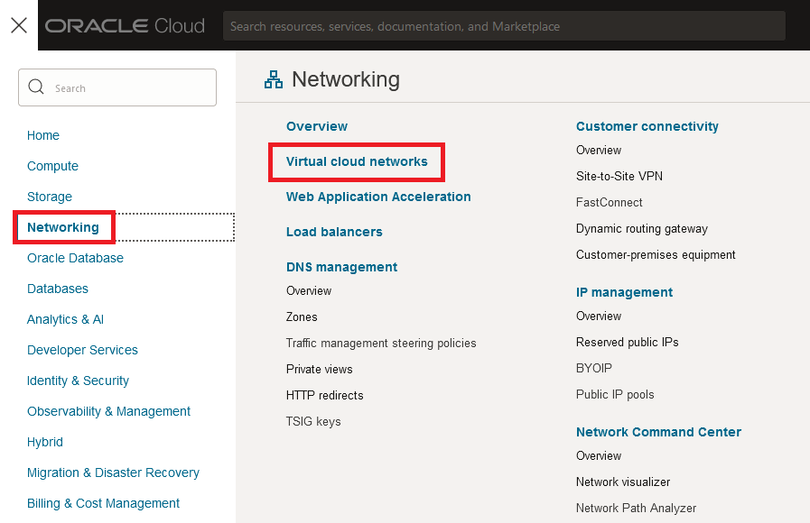

2. Under **Virtual Cloud Network**, click the vertical ellipsis menu on the right side of the page. Select **Delete** from the drop down menu.

	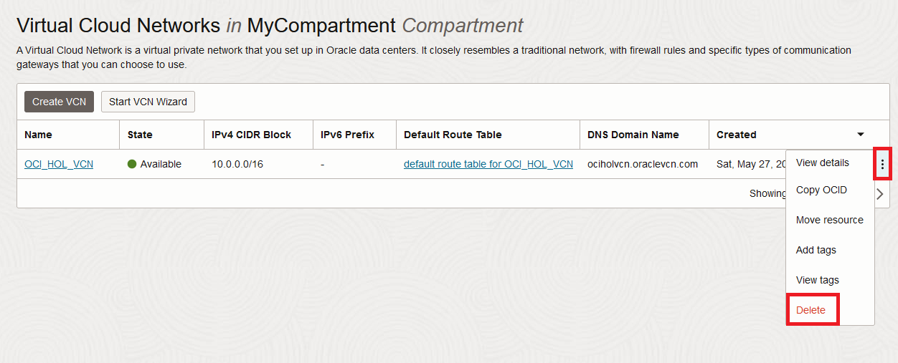

3. Scan for all the VCN's associated resources. Click the **Scan** button.

	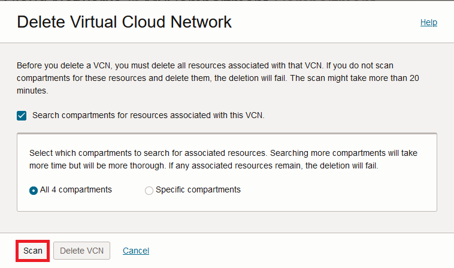

4. Review the VCN and its associated resources. Confirm your intent to delete these resources by clicking the **Delete All** button.

	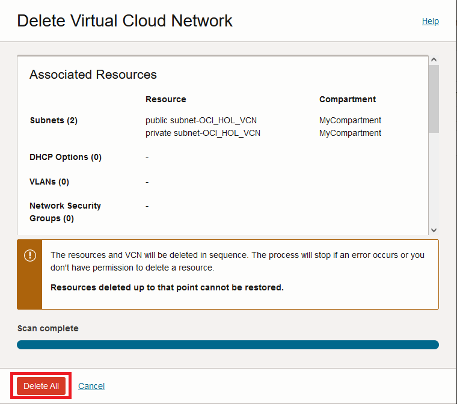

5. Once the VCN resources are deleted, the window will inform you the VCN deletion is complete. Click the **Close** button to close the window.

	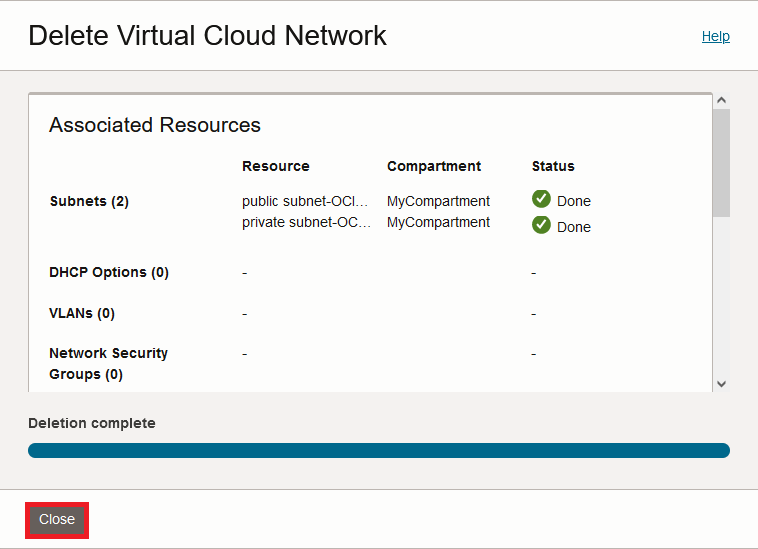

You have succesfully deleted your VCN.

## Learn More

* Click [here](https://docs.oracle.com/en-us/iaas/exadata/doc/eccmanagingadbs.html#GUID-A00BC3BB-3AE6-4FBF-AEAF-2D9C14CD1D9A) to know more about Managing Autonomous Databases.

## Acknowledgements

* **Author** - Anoosha Pilli, Alex Keh
* **Last Updated By/Date** - Alex Keh, June 2023