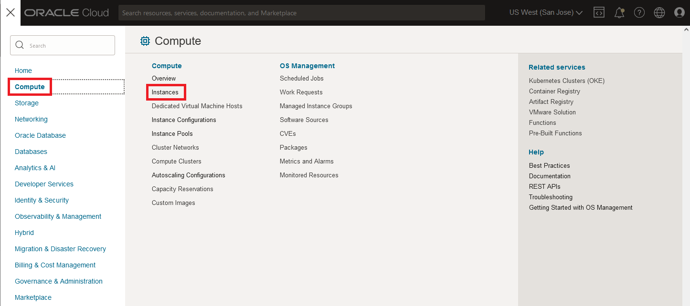
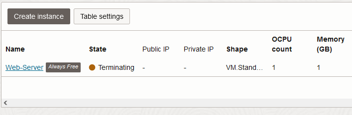

# Clean up lab resources

## Introduction

You can permanently delete (terminate) the database instance, the compute instance, and VCN that you created in the lab. Terminating any of these resources permanently removes them and deletes any data they are storing. However, automatic backups are not deleted if you have chosen Recovery Appliance or NFS as a backup destination. You can delete automatic backups directly from the Recovery Appliance or NFS.

This lab walks you through the steps to terminate an Oracle Autonomous Database instance, a compute instance, and VCN.

For the purpose of this lab, an always free Oracle Autonomous Transaction Processing database instance named DEMOATP will be deleted. The compute host, Web-Server, and VCN, OCI\_HOL\_VCN will then be terminated.

Estimated Time - 10 minutes

### Objectives

- Terminate an Oracle Autonomous Database instance.
- Terminate a compute instance.
- Terminate a VCN.

### Prerequisites

- Completed the previous labs to the point that an Oracle Autonomous Database, compute instance, and network have been created.

## Task 1: Terminate an Oracle Autonomous Database Instance

1. If you are using a Free Trial or Always Free account, in the Oracle Cloud console, you need to be in the region where your Oracle Autonomous Database resources is provisioned. You can see your current default **Region** in the top right-hand corner of the page. To change the default region, click on the **Region** drop-down and choose the region where your Oracle Autonomous Database resource is provisioned.

    

2. Click on navigation menu, search **Oracle Database** and choose **Autonomous Transaction Processing** (ATP).

    **Note:** You can also directly access your Oracle Autonomous Transaction Processing service in the **Quick Actions** section of the dashboard.

    

3. From the compartment drop-down menu select the **Compartment** where your Oracle Autonomous Database resource is provisioned (i.e. MyCompartment). If there were a long list of databases, you could filter the list by the **State** of the databases (Available, Stopped, Terminated, etc.) to view the database you wish to terminate. You can also sort by **Workload Type**.

    In this lab, as **DEMOATP** is an Oracle Autonomous Transaction Processing database which is already provisioned, we selected the **Transaction Processing** workload type to filter the database.

    
    

4. From the databases displayed, click **Display Name** of the database you wish to terminate.

    In this lab, we are terminating the available **DEMOATP** Oracle Autonomous Transaction Processing database instance. Click **DEMOATP**.

    

5. Click **More Actions** on the next web page.

    

6. From the **More Actions** drop-down, scroll down and click **Terminate**.

    

7. Confirm that you wish to terminate this Oracle Autonomous Database in the confirmation dialog. Type the database name in the input field and click **Terminate Autonomous Database**.

    In this example, the database instance is named **DEMOATP**.

    

8.  Your instance will begin to terminate. The Lifecycle State will turn from Available to Terminating.

    

9. After a few minutes, once the instance is terminated, the Lifecycle State will change from Terminating to Terminated.

    

    You have successfully terminated an Oracle Autonomous Database instance.

## Task 2: Terminate a Compute Instance

1. Click the **Navigation Menu** in the upper left. Navigate to **Compute**, and select **Instances**.

	

2. Under **Instances**, move the scroll bar to the right to reveal the vertical ellipsis menu. Click the menu and select **Terminate**.

	

3. Confirm your intent to terminate the compute instance by ticking the checkbox to permanently delete the boot volume and clicking the **Terminate instance** button.

	

4. Your instance will begin to terminate. The Lifecycle State will change to Terminating.

	

5. Once the instance is terminated, the Lifecycle State will change from Terminating to Terminated.

	

You have succesfully terminated your compute instance.

## Task 3: Terminate a VCN

1. Click the **Navigation Menu** in the upper left. Navigate to **Networking**, and select **Virtual Cloud Networks**.

	

2. Under **Virtual Cloud Network**, click the vertical ellipsis menu on the right side of the page. Select **Terminate** from the drop down menu.

	

3. Review the VCN and its associated resources. Confirm your intent to terminate these resources by clicking the **Terminate All** button.

	

4. Once the VCN resources are terminated, the window will inform you the VCN termination is complete. Click the **Close** button to close the window.

	

You have succesfully terminated your compute instance.

## Learn More

* Click [here](https://docs.oracle.com/en-us/iaas/exadata/doc/eccmanagingadbs.html#GUID-A00BC3BB-3AE6-4FBF-AEAF-2D9C14CD1D9A) to know more about Managing Autonomous Databases.

## Acknowledgements

* **Author** - Anoosha Pilli, Alex Keh
* **Last Updated By/Date** - Alex Keh, August 2022