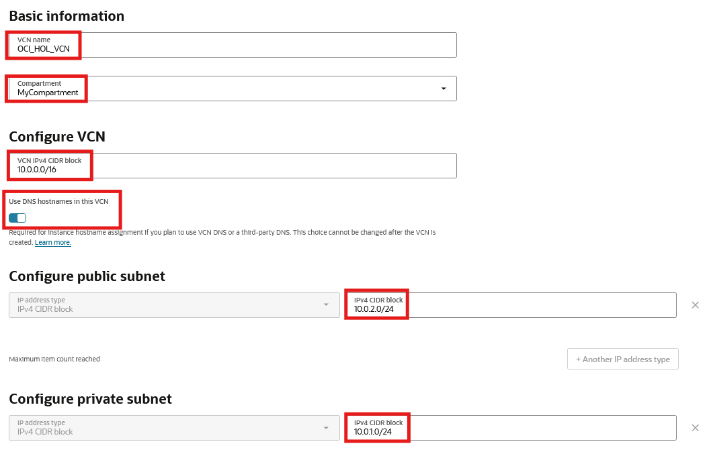
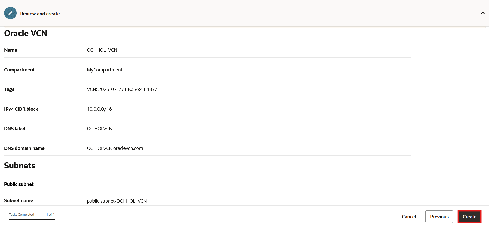
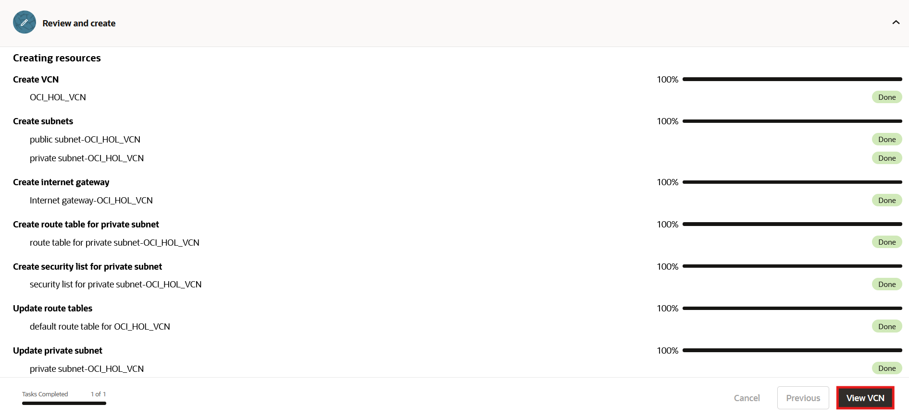

# Create a Virtual Cloud Network

## Introduction

Oracle Cloud Infrastructure (OCI) Compute lets you create multiple Virtual Cloud Networks (VCNs). These VCNs will contain security lists, compute instances, load balancers and many other types of network assets. 

In this lab, we will create a VCN that will be used to connect the OCI Compute web server with Oracle Autonomous Database.

You may review [Overview of Networking](https://docs.cloud.oracle.com/iaas/Content/Network/Concepts/overview.htm) to gain a full understanding of the network components and their relationships, or take a look at this video:

Estimated lab time: 5 minutes

### Objectives
In this lab, you will:
- Create a virtual cloud network

### Prerequisites

* An Oracle Cloud Account

## Task 1: Create Your VCN

If you are running this workshop in a LiveLabs environment, understand that it uses a pre-configured Virtual Cloud Network (VCN). As such, you will not create a VCN in that environment.

If running this workshop from other environments, create a VCN on Oracle Cloud Infrastructure by following the steps below:

1. Click the navigation menu in the upper left to show top level navigation choices. Click **Networking** --> **Virtual cloud networks**.

    

2. Select the **Actions** drop down menu. Click on **Start VCN Wizard**.

    

3. Select **Create VCN with Internet Connectivity**, and then click **Start VCN Wizard**.

    

4. The wizard page appears and checks resource availability. 

   
 
5. Scroll down. Complete the following fields. Modify the default settings if they don't match the below values.

    |                  **Field**              |    **Value**  |
    |----------------------------------------|:------------:|
    |VCN name |OCI\_HOL\_VCN|
    |Compartment |  Choose the same compartment as the Oracle Autonomous Database (i.e., MyCompartment)
    |VCN IPv4 CIDR Block|10.0.0.0/16|
    |Use DNS hostnames In This VCN| Enabled|
    |Public subnet IPv4 CIDR block|10.0.2.0/24|
    |Private subnet IPv4 CIDR block|10.0.1.0/24|

    Your screen should look similar to the following:

    

     Click the **Next** button at the bottom of the screen.

6. Review your settings to ensure they are correct. Click the **Create** button to create the VCN. 
    

7. It will take a moment to create the VCN and a progress screen will keep you apprised of the workflow.

   Once the resource creations and updates are complete, click the **View VCN** button.

    

7. Your completed VCN will look similar to the following:

    

### Summary

This VCN will contain all of the other assets that you will create during this set of labs. In real-world situations, you would create multiple VCNs based on their need for access (which ports to open) and who can access them. Both of these concepts are covered in the next lab. 

You may now **proceed to the next lab.**

## Acknowledgements

- **Author** - Rajeshwari Rai, Prasenjit Sarkar, Alex Keh 
- **Last Updated By/Date** - Alex Keh, September 2025